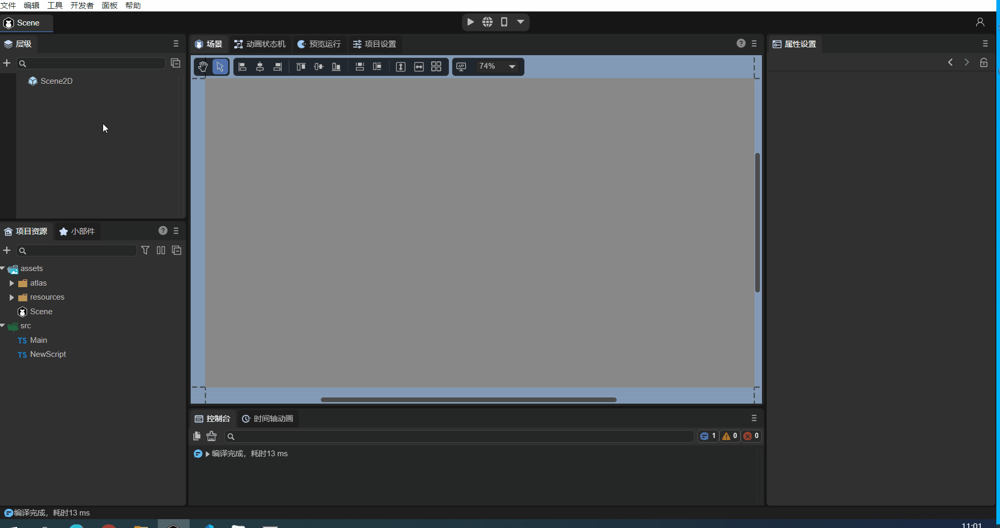
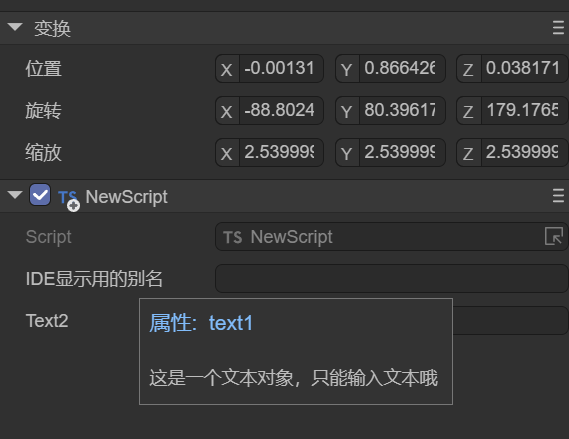
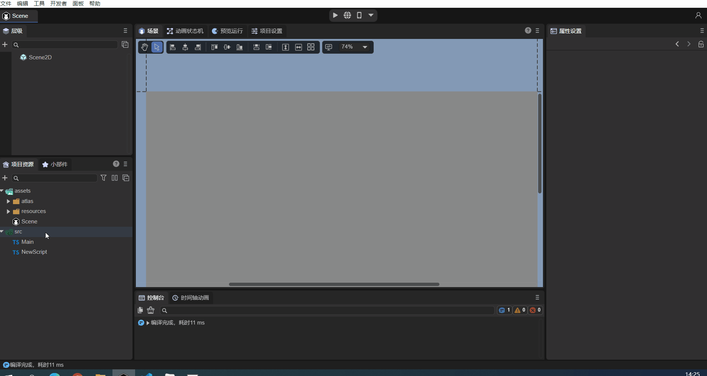
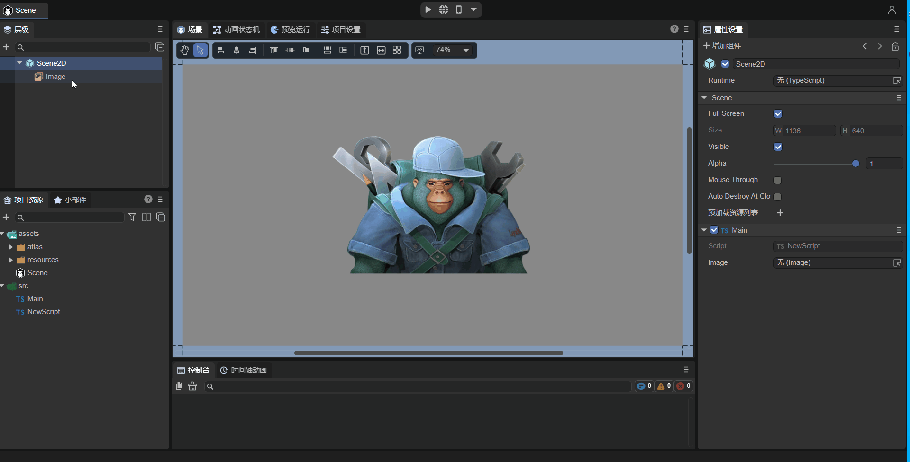
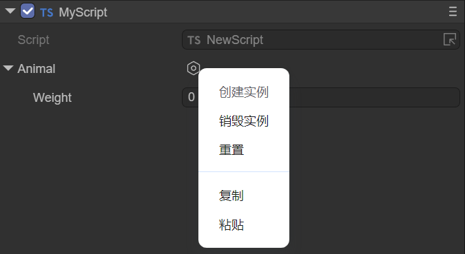
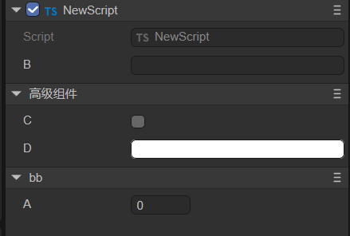
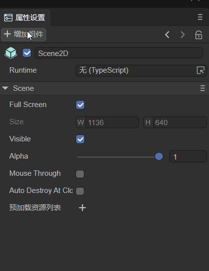
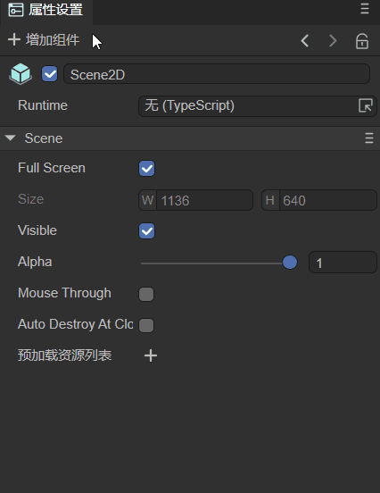
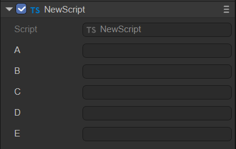

# Detailed Explanation of Component Decorator Identifiers

> Author: Charley, Guzhu, Meng Xingyu

In the ECS (Entity-Component-System) architecture adopted by the LayaAir engine, **components are the core units for carrying data. Each component focuses on storing specific attributes and states of an entity**, such as a character's position, velocity, health, etc. This data provides the foundation for systems to process logic, as systems execute corresponding business logic based on component data.

The core role of decorators in LayaAir-IDE is to help the IDE recognize custom components created by developers. **Through decorator identifiers, developers can easily and quickly expose data that needs to be configured within a component to the IDE's property panel.** This eliminates the need for developers to write additional configuration code, allowing them to directly adjust component parameters in a visual interface. This greatly enhances development efficiency and operational convenience by facilitating efficient data transfer and component configuration.

This document will provide a comprehensive introduction to the function and usage of decorator identifiers. For **more comprehensive ECS-related knowledge**, please refer to the["Component"](../../../basics/common/Component/readme.md) documentation.


## 1\. Identifying Component Scripts: @regClass()

### 1.1 How to Use `@regClass()` in Code

Component scripts written by developers need to use the decorator identifier `@regClass()` before the class definition. Here's an example:

```typescript
const { regClass } = Laya;

@regClass()
export class Script extends Laya.Script {
}
```

### 1.2 How to Find Identified Component Scripts in the IDE

Only classes marked with the `@regClass()` decorator identifier will be recognized as custom component scripts by LayaAir3-IDE and can be added to nodes (entities).

The process for adding a component is: `Property Settings Panel -> Add Component -> Custom Component Script`. As shown in animation 1-1.



(Animation 1-1)

> [\!Tip]
>
> A single TS script file can only have one class using `@regClass()`.
>
> Classes marked with `@regClass()` are compiled within the IDE environment. However, during final publishing, if the class is not referenced by other classes, not added to a node, or if its prefab/scene is not published, this class will be trimmed.


## 2\. Identifying Component Properties: @property()

### 2.1 Standard Usage of Component Properties

When developers want to expose component properties for external editing in the IDE to input data, they need to use the decorator identifier `@property()` before the class property definition. Here's an example:

```typescript
const { regClass, property } = Laya;

@regClass()
export class NewScript extends Laya.Script {
    // Standard way to write decorator properties, suitable for full functional requirements like showing Tips or Chinese aliases in the IDE.
    @property({ type: String, caption: "Alias for IDE display", tips: "This is a text object, only text can be entered." }) 
    public text1: string = "";

    // Abbreviated way to define decorator property types, suitable for type-only definition requirements.
    @property(String)   
    public text2: string = "";
}
```

`@property()` is the decorator identifier that the IDE uses to recognize component properties and display them in the IDE's property panel. The `type` parameter is mandatory for decorator property identifiers.

If you don't need to write a tip for the property, or redefine an alias for it to display in the IDE, etc., you can use the abbreviated form shown in the example above.

> If the abbreviated form shows a syntax warning, please use the new version of the IDE and resolve it using the IDE's `Developer -> Update engine d.ts file` function, or use the standard writing method.

The effect of the example code being recognized in the IDE is shown in Figure 2-1:

 

(Figure 2-1)

### 2.2 Decorator Usage for Accessors

In addition to regular data properties, sometimes developers control the read and write behavior of component properties through accessors (Getters and Setters).

When both a Getter and a Setter exist, the decorator property identifier `@property()` can be placed directly before the Getter. In this case, the component property is read-write, just like the regular usage described in the previous subsection.

If the script **only has a Getter, then this property is read-only**, it can only be displayed in the IDE but cannot be edited.

Example code for decorator usage when both getter and setter are present:

```typescript
const { regClass, property } = Laya;

@regClass()
class Animal {
    private _weight: number = 0;
    
    @property( { type : Number } )
    get weight() : number {
        return this._weight;
    }
    // If there is no Setter, then weight is a read-only property.
    set weight(value: number) {
        this._weight = value;
    }
}
```

### 2.3 Serialization Saving: `serializable`

When a property is defined as a component property via a decorator, its name and value are by default **serialized and saved** in the scene file or prefab file where the component is added. For example, after adding a custom component to a `scene.ls` file, opening `scene.ls` with VSCode will show the serialized component property name and value, as illustrated in Animation 2-2.

 

(Animation 2-2)

Serializing properties not only allows for intuitive viewing and editing of component property values within the IDE, but also enables direct use of serialized values at runtime. For complex data structures, using serialized values can save the overhead of data structure generation. Therefore, sometimes, even if a property doesn't need to be displayed and edited in the property panel, it can still be set as a component property via a decorator to store its value serialized in scene or prefab files.

However, sometimes our component properties are only for convenience in understanding and adjusting within the IDE, and these values are not actually used at runtime. For such cases, control over whether to serialize and save is also provided. When defining a decorator property, if **`serializable` is set to `false` in the object parameter, then the property will not be serialized**.

For example, a developer's requirement might be to serialize and save a radian value, but the radian value is not intuitive when adjusted manually. In this case, an angle value can be directly entered in the IDE without saving it, and only the converted radian value is stored. The example code is as follows:

```typescript
const { regClass, property } = Laya;

@regClass()
export class Main extends Laya.Script {
    @property({ type: Number })
    _radian: number = 0;  // Properties starting with an underscore are not displayed in the IDE's property panel by default; they are only used to store the input radian value.
    
    @property({ type: Number, caption: "Angle", serializable: false }) // Here, serializable is set to false, so 'degree' will not be saved to the scene file.
     get degree() {
        return this._radian * (180 / Math.PI);// Since it's not serialized, the radian stored in _radian needs to be converted back to degrees for display in the IDE property panel.
    }
    set degree(value: number) {
        this._radian = value * (Math.PI / 180);// Convert the input angle value to radians and store it in _radian.
    }
    
    onStart() {
        console.log(this._radian); 
    }
}
```

### 2.4 Is it a Private Property (Affects Panel Visibility)?

In addition to the `hidden` property identifier parameter mentioned earlier, which affects whether a property is visible on the panel, the `private` parameter also affects property visibility on the panel.

Unlike `hidden`, `private` is primarily used to control whether properties starting with an underscore are displayed on the panel.

By default, decorator properties only mark non-underscored class properties as IDE component properties. Underscored properties are considered private by default, which means `private` is implicitly `true`.

**Properties with an underscore are not displayed in the IDE by default.** In this case, the value of such a component property is only to save its value to the scene file, as mentioned and exemplified above.

> If there is no need to serialize and save underscored properties to the scene file, then decorators are not necessary for them.

However, if developers **want underscored properties to also be displayed in the IDE**, it's possible. Simply set the `private` parameter to `false` in the object passed to the decorator property identifier.

Example code:

```typescript
@property({ type: "number", private: false })
_velocity: number = 0;
```

The `private` parameter can not only make underscored properties visible but also **make properties without an underscore not appear in the IDE's property panel by setting `private` to `true`.**

Here, we'll slightly modify the radian conversion example from before:

```typescript
const { regClass, property } = Laya;

@regClass()
export class Main extends Laya.Script {
    @property({ type: Number , private: true })
    radian: number = 0;  // After setting private to true, 'radian' will not appear in the IDE's property panel; it's only used to store the input radian.
    
    @property({ type: Number, caption: "Angle", serializable: false }) // Here, serializable is set to false, so 'degree' will not be saved to the scene file.
     get degree() {
        return this.radian * (180 / Math.PI);// Since it's not serialized, the radian stored in 'radian' needs to be converted back to degrees for display in the IDE property panel.
    }
    set degree(value: number) {
        this.radian = value * (Math.PI / 180);// Convert the input angle value to radians and store it in 'radian'.
    }
    
    onStart() {
        console.log(this.radian); 
    }
}
```

### 2.5 Types of Decorator Property Identifiers

The types supported by decorator property identifiers include engine object types (e.g., `Laya.Vector3`, `Laya.Sprite3D`, `Laya.Camera`), custom object types (which need to be marked with `@regClass()`), and basic TS language types.

#### 2.5.1 Engine Object Types

Understanding engine object types is relatively straightforward. After exposing a component property, you can directly input values of the corresponding type. For example, `Laya.Sprite3D` can only accept 3D nodes; attempting to drag in a 2D node or a resource is prohibited.

Common engine object type usage examples:

```typescript
const { regClass, property } = Laya;

@regClass()
export class Main extends Laya.Script {

    @property( { type:Laya.Camera } ) // Camera type
    private camera: Laya.Camera;  

    @property( { type:Laya.Scene3D } ) // 3D scene root node type
    private scene3D: Laya.Scene3D;

    @property( { type:Laya.DirectionLightCom } ) // DirectionLight component type
    private directionLight: Laya.DirectionLightCom;

    @property( { type:Laya.Sprite3D } ) // Sprite3D node type
    private cube: Laya.Sprite3D;  

    @property( { type:Laya.Prefab } ) // Object obtained after loading a Prefab
    private prefabFromResource: Laya.Prefab;    

    @property( { type:Laya.ShurikenParticleRenderer } ) // ShurikenParticleRenderer component type
    private particle3D: Laya.ShurikenParticleRenderer;  

    @property( { type:Laya.Node } ) // Node type
    private scnen2D: Laya.Node; 

    @property( { type:Laya.Box } ) // Get Box component
    private box: Laya.Box; 

    @property( { type:Laya.List } ) // Get List component
    private list: Laya.List; 

    @property( { type:Laya.Image } ) // Get Image component
    private image: Laya.Image; 

    @property( { type:Laya.Label } ) // Get Label component
    private label: Laya.Label; 

    @property( { type:Laya.Button } ) // Get Button component
    private button: Laya.Button; 

    @property( { type:Laya.Sprite } ) // Get Sprite component
    private sprite: Laya.Sprite; 

    @property( { type:Laya.Animation } ) // Get Animation component
    private anmation: Laya.Animation; 

    @property( { type:Laya.Vector3 } ) // Laya.Vector3 type
    private vector3 : Laya.Vector3;
}
```

As shown in Animation 2-3, drag an already added Image from the scene into the Image property slot exposed by `@property`. This obtains the node, and you can then control the Image's properties using code in the script.



(Animation 2-3)

> For code usage of properties, refer to [Code Usage of Component Properties](https://www.google.com/search?q=../componentProperties/readme.md).

#### 2.5.2 Custom Object Types

Custom object types involve setting a custom imported object. Component properties are exposed based on the decorator property identifier of that object.

For example, consider these two TS code snippets:

```typescript
//MyScript.ts
const { regClass, property } = Laya;

import Animal from "./Animal";

@regClass()
export class MyScript extends Laya.Script  {
    @property({ type : Animal })
    animal : Animal;
}
```

```typescript
//Animal.ts
const { regClass, property } = Laya;

@regClass()
export default class Animal {
    @property({ type : Number })
    weight : number;
}
```

In the example above, the component script `MyScript` references a custom `Animal` object and sets the type of the decorator property identifier to `Animal`.

Even though `Animal` is not a component script inheriting from `Laya.Script`, it needs to be recognized by the IDE because it's referenced by the component script `MyScript`.

Therefore, the `Animal` class definition also needs to use the decorator identifier `@regClass()`, and the properties to be exposed in the `Animal` class use the `@property()` decorator identifier.

The effect of the example code in the IDE is shown in Figure 2-4:

  

(Figure 2-4)

#### 2.5.3 Basic TS Language Types

Finally, there are common basic TS language types. However, it's important to note that basic types need to be described using strings. Only number, string, and boolean types can be marked with their object types (e.g., `Number`, `String`, `Boolean`).

| Type                  | Type Writing Example                                          | Type Description                                            |
| :-------------------- | :------------------------------------------------------------ | :---------------------------------------------------------- |
| **Number Type** | `"number"`                                                    | Can also be marked with `Number`.                         |
| **Single-line String Text Type** | `"string"`                                                    | Can also be marked with `String`.                         |
| **Boolean Type** | `"boolean"`                                                   | Can also be marked with `Boolean`.                        |
| **Integer Type** | `"int"`                                                       | Equivalent to `{ type: Number, fractionDigits: 0 }`.        |
| **Positive Integer Type** | `"uint"`                                                      | Equivalent to `{ type: Number, fractionDigits: 0 , min: 0 }`. |
| **Multi-line String Text Type** | `"text"`                                                      | Equivalent to `{ type: string, multiline: true }`.          |
| **Any Type** | `"any"`                                                       | The type will only be serialized, not displayed or edited. |
| **Typed Array Type** | `Int8Array`, `Uint8Array`, \<br\>`Int16Array`, `Uint16Array`, \<br\>`Int32Array`, `Uint32Array`, `Float32Array` | Supports 7 typed array types.                              |
| **Array Type** | `["number"]`, `["string"]`                                    | Use square brackets to enclose the array element type.      |

Example code usage:

```typescript
const { regClass, property } = Laya;

// Enum
enum TestEnum {
    A,
    B,
    C
};
// String enum
enum Direction {
    Up = 'UP',
    Down = 'DOWN',
    Left = 'LEFT',
    Right = 'RIGHT'
};

@regClass()
export class Script extends Laya.Script {

    @property(Number)// Number type, equivalent to { type : "number" }
    num : number;

    @property(String)// Single-line string text type, equivalent to { type: "string"}
	str : string;

    @property(Boolean)// Boolean type, equivalent to { type: "boolean"}
	bool : boolean;

	@property("int")// Integer type, equivalent to { type: Number, fractionDigits: 0 }
	int : number; 

    @property("uint") // Positive integer type, equivalent to { type: Number, fractionDigits: 0 , min: 0 }
    uint : number; 

    @property("text")// Multi-line string text type, equivalent to { type: String, multiline: true }
    text : string; 

    @property("any")// Any type will only be serialized, not displayed or edited.
	a : any; 
    
    @property(Int8Array)// Typed array type, besides Int8Array, also supports Uint8Array, Int16Array, Uint16Array, Int32Array, Uint32Array, Float32Array, used similarly.
    i8a: Int8Array;
        
    @property({ type: ["number"] })// Array type, use square brackets to contain array element type
    arr1: number[];

    @property({ type: ["string"] })// Array type, use square brackets to contain array element type
    arr2: string[];
    
    // Regular enum type (can use type shorthand), will be displayed as a dropdown for user selection.
    @property(TestEnum)
    enum: TestEnum;
    
	// String enum, cannot use type shorthand, e.g., @property(Direction). Must use the standard way with type parameter specified below.
    @property({ type: Direction })
    direc: Direction;
    
    // Dictionary type requires array parameters to set the type. In the example below, the Record type needs to be within a string as the first element of the array parameter, and the second element of the array parameter is the type of the dictionary input value, used to determine the input control type in the property panel.
    @property({ type: ["Record", Number] })
    dict: Record<string, number>; 

}
```

The example effect is shown in Animation 2-5:

 

(Animation 2-5)

### 2.6 Input Controls for Component Property Values

The IDE has built-in input controls for: number (numeric input), string (string input), boolean (checkbox), color (color box + color palette + eyedropper), vec2 (XY input combination), vec3 (XYZ input combination), vec4 (XYZW input combination), and asset (resource selection).

Typically, the IDE automatically selects the appropriate property value input control based on the component property type.

However, in some cases, it's necessary to **force a specific input control**. For example, if the data type is `string` but it represents a color, the default `string` editing control is unsuitable. In such a scenario, you would set the `inspector` parameter of the component property identifier to `"color"`. Example code:

```typescript
// Display as a color input (not needed if the type is Laya.Color, but required if it's a string type).
@property({ type: String, inspector: "color"})
color: string;
```

> Note: The color obtained by the above method is the color value of a 2D component, e.g., `rgba(217, 232, 0, 1)`.

The effect is shown in Animation 2-6:


(Animation 2-6)

If the `inspector` parameter is `null`, no property input control will be constructed for the property. This differs from setting the `hidden` parameter to `true`. When `hidden` is `true`, the control is created but invisible; when `inspector` is `null`, it's not created at all.

### 2.7 Component Property Categorization and Sorting

Component properties are by default displayed uniformly under the property category named after the component script, as shown in Figure 2-7:

  

(Figure 2-7)

If developers want to categorize certain properties within a component, they can achieve this using the `catalog` object parameter of the decorator property identifier. Here's an example:

```typescript
    @property({ type : "number" })
    a : number;

    @property({ type: "string"})
    b : string;

    @property({ type: "boolean",catalog:"adv"})
    c : boolean;

    @property({ type: String, inspector: "color" ,catalog:"adv"})
    d: string;
```

From the code above, it's clear that when multiple properties (`c` and `d`) are given the same `catalog` name (`"adv"`), they will be grouped by that `catalog` name. The effect is shown in Figure 2-8:

 

(Figure 2-8)

If we want to give this category a Chinese alias, we can use the `catalogCaption` parameter. Here's an example (modifying property `d` from the previous example):

```typescript
    @property({ type: String, inspector: "color" ,catalog:"adv", catalogCaption:"Advanced Components"})
    d: string;
```

The effect is shown in Figure 2-9:

 

(Figure 2-9)

When dealing with multiple component property categories, we can also use the `catalogOrder` parameter to customize the display order of the categories. Smaller numerical values will appear earlier. If not provided, they will appear in the order the properties are defined. Here's an example:

```typescript
	@property({ type : "number", catalog:"bb", catalogOrder:1 })
    a : number;

    @property({ type: "string"})
    b : string;

    @property({ type: "boolean", catalog:"adv"})
    c : boolean;

    @property({ type: String, inspector: "color", catalog:"adv", catalogCaption:"Advanced Components", catalogOrder:0})
    d: string;
```

The effect is shown in Figure 2-10:

 

(Figure 2-10)

> The property category name (`catalogCaption`) and property category order (`catalogOrder`) can be configured in any property that shares the same `catalog` name; there's no need to configure it for all properties.

### 2.8 Summary of Decorator Property Identifier Parameters

The common parameters and their functions for decorator property identifiers (bolded parameters were discussed above) are summarized below.

| Parameter Name        | Parameter Usage Example                                           | Description                                                                                                                                                                                                                                                                                                                                                                                                                                                                                                                                                                                        |
| :-------------------- | :---------------------------------------------------------------- | :----------------------------------------------------------------------------------------------------------------------------------------------------------------------------------------------------------------------------------------------------------------------------------------------------------------------------------------------------------------------------------------------------------------------------------------------------------------------------------------------------------------------------------------------------------------------------------------- |
| `name`                | `name: "abc"`                                                     | Generally not needed.                                                                                                                                                                                                                                                                                                                                                                                                                                                                                                                                                                              |
| **`type`** | `type: "string"`                                                  | The type of values that can be input for the component property; refer to the description above.                                                                                                                                                                                                                                                                                                                                                                                                                                                                                                        |
| **`caption`** | `caption: "Angle"`                                                | An alias for the component property, often used for Chinese names. It can be left unset, defaulting to the component property name.                                                                                                                                                                                                                                                                                                                                                                                                                                                            |
| **`tips`** | `tips: "This is a text object; only text can be entered."`        | Tips description for the component property, used for further describing its function, etc.                                                                                                                                                                                                                                                                                                                                                                                                                                                                                                        |
| **`catalog`** | `catalog:"adv"`                                                   | Setting the same value for multiple properties allows them to be displayed within the same category.                                                                                                                                                                                                                                                                                                                                                                                                                                                                                                  |
| **`catalogCaption`** | `catalogCaption:"Advanced Components"`                            | An alias for the property category. If not provided, the category name is used directly.                                                                                                                                                                                                                                                                                                                                                                                                                                                                                                              |
| **`catalogOrder`** | `catalogOrder:0`                                                  | The display order of categories. Smaller values appear earlier. If not provided, they appear in the order the properties are defined.                                                                                                                                                                                                                                                                                                                                                                                                                                                           |
| **`inspector`** | `inspector: "color"`                                              | Input control for the property value. Built-in options include: `number`, `string`, `boolean`, `color`, `vec2`, `vec3`, `vec4`, `asset`.                                                                                                                                                                                                                                                                                                                                                                                                                                                     |
| `hidden`              | `hidden: "!data.a"`                                               | `true` hides, `false` shows. Can directly use a boolean value or an expression. For expressions, the conditional expression is placed in a string to get a boolean result. Inside the string expression, `data` is a fixed-name variable, representing the data collection of all registered properties of the current type. All JS syntax can be used in the expression, but engine-related types or global objects like `Laya` cannot be referenced.                                                                                                                                                     |
| `readonly`            | `readonly: "data.b"`                                              | `true` means read-only. Can directly use a boolean value or an expression. For expressions, the conditional expression is placed in a string to get a boolean result (expression format is the same as above).                                                                                                                                                                                                                                                                                                                                                                            |
| `validator`           | `validator: "if (value == data.text1) return 'Cannot be same as text1 value' "` | Can use an expression, placing the expression in a string. For example, if the value entered in the IDE is equal to the value of `text1`, it will display "Cannot be same as text1 value".                                                                                                                                                                                                                                                                                                                                                                                                 |
| **`serializable`** | `serializable: false`                                             | Controls whether the component property is serialized and saved. `true`: serialized and saved; `false`: not serialized and saved.                                                                                                                                                                                                                                                                                                                                                                                                                                                              |
| **`multiline`** | `multiline: true`                                                 | When the type is `string`, whether it's a multi-line input. `true`: yes; `false`: no.                                                                                                                                                                                                                                                                                                                                                                                                                                                                                                                |
| `password`            | `password: true`                                                  | Whether it's a password input. `true`: yes; `false`: no. Password input hides the content.                                                                                                                                                                                                                                                                                                                                                                                                                                                                                                   |
| `submitOnTyping`      | `submitOnTyping: false`                                           | If set to `true`, each character input will trigger a submission. If set to `false`, submission only occurs after input is complete and the text input field loses focus (by clicking elsewhere).                                                                                                                                                                                                                                                                                                                                                                                         |
| `prompt`              | `prompt: "Text hint information"`                                 | A hint message that appears inside the text box before input.                                                                                                                                                                                                                                                                                                                                                                                                                                                                                                                                            |
| `enumSource`          | `enumSource: [{name:"Yes", value:1}, {name:"No",value:0}]`        | The component property will be displayed and input as a dropdown list.                                                                                                                                                                                                                                                                                                                                                                                                                                                                                                                                       |
| `reverseBool`         | `reverseBool: true`                                               | Reverses the boolean value. When the property value is `true`, the checkbox is displayed as unchecked.                                                                                                                                                                                                                                                                                                                                                                                                                                                                                                    |
| `nullable`            | `nullable: true`                                                  | Whether null values are allowed. Defaults to `true`.                                                                                                                                                                                                                                                                                                                                                                                                                                                                                                                                                     |
| **`min`** | `min: 0`                                                          | For number types, the minimum value for the number.                                                                                                                                                                                                                                                                                                                                                                                                                                                                                                                                                      |
| `max`                 | `max: 10`                                                         | For number types, the maximum value for the number.                                                                                                                                                                                                                                                                                                                                                                                                                                                                                                                                                      |
| `range`               | `range: [0, 5]`                                                   | For number types, the component property is displayed and input as a slider within a range.                                                                                                                                                                                                                                                                                                                                                                                                                                                                                                            |
| `step`                | `step: 0.5`                                                       | For number types, the minimum precision change value when using mouse-sliding or scroll wheel in the input box.                                                                                                                                                                                                                                                                                                                                                                                                                                                                                        |
| **`fractionDigits`** | `fractionDigits: 3`                                               | For number types, the number of decimal places to retain for the property value.                                                                                                                                                                                                                                                                                                                                                                                                                                                                                                                           |
| `percentage`          | `percentage: true`                                                | When the `range` parameter is set to `[0,1]`, setting `percentage` to `true` allows it to be displayed as a percentage.                                                                                                                                                                                                                                                                                                                                                                                                                                                                                  |
| `fixedLength`         | `fixedLength: true`                                               | For array types, fixes the array length, disallowing modification.                                                                                                                                                                                                                                                                                                                                                                                                                                                                                                                                     |
| `arrayActions`        | `arrayActions: ["delete", "move"]`                                | For array types, can restrict allowed operations on the array. If not provided, all operations are allowed. If provided, only the listed operations are allowed. Supported types: `"append"`, `"insert"`, `"delete"`, `"move"`.                                                                                                                                                                                                                                                                                                                                                                |
| `elementProps`        | `elementProps: { range: [0, 10] }`                                | Applicable to array type properties. This defines the properties of the array elements.                                                                                                                                                                                                                                                                                                                                                                                                                                                                                                                    |
| `showAlpha`           | `showAlpha: false`                                                | For color types, indicates whether to provide modification for the alpha (`a`) value. `true` provides, `false` does not.                                                                                                                                                                                                                                                                                                                                                                                                                                                                                 |
| `defaultColor`        | `defaultColor: "rgba(217, 232, 0, 1)"`                            | For color types, defines a default color value when not null.                                                                                                                                                                                                                                                                                                                                                                                                                                                                                                                                            |
| `colorNullable`       | `colorNullable: true`                                             | For color types, setting to `true` displays a checkbox to determine if the color is null.                                                                                                                                                                                                                                                                                                                                                                                                                                                                                                              |
| `isAsset`             | `isAsset: true`                                                   | Indicates that this property references a resource.                                                                                                                                                                                                                                                                                                                                                                                                                                                                                                                                                      |
| `assetTypeFilter`     | `assetTypeFilter: "Image"`                                        | For resource types, sets the type of resource to load.                                                                                                                                                                                                                                                                                                                                                                                                                                                                                                                                                   |
| `useAssetPath`        | `useAssetPath: true`                                              | When the property type is `string` and resource selection is performed, this option determines whether the property value is the original resource path or a format like `res://uuid`. Defaults to `false`. If `true`, it's the original resource path, generally not used because the path will be lost if the resource is renamed.                                                                                                                                                                                                                                                                 |
| `position`            | `position: "before x"`                                            | The default display order of properties is their order of appearance in the type definition. `position` can manually change this order. Available phrases: `"before x"`, `"after x"`, `"first"`, `"last"`.                                                                                                                                                                                                                                                                                                                                                                                           |
| **`private`** | `private: false`                                                  | Controls whether the component property is displayed in the IDE. `false`: displays; `true`: does not display.                                                                                                                                                                                                                                                                                                                                                                                                                                                                                              |
| `addIndent`           | `addIndent:1`                                                     | Increases indentation. The unit is levels, not pixels.                                                                                                                                                                                                                                                                                                                                                                                                                                                                                                                                                   |
| `onChange`            | `onChange: "onChangeTest"`                                        | When the property changes, calls the function named `onChangeTest`. The function needs to be defined on the current component class.                                                                                                                                                                                                                                                                                                                                                                                                                                                                       |

Here's an example code (only listing parameters not covered above):

```typescript
	// Hidden control
    @property({ type: Boolean })
    a: boolean;
    @property({ type: String, hidden: "!data.a" })// The conditional expression !data.a is placed in a string. If 'a' is true (checked in IDE), !data.a returns false, meaning the 'hidden' property indicates 'show'.
    hide: string = "";

	// Read-only control
    @property({ type: Boolean })
    b: boolean;
    @property({ type: String, readonly: "data.b" })// The conditional expression data.b is placed in a string. If 'b' is true (checked in IDE), data.b returns true, meaning the 'readonly' property indicates 'read-only'.
    read: string = "";

	// Data validation mechanism
    @property(String)
    text1: string;
    @property({ type: String, validator: "if (value == data.text1) return 'Cannot be same as a value' " })
    text2: string = "";

	// Password input
    @property({ type: String, password: true })
    password: string;

	// If true or omitted, text input submits on every character; otherwise, only on blur.
    @property({ type: String, submitOnTyping: false })
    submit: string;

	// Input text hint message
    @property({ type: "text", prompt: "Text hint information" })
    prompt: string;

	// Display as dropdown
    @property({ type: Number, enumSource: [{name:"Yes", value:1}, {name:"No",value:0}] })
    enumsource: number;

	// Reverse boolean value
    @property({ type: "boolean", reverseBool: true })
	reverseboolean : boolean;
	
	// Allow null value
    @property({ type: String, nullable: true })
    nullable: string;

	// Control number input precision and range
    @property({ type: Number, range:[0,5], step: 0.5, fractionDigits: 3 })
    range : number;

	// Display as percentage
    @property({ type: Number, range:[0,1], percentage: true })
    percent : number;

	// Fixed array length
    @property({ type: ["number"], fixedLength: true })
    arr1: number[];

	// Allowed array operations
    @property({ type: ["number"], arrayActions: ["delete", "move"] })
    arr2: number[];

    // Restrict max and min values when editing array elements
    @property({ type: [Number], elementProps: { range: [0, 100] } })
    array1: Array<Number>;
    // For multi-dimensional arrays, elementProps also needs multiple layers
    @property({ type: [[Number]], elementProps: { elementProps: { range: [0, 10] } } })
    array2: Array<Array<Number>>;

	// Do not provide alpha (a) value modification
    @property({ type: Laya.Color, showAlpha: false })
    color1: Laya.Color;

	// For color type, defaultColor defines a default value when not null
    @property({ type: String, inspector: "color", defaultColor: "rgba(217, 232, 0, 1)" })
    color2: string;

	// Show a checkbox to decide if color can be null
    @property({ type: Laya.Color, colorNullable: true })
    color3: Laya.Color;

	// Load Image resource type, set resource path format
    @property({ type: String, isAsset: true, assetTypeFilter: "Image" })
    resource: string;

    // Property 'x' appears before 'testposition' property
    @property({ type: String })
    x: string;
    // 'testposition' property can be manually arranged to display before 'x' using 'position'
    @property({ type: String, position: "before x" })
    testposition: string;

	// Increase indentation, unit is levels
    @property({ type: String, addIndent:1 })
    indent1: string;
    @property({ type: String, addIndent:2 })
    indent2: string;

    // Call onChangeTest function when property changes
    @property({ type: Boolean, onChange: "onChangeTest"})
    change: boolean;
    onChangeTest() {
        console.log("onChangeTest");
    }
```

### 2.9 Special Usages of Decorator Property Identifiers

> In addition to the basic parameter properties listed above, `@property` also has some special combined usages.

  - Nested Arrays or Dictionaries in Type Properties

Examples:

```typescript
    @property([["string"]])
    test1: string[][] = [["a", "b", "c"], ["e", "f", "g"]];

    @property([["Record", "string"]])
    test2: Array<Record<string, string>> = [{ name: "A", value: "a" }, { name: "B", value: "b" }];

    @property({ type: ["Record", [Number]], elementProps: { elementProps: { range: [0, 10] } } })
    test3: Record<string, number[]> = { "a": [1, 2, 3], "b": [4, 5, 6] };

    @property(["Record", [Laya.Prefab]])
    test4: Record<string, Laya.Prefab[]>;
```

One important application of this is to achieve **dynamic dropdown lists**. Section 2.8 previously introduced two ways to implement dropdowns: setting the property type to `Enum`, or setting `enumSource` to an array. Both methods can create fixed dropdown option lists, but if you want the option list to be dynamic, you can use the following method:

```typescript
    // This property provides a get method that returns dropdown options. This data is generally only for the editor, so it's set not to be saved.
    @property({ type: [["Record", String]], serializable: false })
    get itemsProvider(): Array<Record<string, string>> {
        return [{ name: "Item0", value: "0" }, { name: "Item1", value: "1" }];
    }
    // Set enumSource to a string, indicating that the property with that name will be used as the dropdown data source.
    @property({ type: String, enumSource: "itemsProvider" })
    enumItems: string;
```


## 3\. Executing Lifecycle Methods in the IDE: @runInEditor

Besides exposing component properties in the IDE's property panel, developers can also use the decorator identifier `@runInEditor` to trigger lifecycle methods (all component script lifecycle methods like `onEnable`, `onStart`, etc.) when the component is loaded within the IDE. Example code:

```typescript
const { regClass, property, runInEditor } = Laya;

@regClass() @runInEditor     // Key point: place before the class. The order of @regClass() and @runInEditor doesn't matter.
export class NewScript extends Laya.Script {
    @property({ type: Laya.Sprite3D })
    sp3: Laya.Sprite3D;

    constructor() {
        super();
    }

    onEnable() {
        console.log("Game onStart", this.sp3.name);
    }
}
```

Unless there's a specific requirement, we don't recommend doing this. On one hand, static objects are more conducive to editing within the IDE. On the other hand, for performance optimization, the scene editor's frame rate is much slower than normal runtime, so the effect will be significantly different from normal operation.


## 4\. Component Group Management: @classInfo()

The decorator identifier `@classInfo()` has two main purposes: **grouping component script lists** and **grouping component properties**.

### 4.1 Joining IDE Component Script List Groups

Developers' custom component scripts are by default located under `Property Settings` panel -\> `Add Component -> Custom Component Script`, as shown in Animation 4-1.

 

(Animation 4-1)

If we want to add this component to our custom component list category within this `Component List`, we can use the decorator identifier `@classInfo()`. Here's an example:

```typescript
const { regClass, property, classInfo } = Laya;

@regClass()
@classInfo( {
    menu : "MyScript",
    caption : "Main",
})
export class Main extends Laya.Script {

    onStart() {
        console.log("Game start");
    }
}
```

Then we save the code and return to the IDE, and we will find that the custom category has appeared in the component list, as shown in Animation 4-2.

 

(Animation 4-2)

### 4.2 Property Grouping

Suppose 5 properties, A, B, C, D, and E, are exposed using decorators, with the following display effect:

 

(Figure 4-3)

When there are many properties, they can be displayed in groups using `@classInfo()`. `@classInfo()` can add non-data-type properties to a class. For example, to display properties B and C in one group, follow this implementation:

```typescript
const { regClass, property, classInfo } = Laya;

@regClass()
@classInfo({
    properties: [
        {
            name: "Group1",
            inspector: "Group",
            options: {
                members: ["b", "c"]
            },
            position: "after a"
        }
    ]
})
export class NewScript extends Laya.Script {

    @property(String)
    public a: string = "";

    @property(String)
    public b: string = "";

    @property(String)
    public c: string = "";

    @property(String)
    public d: string = "";

    @property(String)
    public e: string = "";

}
```

Here, `members` specifies the list of property names belonging to this group. If there are many properties, you can also use the format `["b~c"]`, which means all properties from property `b` to property `c`. `position` is optional and indicates where this group should be displayed. The display effect is as follows:

 

(Figure 4-4)