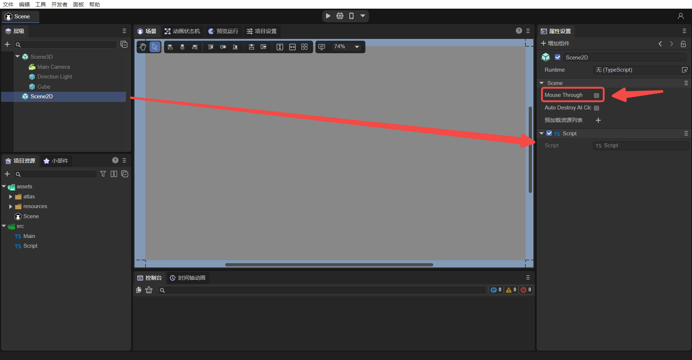

# ECS - System: Built-in Methods of Component Scripts

> Author: Charley

In the **ECS (Entity-Component-System)** architecture used by the LayaAir engine, the **System** is the logical processing unit that drives entity behavior based on the data provided by Components.

When developers inherit the LayaAir component script class (`Laya.Script`), they can use a series of built-in lifecycle methods (e.g., `onAwake`, `onEnable`, `onUpdate`, etc.) and event response methods (e.g., `onMouseDown`, `onMouseClick`, etc.) provided by the engine. **These built-in methods serve as the entry points for component script logic, corresponding to the logical processing part of the System in the ECS architecture.**

> To learn more about ECS Components, please refer to ["Component Decorator Description"](../../../IDE/customComponent/decorators/readme.md)
>
> For **more comprehensive knowledge about ECS**, please refer to ["Entity Component System"](../../../basics/common/Component/readme.md)。

-----

## 1\. Overview of Built-in Script Methods

A component script is mainly composed of four parts: lifecycle methods, mouse event methods, keyboard event methods, and physics event methods. This is illustrated in Figure 1-1:


(Figure 1-1)

## 2\. Lifecycle Methods

In the LayaAir engine, lifecycle methods are a series of methods that the engine automatically calls at specific stages throughout the entire lifecycle of a game object (e.g., a scene, character, or UI element), from creation to destruction. These methods allow developers to execute specific code logic at different stages to control the initialization, updating, rendering, and destruction of game objects.

For example, the `onEnable` method is called when a component is enabled, such as when a node is added to the stage. In this method, you can perform initialization operations like getting component references or setting the initial state. The `onDestroy` method is called when a game object is destroyed, allowing you to release resources (e.g., memory, textures) occupied by the object to prevent memory leaks and resource waste. By properly using these lifecycle methods, developers can better manage the state and behavior of game objects, improving game performance and stability.

### 2.1 List of All Lifecycle Methods

All lifecycle methods are listed in the table below:

| Name | Condition |
| :--- | :--- |
| `onAdded` | Called after being added to a node. Unlike `onAwake`, `onAdded` is called even if the node is not active. |
| `onReset` | Resets component parameters to their default values. If this function is implemented, the component will be reset and automatically recycled to the object pool for future reuse. If not implemented, it will not be recycled. |
| `onAwake` | Executed after the component is activated. At this point, all nodes and components have been created. This method is executed only once. |
| `onEnable` | Executed after the component is enabled, for example, when a node is added to the stage. |
| `onStart` | Executed before the first `onUpdate` call, only executed once. |
| `onUpdate` | Executed every frame during the update. Avoid writing large loops or using the `getComponent` method here. |
| `onLateUpdate` | Executed every frame during the update, after `onUpdate`. Avoid writing large loops or using the `getComponent` method here. |
| `onPreRender` | Executed before rendering. |
| `onPostRender` | Executed after rendering. |
| `onDisable` | Executed when the component is disabled, for example, when a node is removed from the stage. |
| `onDestroy` | Executed when the node is manually destroyed. |

### 2.2 Using Lifecycle Methods in Code

In your code, as long as you inherit from `Laya.Script`, you can directly use the lifecycle methods with their corresponding names. The LayaAir engine will automatically execute the corresponding method at specific times (e.g., when a node is created or enabled).

Here is a usage example:

```typescript
const { regClass } = Laya;
@regClass()
export class NewScript extends Laya.Script {
	// Called after being added to a node. Unlike onAwake, onAdded is called even if the node is not active.
    onAdded(): void {
        console.log("Game onAdded");
    }

    // Executed after the component is activated. At this point, all nodes and components have been created. This method is executed only once.
    onAwake(): void {
        console.log("Game onAwake");
    }

    // Executed after the component is enabled, for example, when a node is added to the stage.
    onEnable(): void {
        console.log("Game onEnable");
    }

    // Executed before the first update call, only executed once.
    onStart(): void {
        console.log("Game onStart");
    }

    // Executed every frame during the update. Avoid writing large loops or using the getComponent method here.
    onUpdate(): void {
        console.log("Game onUpdate");
    }

    // Executed every frame during the update, after update. Avoid writing large loops or using the getComponent method here.
    onLateUpdate(): void {
        console.log("Game onLateUpdate");
    }

    // Executed before rendering.
    onPreRender(): void {
        console.log("Game onPreRender");
    }

    // Executed after rendering.
    onPostRender(): void {
        console.log("Game onPostRender");
    }

    // Resets component parameters to default values. If this function is implemented, the component will be reset and automatically recycled to the object pool for future reuse. If not reset, it will not be recycled.
    onReset(): void {
        console.log("Game onReset");
    }

    // Executed when the component is disabled, for example, when the node is removed from the stage.
    onDisable(): void {
        console.log("Game onDisable");
    }

    // Executed when the node is manually destroyed.
    onDestroy(): void {
        console.log("Game onDestroy");
    }
}
```

Let's take the `DropBox.ts` script from the "2D Getting Started Example" as an example to explain the use of lifecycle methods. The example code is as follows:

```typescript
const { regClass, property } = Laya;
import PhysicsGameMainRT from "../scence/physicsDemo/PhysicsGameMainRT";
/**
 * Script for falling boxes, implementing box collision and recycling process.
 */
@regClass()
export default class DropBox extends Laya.Script {

    /** Prefab for the box explosion animation. */
    @property({ type: Laya.Prefab, caption: "爆炸动画" })
    private burstAni: Laya.Prefab;
    /** Reference to the level text object. */
    private _text: Laya.Text;
    /** Box level. */
    private _level: number;

    constructor() { super(); }
    
    // Executed after the component is enabled.
    onEnable(): void {
        this._level = Math.round(Math.random() * 5) + 1;
        this._text = this.owner.getChildByName("levelTxt") as Laya.Text;
        this._text.text = this._level + "";

    }

	// Executed every frame during the update.
    onUpdate(): void {
        // Make the box rotate continuously.
        (this.owner as Laya.Sprite).rotation++;
    }
	// Executed at the start of a collision.
    onTriggerEnter(other: any): void {
        var owner: Laya.Sprite = this.owner as Laya.Sprite;
        if (other.label === "buttle") {
            // After colliding with a bullet, increase the score and play a sound effect.
            if (this._level > 1) {
                this._level--;
                this._text.text = (this._level + "");
                owner.getComponent(Laya.RigidBody).setVelocity({ x: 0, y: -10 });
                Laya.SoundManager.playSound("resources/sound/hit.wav");
            } else {
                if (owner.parent) {
                    let effect: Laya.Sprite = Laya.Pool.getItemByCreateFun("effect", this.createEffect, this);
                    owner.parent.addChild(effect);// Add the explosion animation to the parent node.
                    effect.pos(owner.x, owner.y);// Set the position of the explosion animation to follow the box.
                    owner.removeSelf();// Remove the box's own node object.
                    Laya.SoundManager.playSound("resources/sound/destroy.wav");
                }
            }
            PhysicsGameMainRT.instance.addScore(1);
        } else if (other.label === "ground") {
            // As soon as one box touches the ground, stop the game.
            owner.removeSelf();
            PhysicsGameMainRT.instance.stopGame();
        }
    }

    /** Creates an explosion animation using an object pool. */
    createEffect(): Laya.Sprite {
        // Get the node object of the animation prefab.
        const aniNode: Laya.Sprite = this.burstAni.create() as Laya.Sprite;
        const ani: Laya.Animator2D = aniNode.getComponent(Laya.Animator2D);// Get the animation component object.
        // Listen for the animation playback event on the default state machine. After the animation finishes playing, delete the node object and recycle it to the object pool.
        ani.getControllerLayer().defaultState.on(Laya.AnimatorState2D.EVENT_OnStateExit, () => {
            aniNode.removeSelf();// Delete the animation node.
            Laya.Pool.recover("effect", aniNode);// Recycle the animation prefab to the object pool for future reuse.
        });
        return aniNode;
    }
	
    // Executed when the component is disabled.
    onDisable(): void {
        // When the box is removed, recycle it to the object pool for future reuse, reducing object creation overhead.
        Laya.Pool.recover("dropBox", this.owner);
    }
}
```

In addition to the comments in the code, it is important to note that `onEnable()` and `onAwake()` are methods that developers often use incorrectly.

In the example above, the requirement is to reset the random level every time the box is added to the stage. If the logic from `onEnable()` were moved to the `onAwake()` lifecycle method, this random level logic would not be executed when the box is retrieved from the object pool.

This is because when the box is removed, it is not destroyed but recycled to the object pool. When it reappears, it is retrieved from the pool rather than being recreated. Since `onAwake()` is only executed once upon first activation and the box is not truly "destroyed", it will not be "reborn" and thus `onAwake()` will not be called again. Therefore, the logic must be placed in the `onEnable()` lifecycle method, which is executed every time the node is added to the stage.

-----

## 3\. What are Event Methods?

In the LayaAir engine, event methods are script methods used to respond to various events. These events can be user actions (like mouse clicks, keyboard input), physical state changes (like collision start, ongoing collision, collision end), etc. By registering event methods, developers can make the game execute corresponding logic when a specific event occurs.

Event methods are automatically triggered methods that are called based on specific conditions. When using custom component scripts, you can quickly develop business logic through event methods.

### 3.1 Physics Events

When using a physics engine, we sometimes need to implement logical interactions based on physics collision events in the code. To facilitate this, the LayaAir engine triggers specific physics event methods when a physics collision first occurs, continues, or ends. These methods do not have a default implementation in the engine and can be considered methods to be overridden by developers. Developers only need to inherit the `Laya.Script` class and override these methods to implement custom logic responses, replacing the default empty implementation.

By overriding these specific methods, developers can execute corresponding game logic or interaction effects based on the specific phase of the physics collision, allowing the game or application to respond more naturally and realistically to physical collisions. The table below lists all physics event methods:

| Name | Condition |
| :--- | :--- |
| `onTriggerEnter` | 3D physics trigger event and 2D physics collision event. Executed at the start of a collision, only once. |
| `onTriggerStay` | 3D physics trigger event and 2D physics collision event (does not support sensors). Executed every frame during a sustained collision. |
| `onTriggerExit` | 3D physics trigger event and 2D physics collision event. Executed at the end of a collision, only once. |
| `onCollisionEnter` | 3D physics collider event (not applicable to 2D). Executed at the start of a collision, only once. |
| `onCollisionStay` | 3D physics collider event (not applicable to 2D). Executed every frame during a sustained collision. |
| `onCollisionExit` | 3D physics collider event (not applicable to 2D). Executed at the end of a collision, only once. |

As shown in the table above, 2D physics events have only three event methods, while 3D physics events are divided into two types, trigger events and collider events, with six event methods in total.

**Collider events** refer to events with physical feedback (like bouncing), while **trigger events** only trigger a physical event without actual physical collision feedback. This is the same effect as enabling a sensor on a 2D collider. However, for 2D physics, both collision feedback events and non-feedback events with sensors enabled use only the `onTrigger` events.

A special note for new developers: the `onTriggerStay` event is not triggered in 2D physics after a sensor is enabled.

Here is a usage example in a script:

```typescript
class DemoScript extends Laya.Script {
    
    /**
     * 3D physics trigger event and 2D physics collision event. The engine calls this event method once at the beginning of every physical collision.
     * @param other The collider and node information of the collision target object.
     * @param self The collider and node information of the current object (this parameter is only available for 2D physics; 3D physics only has `other`).
     * @param contact Collision information `b2Contact` from the physics engine. Developers can query the `b2Contact` object to get detailed information about the collision between the two rigid bodies. However, it is usually not needed, as the conventional information is sufficient in `other` and `self` (this parameter is only available for 2D physics; 3D physics only has `other`).
     */
     onTriggerEnter(other: Laya.PhysicsComponent | Laya.ColliderBase, self?: Laya.ColliderBase, contact?: any): void {
        // If it hits a bomb.
        if (other.label == "bomb") {
            // Logic for explosion damage is omitted here.

            console.log("Hit a bomb: " + self.label + " took damage, health reduced by xx");

        } else if (other.label == "Medicine") {  // If it hits a medicine box.
            // Logic for restoring health is omitted here.

            console.log("Hit a medicine box: " + self.label + " received treatment, health restored by xx");
            
        }
        console.log("onTriggerEnter:", other, self);
    }	

    /**
    * 3D physics trigger event and 2D physics collision event (does not support sensors). This event method is triggered every frame during a sustained physical collision, from the second collision in the lifecycle until the collision ends.
    * Avoid executing complex logic and function calls in this event method, especially performance-intensive calculations, as it can significantly impact performance.
    * @param other The collider and node information of the collision target object.
    * @param self The collider and node information of the current object (this parameter is only available for 2D physics; 3D physics only has `other`).
    * @param contact Collision information `b2Contact` from the physics engine. Developers can query the `b2Contact` object to get detailed information about the collision between the two rigid bodies. However, it is usually not needed, as the conventional information is sufficient in `other` and `self` (this parameter is only available for 2D physics; 3D physics only has `other`).
    */
    onTriggerStay(other: Laya.PhysicsComponent | Laya.ColliderBase, self?: Laya.ColliderBase, contact?: any): void {
        // During a sustained collision, log a message. Try not to use this event method, as improper use can have a significant impact on performance.
        console.log("onTriggerStay====", other, self);
    }

    /**
    * The engine calls this event method once at the end of every physical collision.
    * @param other The collider and node information of the collision target object.
    * @param self The collider and node information of the current object (this parameter is only available for 2D physics; 3D physics only has `other`).
    * @param contact Collision information `b2Contact` from the physics engine. Developers can query the `b2Contact` object to get detailed information about the collision between the two rigid bodies. However, it is usually not needed, as the conventional information is sufficient in `other` and `self` (this parameter is only available for 2D physics; 3D physics only has `other`).
    */
    onTriggerExit(other: Laya.PhysicsComponent | Laya.ColliderBase, self?: Laya.ColliderBase, contact?: any): void {   
        // Simulate a character leaving a poison area to trigger an escape reward.
        if (other.label == "poison") {
            // Logic for the escape reward is omitted here.

            console.log("Left the poison area: " + self.label + " received an escape reward, health +10");
        }

        console.log("onTriggerExit========", other, self);
    }

    /**
     * 3D physics collider event (not applicable to 2D). The engine calls this event method once at the beginning of every physical collision.
     * @param other The collision target object.
     */
    onCollisionEnter(other:Laya.Collision): void {
        // After the collision starts, the object changes color.
        (this.owner.getComponent(Laya.MeshRenderer).material as Laya.BlinnPhongMaterial).albedoColor = new Laya.Color(0.0, 1.0, 0.0, 1.0);// Green
    }

    /**
    * 3D physics collider event (not applicable to 2D) when a sustained physical collision occurs. This event method is triggered every frame from the second collision in the lifecycle until the collision ends.
    * Avoid executing complex logic and function calls in this event method, especially performance-intensive calculations, as it can significantly impact performance.
    * @param other The collision target object.
    */
    onCollisionStay(other:Laya.Collision): void {
    	// During a sustained collision, log a message. Try not to use this event method, as improper use can have a significant impact on performance.
        console.log("peng");
    }

   /**
    * 3D physics collider event (not applicable to 2D). The engine calls this event method once at the end of every physical collision.
    * @param other The collision target object.
    */
    onCollisionExit(other:Laya.Collision): void {
        //// After the collision leaves, the object reverts to its original color.
		(this.owner.getComponent(Laya.MeshRenderer).material as Laya.BlinnPhongMaterial).albedoColor = new Laya.Color(1.0, 1.0, 1.0, 1.0);// White
    }
}
```

Based on the code example above, let's add a script to a 3D model, as shown in the animated Figure 3-1.


(Animated Figure 3-1)

### 3.2 Mouse Events

| Name | Condition |
| :--- | :--- |
| `onMouseDown` | Executed when a mouse button is pressed. |
| `onMouseUp` | Executed when a mouse button is released. |
| `onRightMouseDown` | Executed when the right or middle mouse button is pressed. |
| `onRightMouseUp` | Executed when the right or middle mouse button is released. |
| `onMouseMove` | Executed when the mouse moves over the node. |
| `onMouseOver` | Executed when the mouse enters the node. |
| `onMouseOut` | Executed when the mouse leaves the node. |
| `onMouseDrag` | Executed when an object is dragged while the mouse button is held down. |
| `onMouseDragEnd` | Executed after dragging an object for a certain distance and releasing the mouse button. |
| `onMouseClick` | Executed when the mouse is clicked. |
| `onMouseDoubleClick` | Executed when the mouse is double-clicked. |
| `onMouseRightClick` | Executed when the right mouse button is clicked. |

Here is the usage in code:

```typescript
	// Executed when a keyboard button is pressed.
    onMouseDown(evt: Laya.Event): void {
    }

    // Executed when a mouse button is released.
    onMouseUp(evt: Laya.Event): void {
    }

    // Executed when the right or middle mouse button is pressed.
    onRightMouseDown(evt: Laya.Event): void {
    }

    // Executed when the right or middle mouse button is released.
    onRightMouseUp(evt: Laya.Event): void {
    }

    // Executed when the mouse moves over the node.
    onMouseMove(evt: Laya.Event): void {
    }

    // Executed when the mouse enters the node.
    onMouseOver(evt: Laya.Event): void {
    }

    // Executed when the mouse leaves the node.
    onMouseOut(evt: Laya.Event): void {
    }

    // Executed when an object is dragged while the mouse button is held down.
    onMouseDrag(evt: Laya.Event): void {
    }

    // Executed after dragging an object for a certain distance and releasing the mouse button.
    onMouseDragEnd(evt: Laya.Event): void {
    }

    // Executed when the mouse is clicked.
    onMouseClick(evt: Laya.Event): void {
    }

    // Executed when the mouse is double-clicked.
    onMouseDoubleClick(evt: Laya.Event): void {
    }

    // Executed when the right mouse button is clicked.
    onMouseRightClick(evt: Laya.Event): void {
    }
```

Let's take `onMouseDown` and `onMouseUp` as examples. Add the following code to the custom component script "Script.ts":

```typescript
const { regClass, property } = Laya;

@regClass()
export class Script extends Laya.Script {
    /**
     * Executed when a mouse button is pressed.
     */
	onMouseDown(evt: Laya.Event): void {
        console.log("onMouseDown");
    }
    /**
     * Executed when a mouse button is released.
     */
    onMouseUp(evt: Laya.Event): void {
        console.log("onMouseUp");
    }
}
```

As shown in Figure 3-2, after adding the component script to the Scene2D properties panel, do not check "Mouse Through" first, because if you do, mouse events under Scene2D will not be responded to. If it's a 3D scene, it will be passed to Scene3D.



(Figure 3-2)

Run the project, and as shown in the animated Figure 3-3, when the mouse button is pressed, `onMouseDown` is executed, printing "onMouseDown"; when the mouse is released, `onMouseUp` is executed, printing "onMouseUp".


(Animated Figure 3-3)

### 3.3 Keyboard Events

| Name | Condition |
| :--- | :--- |
| `onKeyDown` | Executed when a key is pressed down. |
| `onKeyPress` | Executed when a character is produced by the keyboard. |
| `onKeyUp` | Executed when a key is released. |

Here is the usage in code:

```typescript
	// Executed when a key is pressed down.
     onKeyDown(evt: Laya.Event): void {
    }

    // Executed when a character is produced by the keyboard.
    onKeyPress(evt: Laya.Event): void {
    }

    // Executed when a key is released.
    onKeyUp(evt: Laya.Event): void {
    }
```

> Note: `onKeyPress` is executed when a character is produced, such as the letters "a", "b", "c", etc. Keys that do not produce a character, such as the arrow keys, F1, F2, etc., will not trigger this method.