# Practical Operations

In this chapter, we use an example project to demonstrate the usage workflow of the Smart Resource Management Plugin for developers. Please note that before reading this article, it is recommended to first read the [User Guide](../instruction/readme.md) documentation.

## 1. Import Plugin

Developers need to use an account with Smart Resource Management Plugin permissions to log in to the IDE. Open the package manager in the developer bar, select the Smart Resource Management Plugin, and install it.

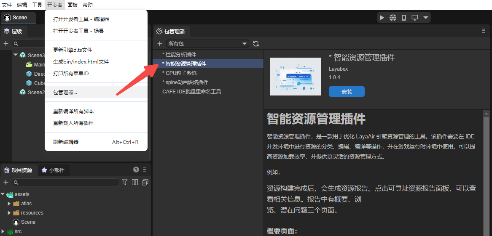

## 2. Resource Group Management

After successfully importing the plugin, the Smart Resource Management panel will appear in the IDE. Developers need to add resources to resource groups and set resource aliases and tags.

**Note:** In real project development scenarios, please determine the specific resource grouping scheme based on actual needs. This is only for demonstration purposes.

Add resources:

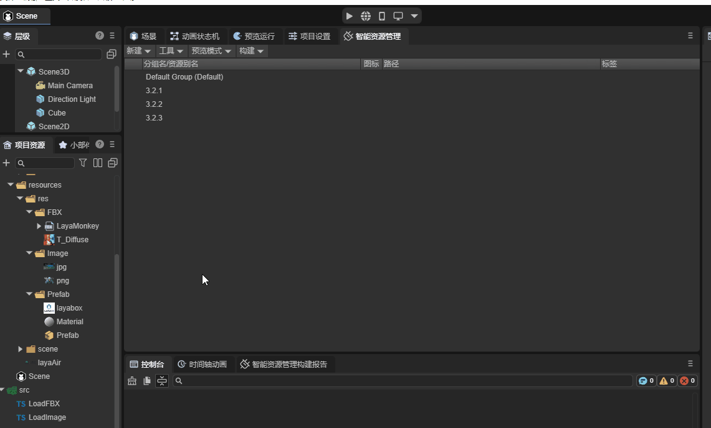

Modify resource alias:


Add tags:


## 3. Preview and Debug

### 3.1 Build Resources

After setting up resource groups, you need to package the resources to debug the program in preview mode. Open the Smart Resource Management panel and click Build - New Build to start the plugin's resource build process.

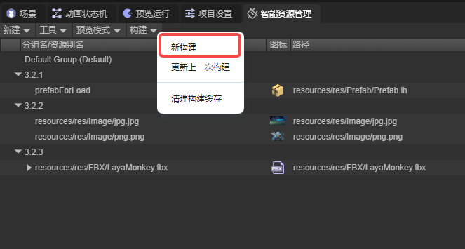

### 3.2 Resource Loading Examples

#### 3.2.1 Loading a Prefab

The resources used in the example are shown below:

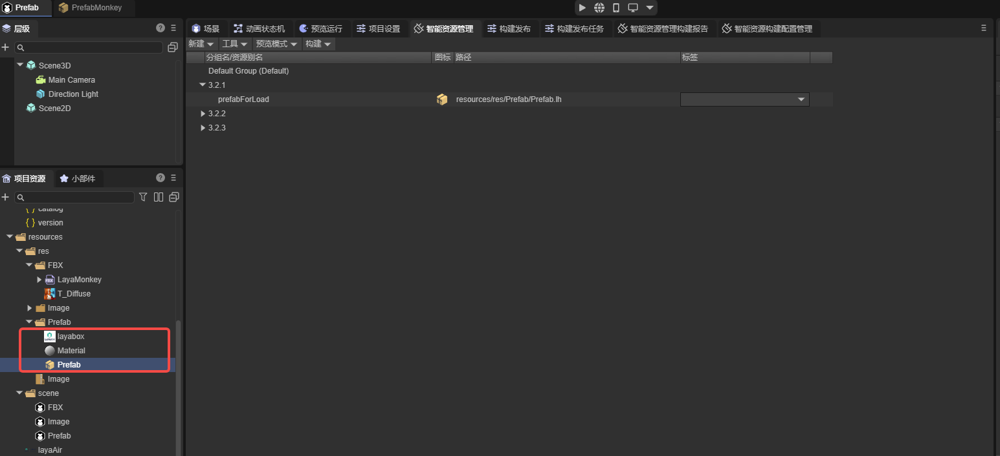

As you can see, only one resource "Prefab" was added to the resource group, but in reality this prefab uses the resources in the red box, and the "layaBox" and "Material" resources were not added to resource management. This is one of the features of the Smart Resource Management Plugin. Developers only need to add resources that need to be directly used to group management, and resources associated with this resource will be automatically packaged.

Example code:

```typescript
@regClass()
export class LoadPrefab extends Laya.Script {

    @property(Laya.Scene3D)
    public scene: Laya.Scene3D;

    key: string = "prefabForLoad"

    onStart(): void {
        Addressables.instantiateAsync(this.key).then((res) => {
            res.data.transform.position = new Laya.Vector3(-3, 0, 0);
            this.scene.addChild(res.data);
        })

        Addressables.loadAssetAsync(this.key).then((res) => {
            let prefab = res.data.create();
            prefab.transform.position = new Laya.Vector3(3, 0, 0);
            this.scene.addChild(prefab);
        })
    }

}
```

Mount the above script to the scene and click run. The running result is shown in the figure:

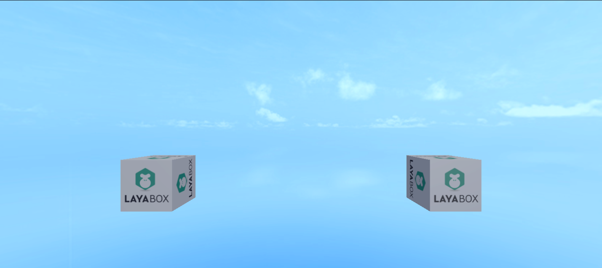

When loading prefabs, you can either use the `Addressables.instantiateAsync` method to directly create the prefab as an instance, or first use `Addressables.loadAssetAsync` to load the prefab resource, then create an instance through the prefab object's `create()` method.

#### 3.2.2 Loading Multiple Images

The resources used in the example are shown below:


Example code:

```typescript
@regClass()
export class LoadImage extends Laya.Script {

    key: string[] = ["test1"];
    resourceLocation: ResourceLocation[] = [];

    onStart(): void {
        this.loadImage(this.key);
    }

    async loadImage(key: string[]){
        //Load resources
        await Addressables.loadAssetsAsync(this.key, { mode: MergeMode.Union });
        //Get resource address
        this.resourceLocation = await Addressables.getLocationAsync(this.key, MergeMode.Union);
        this.setImage();
    }

    //Add images to the scene
    setImage(): void{
        let imageJPG: Laya.Image = new Laya.Image(this.resourceLocation[0].path);
        imageJPG.pos(165, 62.5);
        imageJPG.size(300, 200);
        this.owner.addChild(imageJPG);

        let imagePNG: Laya.Image = new Laya.Image(this.resourceLocation[1].path);
        imagePNG.pos(600, 62.5);
        imagePNG.size(300, 200);
        this.owner.addChild(imagePNG);
    }

}
```

As you can see, after loading resources, the code uses the `Addressables.getLocationAsync` method to get the resource path. Some methods need to use the resource path as a parameter, so you need to get the resource address.

The running result is shown in the figure:


**Note:** The `Addressables.getLocationAsync` method does not load resources. When loading resources through the Smart Resource Management Plugin, regardless of what type of resources are loaded, the first step is to call one of the four methods introduced in Section 5 of the [User Guide](../instruction/readme.md) to load resource packages.

#### 3.2.3 Loading FBX Resources

The resources used in the example are shown below:


Example code:

```typescript
@regClass()
export class NewScript extends Laya.Script {

    @property(Laya.Scene3D)
    public scene: Laya.Scene3D;

    resource: any;

    onStart(): void {
        this.loadFBX();
    }

    async loadFBX() {
        let loadResult = await Addressables.loadAssetAsync("resources/res/FBX/LayaMonkey.fbx", { type: Laya.Loader.HIERARCHY});
        let monkey: Laya.Sprite3D = loadResult.data.create();
        this.scene.addChild(monkey);
    }
}
```

When the engine loads certain resources, it needs to pass the resource type as a parameter.

When the plugin loads resources, it will cache the loaded resource packages. After a resource package is loaded, developers can also load other resources in the resource package through the `Laya.loader.load` method.

The running result is shown in the figure:


In practice, you can also make resources into prefabs and then load them.

Loading resources on demand is also an advantage of the Smart Resource Management Plugin. Without the plugin, the system will download all resources, even if some resources may not be used; while the Smart Resource Management Plugin will selectively load resources based on developer settings (for example, if the program has a total of ten resource packages, and only two are needed at this time, the plugin will only download these two resource packages, not the other eight resource packages), which greatly improves program loading speed.

### 3.3 Optimize Resource Packages

After each resource build, the plugin will automatically generate a build report. If multiple resources reference the same resource, and the referenced resource is not added to smart resource management, this resource will be repeatedly packaged by the plugin, causing space waste. Developers need to optimize resource packages based on actual needs.

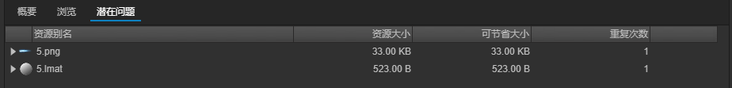

## 4. Build and Release

After preview and debugging are completed without problems, you can proceed with build and release.

### 4.1 Smart Resource Build Configuration Management

In the Smart Resource Management panel, click the toolbar to open the Build Configuration Management panel.

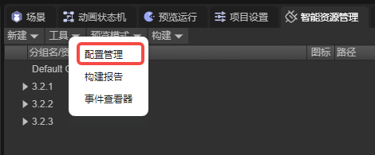

Set up build configurations according to needs and activate them.


For the operation methods and properties of build configurations, please [refer to the documentation](../instruction/readme.md)

### 4.2 Build Release Settings

After the build configuration settings are completed, the next step is to set up in Build & Release - Smart Resource Management page. For explanations of specific properties, please refer to Section 2.1 and Section 2.3 in the [User Guide](../instruction/readme.md).

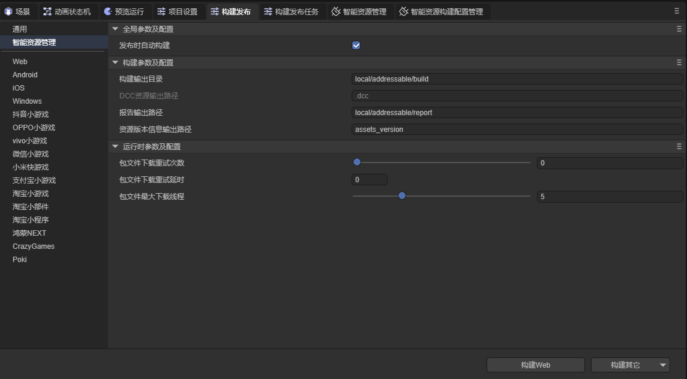

### 4.3 Build Release

After completing the above process, developers can proceed with build and release. The build release process is the same as the normal release process, no additional settings required.


After the build is completed, a packaged project will be generated in the output directory, and there will be a .dcc file in the project files.

### 4.4 Distribute Remote Packages

Next, you need to distribute remote packages.

First, let me explain the project resources mentioned below: Project resources are the resource packages generated after build and release, usually stored in the release folder.

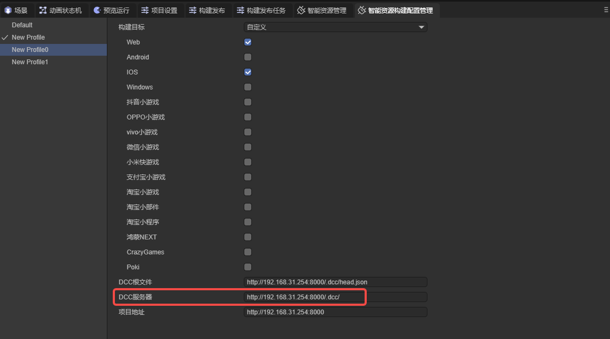

First, put the project resources into the project address.


Next is the `head.json` file. This file will be generated in the .dcc file under the project resources. Developers need to transfer it to the root file address. When left empty, the `head.json` path in the DCC resource output path under the project path will be used.

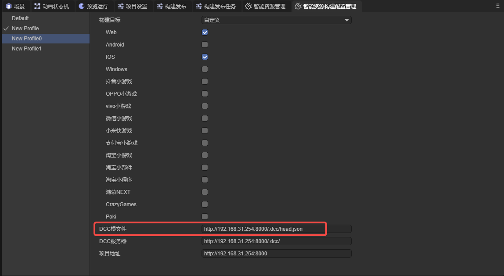

Finally, the DCC-generated files. These files will be generated in the `.dcc` directory under the project resources. Developers need to transfer them to the DCC server address. When left empty, the DCC resource output path under the project path will be used as the DCC server address.


### 4.5 Update Resources

When developers need to update resources, they can use the update last build function.


The resource packages generated by updating the last build will be stored in a folder with the same name as the build configuration in the build output directory, based on the build configuration activated by the developer at this time.

Developers only need to transfer the `.dcc` and `head.json` files and the new exported resources to the corresponding server addresses, without needing to modify the program code.

From here, you can also appreciate the advantage of using the Smart Resource Management Plugin. Without the plugin, if developers make changes to resources (such as renaming, modifying resource paths, etc.), they need to modify the code to ensure the program can find resources normally; if the plugin is used, this problem will not exist, because the plugin loads resources through keywords (resource aliases and tags), and as long as the keywords remain unchanged, the plugin can find and load resources, regardless of what changes developers make to the resources.

Here we renamed the prefab used in 3.2.1 to aaa


After rebuilding the resources, without modifying any code, running the program shows that resources still load normally.

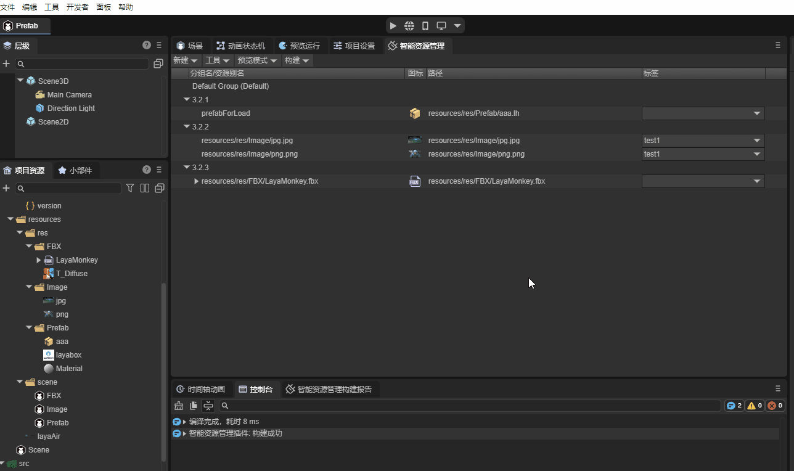
