# User Guide

## 1. Overview

The LayaAir Smart Resource Management Plugin is a plugin for managing and packaging program resources. When resources are added to smart resource management, whether the resource is in the local program or on a remote server, developers can load it through resource aliases anywhere in the code. The smart resource management plugin will handle the resource loading process and return the obtained data.

Using the smart resource management plugin can significantly improve project flexibility. Developers can load resources when needed instead of downloading resources with the program. During the development phase, developers can arbitrarily modify the location of resources without rewriting any game code.

### 1.1 Smart Resource Management Plugin System Overview

This section provides a basic introduction to some concepts in the smart resource management plugin to help developers establish a basic understanding of this plugin.

**Resource Alias:** A string ID that identifies resources managed by the plugin. Developers can use resource aliases to load resources.

**Tag:** A marker that developers can assign to multiple resources and use tags as keywords to load resources.

**Resource Group:** The basic unit of resource management. The plugin packages resources based on resource group settings.

**Resource Build:** The operation of packaging resources. The plugin packages resources based on developer settings.

**Build Report:** After resources are built, the plugin will generate a resource build report. Developers can optimize resource settings based on the build report.

## 2. Configure Smart Resource Management Objects

### 2.1 Smart Resource Management Plugin Configuration

Open the configuration panel in Build & Release - Smart Resource Management.


#### 2.1.1 Global Parameters and Configuration

**Auto Build on Release:** After enabling this configuration, when executing build and release, the smart resource management plugin will automatically perform a new build; if this configuration is not enabled, the plugin will use the resource packages generated during the last build.

#### 2.1.2 Build Parameters and Configuration

**Build Output Directory:** The root path where built files are stored, relative to the current project path. During build, a subdirectory will be created based on this directory, with the subdirectory name being the same as the activated build configuration name during build. All files generated during build will be stored in this subdirectory, and this subdirectory will be cleared with each build.

Generally not recommended to modify.

**DCC Resource Output Path:** The output address of DCC-related files during build, relative to the subdirectory with the same name as the activated build configuration under the build output directory. This address cannot be modified.

**Report Output Path:** The path where the build report is stored, relative to the current project path.

**Resource Version Info Output Path:** The address where resource version information data is stored, relative to the current project path. This data is used to compare changes in managed resources between two builds when updating the last build. This address is generally not recommended to be modified.

#### 2.1.3 Runtime Parameters and Configuration

**Package File Download Retry Count:** The number of times the plugin will retry when package file download fails.

**Package File Download Retry Delay:** How long the plugin will delay before retrying when package file download fails.

**Maximum Package Download Threads:** The maximum number of package files that can be downloaded simultaneously.

### 2.2 Resource Group Configuration

In the Smart Resource Management panel, click any group to configure and manage it in the right panel.


**Prevent Updates:** After enabling this property, when executing update last build, resource builds will no longer be performed for this resource group. If developers modify resources under this resource group, the plugin will remind developers to move modified resources to a new group. New builds are not affected by this property.

**Include in Package:** Only resource groups with this property enabled will be packaged. Resource groups without this property enabled are equivalent to not existing.

**Include Alias/Tags in Catalog:** When this property is not enabled, the alias/tags of resources in this resource group will not be included in the Catalog file generated by the plugin, and resources in this resource group cannot be loaded using alias/tags as keywords.

### 2.3 Build Configuration

Open the Smart Resource Management Build Configuration panel in Smart Resource Management - Toolbar.


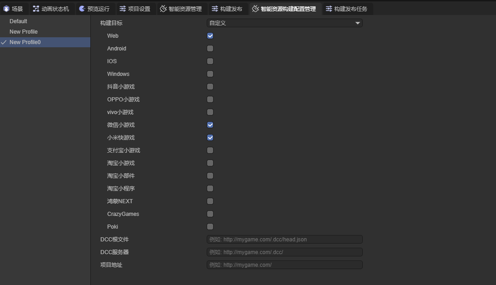

**Build Target:** Which platform this build configuration will take effect on. It can be all platforms or a custom combination of multiple platforms.

**Root File:** The plugin will load the `head.json` file through the address set by this property. When left empty, the `.dcc/head.json` under the project address set during build & release will be used as the root file address.

**DCC Server:** The plugin will load DCC-related files according to the address filled in this property. When left empty, the `.dcc` directory address under the project address set during build & release will be used as the DCC server address.

**Project Address:** The HTTP address of project resources, used to access project resources. When left empty, it indicates that all project resources are in the package.

### 2.4 Preview Mode

Preview mode is used during program development to simulate loading resources for convenient program debugging by developers.

Preview mode is divided into two types: local mode and remote mode.

When local mode is selected, resources will not be loaded through package files, but through the assets directory;


When remote mode is selected, the plugin will start an HTTP service locally to simulate external network resource loading.
**Note:** After modifying the mode, you need to use `Ctrl + Shift + R` to refresh the editor to enable/disable this HTTP service.


## 3. Resource Management

### 3.1 Resource Group Management

#### 3.1.1 Create New Resource Group

Click the "New" button at the top of the panel to create a new resource group.

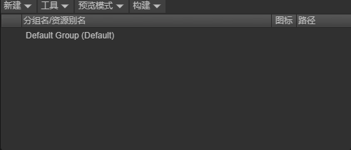

#### 3.1.2 Rename Resource Group

You can rename a group in three ways: right-click group name - rename, slow double-click, or select the group to be renamed and press the `F2` key on the keyboard.

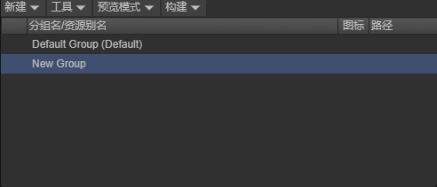

#### 3.1.3 Delete Resource Group

You can delete a group in two ways: right-click group name - remove group, or select the group to be deleted and press the `Del` key on the keyboard.

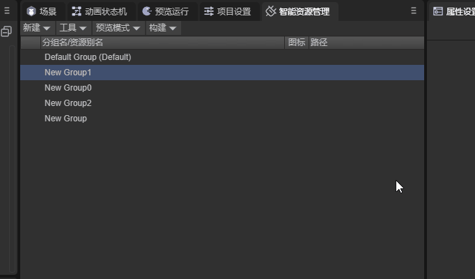

#### 3.1.4 Change Group Order

Change the order of groups by dragging to facilitate user management.


### 3.2 In-Group Resource Management

#### 3.2.1 Add Resources

First method: Drag resources to be packaged into the newly created resource group to generate resource entries. You can drag a single resource or folder into the resource group.

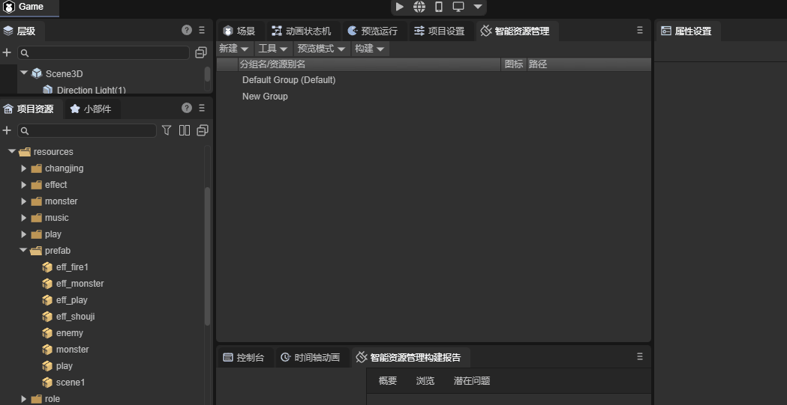

When dragging a folder into the resource group, the plugin will automatically add all resources under that folder (including all subfolders under that file) to this resource group.


Second method: In the project resource panel, select the resource to be added, check the "Smart Resource Management" option in the right panel, and apply. The resource will be automatically added to the default group.

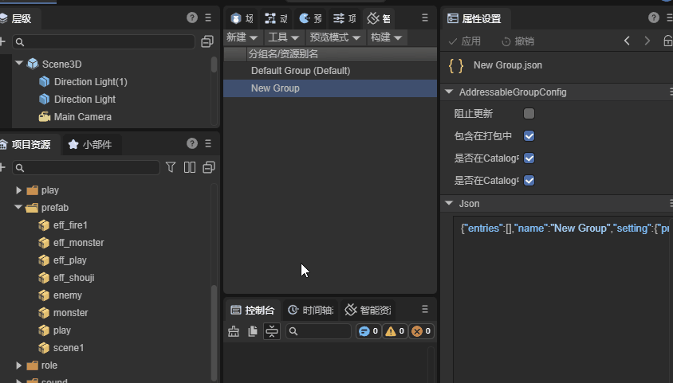

#### 3.2.2 Remove Resources

First method: In the addressable resource management panel, right-click the resource you want to remove and click remove.


Second method: In the project resource panel, select the resource to be removed, uncheck the "Smart Resource Management" option in the right panel, and apply.


#### 3.2.3 Resource Alias Renaming

You can change the resource alias of a resource in three ways: right-click resource - rename, slow double-click, or select the resource to be renamed and press the `F2` key on the keyboard.

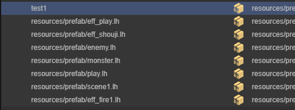

#### 3.2.4 Change Resource Group

Change the resource group where a resource is located by dragging.

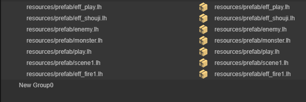

You can also drag resources from the project resource panel into different groups to change the resource group where the resource is located.


#### 3.2.5 Resource Tag Management

Add, remove, and rename tags in the tag management interface.


Add tags to resources. A resource can have multiple tags, and a tag can correspond to multiple resources.


### 3.3 Build Configuration Management

In the Smart Resource Management panel, click the toolbar to open Smart Resource Build Configuration Management.

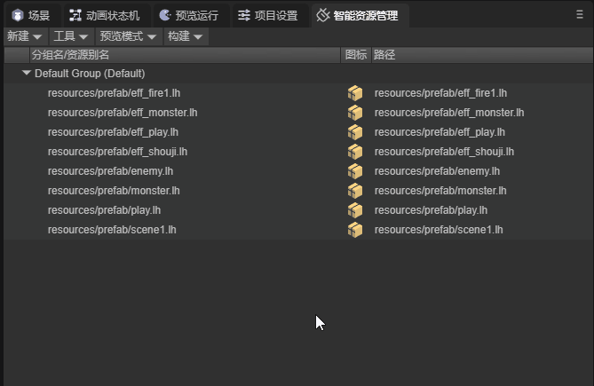

Developers can manage build configurations, including creating, deleting, renaming, and activating these operations.

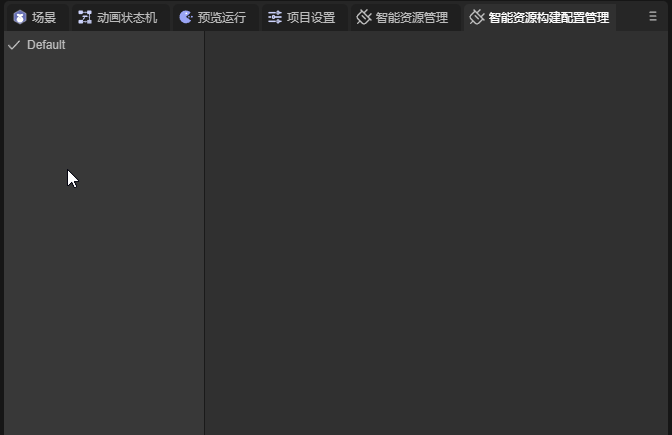

For each build configuration, developers can set its properties themselves.
**Note:** The build platform property of the default configuration is always `All` and cannot be modified. This is to ensure that users always have an available build configuration file when releasing projects.

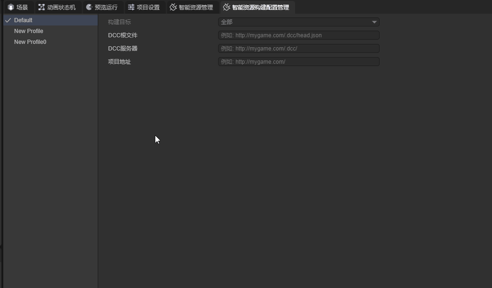

Before building and releasing, developers need to select the correct build configuration. If the build target of the activated build configuration does not include the platform of this build, the plugin will remind developers to change the build configuration.


## 4. Build Content

### 4.1 Build Settings

To build resources, developers need to perform the following operations:

1. Set up resource groups.

2. Set up in Build & Release - Smart Resource Management page.

3. Select the correct build configuration file.

4. Execute build.

### 4.2 Execute Build

#### 4.2.1 New Build

When building, developers can use new build to separately build resources in smart resource management without building the entire project.

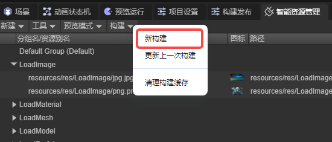

#### 4.2.2 Build Release

When building and releasing, if developers have enabled the auto build on release configuration, the plugin will build resources. The generated `.dcc` file will be saved in the project output directory. Developers can move the `.dcc` file and `head.json` file to the corresponding server based on the activated build configuration.


### 4.3 Update Resources

When developers need to update resources, they can use the update last build function.


Updating the last build will determine whether to perform resource builds for resource groups based on whether the prevent updates property is enabled for the resource group.

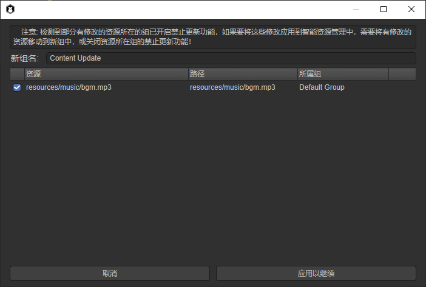

After completing the build, the generated files will be stored in the build output directory. Developers need to transfer the newly packaged resources, `.dcc` directory, and `head.json` files to the specified server.

## 5. Runtime Usage

At runtime, there are four methods for loading resources.

```typescript
/**
 * Load resource
 * @param key Keyword used to filter resources
 * @param options {LoadAssetOptions} Options for loading resources
 * @returns {Promise<LoadResult>}
 */
static async loadAssetAsync(key: string, options?: LoadAssetOptions): Promise<LoadResult> ;

/**
 * Load resources
 * @param key Keyword used to filter resources
 * @param options {LoadAssetsOptions} Options for loading resources
 * @returns {Promise<LoadResult>}
 */
static async loadAssetsAsync(key: string | string[], options?: LoadAssetsOptions): Promise<LoadResult> ;

/**
 * Create resource instance
 * @description Returns the created instance in {@link LoadResult.data}, only valid when the loaded resource is a Prefab
 * @param key Keyword used to filter resources
 * @param options
 * @return {Promise<LoadResult>}
 */
static async instantiateAsync(key: string, options?: InstantiateOptions): Promise<LoadResult> ;

/**
 * Load scene
 * @description Returns the path required to load the scene in {@link LoadResult.data}
 * @param key Keyword used to filter resources
 * @param options
 * @returns {Promise<LoadResult>} Returns the path of the loaded scene in {@link LoadResult.data}
 */
static async loadSceneAsync(key: string, options?: LoadSceneOptions): Promise<LoadResult>;
```

### 5.1 Load Single Resource

```typescript
/**
 * Load resource
 * @param key Keyword used to filter resources
 * @param options {LoadAssetOptions} Options for loading resources
 * @returns {Promise<LoadResult>}
 */
static async loadAssetAsync(key: string, options?: LoadAssetOptions): Promise<LoadResult> ;
```

Addressables.loadAssetAsync, this method will load the first found resource based on the keyword.

    onStart(): void {
        Addressables.loadAssetAsync('test1').then((result: LoadResult) => {
            console.log(result);
        });
    }


Output result:

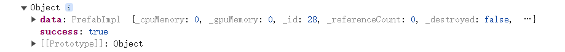

### 5.2 Load Multiple Resources

```typescript
/**
 * Load resources
 * @param key Keyword used to filter resources
 * @param options {LoadAssetsOptions} Options for loading resources
 * @returns {Promise<LoadResult>}
 */
static async loadAssetsAsync(key: string | string[], options?: LoadAssetsOptions): Promise<LoadResult> ;
```

Addressables.loadAssetsAsync, this method has three loading options based on different options values.

#### 5.2.1 UseFirst

When using this loading option, the plugin will load all resources containing this resource alias or tag based on the first keyword passed in. If multiple keywords are passed at this time, only the first keyword takes effect.


```typescript
onStart(): void {
    Addressables.loadAssetsAsync(['test2', 'test1'], { mode: MergeMode.UseFirst }).then((result: LoadResult) => {

        console.log(result);

        for(let i = 0; i < result.data.length; i++) {
            console.log(result.data[i].url);
        }
    });
}
```

Output result:

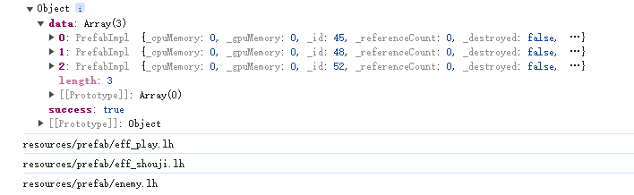

#### 5.2.2 Union

The plugin will filter all resources corresponding to each keyword and take the union of these resources.

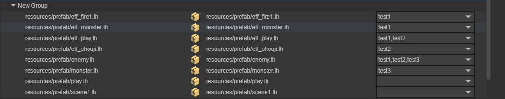

```typescript
onStart(): void {
    Addressables.loadAssetsAsync(['test1', 'test2'], { mode: MergeMode.Union }).then((result: LoadResult) => {

        console.log(result);

        for(let i = 0; i < result.data.length; i++) {
            console.log(result.data[i].url);
        }
    });
}
```

Output result:


#### 5.2.3 Intersection

The plugin will filter all resources corresponding to each keyword and take the intersection of these resources.


```typescript
onStart(): void {
    Addressables.loadAssetsAsync(['test1', 'test2'], { mode: MergeMode.Intersection }).then((result: LoadResult) => {

        console.log(result);

        for(let i = 0; i < result.data.length; i++) {
            console.log(result.data[i].url);
        }
    });
}
```

Output result:

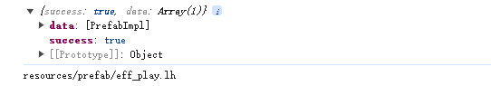

#### 5.2.4 options

The smart resource management plugin internally calls the `Laya.loader.load` method, so the plugin's loading methods can also use its property values as parameters. Developers can set parameters themselves according to needs.

```typescript
export interface ILoadOptions {
    type?: string; //Resource type. For example: Loader.IMAGE.
    priority?: number; //(default = 0) Loading priority, the higher the number, the higher the priority, and higher priority resources load first.
    group?: string; //Grouping for easy resource management.
    cache?: boolean; //Whether to cache
    noRetry?: boolean; //Whether to retry loading
    silent?: boolean; //Whether to prompt loading failure
    useWorkerLoader?: boolean; //(default = false) Whether to use worker loading (only effective for IMAGE type and ATLAS type, and when browser supports)
    constructParams?: TextureConstructParams; //Image properties, see below
    propertyParams?: TexturePropertyParams; //Texture properties, see below
    blob?: ArrayBuffer; //Pass blob object to get HTMLImageElement
    noMetaFile?: boolean; //Whether not to download Meta(json) file
    [key: string]: any;
}

TextureConstructParams {
    width?: number,
    height?: number,
    format?: TextureFormat,
    mipmap?: boolean,
    canRead?: boolean,
    sRGB?: boolean,
}

TexturePropertyParams {
    wrapModeU?: number,
    wrapModeV?: number,
    filterMode?: FilterMode,
    anisoLevel?: number,
    premultiplyAlpha?: boolean,
    hdrEncodeFormat?: HDREncodeFormat,
}
```

If developers want the smart resource management plugin to internally call the `Laya.loader.fetch` method to load resources, they need to set the `noUseResourceLoader?: boolean` property to `true` and pass in the required `contentType?: keyof Laya.ContentTypeMap` property value.

```typescript
export interface LoadOptions extends Laya.ILoadOptions {
    /** Resource loading progress callback */
    progress?: Laya.Handler | Laya.ProgressCallback;
    /** Do not use {@link Laya.IResourceLoader} to parse downloaded resources. When this value is true, {@link LoadResult.data} returns the result obtained through the {@link Laya.Loader.fetch} interface */
    noUseResourceLoader?: boolean;
    /** Valid only when {@link noUseResourceLoader} is true. This parameter will be passed as a parameter of {@link Laya.Loader.fetch} */
    contentType?: keyof Laya.ContentTypeMap;
}
```

### 5.3 Create Resource Instance

```typescript
/**
 * Create resource instance
 * @description Returns the created instance in {@link LoadResult.data}, only valid when the loaded resource is a Prefab
 * @param key Keyword used to filter resources
 * @param options
 * @return {Promise<LoadResult>}
 */
static async instantiateAsync(key: string, options?: InstantiateOptions): Promise<LoadResult> ;
```

Addressables.instantiateAsync, the plugin will directly convert the first prefab resource retrieved based on the passed keyword into a corresponding node. Other resources will be ignored.

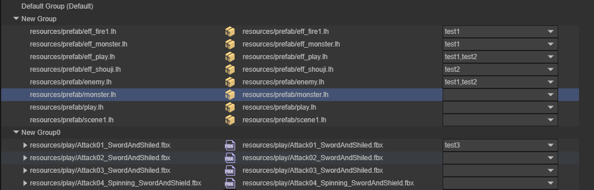

```typescript
onStart(): void {
    Addressables.instantiateAsync('test1').then((result: LoadResult) => {
        console.log(result);
    });

    Addressables.instantiateAsync('test3').then((result: LoadResult) => {
        console.log(result);
    });
}
```

Output result:

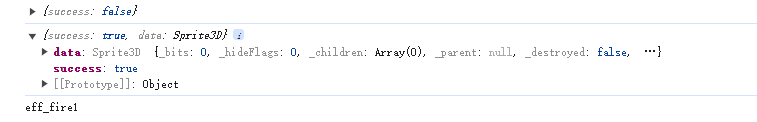

### 5.4 Load Scene

```typescript
/**
 * Load scene
 * @description Returns the path required to load the scene in {@link LoadResult.data}
 * @param key Keyword used to filter resources
 * @param options
 * @returns {Promise<LoadResult>} Returns the path of the loaded scene in {@link LoadResult.data}
 */
static async loadSceneAsync(key: string, options?: LoadSceneOptions): Promise<LoadResult> 
```

Addressables.loadSceneAsync, the plugin will load the first scene resource retrieved based on the passed keyword. Non-scene resources will be ignored.


```typescript
onStart(): void {
    Addressables.loadSceneAsync("resources/scene/SceneForLoad.ls").then((res) => {
        console.log(res);
        Laya.Scene.open(res.data);
    })
}
```

Output result:


### 5.5 Get Resource Description Information List

Addressables.getLocationAsync, the plugin will load and return resource description information based on the passed keyword. Note that this method will not load resources.

```typescript
/**
 * Get resource description information list
 * @param keys Keyword list used to filter resources
 * @param mode Merge mode
 * @returns {Promise<ResourceLocation[]>}
 */
static async getLocationAsync(key: string | string[], mode?: MergeMode): Promise<ResourceLocation[]>
```

Same as the method for loading multiple resources, Addressable.getLocationAsync can also use different loading options based on different passed keywords.

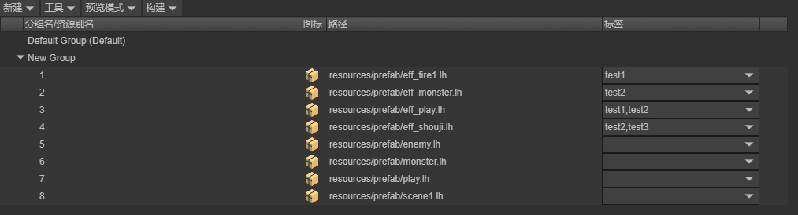

```typescript
onStart(): void {
    Addressables.getLocationAsync(["test2"], MergeMode.Union).then((res) => {
        console.log(res);
    })
}
```

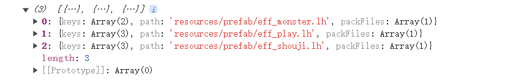

## 6. Build Report

After resource build is completed, a resource report will be generated. Click the Smart Resource Management Build Report panel to view relevant information. The report has three pages: Overview, Browse, and Potential Issues.

### 6.1 Overview

The overview page contains information such as compilation time, version number, resource statistics, and conflict issues for this report.

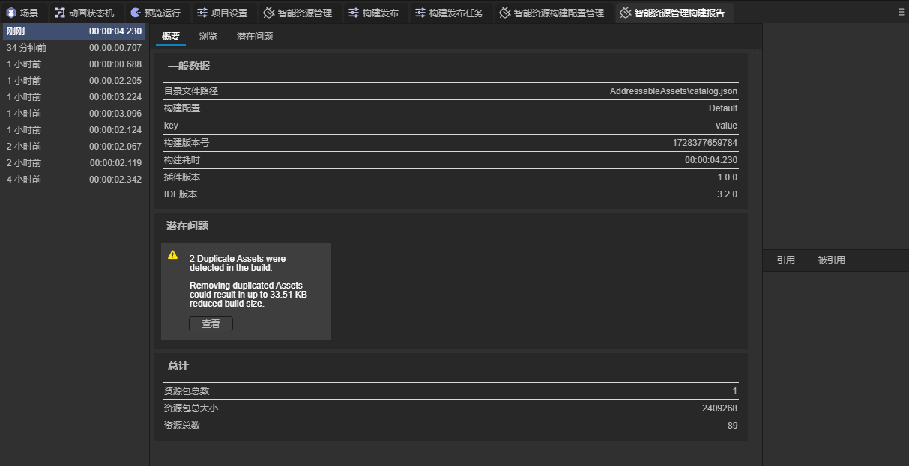

### 6.2 Browse

The browse page displays information about resources contained in each package, dependencies between resources, and dependencies between packages.

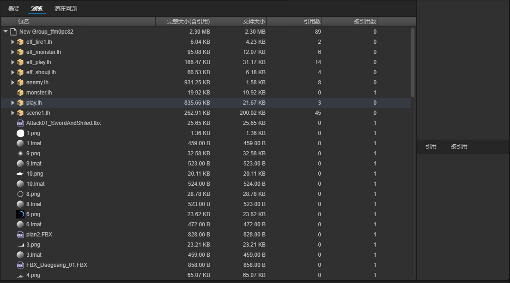

### 6.3 Potential Issues

Multiple resources in different packages reference the same resource simultaneously, and that resource is not added to resource management. At this time, the referenced resource will exist in multiple packages simultaneously, causing space waste.


## 7. Log Viewer

When previewing in the IDE, the plugin will generate runtime logs recording the plugin's behavior at runtime. Developers can check whether the plugin runs correctly as designed based on the runtime logs, or optimize code and resource packaging.

### 7.1 Open Log Viewer

In the Smart Resource Management panel, select the toolbar and click Event Viewer to open the log viewer.


### 7.2 Generate Logs During Preview


When starting preview, the plugin will automatically clear logs generated during the last preview.

### 7.3 Resource Optimization

In remote preview mode, the plugin will generate resource package download logs. Developers can optimize the resource management mode based on logs.

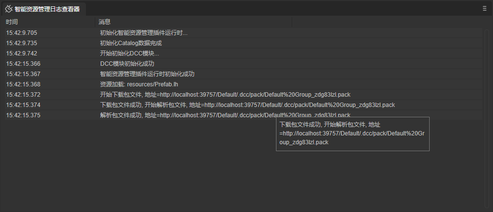
