# CPU Particle System

## I. CPU Particle System Introduction

The CPU particle system is not as flexible as the GPU particle system but is suitable for a wider range of hardware and can provide better support for mobile phones or older devices. Since particle rendering is processed on the CPU, performance is not as good as the GPU particle system.

An important feature of the CPU particle system is supporting particle effects exported from Unity projects. Various attributes of particle effects in Unity cannot be adapted to LayaAir Engine's built-in 3D particle system, so resources exported from Unity need the CPU particle system plugin to be used normally.

In LayaAir-IDE, open the package manager to install the CPU particle system.

> Note: The CPU particle system is a LayaAir member feature.

After importing the plugin, you can add CPU particles in the Hierarchy panel.

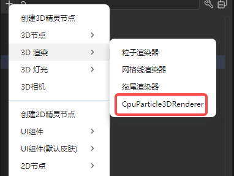

You can also add CPU particles in the property settings panel's rendering section.

## II. CPU Particle System Attribute Introduction

### 2.1 Attribute Parameter Modes

For particle systems, one attribute may have multiple parameter modes. Here we use `StartLifetime` as an example:

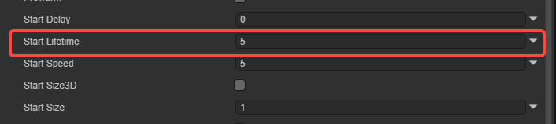

Click the arrow on the far right of the attribute to select the attribute's parameter mode. There are four types total:

**Constant**: The parameter value is a constant value during the attribute's lifecycle and won't change.

**Curve**: The parameter value changes over time during the attribute's lifecycle, with the specific value being the curve's corresponding value at that moment.

Click to open the curve editing panel. In the panel, you can edit the parameter value's range and curve shape.

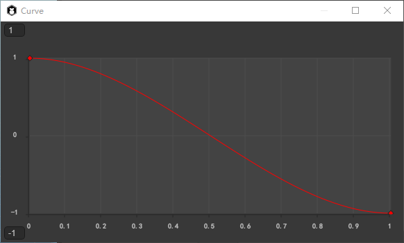

**Random Between Two Curves**: The parameter value changes over time during the attribute's lifecycle, with the specific value randomly chosen between the upper and lower bounds of the corresponding value range at that moment.

**Random Between Two Constants**: The parameter value continuously changes during the attribute's lifecycle, with the value range determined by set constants.

Here's an explanation of the "attribute's lifecycle" concept. In CPU particles, there are two lifecycles: the particle system lifecycle and the particle lifecycle. The former belongs to the particle system and affects particle emission quantity, particle initial data, etc. The latter belongs to individual emitted particles and affects particle size changes, motion speed, etc.

### 2.2 Particle System Properties

Particle system properties are global properties that affect the entire system. Most properties control particle initial states, while a few control system operation rules. Particle system properties include the following:

`Duration`: The time length the particle system runs.

`Loop`: When checked, the particle system restarts and continues repeating after the duration ends.

`Prewarm`: Only takes effect when `Loop` is checked. When enabled, the system initializes making the particle system appear as if it has already completed one running cycle.

`Start Delay`: The delay time before the system starts emitting.

`Start Lifetime`: Controls each particle's lifecycle, that is, how long after emission the particle disappears.

`Start Speed`: Each particle's initial speed in the appropriate direction. Only indicates speed magnitude, not direction.

`Start Size3D`: When checked, developers can separately control each axis's initial particle size.

​	`Start SizeX`: Controls particle size on the X axis.

​	`Start SizeY`: Controls particle size on the Y axis.

​	`Start SizeZ`: Controls particle size on the Z axis.

`Start Size`: Each particle's initial size. Becomes invalid when `StartSize3D` is checked.

`Start Rotation3D`: When checked, developers can separately control each axis's rotation angle.

​	`Start RotationX`: Controls particle rotation on the X axis.

​	`Start RotationY`: Controls particle rotation on the Y axis.

​	`Start RotationZ`: Controls particle rotation on the Z axis.

`Start Rotation`: Each particle's initial rotation. Becomes invalid when `StartRotation3D` is checked.

`Flip Rotation`: A normalized value representing how many particles will be rotated in reverse.

`Start Color`: Each particle's initial color.

`Gravity Modifier`: Sets physical gravity value. Zero value disables gravity.

`Simulation Space`: Controls whether particle motion position is in the parent object's local space (moves with parent), world space, or relative to a custom position.

`Simulation Speed`: Adjusts the entire system's update speed.

`Use Unscaled Time`: Attribute has `Scaled` and `Unscaled` options. When `Scaled`, the particle system's running efficiency is affected by project frame rate. When `Unscaled`, it's not affected.

`Scaling Mode`: Attribute has `Hierarchy`, `Local`, or `Shape` options.

​	`Hierarchy`: Particles scale with each level of parent nodes like ordinary nodes.

​	`Local`: Particles only scale with the component's attached node.

​	`Shape`: Scaling effect only acts on the particle emitter's shape, not on particles themselves.

`Play On Awake`: When checked, the particle system automatically starts emitting particles on startup. Otherwise, control emission via code.

`Emitter Velocity Mode`: Selects how the particle system calculates the velocity used.

​	`Transform`: Estimates speed based on the component's attached node's Transform.position.

​	`Rigidbody`: Gets speed value from the rigid body component on the component's attached node, equivalent to using physics engine-calculated speed.

​	`Custom`: Custom speed. After selecting this value, an `EmitterVelocity` property appears for setting the speed value.

`MaxParticles`: The maximum number of particles allowed simultaneously in the system.

`Stop Action`: When all particles belonging to the system have completed and the particle system's operation has also ended, can make the system execute an action.

​	`None`: No action taken.

​	`Disable`: Disables the component's attached node.

​	`Destroy`: Destroys the component's attached node.

​	`Callback`: Sends a callback signal to scripts attached to the same node.

`Culling Mode`: How the system handles its simulation calculation when the particle system is out of view.

​	`Automatic`: If it's a looping particle, uses Pause. If it's a one-time particle, uses Always Simulate.

​	`Pause`: When particle leaves view, immediately stops calculation. When re-entering view, continues from the stop moment.

​	`Always Simulate`: Continuously calculates whether particle is in view or not.

​	`Pause And Catchup`: When particle leaves view, simulation pauses. When re-entering view, calculates the displacement that should have occurred during this time all at once.

`Ring Buffer Mode`: When particle quantity reaches the maximum limit, generates new particles by overwriting the "oldest" particles instead of stopping emission.

​	`Disabled (default)`: Doesn't enable this option. Particles disappear normally according to lifecycle.

​	`Pause Until Replaced`: When particle quantity reaches maximum, old particles don't disappear at lifecycle end but pause in place. They are replaced only when new particles need space.

​	`Loop Until Replaced`: Old particles don't disappear at lifecycle end but replay their animation or lifecycle. They are replaced only when new particles need space.

`Use Auto Random Seed`: When enabled, each playback is different.

### 2.3 Emitter

The emitter controls particle emission rate and timing. The emitter includes the following:

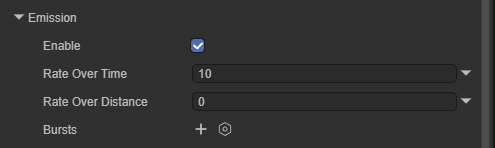

`Enable`: Whether to enable the emitter. When checked, the particle system normally emits particles.

`Rate Over Time`: Number of particles emitted per second.

`Rate Over Distance`: Number of particles emitted per movement distance unit. This mode can simulate particles actually generated by object motion (e.g., dust left by wheels on a dirt road).

`Bursts`: Bursts are events that generate particles. Used to control the particle system emitting multiple particles at once at a specified time.

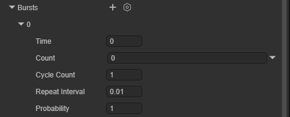

​	`Time`: Sets the time to emit burst particles (seconds after particle system starts playing). If the set value is greater than the particle system's `Duration`, the burst won't take effect.

​	`Count`: Sets the maximum particle emission quantity for a single burst. Actual particle emission quantity is limited by `MaxParticles`.

​	`Cycle Count`: Sets the value of burst playback count.

​	`Repeat Interval`: Sets the interval time (in seconds) between triggering each burst cycle.

​	`Probability`: Controls the likelihood of each burst event generating particles. Higher values make the system produce more particles. A value of 1 guarantees the system produces particles.

### 2.4 Shape

The shape defines the volume or surface from which the particle system can emit particles, as well as the direction of particle initial velocity.

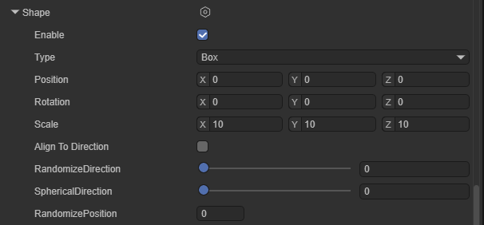

The shape module has these common properties:

`Enable`: Whether to enable the shape module. When disabled, all particles emit from the same point.

`Type`: Select the emitter type to use. Depending on the selected shape, the remaining properties of the shape module vary.

`Position`: Applies an offset to the emitter shape that generates particles.

`Rotation`: Rotates the emitter shape that generates particles.

`Scale`: Changes the size of the emitter shape that generates particles.

`Align To Direction`: Aligns particle's local coordinate axes with its emission velocity direction.

`Randomize Direction`: Blends particle emission velocity direction toward random direction. When 0, this property has no effect. When 1, particles move randomly.

`Spherical Direction`: Blends particle emission velocity direction toward spherical direction. When 0, this property has no effect. When 1, particle direction is from center outward.

`Randomize Position`: Adds a random value to particle's initial position. Larger value means higher position randomness.

These properties won't be repeated in subsequent content.

#### 2.4.1 Sphere, Hemisphere

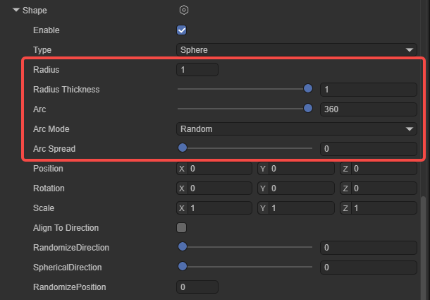

These two shapes have identical properties, so they're explained together.

`Sphere`: Emits particles uniformly in all directions.

`Hemisphere`: Emits particles uniformly in all directions on one side of a plane.

`Radius`: The circle's radius.

`Radius Thickness`: Volume proportion of emitting particles. Value 0 means emit particles from the shape's outer surface. Value 1 means emit particles from the entire volume. Values between use a proportion of the volume.

`Arc`: Emitter's effective arc, default 360°. Particles emit from any position on the emitter. When reducing this value (e.g., set to 180°), particles only emit from the emitter's "half" area.

`Arc Mode`: Movement mode of emitter spray position within the effective range.

​	`Random`: Particles randomly appear within the arc range.

​	`Loop`: Particles smoothly move from start point to end point, then jump back to start and restart.

​	`PingPong`: Particles move from start to end point, then don't return but go back the way they came.

​	`Burst Spread`: Generally used with `Bursts`. Can evenly distribute all particles of a single burst across the entire arc range.

`Arc Speed`: When `Arc Mode` selects `Loop` or `PingPong`, this property appears, used to control the movement speed of the emitter spray position within the effective range.

`Arc Spread`: Emits particles every how many degrees. Particles emit evenly at interval angles. Interval angle = Arc * Arc Spread value.

#### 2.4.2 Cone

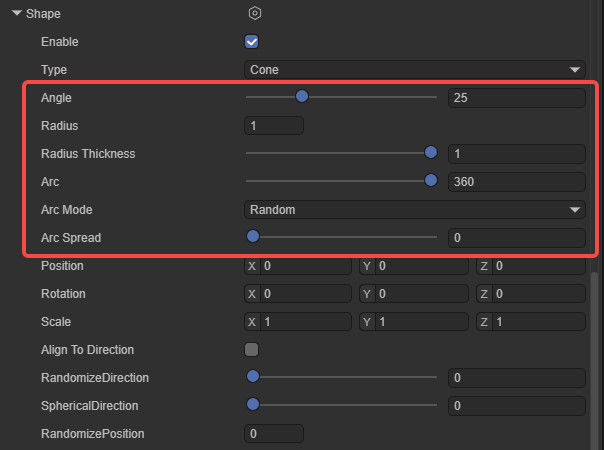

Under this shape, all particles start from the cone's apex and diffuse outward along the cone's angle.

`Angle`: The cone's angle at its apex. Angle 0 produces a cylinder. Angle 90 produces a disc.

`Radius`: The radius of the cone's apex. When set to 0, all particles start from the same point.

`Radius Thickness`: Volume proportion of emitting particles. Value 0 means emit from shape's outer surface. Value 1 means emit from entire volume. Values between use a volume proportion.

`Arc`: Emitter's effective arc, default 360°. Particles emit from any position on the emitter. When reducing this value (e.g., set to 180°), particles only emit from the emitter's "half" area.

`Arc Mode`: Movement mode of emitter spray position within the effective range.

​	`Random`: Particles randomly appear within the arc range.

​	`Loop`: Particles smoothly move from start point to end point, then jump back to start and restart.

​	`PingPong`: Particles move from start to end point, then don't return but go back the way they came.

​	`Burst Spread`: Generally used with `Bursts`. Can evenly distribute all particles of a single burst across the entire arc range.

`Arc Speed`: When `Arc Mode` selects `Loop` or `PingPong`, this property appears, used to control the movement speed of the emitter spray position within the effective range.

`Arc Spread`: Emits particles every how many degrees. Particles emit evenly at interval angles. Interval angle = Arc * Arc Spread value.

#### 2.4.3 Box

The box emitter's shape is a cube, and particles start from any position within the emitter's volume. The box emitter has no special properties and won't be introduced here.

#### 2.4.4 Cone Volume

Under this shape, particles are generated at random positions within the cone's internal space, not only at the cone's apex. Most properties of `Cone Volume` are the same as `Cone` and won't be repeated here. Only `Length` is a property that `Cone` doesn't have:

`Length`: The depth range where particles can be generated.

#### 2.4.5 Circle

The circle emitter is a plane emitter. Particle emission trend is along the circle surface. By default, particles are in the same plane. Adjusting Scale.z doesn't affect the emitter's shape.

`Radius`: The circle's radius.

`Radius Thickness`: Volume proportion of emitting particles. Value 0 means emit from shape's outer surface. Value 1 means emit from entire volume. Values between use a volume proportion.

`Arc`: Emitter's effective arc, default 360°. Particles emit from any position on the emitter. When reducing this value (e.g., set to 180°), particles only emit from the emitter's "half" area.

`Arc Mode`: Movement mode of emitter spray position within the effective range.

​	`Random`: Particles randomly appear within the arc range.

​	`Loop`: Particles smoothly move from start point to end point, then jump back to start and restart.

​	`PingPong`: Particles move from start to end point, then don't return but go back the way they came.

​	`Burst Spread`: Generally used with `Bursts`. Can evenly distribute all particles of a single burst across the entire arc range.

`Arc Speed`: When `Arc Mode` selects `Loop` or `PingPong`, this property appears, used to control the movement speed of the emitter spray position within the effective range.

`Arc Spread`: Emits particles every how many degrees. Particles emit evenly at interval angles. Interval angle = Arc * Arc Spread value.

#### 2.4.6 Single Side Edge

The edge emitter's shape is a line. Particles move in the object's upward (Y) direction.

`Radius`: This radius property is used to define the edge's length.

`Arc Mode`: Controls particle generation position and sequence within the arc area.

​	`Random`: Particles randomly appear within the arc range.

​	`Loop`: Particles smoothly move from start point to end point, then jump back to start and restart.

​	`PingPong`: Particles move from start to end point, then don't return but go back the way they came.

​	`Burst Spread`: Generally used with `Bursts`. Can evenly distribute all particles of a single burst across the entire arc range.

`Arc Speed`: When `Arc Mode` selects `Loop` or `PingPong`, this property appears, used to control the movement speed of the emitter spray position within the effective range.

`Arc Spread`: Emits particles every how many degrees. Particles emit evenly at interval angles. Interval angle = Arc * Arc Spread value.

#### 2.4.7 Box Shell

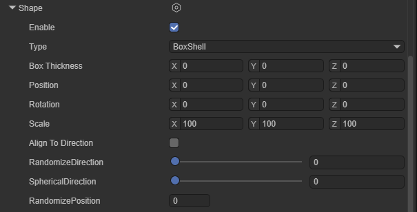

Similar to the `Box` emitter, `Box Shell` is also a cube-shaped emitter. Particles start from the emitter cube's surface. It has one special property.

`Box Thickness`: When value is 0, particles only emit from the emitter cube's surface. When value is not 0, particles emit within the emitter.

#### 2.4.8 Box Edge

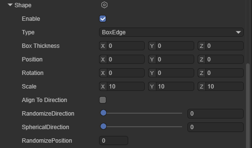

`Box Edge` is also a cube-shaped emitter. Particles start from each edge of the emitter cube.

`Box Thickness`: When value is 0, particles only emit from each edge of the emitter cube. When value is not 0, particles emit from the emitter's surface.

#### 2.4.9 Donut

`Donut` particle emitter is a torus-shaped emitter. Particles start from the torus's surface and move outward.

`Radius`: The torus's radius.

`Donut Radius`: The torus's thickness.

`Radius Thickness`: Volume proportion of emitting particles. Value 0 means emit from shape's outer surface. Value 1 means emit from entire volume. Values between use a volume proportion.

`Arc`: Emitter's effective arc, default 360°. Particles emit from any position on the emitter. When reducing this value (e.g., set to 180°), particles only emit from the emitter's "half" area.

`Arc Mode`: Movement mode of emitter spray position within the effective range.

​	`Random`: Particles randomly appear within the arc range.

​	`Loop`: Particles smoothly move from start point to end point, then jump back to start and restart.

​	`PingPong`: Particles move from start to end point, then don't return but go back the way they came.

​	`Burst Spread`: Generally used with `Bursts`. Can evenly distribute all particles of a single burst across the entire arc range.

`Arc Speed`: When `Arc Mode` selects `Loop` or `PingPong`, this property appears, used to control the movement speed of the emitter spray position within the effective range.

`Arc Spread`: Emits particles every how many degrees. Particles emit evenly at interval angles. Interval angle = Arc * Arc Spread value.

#### 2.4.10 Rectangle

Emits particles from a rectangle. All particles start from random positions on the same rectangle plane. By default, they move in the positive z-axis direction.

`Rectangle` has no special properties and won't be explained.

### 2.5 Velocity Over Lifetime

This module controls particle velocity during its lifecycle.

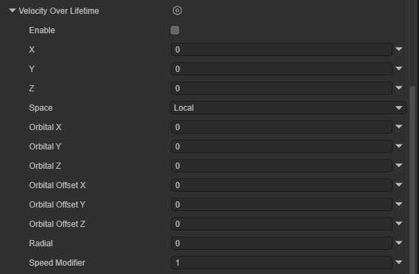

`Enable`: Whether to enable this module.

`X, Y, Z`: Particle linear velocity on X, Y, and Z axes.

> Note: If particle system's `Start Speed` property is set, particle's final speed is the sum of `Start Speed` and `X, Y, Z`.

`Space`: Specifies whether `X, Y, Z` refer to local space or world space.

`Orbital X, Y, Z`: Particle's orbital velocity rotating around X, Y, and Z axes.

`Orbital Offset X, Y, Z`: Orbital center position offset.

`Radial`: Particle's radial velocity away from/toward the orbital center position. Value greater than 0 means particles move away from center. Value less than 0 means particles move toward center.

`Speed Modifier`: A multiplier scaling of particle's total speed.

### 2.6 Limit Velocity Over Lifetime

This module controls how particle velocity decreases during its lifecycle.

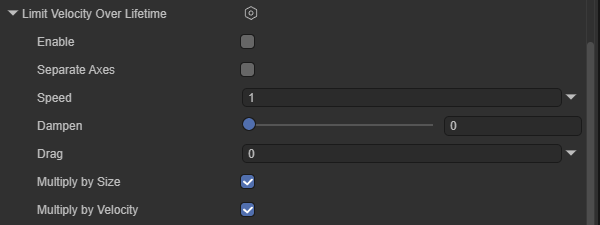

`Enable`: Whether to enable this module.

`Separate Axes`: Splits axes into separate X, Y, and Z components. When unchecked, the module calculates particle velocity magnitude and limits it.

​	`Limit X, Y, Z`: Speed limits on X, Y, and Z axes. Displayed and effective when `Separate Axes` is checked.

`Speed`: Sets particle speed limit. Displayed and effective when `Separate Axes` is unchecked.

`Dampen`: When particle speed exceeds speed limit, the proportion of velocity reduction. This value makes particle speed decrease more smoothly.

`Drag`: Applies linear drag to particle velocity. Particle speed is continuously affected by this value, even when particle speed is already less than `Speed` limit.

`Multiply by Size`: When this property is enabled, larger particles are more affected by drag coefficient.

`Multiply by Velocity`: When this property is enabled, faster particles are more affected by drag coefficient.

### 2.7 Inherit Velocity

This module controls how particle velocity is affected by parent object movement over time.

`Enable`: Whether to enable this module.

`Mode`: Specifies how to apply emitter velocity to particles.

​	`Current`: Emitter's current velocity is applied to all particles on every frame. For example, if emitter slows down, all particles also slow down.

​	`Initial`: Emitter's velocity is applied once when each particle is born. Emitter velocity changes after particle birth won't affect that particle.

`Multiplier`: The proportion of emitter velocity that particles should inherit.

### 2.8 Lifetime by Emitter Speed

This module controls each particle's initial lifecycle based on emitter speed at particle generation time. It multiplies particle's initial lifecycle by a value that depends on the speed of the object generating them. For most particle systems, this is game object speed. For sub-emitters, speed comes from the parent particle that sub-emitter particles originate from.

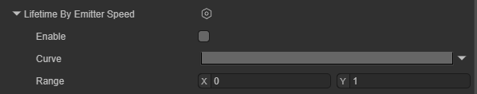

`Enable`: Whether to enable this module.

`Multiplier`: A multiplier applied to particle's initial lifecycle. The module uses this value differently based on the set curve mode.

​	`Constant`: Uses constant multiplier value. At this point `Speed Range` becomes ineffective.

​	`Curve`: Curve's horizontal axis is emitter speed, vertical axis is multiplier.

​	`Random Between Two Constants`: For each particle, randomly chooses a value between two set constants as the constant. At this point `Speed Range` becomes ineffective.

​	`Random Between Two Curves`: Curve's horizontal axis is emitter speed, vertical axis is multiplier. Module randomly chooses a value between the two curves.

`Speed Range`: Emitter speed's minimum and maximum values. The module normalizes this value and samples in `Multiplier` curve.

### 2.9 Force Over Lifetime

Accelerates particles by applying specified force.

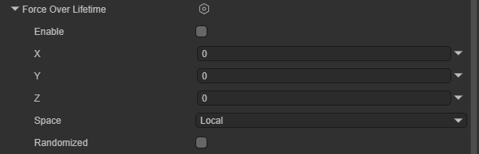

`Enable`: Whether to enable this module.

`X, Y, Z`: Force applied to each particle on X, Y, and Z axes.

`Space`: Choose whether to apply force in local space or world space.

`Randomize`: When `X, Y, Z` choose `Random Between Two Constants` or `Random Between Two Curves` mode, this property causes the module to apply different forces to particles each frame, producing more turbulent, unstable motion.

### 2.10 Color Over Lifetime

This module specifies how particle color and transparency change during its lifecycle.

`Enable`: Whether to enable this module.

`Color`: Particle's color gradient during its lifecycle. The gradient bar's left point represents the start of particle lifecycle, and the right represents the end of particle lifecycle.

### 2.11 Color By Speed

This module specifies particle color changes produced by particle speed.

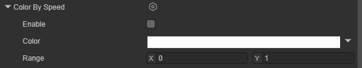

`Enable`: Whether to enable this module.

`Color`: Particle's color gradient defined within speed range.

`Range`: Speed range's lower and upper bounds. Particle speed is mapped to `Color`'s horizontal axis. Speeds outside range are mapped to endpoints.

### 2.12 Size Over Lifetime

This module specifies particle size changes produced by particle lifecycle.

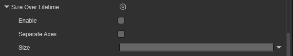

`Enable`: Whether to enable this module.

`Separate Axes`: Independently control particle size on each axis.

`Size`: Defines how particle size changes during its lifecycle.

### 2.13 Size by Speed

This module specifies particle size changes produced by particle speed.

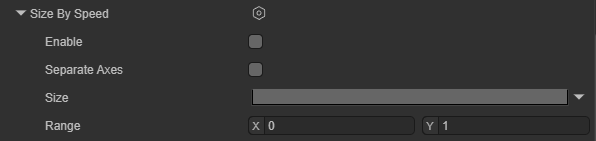

`Enable`: Whether to enable this module.

`Separate Axes`: Independently control particle size on each axis.

`Size`: Particle size. The module uses this value differently based on the set curve mode.

​	`Constant`: Particle size is a constant. At this point `Range` becomes ineffective.

​	`Curve`: Curve's horizontal axis is particle speed, vertical axis is particle size.

​	`Random Between Two Constants`: For each particle, randomly choose a value between two set constants as particle size. At this point `Range` becomes ineffective.

​	`Random Between Two Curves`: Curve's horizontal axis is particle speed, vertical axis is particle size. Module randomly chooses a value between the two curves.

`Range`: Speed range's lower and upper bounds. Particle speed is mapped to `Size`'s horizontal axis. Speeds outside range are mapped to endpoints.

### 2.14 Rotation Over Lifetime

This module specifies particle rotation changes produced by particle lifecycle.

`Enable`: Whether to enable this module.

`Separate Axes`: Allows specifying rotation speed per axis. When enabled, can set rotation speed for each of the X, Y, and Z axes.

`Angular Velocity`: Particle's rotation speed. This property only appears when `Separate Axes` is unchecked. The set value acts on each of the particle's axes.

### 2.15 Rotation by Speed

This module specifies particle rotation changes produced by particle speed.

`Enable`: Whether to enable this module.

`Separate Axes`: Allows specifying rotation speed per axis. When enabled, can set rotation speed for each of the X, Y, and Z axes.

`Angular Velocity`: Particle's rotation speed.

​	`Constant`: Particle rotation speed is a constant. At this point `Range` becomes ineffective.

​	`Curve`: Curve's horizontal axis is particle speed, vertical axis is particle's rotation speed.

​	`Random Between Two Constants`: For each particle, randomly choose a value between two set constants as particle rotation speed. At this point `Range` becomes ineffective.

​	`Random Between Two Curves`: Curve's horizontal axis is particle speed, vertical axis is particle's rotation speed. Module randomly chooses a value between the two curves.

`Range`: Speed range's lower and upper bounds. Particle speed is mapped to `Angular Velocity`'s horizontal axis. Speeds outside range are mapped to endpoints.

### 2.16 External Forces

This property is used to modify the influence of wind zones and particle system force fields on system-emitted particles.

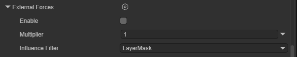

`Enable`: Whether to enable this module.

`Multiplier`: A proportion value applied to wind zone external forces.

`Influence Filter`: Influence filter. Determines which force fields can affect this particle system.

​	`LayerMask`: Uses Layer to filter force fields. Only force field components on specified layers affect particles.

​	`List`: Filters force fields based on specified list.

​	`LayerMask And List`: Uses both layer and list.

### 2.17 Noise

This module adds random perturbation to particle motion trajectories, making particles no longer fly out in stiff straight lines.

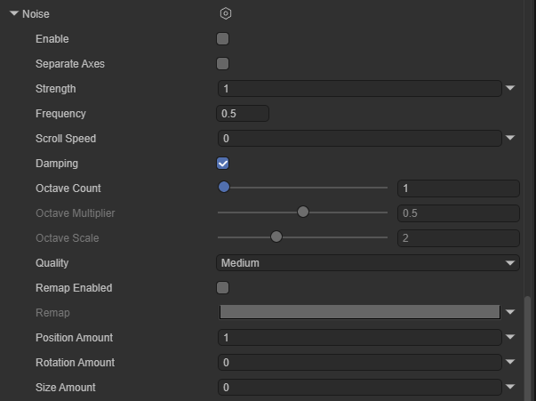

`Enable`: Whether to enable this module.

`Separate Axes`: Independently control intensity and remapping on each axis.

`Strength`: Noise's total intensity. Larger values mean particles jitter and deviate from original trajectory more.

`Frequency`: Low values produce soft, smooth noise. High values produce fast-changing noise. This property controls the frequency at which particles change direction and the suddenness of direction changes.

`Scroll Speed`: Noise field's movement speed. Makes noise shift over time, producing a "wind blowing jitter" effect.

`Damping`: Damping. When enabled, the faster the particle speed, the less affected by noise.

`Octave Count`: Specifies how many overlapping noise layers to combine to produce final noise value. Using more layers provides richer, more interesting noise but significantly increases performance cost.

`Octave Multiplier`: For each additional noise layer, reduces intensity by this proportion.

`Octave Scale`: For each additional noise layer, adjusts frequency by this multiplier.

`Quality`: Quality. This property affects noise generation's fineness.

`Remap Enabled`: Enable remapping. Remaps final noise value to a different range.

`Remap`: Curve describing how final noise value transforms.

`Position Amount`: A multiplier controlling the degree to which noise affects particle position.

`Rotation Amount`: A multiplier controlling the degree to which noise affects particle rotation (degrees/second).

`Size Amount`: A multiplier controlling the degree to which noise affects particle size.

### 2.18 Collision

This module controls how particles collide with game objects in the scene.

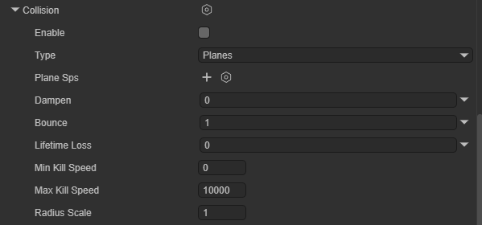

`Enable`: Whether to enable this module.

`Type`: Collision mode. Has `Planes` and `World` modes.

​	`Planes`: Specifies a set of planes. Particles only collide with these planes.

​	`World`: Particles collide with all nodes with Collider in the scene.

`Planes`: Planes used for collision in `Planes` mode.

`Dampen`: Proportion of velocity loss after particle collision.

`Bounce`: Proportion of velocity rebound after particle collision from surface.

`Lifetime Loss`: Proportion of total lifecycle loss after particle collision.

`Min Kill Speed`: Particles moving slower than this speed after collision are removed from the system.

`Max Kill Speed`: Particles moving faster than this speed after collision are removed from the system.

`Radius Scale`: Allows adjusting particle collision sphere radius to fit closer to particle graphic's visual edge.

### 2.19 Sub Emitters

In this module, you can set sub-emitters. These are additional particle emitters created at particle positions during certain stages of particle lifecycle.

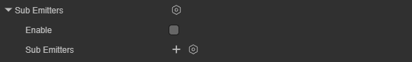

`Enable`: Whether to enable this module.

`Sub Emitters`: Configure a list of sub-emitters and choose their trigger conditions and which properties they inherit from parent particles.

`Particle System`: Choose the particle system for the particle emitter to inherit.

`Type`: Sub-emitter's trigger condition.

​	`Birth`: Sub-particles are generated when parent particles are born.

​	`Collision`: Generated when parent particles collide with objects.

​	`Death`: Generated when parent particle lifecycle ends.

​	`Trigger`: Generated when particles enter a specific Trigger area.

​	`Manual`: Triggered via script code control.

`Properties`: Controls which properties are inherited by sub-emitters. Inheritable properties include color, size, rotation, lifecycle, duration.

`Probability`: Probability that sub-emitter will be triggered.

### 2.20 Texture Sheet Animation

This module uses a texture atlas containing multiple frames to make each particle play the animation in this atlas during its lifecycle.

`Enable`: Whether to enable this module.

`Num Tiles`: Number of blocks the texture is divided into in the X (horizontal) and Y (vertical) directions.

`Animation`: Controls animation playback mode.

​	`WholeSheet`: Loops playback of all frames in entire texture.

​	`SingleRow`: Only plays a specific row.

`Time Mode`: Controls animation playback speed.

​	`Lifetime`: Animation progress advances with particle lifetime.

​	`Speed`: Animation playback speed changes with particle movement speed.

​	`FPS`: Sets fixed frame rate playback.

`Frame Over Time`: Controls how animation frames increase over time. Takes effect after selecting `Lifetime` mode.

`Start Frame`: Which frame to start playing animation from when particle is born.

`Cycle Count`: How many times the animation repeats during particle's lifecycle.

### 2.21 Trails

This module can add trails to particles.

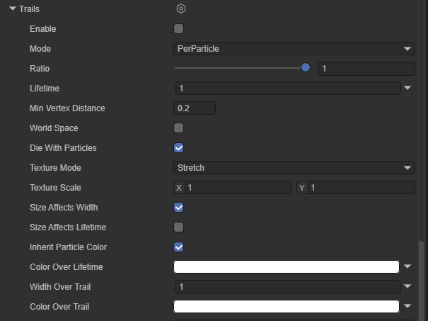

`Enable`: Whether to enable this module.

`Mode`: Particle system trail generation mode.

​	`PerParticle`: Generates trails along particle motion trajectory.

​	`Ribbon`: Creates trail bands connecting each particle based on survival time.

`Ratio`: Defines what proportion of particles will generate trails.

`Lifetime`: Trail's duration (as percentage of particle lifetime).

`Min Vertex Distance`: Vertex density. How far a particle moves before generating a new vertex. Smaller values make trails smoother but increase performance cost.

`World Space`: When checked, trail vertices stay in world coordinates. When unchecked, moving emitter makes entire trail translate with it.

`Die with Particles`: Die with particles. When checked, trail disappears immediately when particle dies. When unchecked, trail plays out its own lifetime before disappearing.

`Texture Mode`: Texture mode.

​	`Stretch`: Texture is stretched to fill entire trail.

​	`Tile`: Texture repeats by length.

​	`Distribute Per Segment`: Texture distributed per vertex.

​	`Repeat Per Segment`: Texture repeats once between every two vertices.

​	`Static`: Static texture.

`Texture Scale`: Trail texture scaling.

`Size Affects Width`: When this property is enabled, trail width is affected by particle size.

`Size Affects Lifetime`: When this property is enabled, trail lifetime is affected by particle size.

`Inherit Particle Color`: When this property is enabled, trail color is modulated by particle color.

`Color Over Lifetime`: Trail color change over time.

`Width Over Trail`: Width curve. Horizontal axis 0 is trail head (close to particle), 1 is trail tail.

`Color Over Trail`: Color gradient curve. Controls trail color and transparency from head to tail.

## III. CPU Particle System Rendering Introduction

The renderer module's settings determine how particles are shaded and drawn.

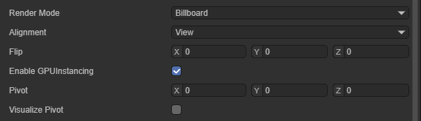

`Render Mode`: Rendering mode.

​	`Billboard`: Particles always face camera.

​	`Alignment`: Choose which direction particle billboards face. Effective when `Render Mode` selects `Billboard`.

​		`View`: Particles face camera plane.

​		`World`: Particles align with world axes.

​		`Local`: Particles align with game object's transform component.

​		`Facing`: Particles face the camera game object's direct position.

​		`Velocity`: Particles face their velocity direction.

​	`Stretched`: Particles are stretched based on velocity, length, or scale.

​		`Camera Velocity Scale`: Stretches particles based on camera movement. Setting this to 0 disables camera movement stretching.

​		`Velocity Scale`: Stretches particles proportionally based on particle velocity. Setting this to 0 disables velocity-based stretching.

​		`Length Scale`: Stretches particles proportionally based on particle's current size along its velocity direction. Setting this to 0 makes particles disappear, equivalent to 0 length.

​		`Freeform Stretching`: Indicates whether particles should use freeform stretching. With this stretching behavior, particles don't become thinner when viewed from the front.

​		`Rotate With Stretch`: Indicates whether to rotate particles based on their stretching direction. This property is only effective when `Freeform Stretching` is enabled.

​	`Horizontal Billboard`: Particles are horizontally fixed on XZ plane.

​	`Vertical Billboard`: Particles stand vertically on Y axis but rotate with camera.

​	`Mesh`: Uses 3D model as particles.

​	`None`: Renders nothing.

`Alignment`: Choose which direction particle billboards face.

​	`View`: Particles face camera plane.

​	`World`: Particles align with world axes.

​	`Local`: Particles align with game object's transform component.

​	`Facing`: Particles face the camera game object's direct position.

​	`Velocity`: Particles face their velocity direction.

`Flip`: Mirrors a certain proportion of particles on specified axes. Higher values flip more particles.

`Enable GPU Instancing`: Controls whether to use GPU instancing to render the particle system. Requires using mesh render mode and a compatible shader.

`Pivot`: Modify the rotation center axis point for rotating particles. This value is a multiplier of particle size.

`Visualize Pivot`: Preview particle pivot point in scene panel.
