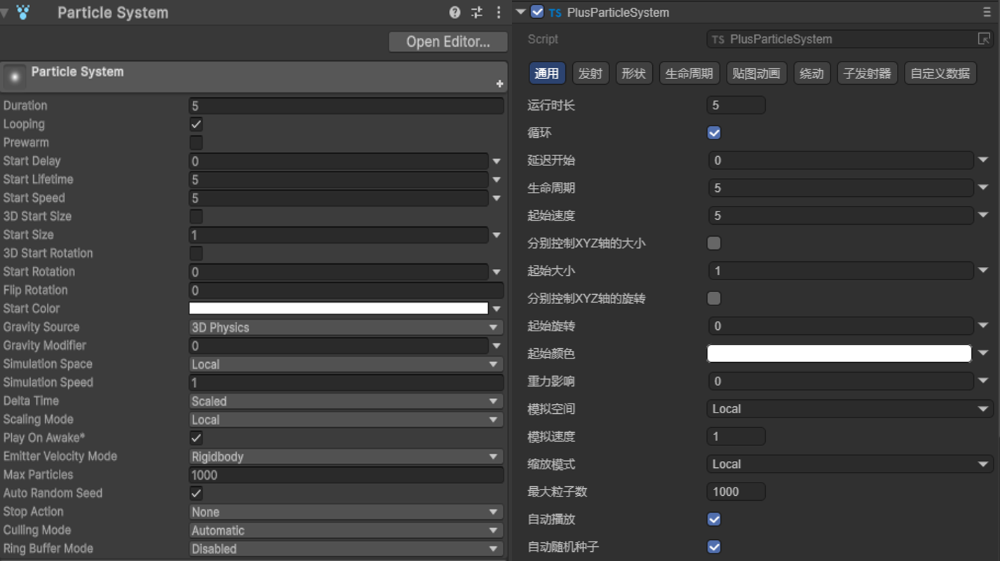
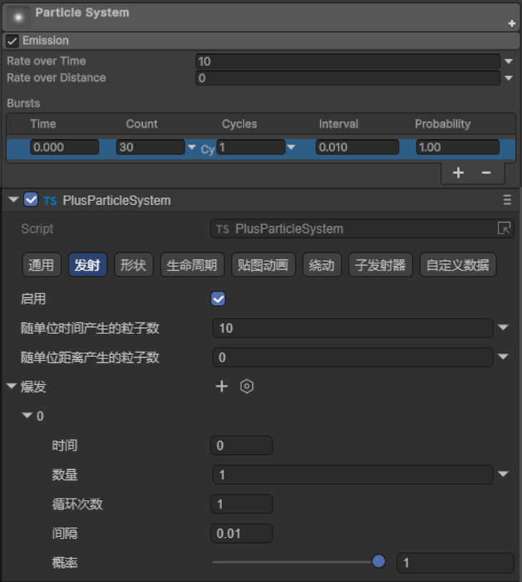
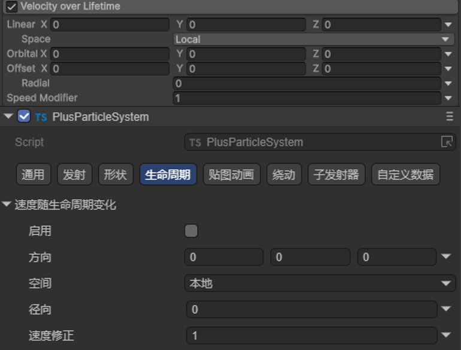
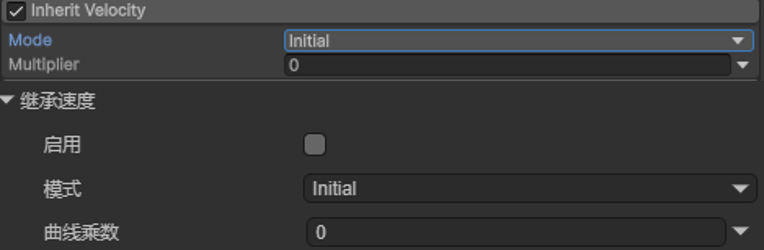
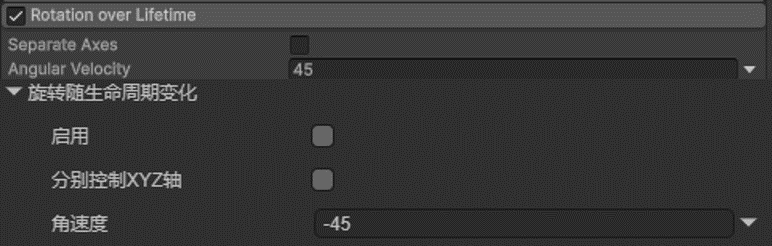
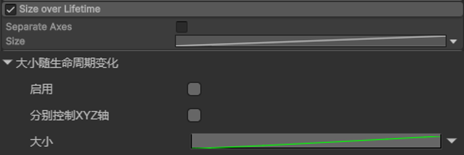
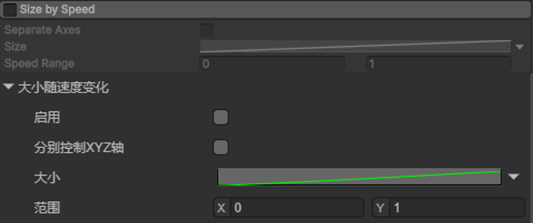
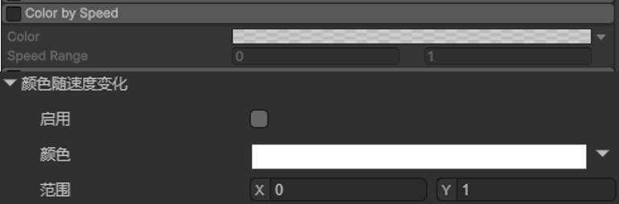
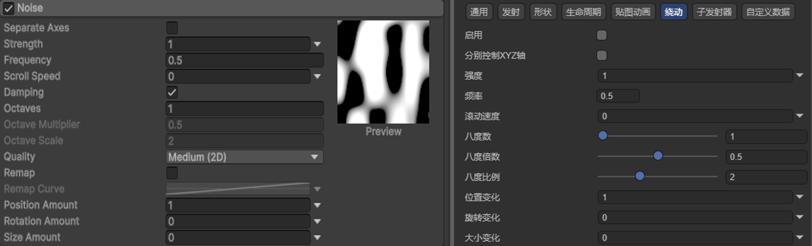
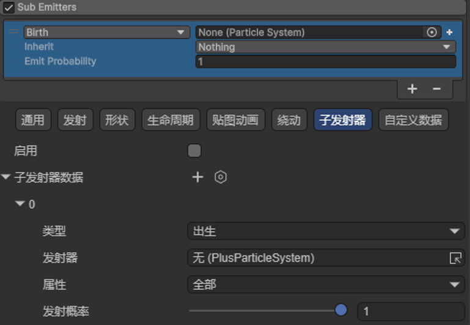

# Unity Resource Export Plugin - Export Particles

## 1. Introduction

To achieve quick export of Unity particles to LayaAir-IDE, the [Unity Resource Export Plugin](../../../../../3D/advanced/Unity/readme.md) supports exporting particle systems from Unity. However, LayaAir's built-in particle system has a different architecture from Unity and does not support Unity-exported particles, so Unity-exported particle resources can only be used in the [CPU Particle System](../readme.md).

The particle export method is the same as other resource export methods. Click [here](../../../../../3D/advanced/Unity/readme.md) to view the process.

Note that if you use a custom shader in Unity, you need to manually convert the Unity shader to LayaShader before exporting, so that the exported particle shader can get the correct effect.

## 2. Exported Parameters

### 2.1 Curve Edit Panel Data Export

In the Unity plugin's `ParticleSystemData.cs`:

- You can find the writeMinMaxCurveData method. MinmaxCurve describes the change between minimum-maximum curves:

Constant: A single constant;

Curve: A single curve;

TwoCurves: Random value between 2 curves;

TwoConstants: Random value between 2 constants;

- There is also the writeMinMaxGradientData method. MinMaxGradient describes the change between two colors:

Color: Single color;

Gradient: Gradient color;

TwoColors: Random between two colors;

TwoGradients: Random between 2 color gradients;

### 2.2 Functional Module Analysis

In the plugin's `ParticleSystemData.cs`, the GetParticleSystem method calls the overall process.

```c
    public static JSONObject GetParticleSystem(ParticleSystem particleSystem, bool isOverride, NodeMap map, ResoureMap resMap)
    {
        JSONObject compData = JsonUtils.SetComponentsType(new JSONObject(JSONObject.Type.OBJECT), "ParticleSystem", isOverride);
        writeBaseNode(particleSystem, compData);
        writeEmission(particleSystem, compData);
        writeShape(particleSystem, compData,map, resMap);
        writeVelocityOverLifetime(particleSystem, compData);
        writeSizeOverLifetime(particleSystem, compData);
        writeForceOverLifetime(particleSystem, compData);
        writeRotationOverLifetime(particleSystem, compData);

        writeLimitVelocityOverLifetime(particleSystem, compData);
        writeColorOverLifetime(particleSystem, compData);
        writeColorBySpeed(particleSystem, compData);
        writeSizeBySpeed(particleSystem, compData);
        writeRotationBySpeed(particleSystem, compData);
        writeInheritVelocity(particleSystem, compData);
        writeNoise(particleSystem, compData);
        writeTextureSheetAnimation(particleSystem, compData);
        writeSubEmittersModule(particleSystem, compData, map);

        return compData;
    }
```

Below, the export of each module is introduced separately:

- writeBaseNode parses the base module, corresponding to "General" in LayaAir-IDE, as shown in Figure 2-1. The correspondence between Unity (left) and LayaAir (right).



(Figure 2-1)

- writeEmission parses the Emission module, corresponding to "Emission" in LayaAir-IDE, as shown in Figure 2-2. The correspondence between Unity (top) and LayaAir (bottom).



(Figure 2-2)

- writeShape parses the Shape module, corresponding to "Shape" in LayaAir-IDE, as shown in Figure 2-3. The correspondence between Unity (left) and LayaAir (right).


(Figure 2-3)

- writeVelocityOverLifetime parses the Velocity over LifeTime module, corresponding to "Lifetime - Velocity Over Lifetime" in LayaAir-IDE, as shown in Figure 2-4. The correspondence between Unity (top) and LayaAir (bottom).



(Figure 2-4)

- writeLimitVelocityOverLifetime parses the Limit Velocity over Lifetime module, corresponding to "Lifetime - Limit Velocity Over Lifetime" in LayaAir-IDE, as shown in Figure 2-5. The correspondence between Unity (top) and LayaAir (bottom).


(Figure 2-5)

- writeInheritVelocity parses the Inherit Velocity module, corresponding to "Lifetime - Inherit Velocity" in LayaAir-IDE, as shown in Figure 2-6. The correspondence between Unity (top) and LayaAir (bottom).



(Figure 2-6)

- writeForceOverLifetime parses the Force over Lifetime module, corresponding to "Lifetime - Force Over Lifetime" in LayaAir-IDE, as shown in Figure 2-7. The correspondence between Unity (top) and LayaAir (bottom).


(Figure 2-7)

- writeRotationOverLifetime parses the Rotation over Lifetime module, corresponding to "Lifetime - Rotation Over Lifetime" in LayaAir-IDE, as shown in Figure 2-8. The correspondence between Unity (top) and LayaAir (bottom).



(Figure 2-8)

- writeRotationBySpeed parses the Rotation by Speed module, corresponding to "Lifetime - Rotation By Speed" in LayaAir-IDE, as shown in Figure 2-9. The correspondence between Unity (top) and LayaAir (bottom).


(Figure 2-9)

- writeSizeOverLifetime parses the Size over Lifetime module, corresponding to "Lifetime - Size Over Lifetime" in LayaAir-IDE, as shown in Figure 2-10. The correspondence between Unity (top) and LayaAir (bottom).



(Figure 2-10)

- writeSizeBySpeed parses the Size by Speed module, corresponding to "Lifetime - Size By Speed" in LayaAir-IDE, as shown in Figure 2-11. The correspondence between Unity (top) and LayaAir (bottom).



(Figure 2-11)

- writeColorOverLifetime parses the Color over Lifetime module, corresponding to "Lifetime - Color Over Lifetime" in LayaAir-IDE, as shown in Figure 2-12. The correspondence between Unity (top) and LayaAir (bottom).


(Figure 2-12)

- writeColorBySpeed parses the Color by Speed module, corresponding to "Lifetime - Color By Speed" in LayaAir-IDE, as shown in Figure 2-13. The correspondence between Unity (top) and LayaAir (bottom).



(Figure 2-13)

- writeTextureSheetAnimation parses the Texture Sheet Animation module, corresponding to "Texture Animation" in LayaAir-IDE, as shown in Figure 2-14. The correspondence between Unity (top) and LayaAir (bottom).


(Figure 2-14)

- writeNoise parses the Noise module, corresponding to "Noise" in LayaAir-IDE, as shown in Figure 2-15. The correspondence between Unity (left) and LayaAir (right).



(Figure 2-15)

- writeSubEmittersModule parses the Sub Emitters module, corresponding to "Sub Emitters" in LayaAir-IDE, as shown in Figure 2-16. The correspondence between Unity (top) and LayaAir (bottom).



(Figure 2-16)

### 2.3 Renderer Module Parameters

Particle rendering parsing is completed by GetParticleSystemRneder, as shown in Figure 3-1. The correspondence between Unity (left) and LayaAir (right).

```c
 public static JSONObject GetParticleSystemRneder(ParticleSystemRenderer renderer, bool isOverride,ResoureMap map)
    {
        JSONObject compData = JsonUtils.SetComponentsType(new JSONObject(JSONObject.Type.OBJECT), "ParticleSystemRenderer", isOverride);
        compData.AddField("renderMode", (int)(object)renderer.renderMode);
        compData.AddField("sortMode", (int)(object)renderer.sortMode);
        compData.AddField("alignment", (int)(object)renderer.alignment);
        compData.AddField("material", map.GetMaterialData(renderer.sharedMaterial));
        compData.AddField("cameraVelocityScale", renderer.cameraVelocityScale);
        compData.AddField("velocityScale", renderer.velocityScale);
        compData.AddField("lengthScale", renderer.lengthScale);
        if (renderer.mesh)
        {
            compData.AddField("sharedMesh", map.GetMeshData(renderer.mesh, renderer));
        }
        compData.AddField("pivot", JsonUtils.GetVector3Object(renderer.pivot));
        return compData;
    }
```


(Figure 3-1)
