# Performance Analysis Plugin

The Performance Analysis Plugin is used to detect various performance metrics of LayaAir projects at runtime. Developers need to follow the steps in the documentation to first install the plugin in the IDE, then log in to the backend platform, and finally integrate the plugin into the LayaAir project.

During use, all performance analysis reports are uploaded to the server for parsing, and statistical information is ultimately displayed on the backend platform.

Developers can use this plugin to conveniently obtain runtime information such as CPU, memory, resources, rendering, and UI, and the backend platform provides optimization suggestions.

## 1. Installation and Integration

### 1.1 Installing the Plugin

As shown in Figure 1-1, install the Performance Analysis Plugin in the LayaAir-IDE package manager.

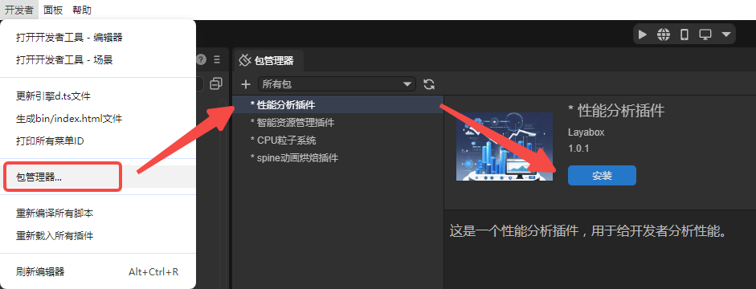

(Figure 1-1)

### 1.2 Logging into the Backend Platform

Click [here](https://layame-1251285021.cos.ap-shanghai.myqcloud.com/maker_union/master-asset/performance/index.html#/home) to log into the backend platform. As shown in Figure 1-2, after entering the backend interface, create a project.

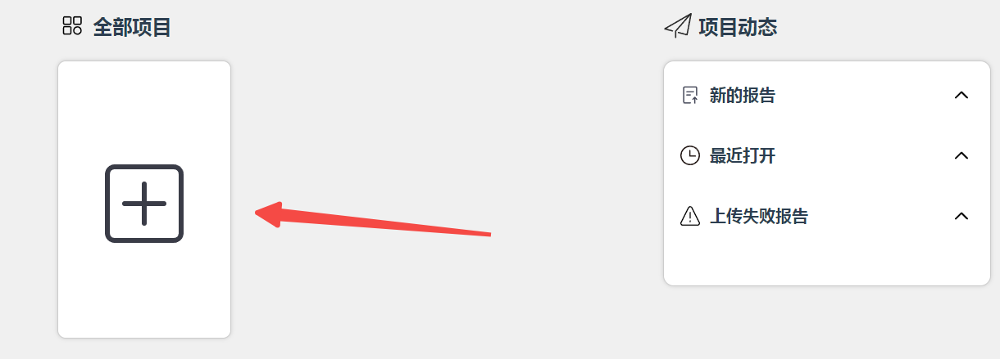

(Figure 1-2)

### 1.3 Integrating the Plugin into the Project

In the project entry point, call the interface to initialize the plugin.

> The project entry here refers to the first place the project executes after engine initialization. Refer to the documentation [Project Entry Description](https://layaair.com/3.2/doc/basics/IDE/entry/readme.html).
>
> Developers can set up a dedicated script for initializing and configuring the performance analysis tool.

```typescript
const { regClass, property } = Laya;

@regClass()
export class NewScript extends Laya.Script {

    @property(Number)
    public projectId: number = 23;

    private perfMain: LayaPerf = new LayaPerf();

    onEnable(): void {
        this.perfMain.init(this.projectId);
    }
}
```

`projectId` uses the project ID assigned by the backend. As shown in Figure 1-3, the ID value can be seen in the backend interface.

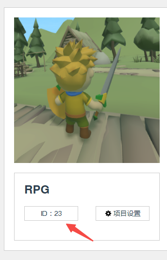

(Figure 1-3)

## 2. Using the Tool

### 2.1 Recording

The Performance Analysis Plugin is used for running projects. During runtime, recording-related buttons will appear in the upper-left corner of the game. Click the circular recording button as shown in Figure 2-1. A prompt popup will appear as shown in Figure 2-2. Click "OK" to start recording performance.

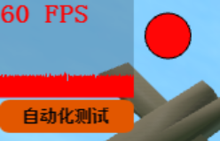

(Figure 2-1)

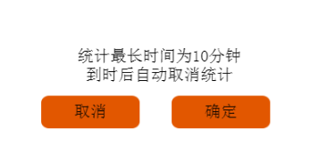

(Figure 2-2)

After recording starts, click the "Automated Testing" button, and the system will automatically turn on/off key indicators (lights, shadows, cameras, physics, particles, etc.) for automated testing. During recording, the recording button will change to a square shape as shown in Figure 2-3. To stop recording, click this square button.

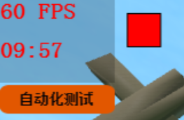

(Figure 2-3)

### 2.2 Uploading

After stopping recording, a dialog will appear asking whether to upload the recording results, as shown in Figure 2-4.


(Figure 2-4)

Click the "Upload" button to upload the performance analysis file from this recording session to the server for parsing.

> Note:
>
> Each upload of a recording consumes one usage. Remaining usage can be viewed on the [backend platform](https://layame-1251285021.cos.ap-shanghai.myqcloud.com/maker_union/master-asset/performance/index.html#/home).
>
> After recording ends, if you click "Cancel", the recording results will not be uploaded and no usage will be consumed.

### 2.3 Viewing Reports

After uploading, refresh the backend interface, and you can see the corresponding recording reports displayed on the project page.

> If the report cannot be clicked with the mouse, it means the report is still being analyzed. Refresh the page later, and clicking the corresponding report will display the report content normally.

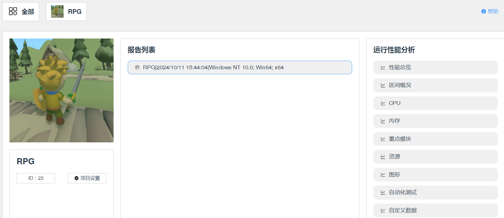

(Figure 2-5)

## 3. Feature Description

### 3.1 Performance Overview

The performance overview provides an overall analysis of the recording process. You can view the average or peak values of various parameters during testing. As shown in Figure 3-1, click the "?" icon to view optimization suggestions.

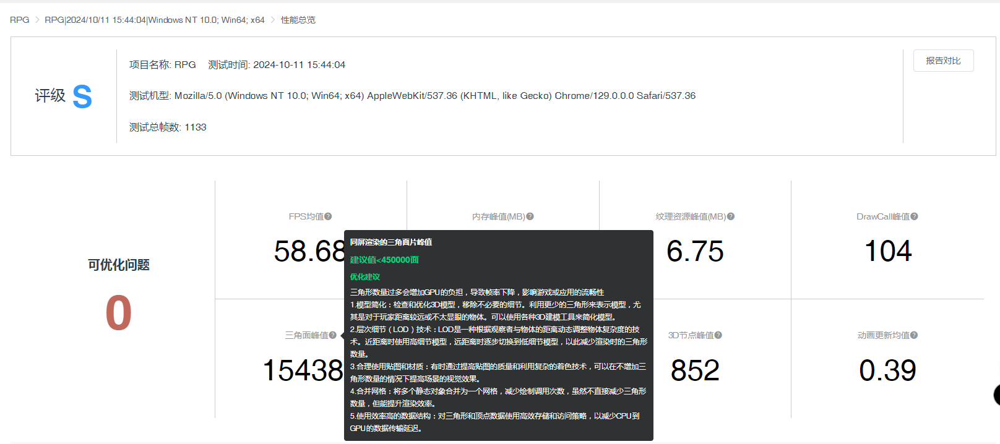

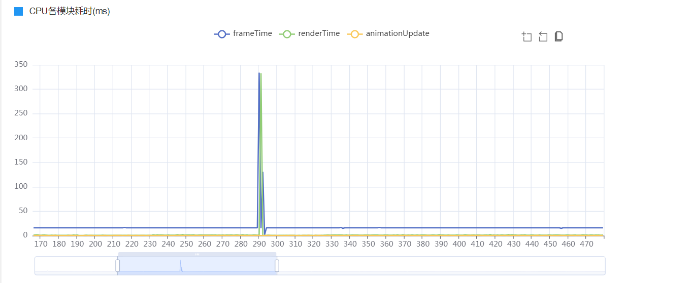

(Figure 3-1)

### 3.2 Section Overview

Typically used to mark performance overhead within a certain time period. For example, different levels or user-defined time periods. After statistics are completed, on the backend "Section Overview" page, you can see the performance overhead for this analysis period, as shown in Figure 3-2.

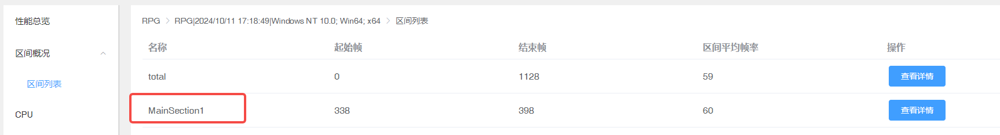

(Figure 3-2)

Implementing section statistics requires using two APIs:

`section_begin(tag: string): void;`: Section statistics start. When viewing on the backend page, it will be displayed in the section overview according to sections. The parameter tag is the statistics identifier.
`section_end(tag: string): void;`: Section statistics end. Pass the same tag parameter as section_begin to indicate the end of this section statistics.

Usage can refer to the following code:

```typescript
    //Executed after the component is enabled, for example after the node is added to the stage
    onEnable(): void {
        this.perfMain.init(this.projectId).then(res =>{

            Laya.timer.once(8000, this, () => {
                this.perfMain.section_begin("MainSection1");
            });
            Laya.timer.once(9000, this, () => {
                this.perfMain.section_end("MainSection1");
            });

        });
    }
```

The data after recording is shown in Figure 3-2 above. Click "View Details" to view.

### 3.3 CPU

Analyzes the CPU performance of the project at runtime.

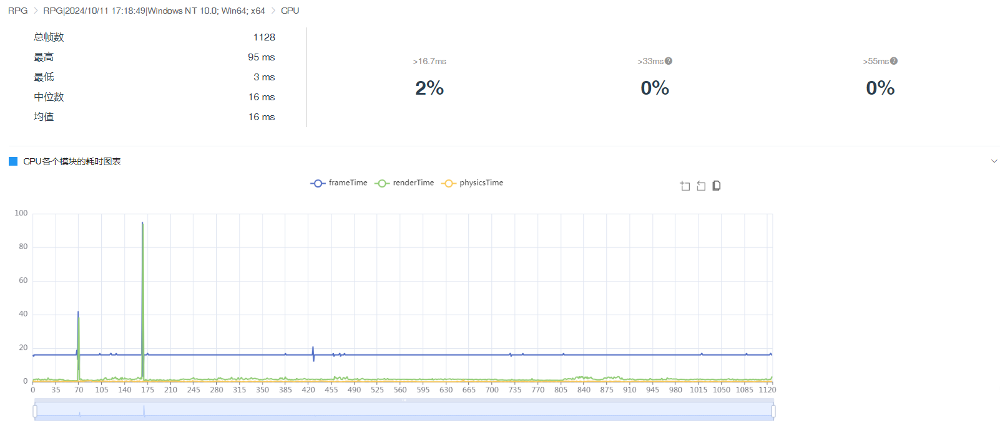

(Figure 3-3)

### 3.4 Memory

Analyzes memory peaks and total memory usage over time.

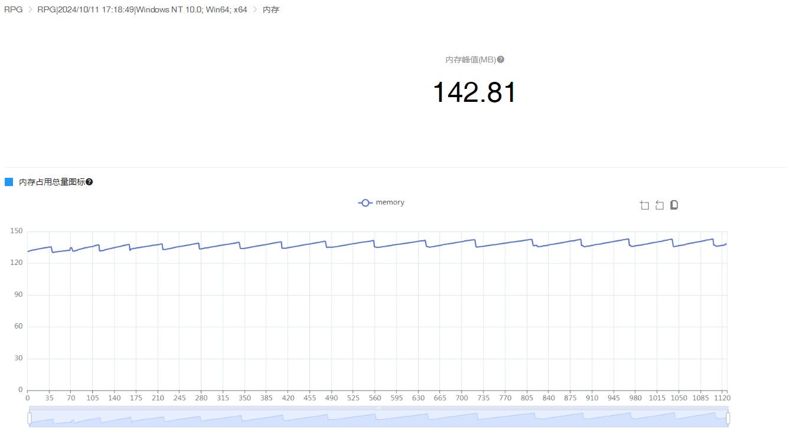

(Figure 3-4)

### 3.5 Key Modules

This module analyzes the main modules during game runtime, including: rendering module, physics module, animation module, loading module, particle system, shader, UI module.

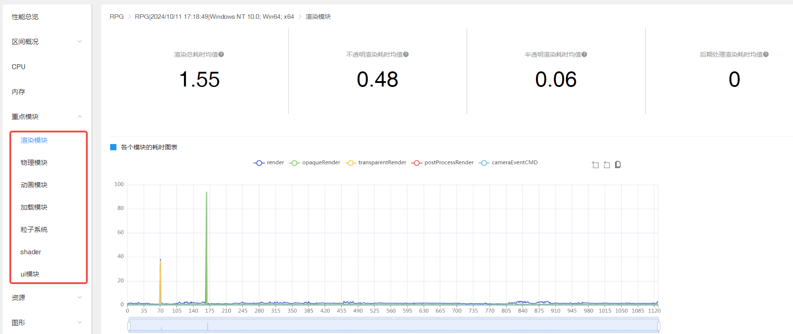

(Figure 3-5)

`Rendering Module`: Mainly analyzes the average rendering time, average opaque rendering time, average translucent rendering time, and average post-processing rendering time.

`Physics Module`: Can view peak StaticRigidBody count and peak DynamicRigidBody count.

`Animation Module`: Includes average animation update time and average bone update time.

`Loading Module`: Displays peak network request resource count.

`Particle System`: Contains analysis of shurikenParticle time and shurikenParticle count.

`shader`: Has shader compilation time peak and shader count peak analysis.

`ui module`: Statistics on UI rendering time average (ms) and UI DrawCall.

> Click the corresponding "?" icon to view optimization suggestions. Data statistics for each module are displayed in line chart format.

### 3.6 Resources

Resource statistics include texture resources and geometry data.

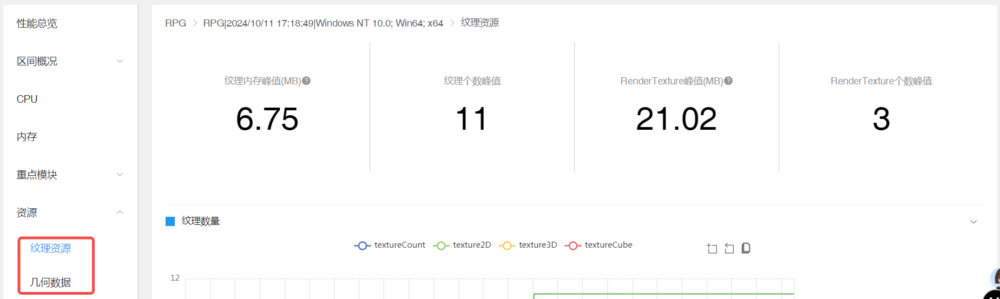

(Figure 3-6)

`Texture Resources`: Mainly statistics on texture memory, count, and RenderTexture.

`Geometry Data`: Includes data for vertex cache and index cache.

### 3.7 Graphics

This module is mainly for various DrawCall statistics.

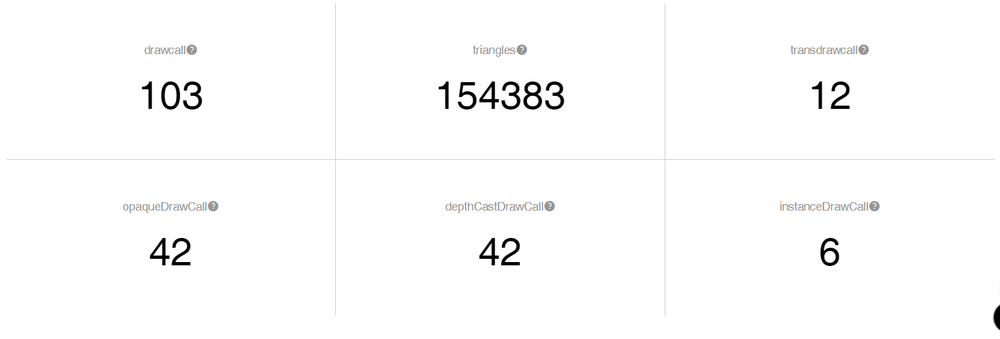

(Figure 3-7)

### 3.8 Automated Testing

Performance analysis after clicking automated testing when starting recording in section 2.1.

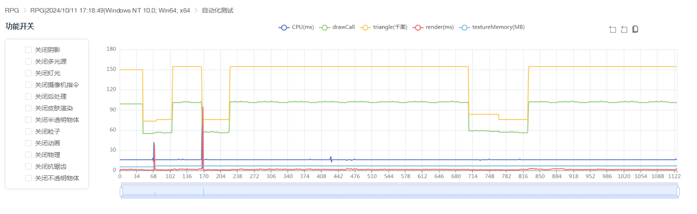

(Figure 3-8)

### 3.9 Custom Data

This module is typically used for statistical analysis of user-defined data. Data is divided into "Time Interval Data" and "Value Data". Data is collected every frame.

`Time Interval Data`: Generally used to statistics the execution time of a function (CPU time). For example, rendering time per frame.

`Value Data`: Generally used to statistics the value of a certain data per frame. For example, the number of triangles rendered per frame.

When using, you need to register tags first, then perform data statistics:

#### 3.9.1 Registering Tags

First, register the tags you need to use. For efficient data compression, separate ways to register tags are provided:

`regTimeTag(tag: string[]): void;`: Register tags for time interval data.

`regValueTag(tag: string[]): void;`: Register tags for value data.

The tag parameter of both APIs can register multiple tags.

Example usage code:

```typescript
    onEnable(): void {
        this.perfMain.init(this.projectId).then(res =>{
            this.perfMain.regTimeTag(["time1","time2"]);
            this.perfMain.regValueTag(["value1","value2"]);
        });
    }
```

#### 3.9.2 Data Statistics

After registering tags, you can perform data statistics.

**(1) Time Interval Data Statistics Method**

`perf_begin(tag: string): void;`: Custom time-consuming performance statistics start, add before the code block to be measured.

`perf_end(tag: string): void;`: Custom time-consuming performance statistics end, add at the end of the code block to be measured.

The tag parameter of both APIs is the time tag when registering the tag regTimeTag in 3.9.1.

Example usage code:

```typescript
    onUpdate(): void {
        this.perfMain.perf_begin("time2");
        const targetDuration = 2; // Target duration (milliseconds)
        const startTime = performance.now(); // Use performance high-precision time mark

        // A simple counting loop to occupy CPU time
        // The initial value and increment size may need to be adjusted to match approximately 2ms execution time
        let count = 0;
        while (performance.now() - startTime < targetDuration) {
            count++;
        }
        this.perfMain.perf_end("time2");
    }
```

After recording, the backend data statistics are shown in the figure below.

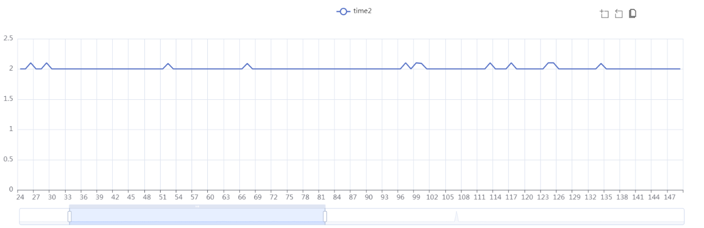

(Figure 3-9-1)

**(2) Value Data Statistics Method**

`perf_value(tag: string,value: any): void;`: The parameter tag is the data tag when registering the tag regValueTag in 3.9.1; the parameter value is the data value to be collected.

Example usage code:

```typescript
    onUpdate(): void {
        const targetDuration = 2; // Target duration (milliseconds)
        const startTime = performance.now(); // Use performance high-precision time mark
        // A simple counting loop to occupy CPU time
        // The initial value and increment size may need to be adjusted to match approximately 2ms execution time
        let count = 0;
        while (performance.now() - startTime < targetDuration) {
            count++;
        }

        this.perfMain.perf_value("value1", count);
    }
```

After recording, the backend data statistics are shown in the figure below.

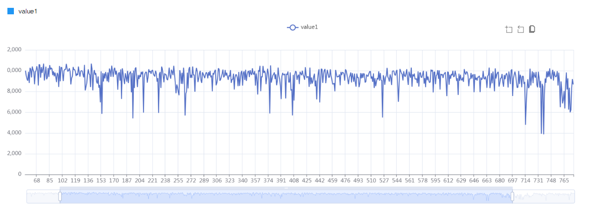

(Figure 3-9-2)
