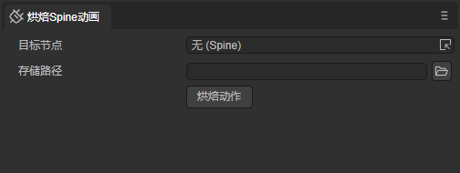
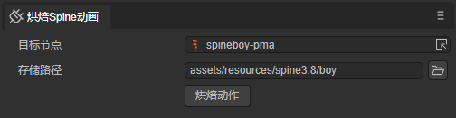
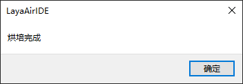
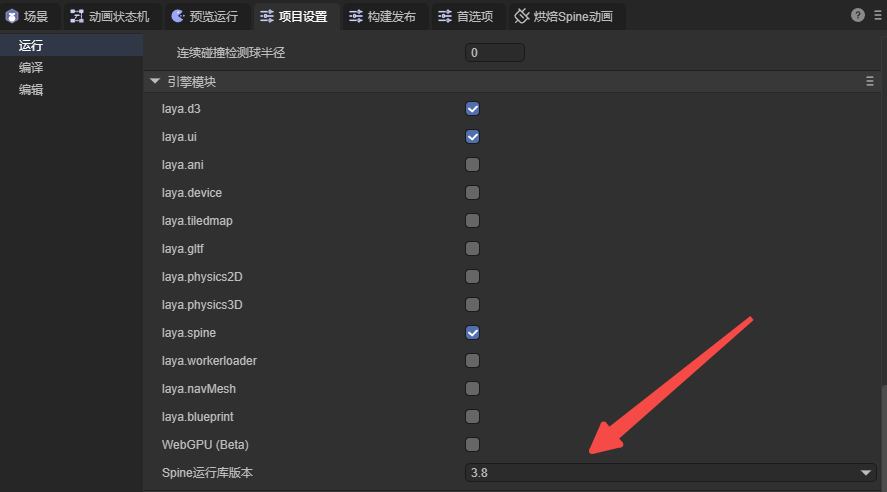
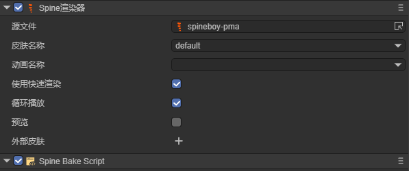
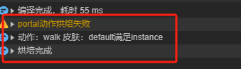
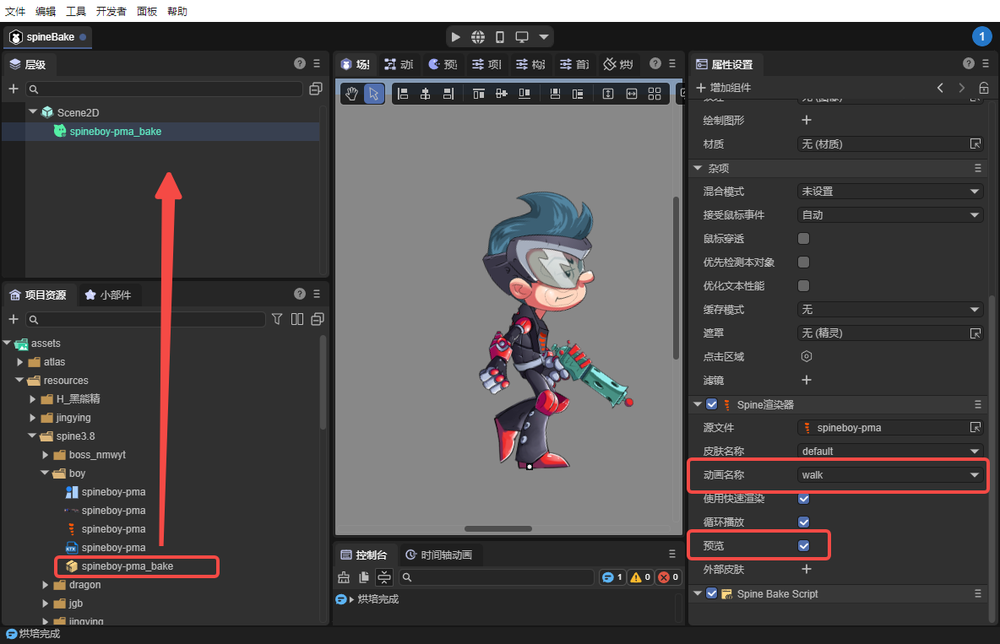

# Spine Animation Baking Plugin

The Spine Animation Baking Plugin is an efficient tool designed for game developers to optimize and improve the runtime performance of Spine animations in the LayaAir engine. By baking Spine animation data, it can significantly reduce performance consumption during game runtime and increase overall rendering efficiency.

## 1. Installing the Plugin

In LayaAir-IDE, install the Spine Animation Baking Plugin from the package manager, as shown in Figure 1-1.


(Figure 1-1)

After installation, this tool panel will open.



(Figure 1-2)

## 2. Baking Animations

Target Node: You can select Spine resources (in .skel or .json format).

Storage Path: Select a custom directory in the resources directory.



(Figure 2-1)

After clicking the `Bake Animation` button, a popup will prompt that baking is complete.



(Figure 2-2)

If the selected Spine version does not match the Spine version set in the IDE, or the Spine file is corrupted, an error popup will appear. The Spine version setting is in the project settings shown in Figure 2-3.



(Figure 2-3)

After successful baking, a .ktx compressed texture file and a .lh prefab file will be generated in the target folder.


(Figure 2-4)

The generated prefab file adds a baking component (parameters not exposed) and a Spine component.



(Figure 2-5)

Additionally,

1. The console will output which animations failed to bake (currently only resources using clipping cannot be baked).

2. During baking, it will output which animations met the instance rendering conditions (no VB/IB changes in between, meaning the Spine did not change slots, show/hide, or modify blend).



(Figure 2-6)

## 3. Using Prefabs

Method 1:

In the IDE, drag the prefab into the scene, check preview, select skin animation, and you can preview it in the IDE.



(Figure 3-1)

Method 2:

Add through script code. Example code is shown below:

```typescript
const { regClass, property } = Laya;

@regClass()
export class SpineTest extends Laya.Script {

    //Executed after the component is enabled, for example after the node is added to the stage
    onEnable(): void {
        //Load prefab file
        Laya.loader.load("resources/spine3.8/boy/spineboy-pma_bake.lh").then((res) => {
            // Create prefab
            let spineboy: Laya.Sprite = res.create();
            // Get Spine2DRenderNode component
            let spine2dRender: Laya.Spine2DRenderNode = spineboy.getComponent(Laya.Spine2DRenderNode);
            // Set animation to play
            spine2dRender.animationName = "walk";
            // Add prefab to scene
            this.owner.addChild(spineboy);
        });
    }

}
```
