# IDE Material Properties

To render objects in a scene, we need to describe the object's shape and appearance. We use mesh to represent the object's shape and material to represent the object's appearance. Materials and shaders are closely connected. The materials we use must have corresponding shader forms set.

# 1. Material Creation

We can create materials in the IDE's project panel. The material creation operation is shown in Animated Figure 1-1:

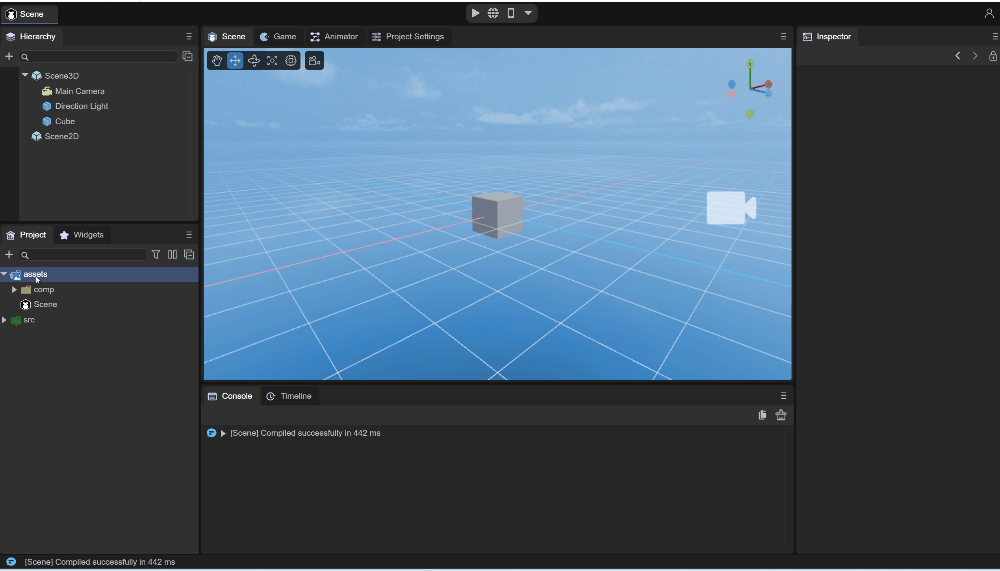

Figure 1-1

We create a material and name it "myMaterial".

# 2. Material Panel

After creating a material, we see new property descriptions appear on the Inspector panel on the right. When we select the created material, the property panel displays the current material's property content. The property panel mainly consists of two parts: material basic properties and material effect display. As shown in Figure 2-1, we'll explain the composition of the material property panel in detail.

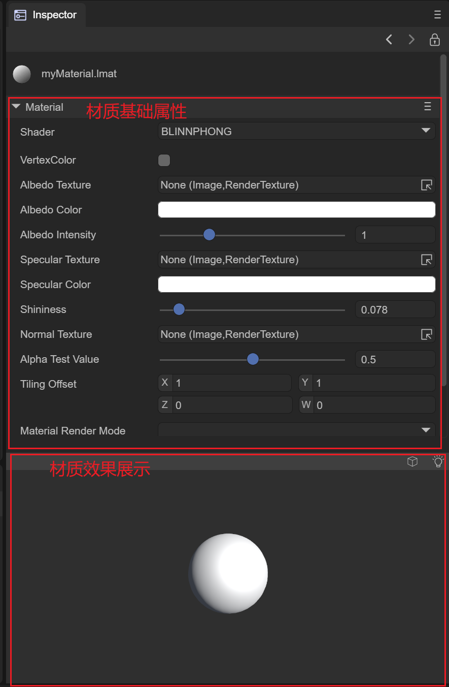

Figure 2-1

## 2.1 Material Basic Properties

Materials describe different surfaces based on different shader models. The IDE has eight built-in shader types. We'll explain the basic properties of each shader corresponding material based on shader type. **Switching a material's shader is achieved by selecting the material's Shader**. The specific operation is shown in Animated Figure 2-1-1 to switch to other shader types.

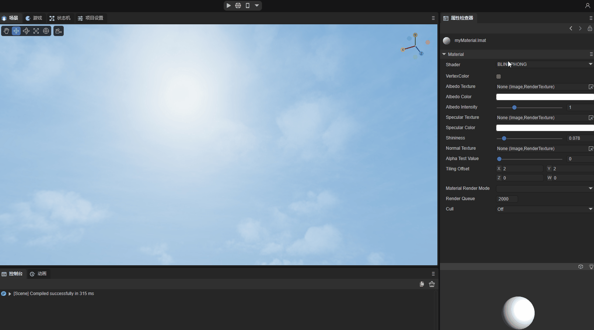

Animated Figure 2-1-1

### 2.1.1 BlinnPhong Shader

The Blinn-Phong lighting model can simply describe an object's surface absorption and reflection of light, making the object's surface present different brightness levels. It mainly describes the object's surface highlights, diffuse light, and ambient light parts.

#### (1) VertexColor

A macro definition switch for whether to support vertex colors. After enabling, mesh vertex color content can be superimposed.

#### (2) AlbedoTexture

Can set the content of the material's diffuse texture. The example uses a brick texture. The effect is shown in Animated Figure 2-1-1-2-1:

Animated Figure 2-1-1-2-1

#### (3) AlbedoColor

Can set the overall diffuse color of the material. As shown in Animated Figure 2-1-1-3:

Animated Figure 2-1-1-3

#### (4) AlbedoIntensity

Sets the intensity of the diffuse color.

#### (5) SpecularTexture

Used to set the specular reflection of the object's surface. Based on the RGB value of the object's current vertex's UV on the specular texture, it reflects the smooth reflection degree of the object's current vertex. As shown in Figure 2-1-1-5-1 and Figure 2-1-1-5-2:

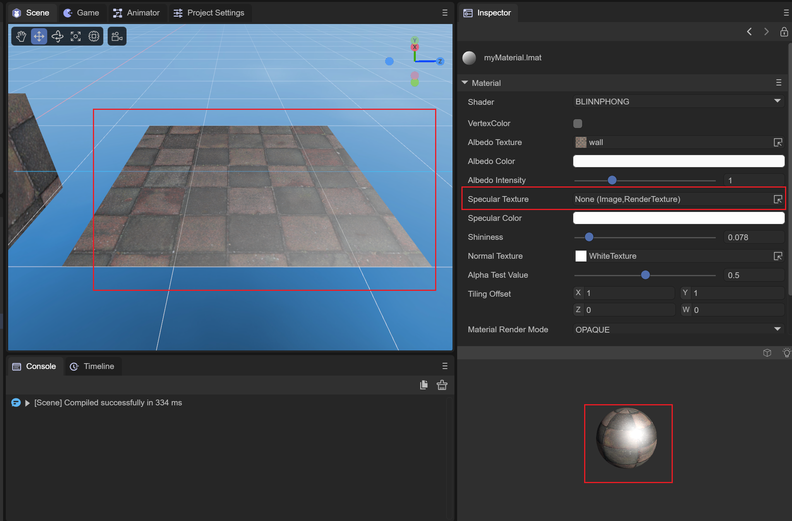

Figure 2-1-1-5-1

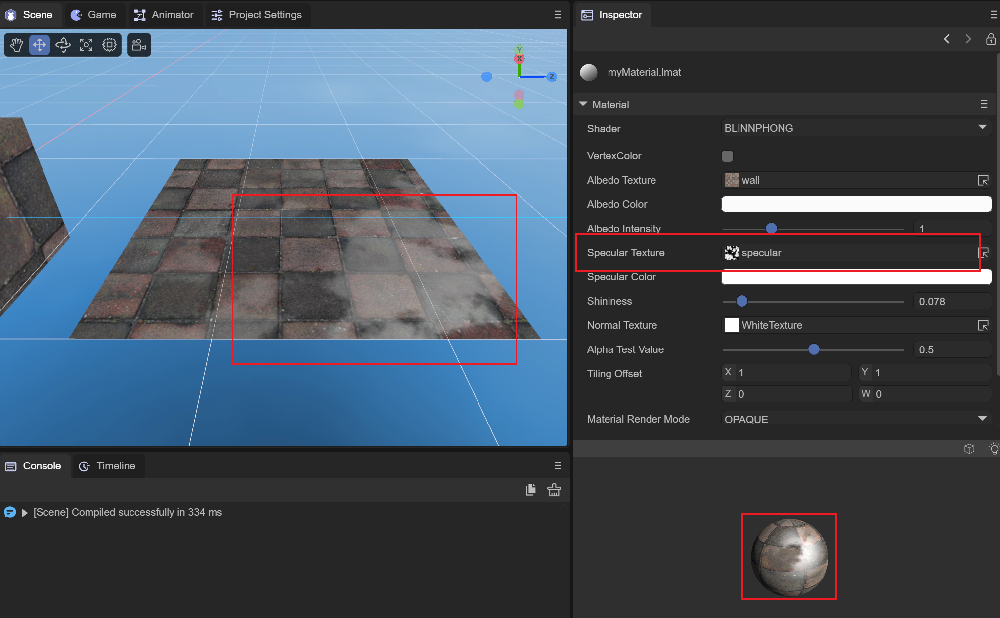

Figure 2-1-1-5-2

Before and after setting the specular texture, you can clearly see that due to the specular texture's influence, only parts of the wall produce highlight effects. This can be used to simulate highlight phenomena of different materials at different positions.

#### (6) SpecularColor

Can set the color of the highlight part. As shown in Figure 2-1-1-6, setting the highlight color to green:

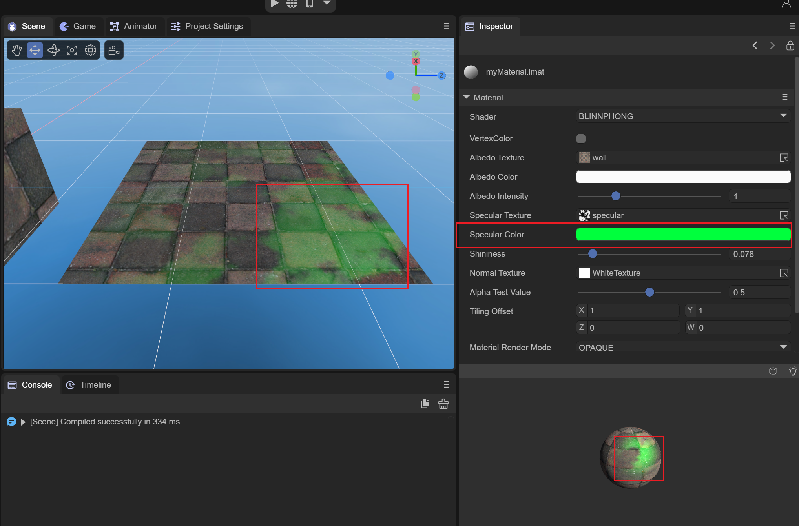

Figure 2-1-1-6

#### (7) Shininess

Used to set the range of highlights. The effect is shown comparing different shininess values in Figure 2-1-1-7-1 and Figure 2-1-1-7-2:

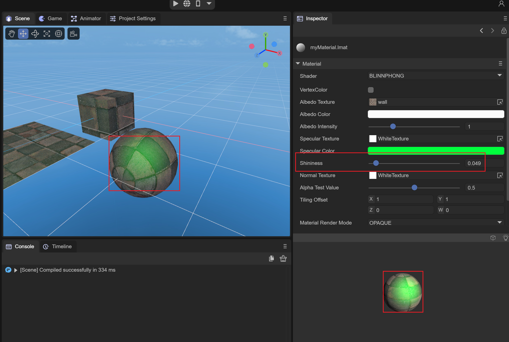

Figure 2-1-1-7-1

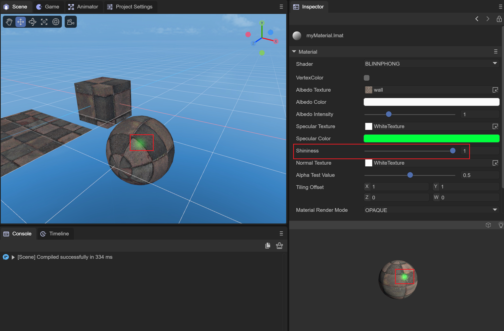

Figure 2-1-1-7-2

When the shininess value is smaller, the overall highlight range is larger; when the shininess value is larger, the overall highlight range is smaller.

#### (8) NormalTexture

Used to set the object model's normals in tangent space for lighting calculations, **requires the model to have tangent data**. As shown in Figure 2-1-1-8-1 and Figure 2-1-1-8-2, with normal map participation, lighting and shading appear more realistic.

Figure 2-1-1-8-1

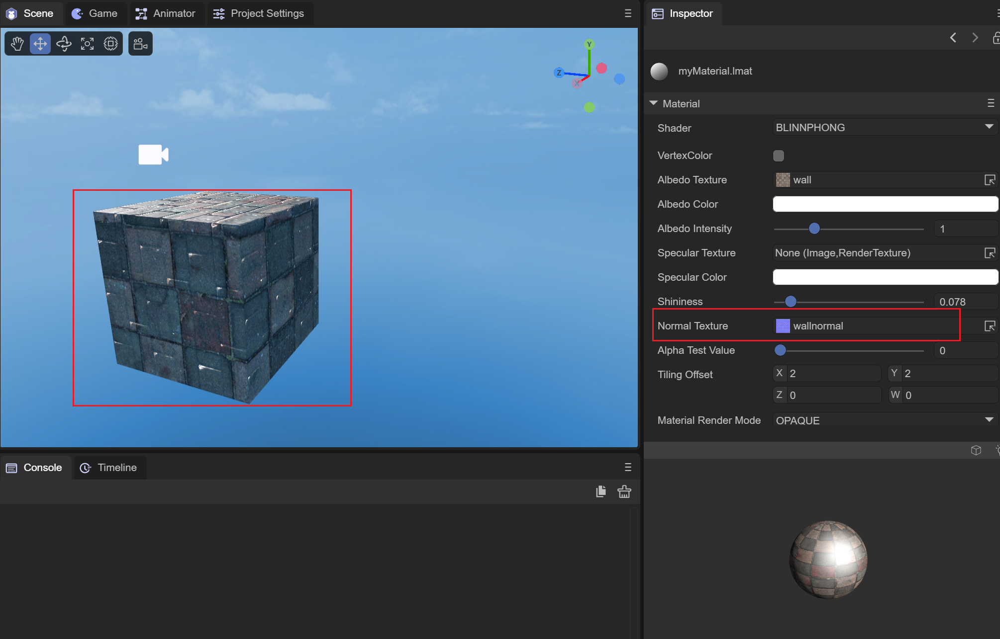

Figure 2-1-1-8-2

It can be seen that after adding the normal map, lighting is recalculated, and the object's surface has a more realistic bump effect.

#### (9) AlphaTestValue

This needs to be used with the material's render mode set to CUTOUT. In CUTOUT mode, when the alpha value of the current vertex's fragment color is less than AlphaTestValue, the fragment's value is directly discarded and not rendered. We use a spider web image as the diffuse texture and adjust the AlphaTestValue to see the effect of this value. The spider web image is shown in Figure 2-1-1-9-1, and the AlphaTestValue adjustment is shown in Animated Figure 2-1-1-9-2:

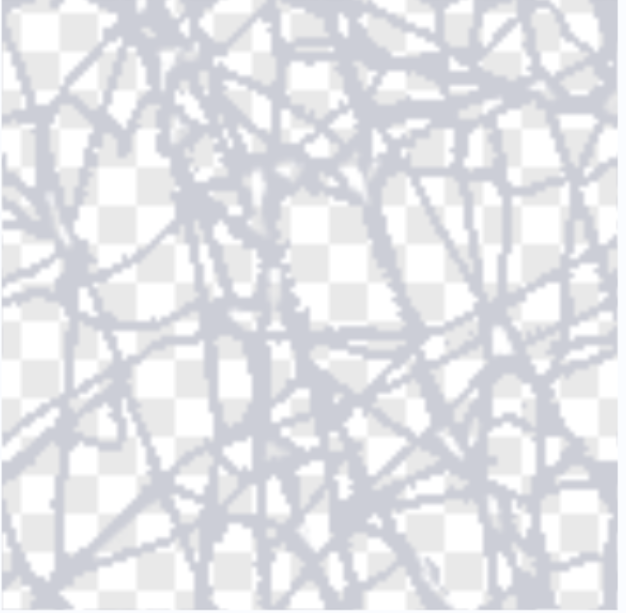

Figure 2-1-1-9-1

The alpha channel value of the hollow parts is 0

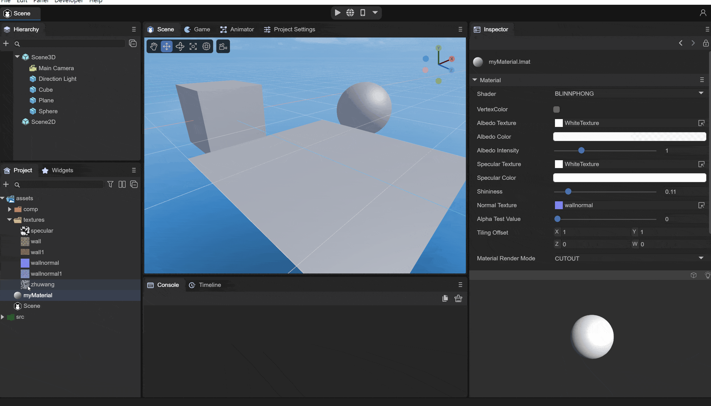

Animated Figure 2-1-1-9-2

As the value increases, more and more fragments are discarded until all fragments are discarded and not rendered.

#### (10) TilingOffset

Can set the scaling and offset of the object model's UV to achieve different effects of sampling AlbedoTexture, as shown in Animated Figure 2-1-1-10:

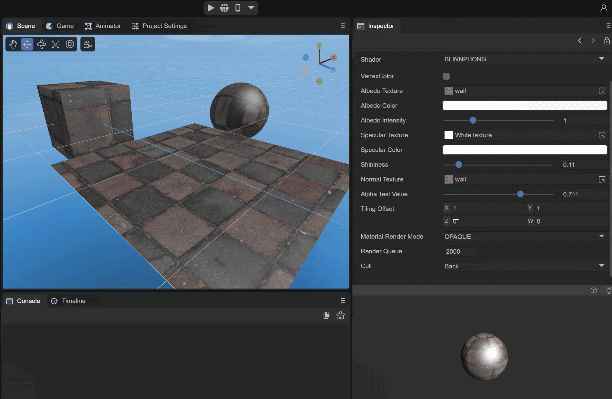

Animated Figure 2-1-1-10

#### (11) MaterialRenderMode

OPAQUE: Opaque mode, models behind the object will not be rendered.

CUTOUT: Cutout mode, discards some fragments based on the alpha value of the albedo texture and the AlphaTestValue.

TRANSPARENT: Transparent mode, blends with objects behind to create a transparent effect.

ADDITIVE: Additive mode, adds pixels of objects behind

ALPHABLENDED: Same blending mode as transparent mode, the difference is that it doesn't blend with fog in the scene.

#### (12) RenderQueue

Can be used to set the render queue of the material shader. The larger the RenderQueue, the later it renders. Generally, after setting the material's render mode, the render queue is set according to the render mode.

OPAQUE mode corresponds to queue 2000;

CUTOUT mode corresponds to queue 2450;

TRANSPARENT mode corresponds to queue 3000;

ADDITIVE mode corresponds to queue 3000;

ALPHABLENDED mode corresponds to queue 3000;

#### (13) Cull

Culls based on different connection orders of face vertices (clockwise or counterclockwise).

Off: Disable culling

Back: Cull back faces

Front: Cull front faces

### 2.1.2 Unlit Shader

The Unlit shader is a light-ignoring material that won't be affected by lighting, only using the material's texture and color to represent the object's surface effect.

#### (1) VertexColor

Whether to apply vertex colors. After enabling this macro definition, model vertex colors are superimposed.

#### (2) Texture

Sets the texture used to describe the object's stroke color. As shown in Figure 2-1-2-2-1 and Figure 2-1-2-2-2, after setting the texture, the object's surface displays the color of the corresponding texture part based on UV, and you can see that it won't be affected by lighting even when light exists in the scene.

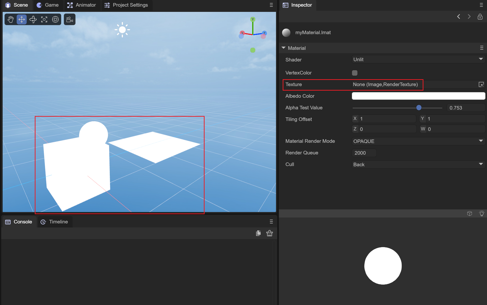

Figure 2-1-2-2-1

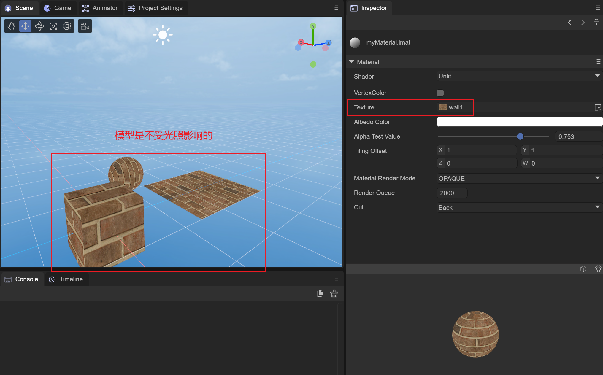

Figure 2-1-2-2-2

#### (3) AlbedoColor

Similarly, AlbedoColor can superimpose color onto the object's surface. As shown in Figure 2-1-2-3-1, we superimpose a red color onto the object's surface:

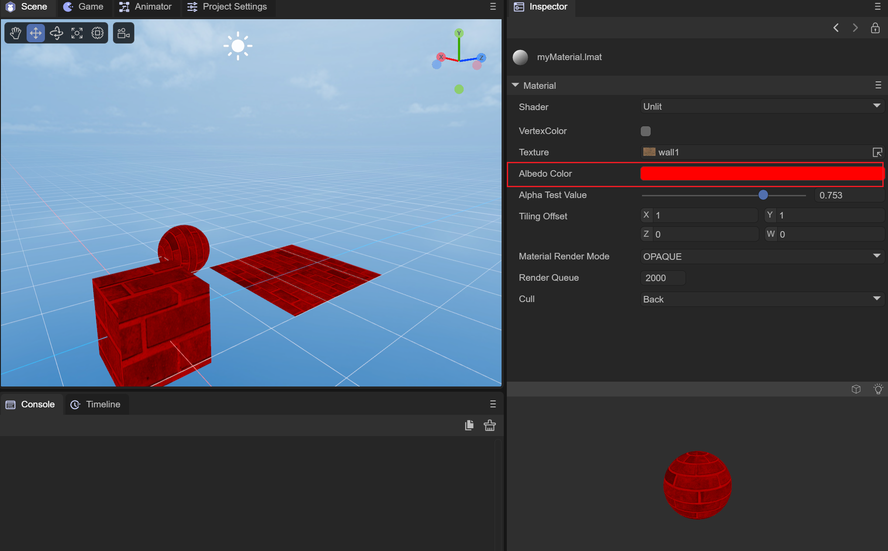

Figure 2-1-2-3-1

#### (4) AlphaTestValue

This also only takes effect when the render mode is CUTOUT and is used in conjunction. Same as the Blinn-Phong shader, it judges the current vertex fragment's alpha value against the set AlphaTestValue. Fragments with alpha values less than AlphaTestValue are discarded and not rendered. We still use the spider web texture from the Blinn-Phong shader to see the processing of different alphaTestValue values, as shown in Animated Figure 2-1-2-4-1:

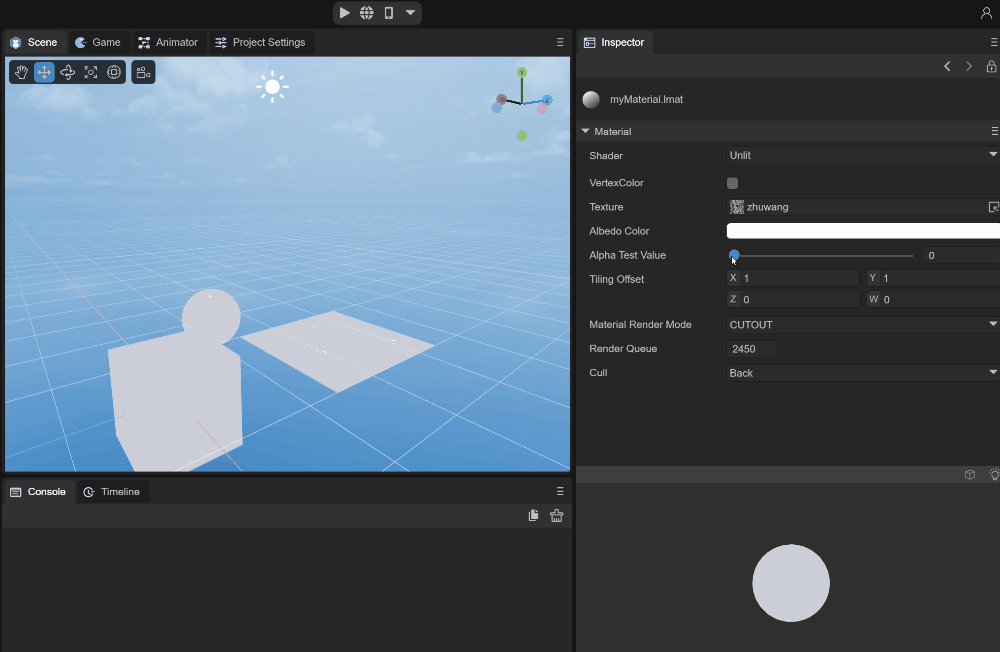

Animated Figure 2-1-2-4-1

You can see that **unlike Blinn-Phong, Unlit's alpha value will superimpose AlbedoColor.a's value. Our AlbedoColor's alpha is 1.0**, so the situation where all fragments are discarded won't occur.

#### (5) TilingOffset

Used to set the scaling and offset of the object model's UV. Same effect as Blinn-Phong shader, as shown in Animated Figure 2-1-2-5-1:

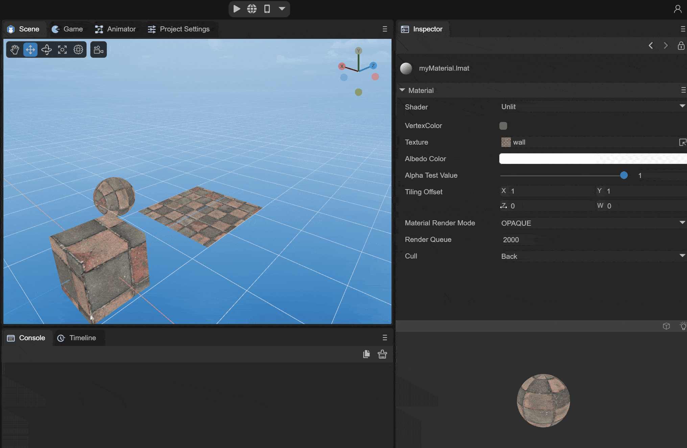

Animated Figure 2-1-2-5-1

#### (6) MaterialRenderMode

OPAQUE: Opaque mode, models behind the object will not be rendered.

CUTOUT: Cutout mode, discards some fragments based on the alpha value of the albedo texture and the AlphaTestValue.

TRANSPARENT: Transparent mode, blends with objects behind to create a transparent effect.

ADDITIVE: Additive mode, adds pixels of objects behind.

ALPHABLENDED: Same blending mode as transparent mode, the difference is that it doesn't blend with fog in the scene.

#### (7) RenderQueue

Can be used to set the render queue of the material shader. The larger the RenderQueue, the later it renders. Generally, after setting the material's render mode, the render queue is set according to the render mode.

OPAQUE mode corresponds to queue 2000;

CUTOUT mode corresponds to queue 2450;

TRANSPARENT mode corresponds to queue 3000;

ADDITIVE mode corresponds to queue 3000;

ALPHABLENDED mode corresponds to queue 3000;

#### (8) Cull

Culls based on different connection orders of face vertices (clockwise or counterclockwise).

Off: Disable culling

Back: Cull back faces

Front: Cull front faces

#### How to achieve the original 2.0 engine's effect material effect through Unlit settings

Change the MaterialRenderMode material render mode to additive or blend mode. If color space is not excluded, the effect is the same. 3.0's color space has already become linear.

### 2.1.3 PBR Shader

PBR material is a physically-based rendering material that can provide an accurate representation of how light interacts with surfaces, more realistically describing object surface properties. We use the Image-Based Lighting (IBL) lighting mode to better demonstrate PBR properties. We need to convert the scene's ambient light source from SolidColor to Spherical Harmonics, and click GenerateLighting below to generate an IBL cubemap CubeMap, as shown in Figure 2-1-3-1:

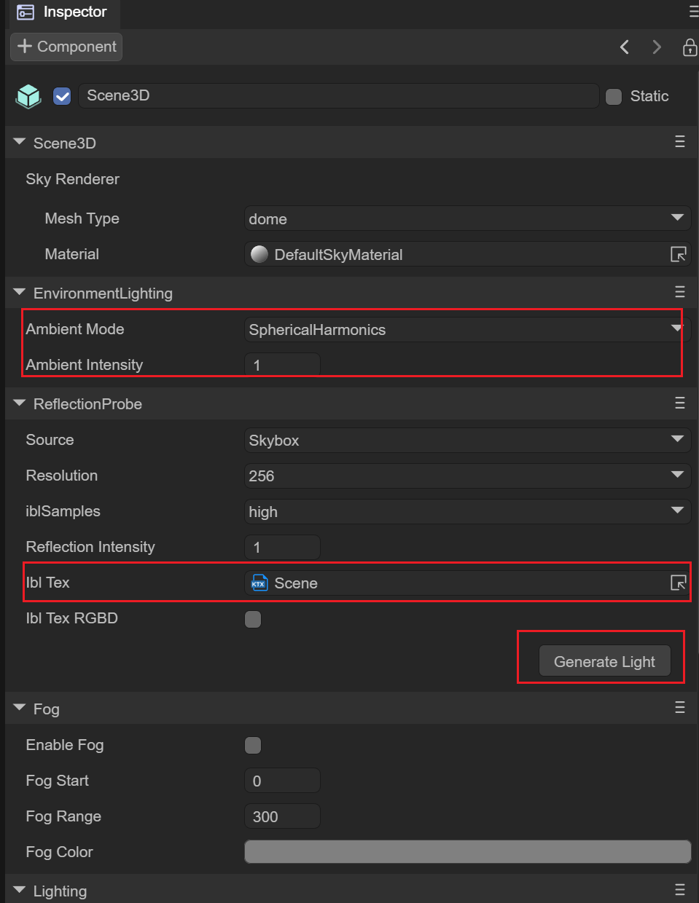

Figure 2-1-3-1

#### (1) AlbedoTexture

To set the overall texture of the object's surface material, we also use the above wall as the texture. As shown in Figure 2-1-3-1-1 and Figure 2-1-3-1-2, the effect of setting AlbedoTexture:

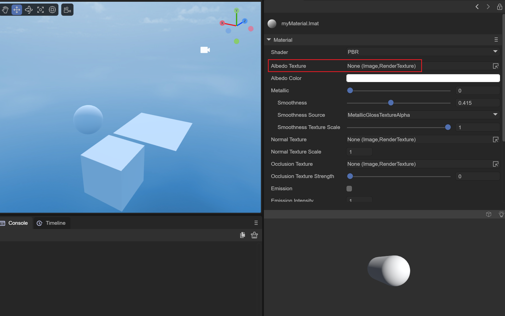

Figure 2-1-3-1-1

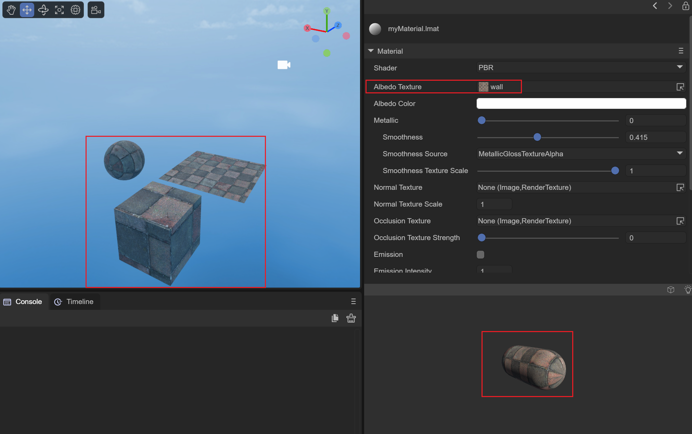

Figure 2-1-3-1-2

#### (2) AlbedoColor

Can superimpose an overall color onto the object's surface. As shown in Figure 2-1-3-2-1, we superimpose a yellow color onto the material:

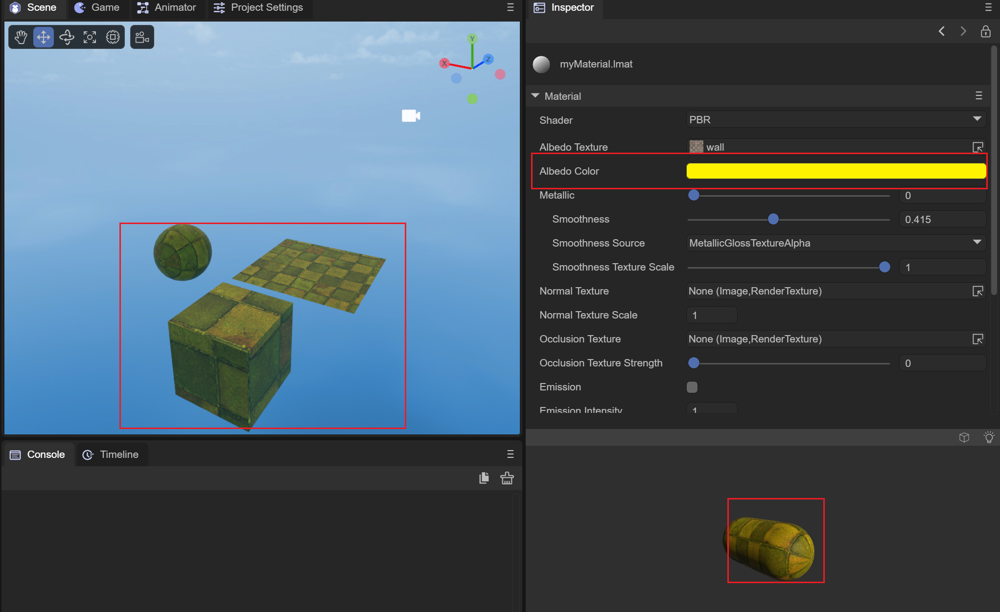

Figure 2-1-3-2-1

#### (3) Metallic

Used to set the metallic luster effect of the object's surface. Generally, we use 0 and 1 to set the object's metalness - either completely absent or completely present. When metalness is 1, it can reflect the surrounding environment's content. Imagine when we look at a smooth metal ball, it reflects our face. In the IDE, we've already set up an IBL-based spherical harmonics cubemap as ambient light. When we adjust the material's metalness closer to 1, the object's surface gradually reflects the surrounding environment's content. At the same time, we set smoothness to 1 to see the effect more clearly, as shown in Animated Figure 2-1-3-3-1:

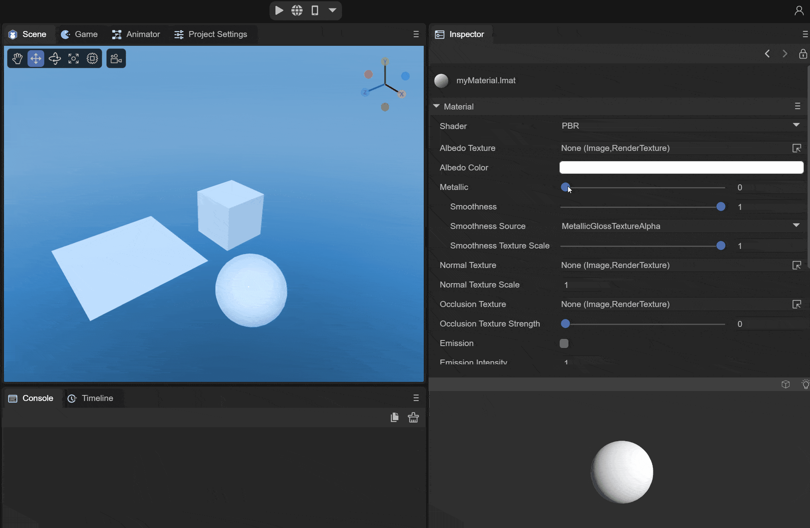

Animated Figure 2-1-3-3-1

When we adjust the material's metalness toward 1, we can see the object's surface gradually reflecting the surrounding environment's content. When metalness is 1, it completely reflects the surrounding environment.

#### (4) Smoothness

Used to set the smoothness of the object's surface. When smoothness is 0, the object's surface shows obvious diffuse reflection and insufficient highlights. When smoothness is 1, the highlight part is more obvious. As shown in Animated Figure 2-1-3-4-1:

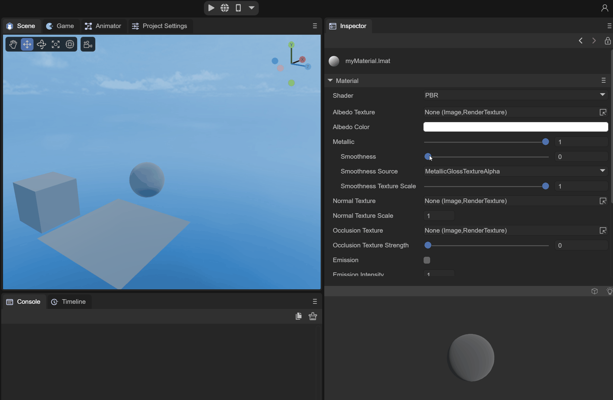

Animated Figure 2-1-3-4-1

#### (5) SmoothnessSource

Can set two smoothness sources: obtained from the alpha channel of AlbedoTexture, or from the alpha channel of MetallicGlossTexture. Actually, this maps the object's surface material's smoothness to the alpha channel of the AlbedoTexture texture or to the alpha channel of the MetallicGloss texture, so lighting calculations can be performed based on each vertex's smoothness.

AlbedoTextureAlpha: Obtain the object's surface smoothness from the alpha channel of the Albedo texture.

MetallicGlossTextureAlpha: Obtain the object's surface smoothness from the alpha channel of the MetallicGloss texture.

#### (6) SmoothnessTextureScale

When set to obtain smoothness values from the texture's alpha channel, you can control the overall smoothness value under the texture's alpha channel by setting this scale value. We set the smoothness source to albedoTexture's alpha value and use the above spider web texture as the albedo texture, as shown in Animated Figure 2-1-3-6-1:

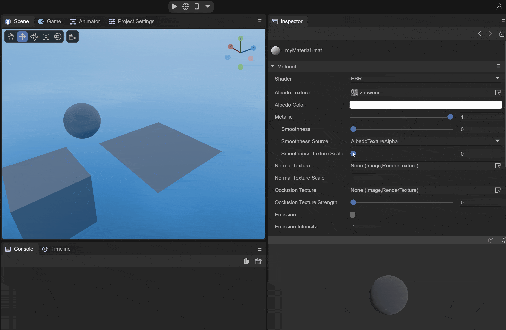

Animated Figure 2-1-3-6-1

#### (7) NormalTexture

Sets the object's normal map, which calculates lighting based on the object's normal map. As shown in Figure 2-1-3-7-1 and Figure 2-1-3-7-2, after setting the normal map, the lighting's highlight and diffuse parts are recalculated:

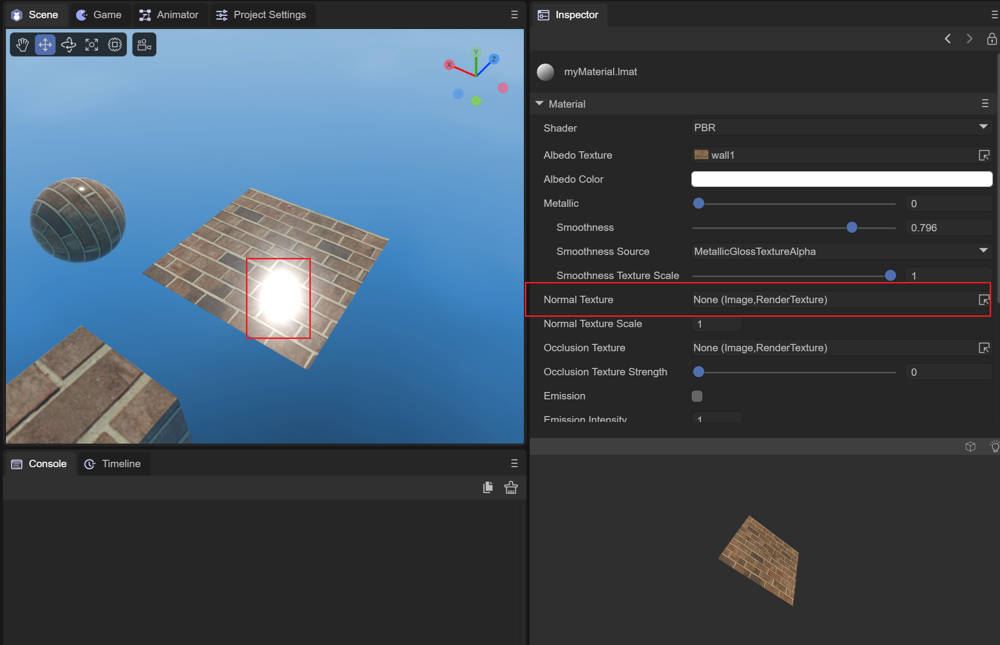

Figure 2-1-3-7-1

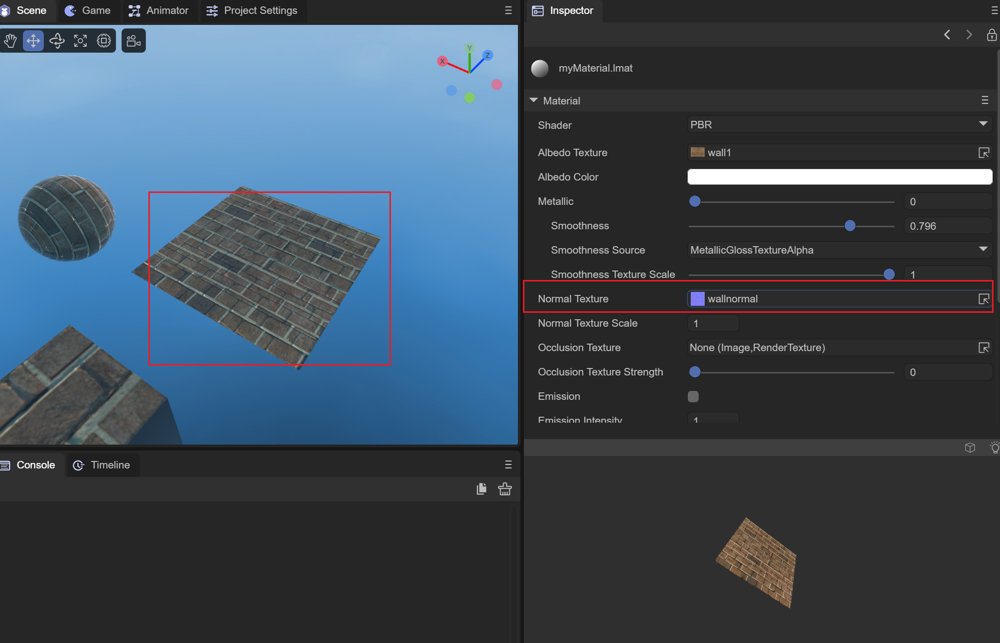

Figure 2-1-3-7-2

#### (8) OcclusionTexture

By sampling the g-channel of the Occlusion texture, can set the AO ambient occlusion value of model vertices, so during PBR lighting calculations, can more realistically simulate lighting values at small joints and other positions.

#### (9) OcclusionTextureStrength

Used to adjust the strength of the occlusion texture. When strength is 0, the overall occlusion value is 1; when strength is 1, the occlusion texture's occlusion value is used.

#### (10) Emission

Used to set whether the model's self-illumination is enabled. After enabling, two new self-illumination parameters are added: EmissionColor and EmissionTexture.

##### EmissionColor

The overall superimposed self-illumination color, which is more obvious in the diffuse part. As shown in Figure 2-1-3-10-1, superimposing a red self-illumination color:

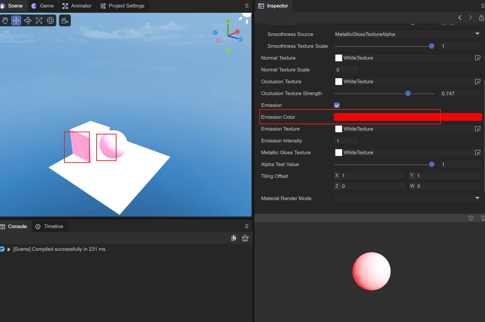

Figure 2-1-3-10-1

##### EmissionTexture

Setting a self-illumination texture can superimpose the above-set self-illumination color on different vertex positions based on the model. As shown in Figure 2-1-3-10-2:

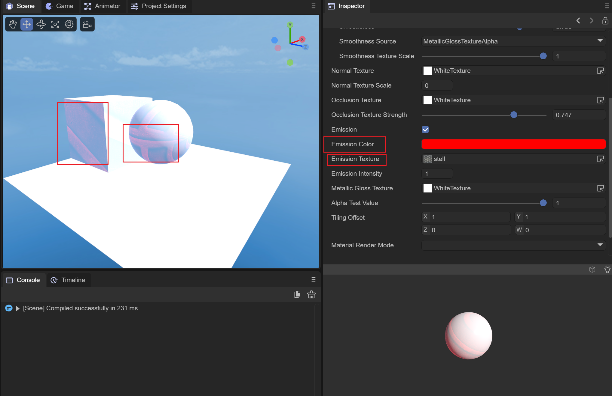

Figure 2-1-3-10-2

#### (11) EmissionIntensity

Sets the intensity of the self-illumination color. When intensity is 0, there's no self-illumination effect; when intensity is 1, the set self-illumination color is superimposed.

#### (12) MetallicGlossTexture

Can set a texture storing the object's surface material's metalness and smoothness. The texture's r-channel stores the model material's metalness information, and the texture's a-channel stores the model material's smoothness information. Below, we use a pure black and pure white texture to show the metallic gloss texture's influence on PBR material, as shown in Figure 2-1-3-12-1 and Figure 2-1-3-12-2:

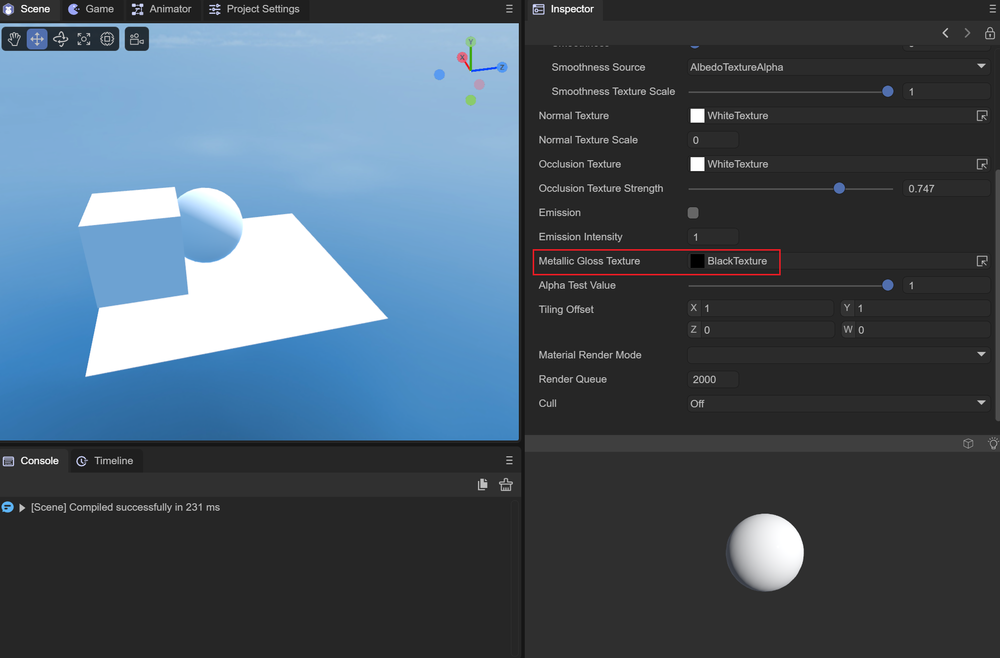

Figure 2-1-3-12-1

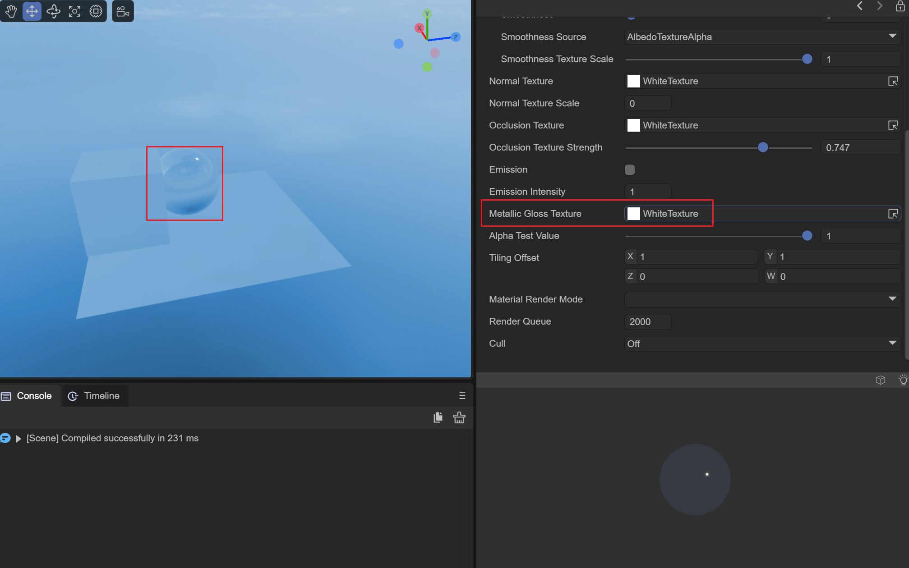

Figure 2-1-3-12-2

In Figure 2-1-3-12-1, the pure black image's metalness and smoothness are 0, basically only having the cubemap's diffuse reflection effect. In Figure 2-1-3-12-2, the pure white image's metalness and smoothness are 1, which can well reflect the surrounding stereoscopic ambient light content.

#### (13) AlphaTestValue

Also needs to be used with render mode set to CUTOUT mode. It tests based on the alpha superimposed value of AlbedoTexture and AlbedoColor. Fragments with alpha values less than AlphaTestValue are discarded and not rendered.

#### (14) TilingOffset

Same effect as Blinn-Phong and Unlit, can be used to set model UV scaling and offset values, achieving sampling of different positions of the Albedo texture.

#### (15) MaterialRenderMode

OPAQUE: Opaque mode, models behind the object will not be rendered.

CUTOUT: Cutout mode, discards some fragments based on the alpha value of the albedo texture and the AlphaTestValue.

TRANSPARENT: Transparent mode, blends with objects behind to create a transparent effect.

ADDITIVE: Additive mode, adds pixels of objects behind

ALPHABLENDED: Same blending mode as transparent mode, the difference is that it doesn't blend with fog in the scene.

#### (16) RenderQueue

Can be used to set the render queue of the material shader. The larger the RenderQueue, the later it renders. Generally, after setting the material's render mode, the render queue is set according to the render mode.

OPAQUE mode corresponds to queue 2000;

CUTOUT mode corresponds to queue 2450;

TRANSPARENT mode corresponds to queue 3000;

ADDITIVE mode corresponds to queue 3000;

ALPHABLENDED mode corresponds to queue 3000;

#### (17) Cull

Culls based on different connection orders of face vertices (clockwise or counterclockwise).

Off: Disable culling

Back: Cull back faces

Front: Cull front faces

### 2.1.4 Particle Shader

The particle shader is used to set the particle's surface display, mainly used in particle effects. We need to create a particle system in the scene, as shown in Animated Figure 2-1-4-1:

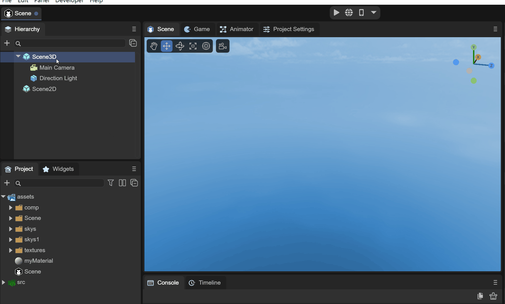

Animated Figure 2-1-4-1

At the same time, we need to assign the material to the particle system, as shown in Animated Figure 2-1-4-2:

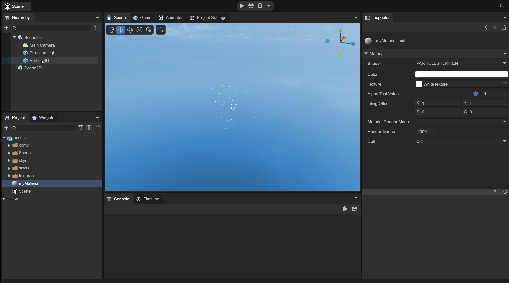

Animated Figure 2-1-4-2

This way, the material is assigned to the particle system for use. Below, we briefly explain the role of each parameter.

#### (1) Color

Used to set the color of the particle material. As shown in Figure 2-1-4-1-1, we set the particle color to red, and the particles emitted by the particle system become red:

Figure 2-1-4-1-1

#### (2) Texture

Used to set the texture style of the particles. As shown in Figure 2-1-4-2-1:

Figure 2-1-4-2-1

#### (3) AlphaTestValue

CUTOUT mode is invalid for the particle shader, so the alpha test value doesn't need to be set.

#### (4) TilingOffset

Same effect as Blinn-Phong and Unlit, can be used to set the model's UV scaling and offset values, achieving different effects of sampling the Albedo texture.

#### (5) MaterialRenderMode

OPAQUE: Opaque mode, models behind the object will not be rendered.

CUTOUT: Invalid under the particle shader.

TRANSPARENT: Transparent mode, blends with objects behind to create a transparent effect.

ADDITIVE: Additive mode, adds pixels of objects behind

ALPHABLENDED: Same blending mode as transparent mode, the difference is that it doesn't blend with fog in the scene.

#### (6) RenderQueue

Can be used to set the render queue of the material shader. The larger the RenderQueue, the later it renders. Generally, after setting the material's render mode, the render queue is set according to the render mode.

OPAQUE mode corresponds to queue 2000;

CUTOUT mode corresponds to queue 2450;

TRANSPARENT mode corresponds to queue 3000;

ADDITIVE mode corresponds to queue 3000;

ALPHABLENDED mode corresponds to queue 3000;

#### (7) Cull

Culls based on different connection orders of face vertices (clockwise or counterclockwise).

Off: Disable culling

Back: Cull back faces

Front: Cull front faces

### 2.1.5 Trail Shader

The Trail shader is used to achieve trail effects. We need a trail effect object to implement it. Create a trail effect object in the scene as shown in Animated Figure 2-1-5-1:

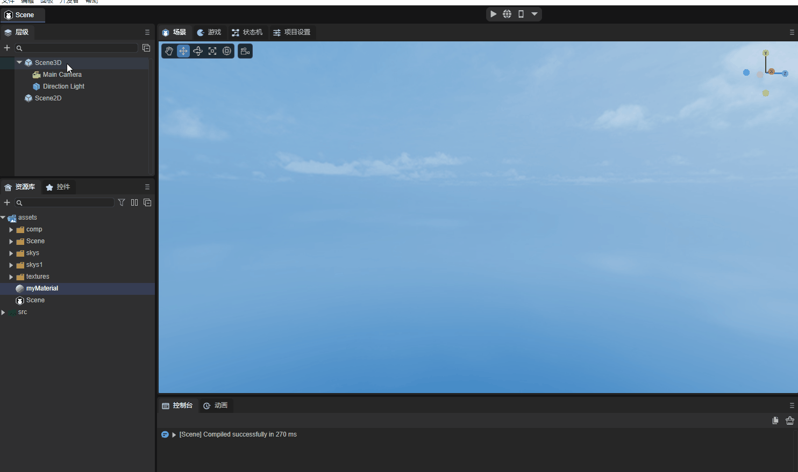

Animated Figure 2-1-5-1

We add the corresponding material to the trail effect object as shown in Animated Figure 2-1-5-2, adding the myMaterial material to the trail effect object:

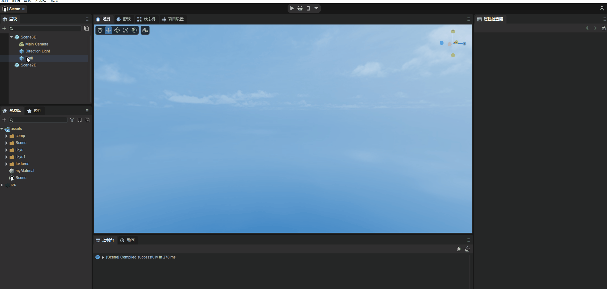

Animated Figure 2-1-5-2

**To view the trail effect, we need to move the trail effect object. For this, we add a Move script to make the effect object move along the x-axis.**

#### (1) Color

Used to set the trail's color. As shown in Animated Figure 2-1-5-1-1, we set red as the trail color:

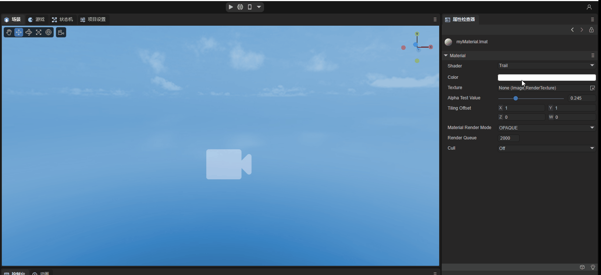

Animated Figure 2-1-5-1-1

#### (2) Texture

Used to set the trail's shape. In Animated Figure 2-1-5-2-2, we add Figure 2-1-5-2-1 as a texture. The trail shader uses ADDITIVE mode to achieve transparent superposition effect:

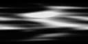

Figure 2-1-5-2-1

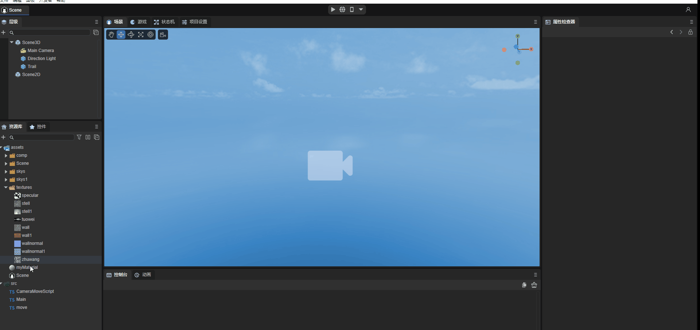

Animated Figure 2-1-5-2-2

#### (3) AlphaTestValue

The trail shader only uses ADDITIVE and ALPHABLENDED modes, so this value is invalid here.

#### (4) TilingOffset

Can be used to set UV scaling and offset during texture sampling, achieving texture scaling and offset effects.

#### (5) MaterialRenderMode

The trail shader only uses ADDITIVE and ALPHABLENDED modes:

ADDITIVE: Transparent superposition mode, superimposes all alpha values of pixels behind to achieve a transparent effect.

ALPHABLENDED: Same blending mode as transparent mode, the difference is that it doesn't blend with fog in the scene. This mode won't produce ADDITIVE's transparent effect.

#### (6) RenderQueue

Can be used to set the render queue of the material shader. The larger the RenderQueue, the later it renders. Generally, after setting the material's render mode, the render queue is set according to the render mode.

OPAQUE mode corresponds to queue 2000;

CUTOUT mode corresponds to queue 2450;

TRANSPARENT mode corresponds to queue 3000;

ADDITIVE mode corresponds to queue 3000;

ALPHABLENDED mode corresponds to queue 3000;

The trail shader only uses ADDITIVE and ALPHABLENDED modes, so set this to 3000.

#### (7) Cull

Culls based on different connection orders of face vertices (clockwise or counterclockwise).

Off: Disable culling

Back: Cull back faces

Front: Cull front faces

### 2.1.6 SkyBox Shader

The skybox shader is used to set the scene's skybox style. The skybox needs a cubemap for sampling. We first need to create a new cubemap and set textures according to the skybox's up, down, left, right, front, and back faces, as shown in Animated Figure 2-1-6-1:

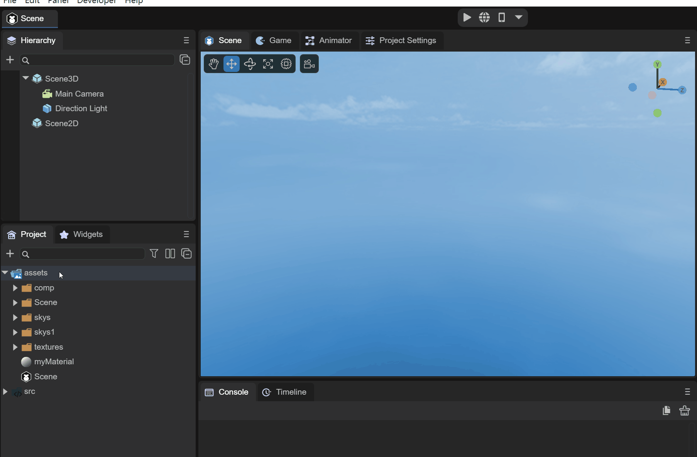

Animated Figure 2-1-6-1

To set the skybox, we need to modify the Scene3D's skybox material, as shown in Animated Figure 2-1-6-2:

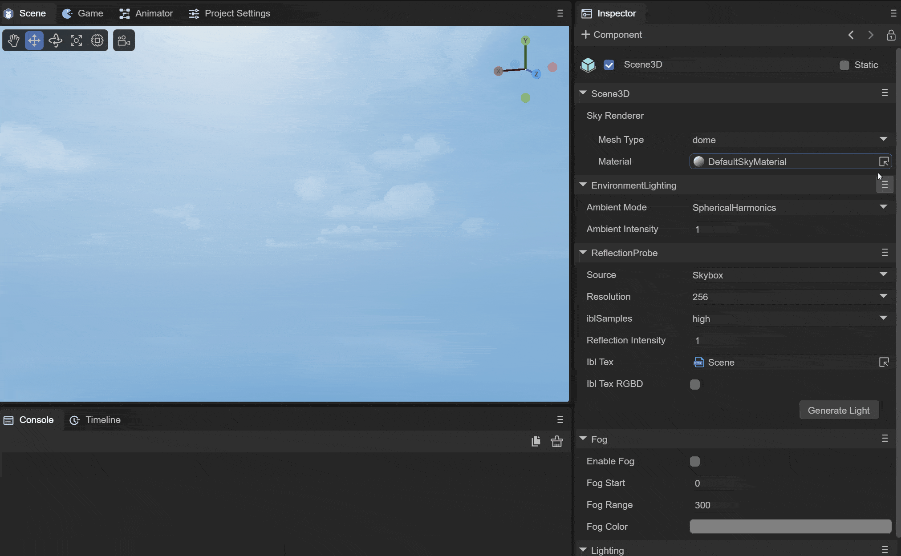

Animated Figure 2-1-6-2

#### (1) TintColor

Superimposes color onto the skybox. As shown in Figure 2-1-6-1-1, setting a light red color makes the entire sky reddish:

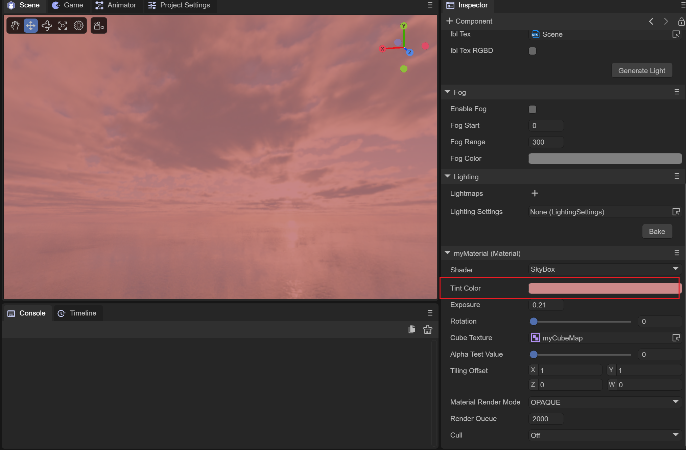

Figure 2-1-6-1-1

#### (2) Exposure

Used to set the skybox's exposure. When exposure is 0, the skybox is black. As the exposure value increases, it gradually displays the normal cubemap color, then due to overexposure, the entire skybox becomes white. As shown in Animated Figure 2-1-6-2-1:

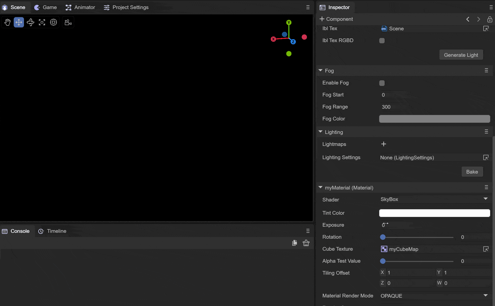

Animated Figure 2-1-6-2-1

#### (3) Rotation

Can rotate the cubemap 0-360 degrees around the y-axis.

#### (4) CubeTexture

Used to set the skybox's sampling texture. Needs to use a CubeMap type cubemap.

#### (5) AlphaTestValue

This value doesn't take effect when switching to CUTOUT mode on the skybox shader.

#### (6) TilingOffset

Since a cubemap is used, this value doesn't take effect on the skybox shader.

#### (7) MaterialRenderMode

On the skybox shader, setting to CUTOUT, TRANSPARENT, ADDITIVE, or ALPHABLENDED modes doesn't take effect.

#### (8) RenderQueue

Can be used to set the render queue of the material shader. The larger the RenderQueue, the later it renders. Generally, after setting the material's render mode, the render queue is set according to the render mode.

OPAQUE mode corresponds to queue 2000;

CUTOUT mode corresponds to queue 2450;

TRANSPARENT mode corresponds to queue 3000;

ADDITIVE mode corresponds to queue 3000;

ALPHABLENDED mode corresponds to queue 3000;

Since the skybox material's render mode only takes effect in OPAQUE mode, setting it to 2000 is sufficient.

#### (9) Cull

Culls based on different connection orders of face vertices (clockwise or counterclockwise).

Off: Disable culling

Back: Cull back faces

Front: Cull front faces

### 2.1.7 SkyPanoramic Shader

The skybox panoramic texture shader uses a 2D panoramic texture to wrap the scene like a cubemap to achieve ambient light effects. The use of this material is the same as the skybox - just assign it directly to the 3D scene's skybox renderer.

#### (1) TintColor

Same function as the skybox shader, both superimpose a color onto the panoramic skybox.

#### (2) Rotation

Can set the skybox's rotation angle around the Y-axis, between 0-360.

#### (3) PanoramicTexture

The panoramic texture needs a 2D texture using latitude and longitude in a cylindrical style.

#### (4) AlphaTestValue

Since only OPAQUE mode takes effect on the panoramic skybox shader, this value is invalid in CUTOUT mode.

#### (5) TilingOffset

Since a 2D texture is used to implement the cubemap approach, this value is invalid.

#### (6) MaterialRenderMode

Only OPAQUE mode takes effect in panoramic skybox mode.

#### (7) RenderQueue

Can be used to set the render queue of the material shader. The larger the RenderQueue, the later it renders. Generally, after setting the material's render mode, the render queue is set according to the render mode.

OPAQUE mode corresponds to queue 2000;

CUTOUT mode corresponds to queue 2450;

TRANSPARENT mode corresponds to queue 3000;

ADDITIVE mode corresponds to queue 3000;

ALPHABLENDED mode corresponds to queue 3000;

Since only OPAQUE mode takes effect, set this to 2000.

#### (8) Cull

Culls based on different connection orders of face vertices (clockwise or counterclockwise).

Off: Disable culling

Back: Cull back faces

Front: Cull front faces

### 2.1.8 SkyProcedural Shader

Procedural skybox, simulates the sky by setting sun parameters.

#### (1) U_SunSize

The sun's disk size setting. As shown in Figure 2-1-8-1-1, setting sun size to 0.1:

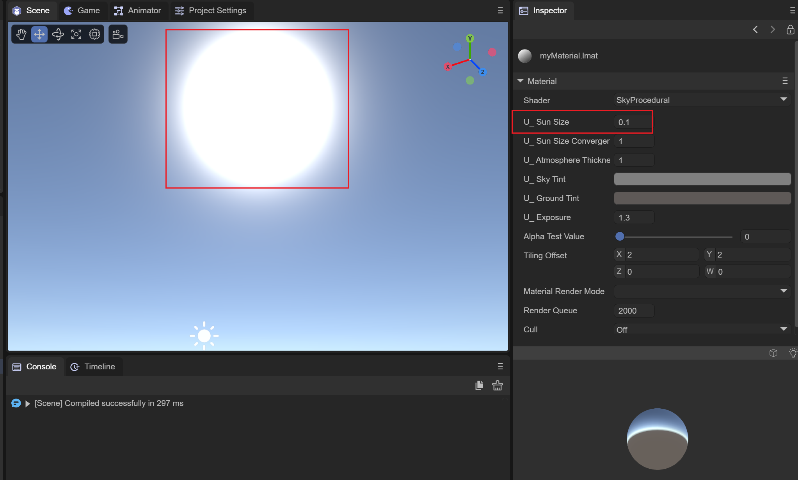

Figure 2-1-8-1-1

#### (2) Sun

Used to set the procedural skybox's sun type. There are three types:

##### SUN_NONE

No sun. After selecting this mode, no sun is displayed on the skybox.

##### SUN_HIGH_QUALITY

High-quality sun simulation. In this mode, the sun's divergence and convergence can be adjusted.

##### SUN_SIMPLE

Simple sun simulation. Can only adjust the sun's overall size.

#### (3) U_SunSizeConvergence

The sun's size convergence. The smaller the value, the larger the overall sun disk. Only takes effect in SUN_HIGH_QUALITY mode. As shown in Animated Figure 2-1-8-3-1:

Animated Figure 2-1-8-3-1

#### (4) U_AtmosphereThickness

Atmospheric density. Higher density atmosphere absorbs more color. As shown in Figure 2-1-8-4-1 at density 1, and Figure 2-1-8-4-2 at density 2:

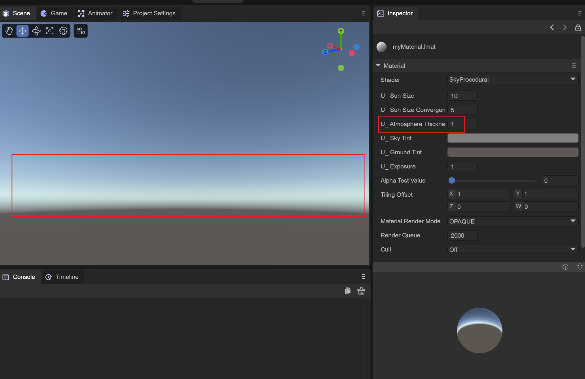

Figure 2-1-8-4-1

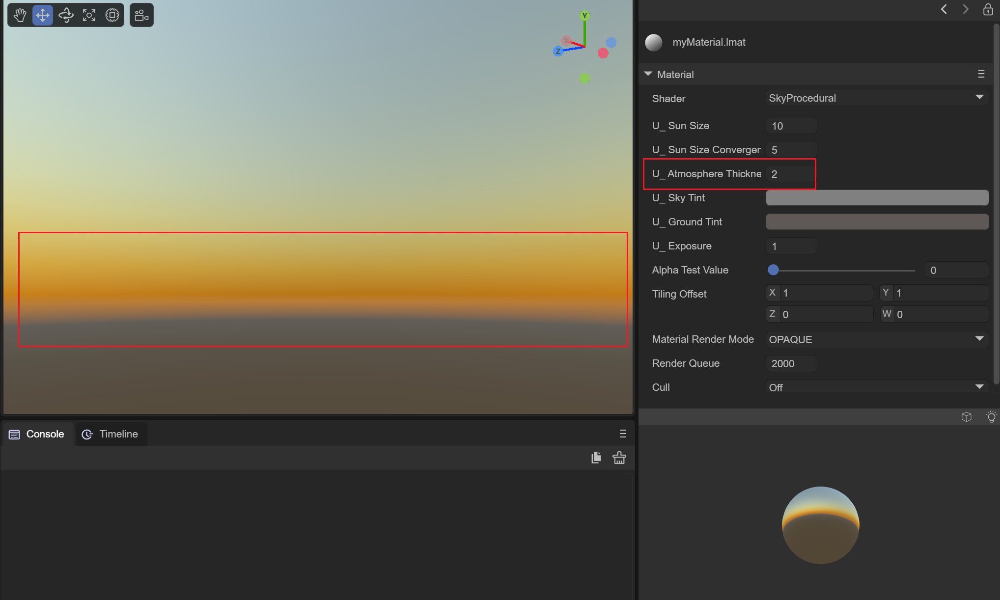

Figure 2-1-8-4-2

#### (5) U_SkyTint

Sets the sky color above the horizon.

#### (6) U_GroundTint

Sets the ground color below the horizon.

#### (7) U_Exposure

Sets the skybox's brightness through the exposure value. As shown in Animated Figure 2-1-8-7-1:

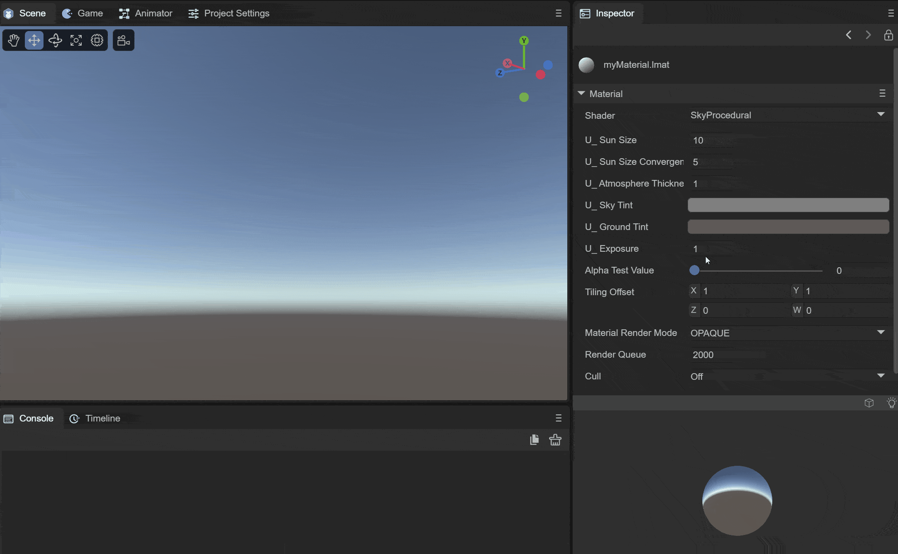

Animated Figure 2-1-8-7-1

#### (8) AlphaTestValue

Since the procedural skybox only uses OPAQUE, this value is invalid.

#### (9) TilingOffset

Since the procedural sky has no texture, this value is also invalid.

#### (10) MaterialRenderMode

Only takes effect in OPAQUE mode.

#### (11) RenderQueue

Can be used to set the render queue of the material shader. The larger the RenderQueue, the later it renders. Generally, after setting the material's render mode, the render queue is set according to the render mode.

OPAQUE mode corresponds to queue 2000;

CUTOUT mode corresponds to queue 2450;

TRANSPARENT mode corresponds to queue 3000;

ADDITIVE mode corresponds to queue 3000;

ALPHABLENDED mode corresponds to queue 3000;

Since the procedural skybox only takes effect in OPAQUE mode, set to 2000.

#### (12) Cull

Culls based on different connection orders of face vertices (clockwise or counterclockwise).

Off: Disable culling

Back: Cull back faces

Front: Cull front faces

## 2.2 Material Effect Display

The material effect display is mainly used to show the material effect after setting properties. You can use the mouse to interact here to operate the material ball's effect in different directions.

### 2.2.1 Switching Materials of Different Meshes

You can switch the material's effect under different meshes by clicking the square button on the right, as shown in Animated Figure 2-2-1:

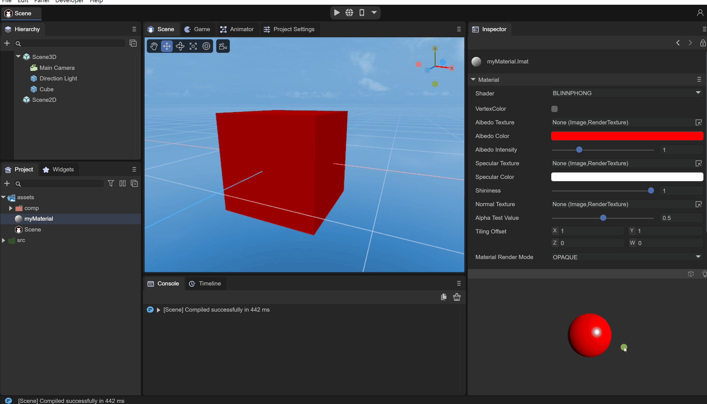

Animated Figure 2-2-1

### 2.2.2 Turning Off Lighting Effects

You can switch the material's effect between lit and unlit by clicking the light bulb button on the right, as shown in Animated Figure 2-2-2:

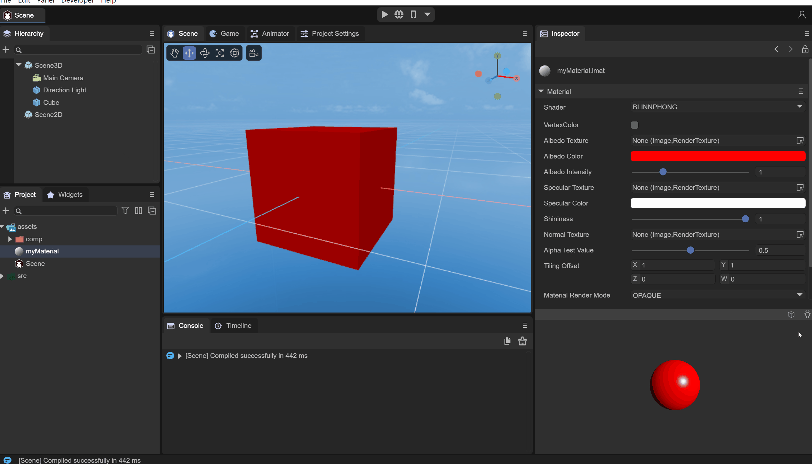

Animated Figure 2-2-2

# 3. Material Usage

After we adjust the material's properties to the desired effect, we can assign the material to objects in the scene. There are two methods to set an object's material, as shown in Animated Figure 3-1 and Animated Figure 3-2:

Animated Figure 3-1

The above Animated Figure 3-1 shows directly dragging the material onto an object in the Scene window. Alternatively, as shown in Animated Figure 3-2, you can select the corresponding material on the object's renderer.

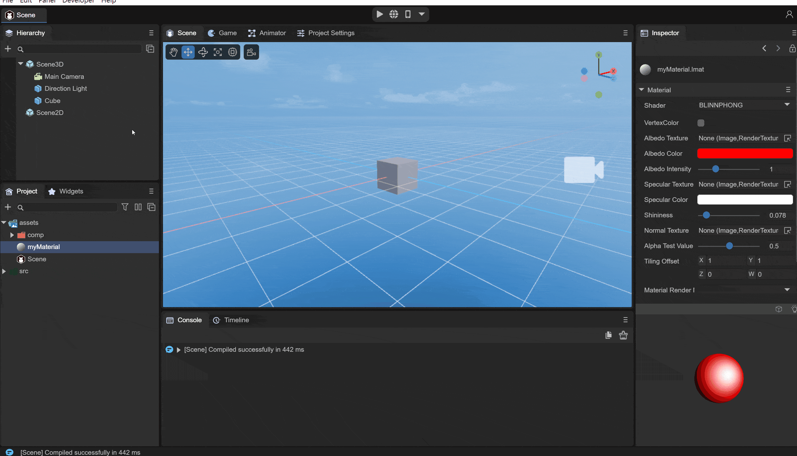

Animated Figure 3-2
