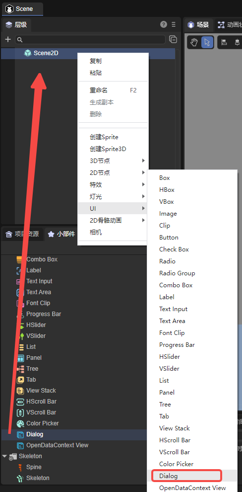
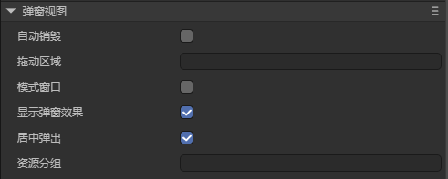
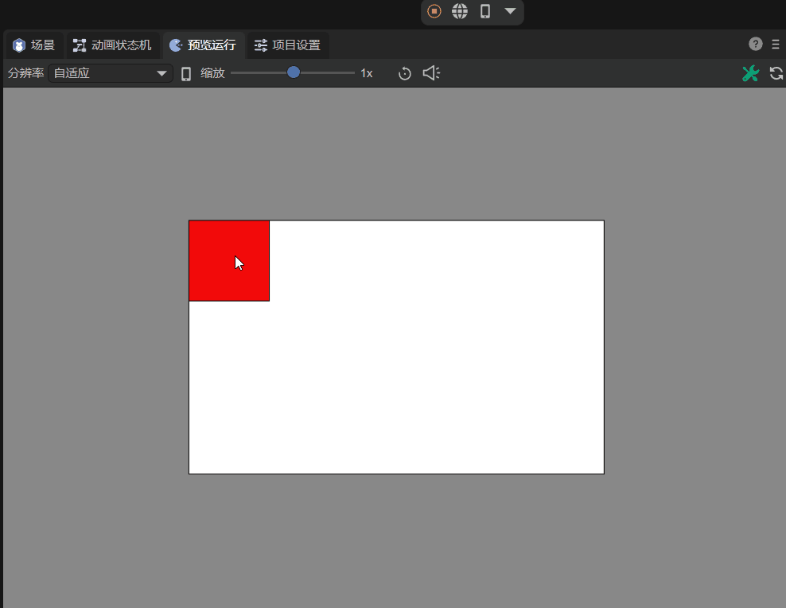
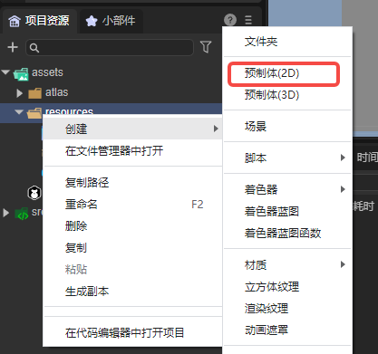
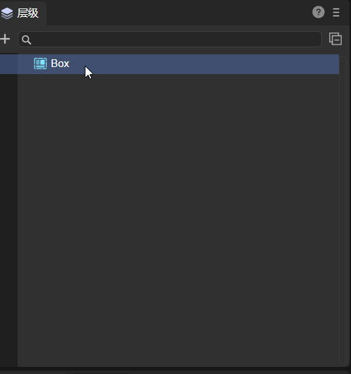
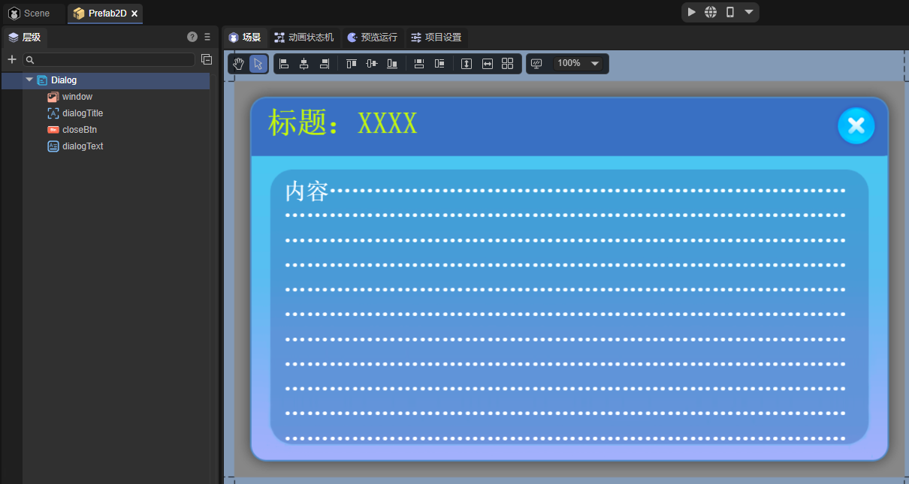
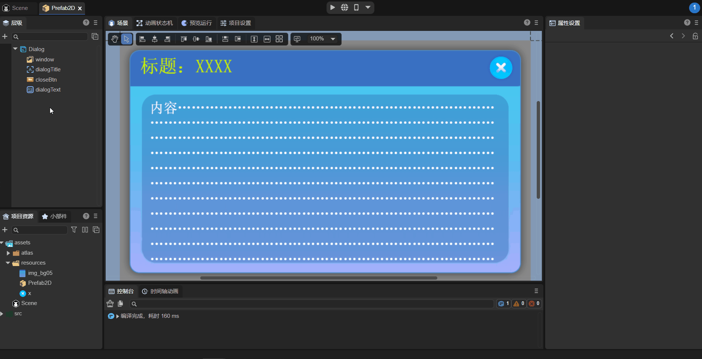

# Dialog View Component (Dialog)

Dialog is a popup view component, mainly used for popup panels.

## 1. Creating Dialog through LayaAir IDE

### 1.1 Creating Dialog

As shown in Figure 1-1, click to select the Dialog component in the widget panel, drag it to the page editing area, or create it by right-clicking in the hierarchy window to add the Dialog component to the page.



(Figure 1-1)

### 1.2 Dialog Property Introduction

Dialog's unique properties are as follows:



(Figure 1-2)

| Property | Function |
| -------------------------------- | ------------------------------------------------------------ |
| Auto Destroy **autoDestoryAtClosed** | Whether to automatically destroy after the popup view is closed (destroy node and used resources). Default is false. This property is inherited from the scene class. |
| Drag Area **dragArea** | Drag area (format: x,y,width,height). Default value is "0,0,0,0" |
| Modal Window **isModal** | Whether it's a modal window. Default is false. When it's a modal window, clicking the popup's blank area can automatically close the popup |
| Show Popup Effect **isShowEffect** | Whether to show popup effect. Default is enabled. When false, there's no popup effect, and the popup displays directly |
| Center Popup **isPopupCenter** | Specifies whether the dialog pops up centered. Default is true. When false, it pops up with the top-left corner's coordinate origin |
| Resource Group **group** | Set the resource group identifier. After setting, resources can be loaded or cleaned up by group |

After setting the dragArea property, you can drag the Dialog within the set value range. Setting it to "0,0,100,100", the effect is shown in Animated Figure 1-3. The red area is the draggable area. After setting, you can only drag within the set values. Dragging outside the set value range is invalid.



(Animated Figure 1-3)

### 1.3 Script Control of Dialog

#### 1.3.1 Creating Popup

Dialog's popup effect needs to use it as a root node. You can create a 2D prefab Prefab2D in the project resource panel. As shown in Figure 1-4.



(Figure 1-4)

Double-click Prefab2D to enter the editing interface. Right-click on the root node, select "Convert Node Type", and select `UI->Dialog`. As shown in Animated Figure 1-5.



(Animated Figure 1-5)

Then, in the prefab's editing interface, you can create the popup page. The created effect is shown in Figure 1-6.



(Figure 1-6)

> The UI image resources in the figure are from the "2D Introduction Example".

#### 1.3.2 Setting Close Button

In the popup page, there's a close button (closeBtn) that needs a script added to implement the logic of closing the page. As shown in Animated Figure 1-7, check closeBtn's define variable option, then double-click Prefab2D's "UI Runtime" to create a UI component script.



(Animated Figure 1-7)

After saving the scene, add the following code in RuntimeScript.ts:

```typescript
const { regClass } = Laya;
import { RuntimeScriptBase } from "./RuntimeScript.generated";

@regClass()
export class RuntimeScript extends RuntimeScriptBase {
    // This method is executed when the component is activated
    onEnable(): void {
        // Listen for close button click event
        this.closeBtn.on(Laya.Event.CLICK, this, () => {
            // Close the current dialog
            this.owner.close();
        });
    }
}
```

This way, when the close button is clicked, the popup window will close.
