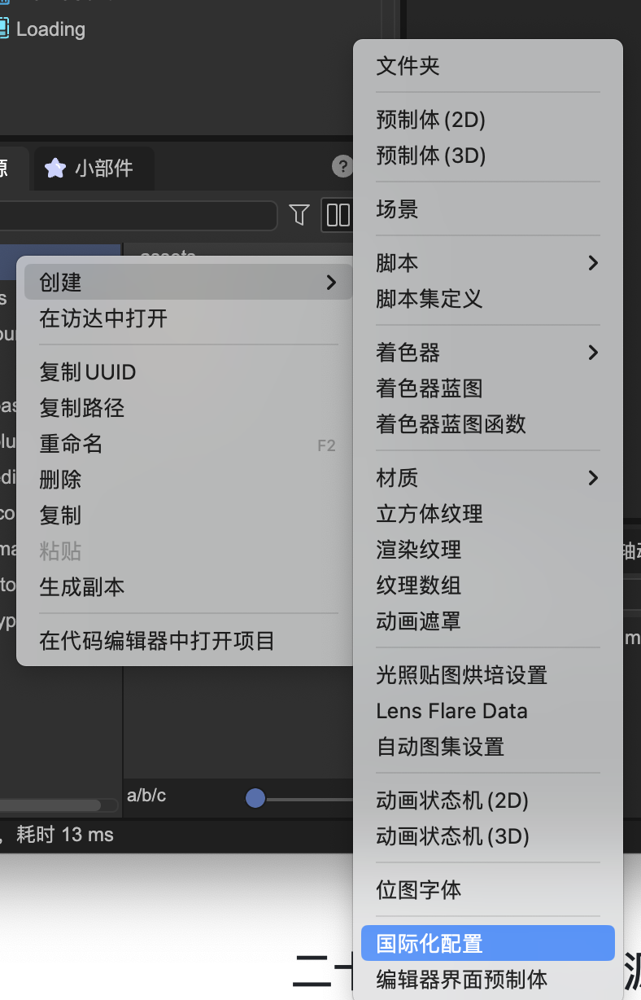
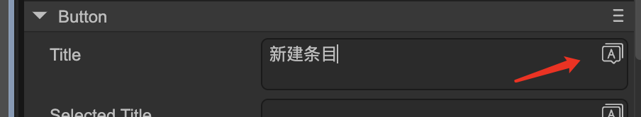
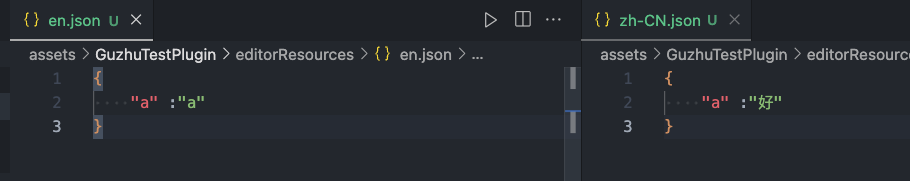

# Internationalization (i18n)

Author: Gu Zhu

This UI system provides built-in internationalization (i18n) functionality, allowing your UI to easily support multiple languages.

## Setting up an i18n configuration file

First, create a new i18n configuration file. This file should be placed in the same directory as your UI prefabs or in a parent directory. Examples are shown in Figures 1-1 and 1-2:

  
(Figure 1-1)  

  
(Figure 1-2)  

### Key properties of the i18n configuration file

* **Identifier**: A unique ID for the i18n file, automatically generated and cannot be changed. If you need to modify it, you can do so manually by editing the file as text, but you must ensure the ID remains unique. Changing it will break any existing bindings to UI components.
* **Scope**: Can be used at runtime or for editor extensions. Usually, the default runtime scope is sufficient.
* **Default Language ID**: The language used when designing prefabs in the editor. For example, if you designed your UI in Chinese, this would be `zh-CN`; if in English, `en`. If the runtime language matches this default, the text on the UI will be used directly without looking up a translation file.
* **Fallback Language ID**: If no matching translation is found for the runtime language, the fallback language will be used. For example, if the runtime language is German (`de`) but no German translation exists, the system will use the fallback language (e.g., `en`).
* **Translation Reference**: Usually used to automatically collect text from your UI and generate a reference file. This reference can then be translated into multiple languages and added to the translation file list. The reference file itself does not need to be in the translation file list, as it only contains existing UI text.

### Collecting text

Clicking **Collect Text** will scan all prefab files in the directory of the i18n file (and its subdirectories), extract all text that needs translation, and convert it into an internationalized format. If no reference file exists, one will be automatically created.

### Synchronization

After collecting text, clicking **Sync** will align all translation files with the reference file. For example, if you add a new text `"abc"` to the UI, it will be added to the reference file. Clicking **Sync** will also add `"abc"` to all translation files.

### Manual configuration

You can also manually assign i18n keys to UI elements, such as a button title (Figures 1-3 and 1-4).

  
(Figure 1-3)  

  
(Figure 1-4)  

Select or create a new entry from the language file. After selection, the input field will display the assigned key (Figure 1-5).

  
(Figure 1-5)  

The green bar indicates that the text is now fully internationalized.

**Once the UI is internationalized, language adaptation is automatic and requires no code intervention.**

### Code-level internationalization

For text displayed in code (not in the UI), it is recommended to use a separate configuration file. After creating multiple translation files, drag them into the translation file list. Keys must be manually synchronized.

The translation reference feature can be ignored for code-only text (Figure 1-6).

  
(Figure 1-6)  

Example usage in code:

```TypeScript
let myI18n: Laya.Translations;

myI18n = await Laya.loader.load("editorResources/i18nSettings.i18ns");
console.log(myI18n.t("a"));
```

For small amounts of text used only in code, you can create translations entirely in code:

```TypeScript
// The first parameter must be globally unique
let myI18n = Laya.Translations.create("LodSimplify");

myI18n.setContent("zh-CN", {
    meshRate : "Model Compression Ratio",
    meshRateTips : "Compress model mesh by the set ratio 2x"
});

console.log(myI18n.t("meshRate", "Mesh Rate"));
```

You can call `setContent` multiple times to add different languages. The following example adds English translations, so the `t` function can omit the default value:

```TypeScript
let myI18n = Laya.Translations.create("LodSimplify", "en");

myI18n.setContent("zh-CN", {
    meshRate : "Model Compression Ratio",
    meshRateTips : "Compress model mesh by the set ratio 2x"
}).setContent("en", {
    meshRate: "Mesh Rate2",
    meshRateTips: "Compress the model mesh based on the set ratio."
});

console.log(myI18n.t("meshRate"));
```
