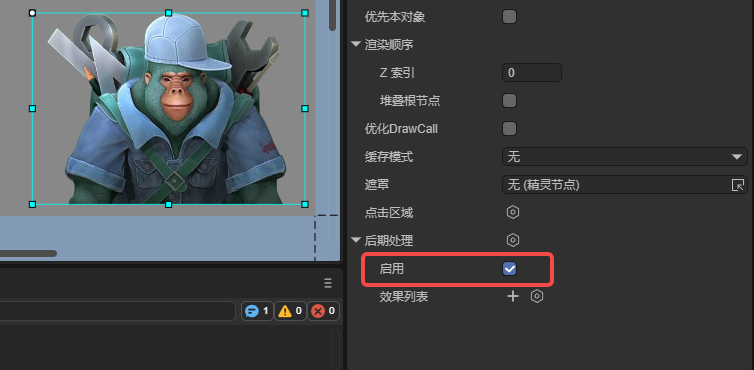
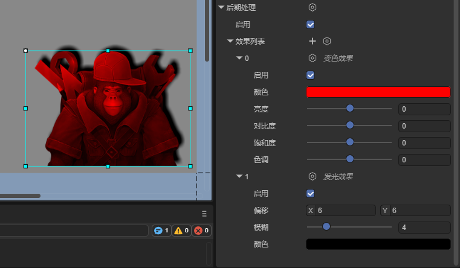
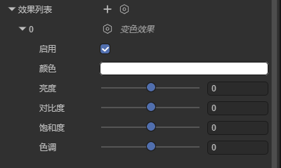
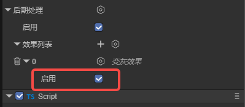
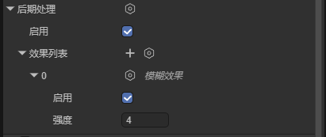
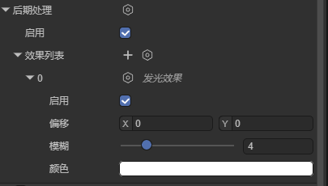

# Post-Processing

## 1. Overview

Post-processing is mainly used to implement various special effects on images to achieve the best artistic results. Through post-processing, we can use one art asset to achieve different effects. The 2D post-processing effects supported in the engine include color effect, grayscale effect, blur effect, and glow effect.

### 1.1 Creating Post-Processing Effects

Select a node and create a post-processing instance, then add post-processing effects in the effect list. After creation is complete, you can see the effect:


The enable attribute on the post-processing instance determines whether post-processing takes effect. This attribute affects every effect and is checked by default:



### 1.2 Adding Multiple Post-Processing Effects

A node can have multiple post-processing effects added, and one type of post-processing effect can also be added repeatedly to a node. These post-processing effects will superimpose on each other and take effect simultaneously:



## 2. Color Effect

ColorEffect2D is a color effect. By setting different parameters, the color effect can present different styles and effects without changing the general style of the image. During actual runtime, the color effect doesn't deform the node but only changes effects like brightness, contrast, saturation, hue, etc. Proper use of color effects can correct issues like abnormal image exposure.

### 2.1 Basic Attributes

As shown in the figure, the color effect has the following attributes:



**Enable**: Whether to enable this effect.

**Color**: Adjust the overall color tendency of the image.

**Brightness**: Control the brightness level of the image.

**Contrast**: Adjust the intensity of brightness differences.

**Saturation**: Control the vividness of colors.

**Hue**: Change the position of colors on the color wheel.

### 2.2 Code Implementation

We can also create a color effect through code. An example is as follows:

```typescript
const { regClass, property } = Laya;

@regClass()
export class Script extends Laya.Script {
    // Get node
    @property(Laya.Sprite)
    public sp: Laya.Sprite;

    onAwake(): void {
        // Create post-processing instance
        this.sp.postProcess = new Laya.PostProcess2D();
        // Create color effect
        let colorEffect2D = new Laya.ColorEffect2D();
        // Create post-processing effect array
        let effectGroup: Laya.PostProcess2DEffect[] = [];
        // Add color effect to post-processing effect array
        effectGroup.push(colorEffect2D);
        // Add post-processing effect array to the post-processing instance on the node
        this.sp.postProcess.effects = effectGroup;

        // Set color, brightness, contrast, saturation, hue in sequence
        colorEffect2D.color(0.5, 0.5, 0.5, 1);
        colorEffect2D.adjustBrightness(30);
        colorEffect2D.adjustContrast(8);
        colorEffect2D.adjustSaturation(30);
        colorEffect2D.adjustHue(-15);
    }
}
```

## 3. Grayscale Effect

The grayscale effect is a special usage of the color effect. When using this effect, developers don't need to set various attributes themselves; the engine will set them automatically. This effect is generally used to indicate that the node is in a disabled state, etc. When a UI component checks the display grayscale or disable mouse event attributes, the engine will automatically create a grayscale effect.

### 3.1 Basic Attributes

In the IDE, the grayscale effect only has the enable attribute that can be set:



### 3.2 Code Implementation

We can create a grayscale effect through code. An example is as follows:

```typescript
const { regClass, property } = Laya;

@regClass()
export class Script extends Laya.Script {
    // Get node
    @property(Laya.Sprite)
    public sp: Laya.Sprite;

    onAwake(): void {
        // Create post-processing instance
        this.sp.postProcess = new Laya.PostProcess2D();
        // Create grayscale effect
        let grayEffect2D = new Laya.GrayscaleEffect2D();
        // Create post-processing effect array
        let effectGroup: Laya.PostProcess2DEffect[] = [];
        // Add grayscale effect to post-processing effect array
        effectGroup.push(grayEffect2D);
        // Add post-processing effect array to the post-processing instance on the node
        this.sp.postProcess.effects = effectGroup;
    }
}
```

## 4. Blur Effect

The blur effect is a commonly used image processing technique that creates a blurred or hazy effect by reducing image details and noise.

### 4.1 Basic Attributes

As shown in the figure, the blur effect has two basic attributes:



**Enable**: Whether to enable this effect.

**Strength**: The intensity of the blur effect. The larger the value, the less clear the image.

### 4.2 Code Implementation

We can create a blur effect through code. An example is as follows:

```typescript
const { regClass, property } = Laya;

@regClass()
export class Script extends Laya.Script {
    // Get node
    @property(Laya.Sprite)
    public sp: Laya.Sprite;

    onAwake(): void {
        // Create post-processing instance
        this.sp.postProcess = new Laya.PostProcess2D();
        // Create blur effect
        let blurEffect2D = new Laya.BlurEffect2D();
        // Create post-processing effect array
        let effectGroup: Laya.PostProcess2DEffect[] = [];
        // Add blur effect to post-processing effect array
        effectGroup.push(blurEffect2D);
        // Add post-processing effect array to the post-processing instance on the node
        this.sp.postProcess.effects = effectGroup;

        // Set blur effect strength
        blurEffect2D.strength = 10;
    }
}
```

## 5. Glow Effect

The glow effect is used to add a halo effect to a node, which can create a ring of light at the node's edge.

### 5.1 Basic Attributes

As shown in the figure, the glow effect has the following basic attributes:



**Enable**: Whether to enable this effect.

**Offset**: The offset of the glow effect compared to the node. The image below shows a comparison between not setting offset and setting offset.


**Blur**: The edge blur size of the glow effect. The larger the value, the blurrier the edge.

**Color**: The color of the glow filter. Through color and offset, you can create effects similar to shadows:


### 5.2 Code Implementation

We can create a glow effect through code. An example is as follows:

```typescript
const { regClass, property } = Laya;

@regClass()
export class Script extends Laya.Script {
    // Get node
    @property(Laya.Sprite)
    public sp: Laya.Sprite;

    onAwake(): void {
        // Create post-processing instance
        this.sp.postProcess = new Laya.PostProcess2D();
        // Create glow effect
        let glowEffect2D = new Laya.GlowEffect2D();
        // Create post-processing effect array
        let effectGroup: Laya.PostProcess2DEffect[] = [];
        // Add glow effect to post-processing effect array
        effectGroup.push(glowEffect2D);
        // Add post-processing effect array to the post-processing instance on the node
        this.sp.postProcess.effects = effectGroup;

        // Set offset, blur, color values in sequence
        glowEffect2D.offsetX = 10;
        glowEffect2D.offsetY = 10;
        glowEffect2D.blur = 5;
        glowEffect2D.color = "#33ff00ff"
    }
}
```
