# Radio Button Group Component (RadioGroup)

RadioGroup is a radio button group. Component options within the button group are mutually exclusive. Users can only select one Radio component at a time. As shown in Animated Figure 1.

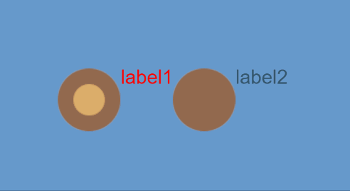

(Animated Figure 1)

The difference between Radio and RadioGroup is that Radio is a single radio button, while RadioGroup can increase radio buttons by modifying the labels property. For detailed usage of the RadioGroup component, please refer to [RadioGroup API](https://layaair.com/3.x/api/Chinese/index.html?version=3.0.0&type=2D&category=UI&class=laya.ui.RadioGroup).

## 1. Creating RadioGroup Component through LayaAir IDE

### 1.1 Creating RadioGroup

As shown in Figure 1-1, click to select the RadioGroup component in the widget panel, drag it to the page editing area, or create it by right-clicking in the hierarchy window to add the RadioGroup component to the page.

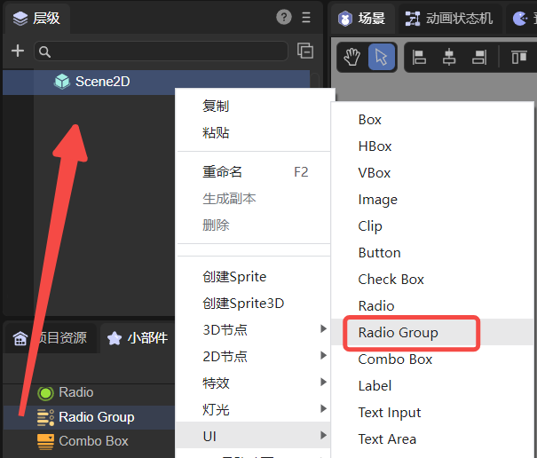

(Figure 1-1)

The default skin resources for the RadioGroup component are shown below:

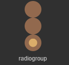

(Figure 1-2)

> The RadioGroup component's skin cannot use the SizeGrid property, so the actual application size should be determined during resource design.

### 1.2 RadioGroup Properties

RadioGroup's unique properties are as follows:

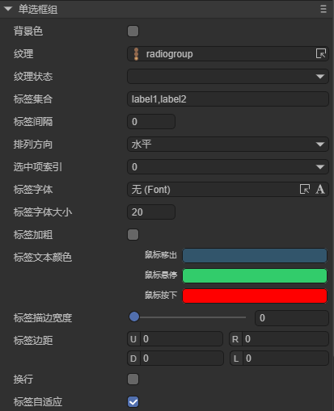

(Figure 1-3)

| Property | Function Description |
| ---------------------------------- | ------------------------------------------------------------ |
| Background Color **bgColor** | Radio button group background color. After checking, you can directly input a color value, for example: `#ffffff`, or click the color picker on the right side of the input bar to select a color |
| Texture **skin** | The radio button's skin texture resource. After setting, you need to set stateNum skin state count according to the skin resource |
| Texture State **stateNum** | The number of states for the radio button skin. Supports single state (1), two states (2), and three states (3) |
| Labels Collection **labels** | Text label collection for the radio button group. The number of radio buttons in the radio button group can be determined based on the number of text labels |
| Label Spacing **space** | Spacing between radio buttons, in pixels |
| Arrangement Direction **direction** | Arrangement direction of radio buttons. There are two types: vertical (vertical arrangement) and horizontal (horizontal arrangement) |
| Selected Item Index **selectedIndex** | Selection index, default is -1. After setting, the radio button will maintain the selected state. The index quantity dynamically changes based on the labels quantity (radio button quantity) |
| Label Font **labelFont** | Font of text labels |
| Label Font Size **labelSize** | Font size of text labels |
| Label Bold **labelBold** | Whether text labels are bold. Default is false |
| Label Text Color **labelColors** | Text label colors in various states when the mouse is released on the element (up), when the mouse moves over the element (over), and when the mouse is pressed (down) |
| Label Stroke Width **labelStroke** | Stroke width of text labels, in pixels. Default value is 0, meaning no stroke |
| Text Stroke Color **labelStrokeColor** | Color of text label stroke, expressed as a string. Default value is #000000 (black) |
| Label Padding **labelPadding** | Padding of text labels. Format: top padding, right padding, bottom padding, left padding |
| Line Wrap **lineWrap** | Default is false. After checking, child items will wrap to display when exceeding the current node's width and height |
| Line Spacing **lineSpace** | Spacing distance after wrapping |

You can increase the number of radio buttons by setting the labels property. As shown in Animated Figure 1-4, the default radio button group has only two radio buttons. If you want to add radio buttons, just add new labels in the labels property. Modifying text label content is also set in this property.

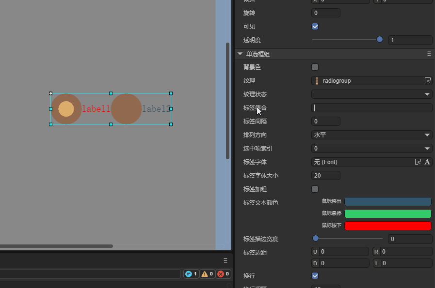

(Animated Figure 1-4)

You can also change the layout direction and spacing of the radio button group RadioGroup. RadioGroup defaults to horizontal layout (horizontal). By changing the direction property, you can achieve vertical layout (vertical). Setting spacing can be achieved through the space property. As shown in Figure 1-5.

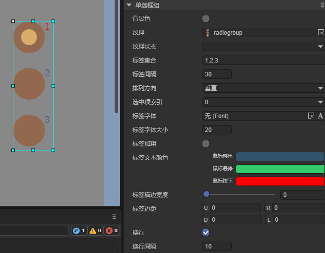

(Figure 1-5)

To set the default selected option of the radio button group RadioGroup, you need to set it through the selectedIndex property. This property changes the index value of the radio button group. When set to -1 by default, no option box is selected. Setting to 0 is the 1st radio button, 1 is the 2nd radio button, and so on. Assuming the property value is set to 1, the effect is shown in Figure 1-6.

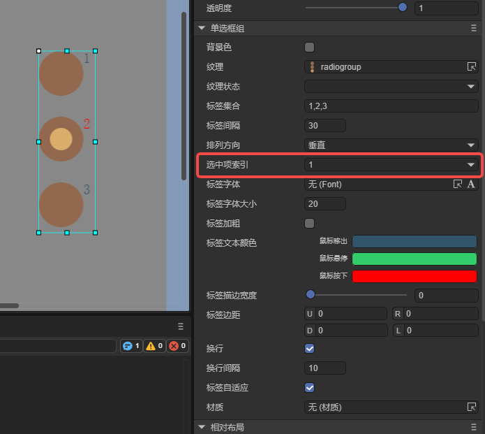

(Figure 1-6)

### 1.3 Script Control of RadioGroup

In Scene2D's property settings panel, add a custom component script. Then, drag RadioGroup into its exposed property entry. You need to add the following example code to implement script control of RadioGroup:

```typescript
const { regClass, property } = Laya;

@regClass()
export class NewScript extends Laya.Script {

    @property({ type: Laya.RadioGroup })
    public radiogroup: Laya.RadioGroup;

    //Executed after component is activated, at this time all nodes and components have been created. This method only executes once
    onAwake(): void {
        this.radiogroup.pos(100, 100);
        this.radiogroup.labels = "label0,label1,label2";
        this.radiogroup.space = 20;
        this.radiogroup.selectedIndex = 0;
        this.radiogroup.direction = "vertical";
    }
}
```

## 2. Creating Custom RadioGroup Components

In the previous section, we used the same radio button resource and generated three radio buttons in RadioGroup by setting labels. However, in actual games, there are different requirements for radio button styles in the same RadioGroup component. The method of setting through labels cannot complete this requirement. At this time, you need to use the custom RadioGroup component method. Here are the specific steps:

### 2.1 Prepare Art Resources

Use three different Radio art resources to form a custom RadioGroup component. The resources are shown in Figure 2-1.

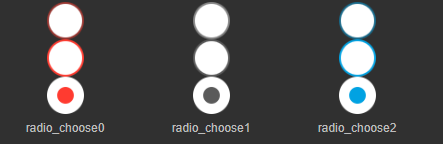

(Figure 2-1)

**Tips**:

Here, pay special attention to the naming rules for skin images. In custom RadioGroup components, you cannot use `RadioGroup` or `RadioGroup_` as a prefix for naming. Because you need to use the Radio radio button component as its child item component, the image resource naming in this example uses `radio_` as a prefix.

### 2.2 Creating Radio Components in IDE

Copy resources to the project's resource folder. Then, in the IDE, drag Radio components one by one to the scene editor, from left to right (or from top to bottom). Then modify each Radio component's name property in sequence to "item0, item1, item2....." (If you don't add name properties according to this rule, the generated RadioGroup component will be an invalid component and cannot run normally).

After setting the skin, text, size, position, and other properties of each Radio component, the effect is shown in Figure 2-2.

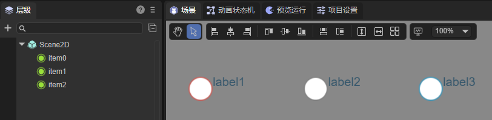

(Figure 2-2)

### 2.3 Convert to RadioGroup Container

After modifying child item properties, select all child components, right-click to bring up the settings panel, click `Convert to Container -> RadioGroup`, and finally convert to the RadioGroup container type. The steps are shown in Animated Figure 2-3.

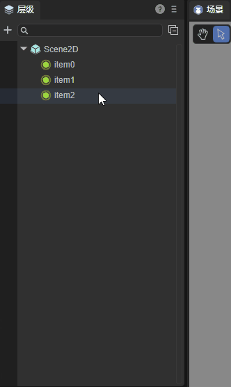

(Animated Figure 2-3)

After successful conversion, as shown in Figure 2-4, you need to ensure that the RadioGroup's skin property value is empty. This way, the three radio button styles in the same RadioGroup component are all different.

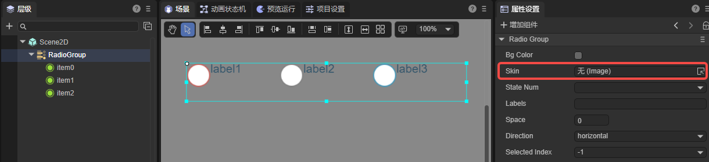

(Figure 2-4)

Developers can also adjust the RadioGroup component's properties. The final effect is shown in the following animated figure:

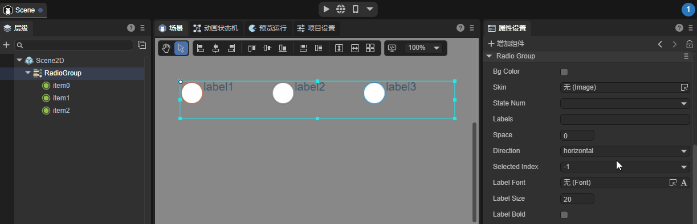

(Animated Figure 2-5)

## 3. Creating RadioGroup through Code

When writing code, it's unavoidable to control UI through code. Create a `UI_RadioGroup` class and set RadioGroup related properties through code. Example code is as follows:

```typescript
const { regClass, property } = Laya;

@regClass()
export class UI_RadioGroup extends Laya.Script {

    private SPACING: number = 150;
    private X_OFFSET: number = 200;
    private Y_OFFSET: number = 80;

    private skins: any[];

    constructor() {
        super();
    }

    // Executed after component is activated, at this time all nodes and components have been created. This method only executes once
    onAwake(): void {
        this.skins = ["resources/res/ui/radioButton (1).png", "resources/res/ui/radioButton (2).png", "resources/res/ui/radioButton (3).png"];
        Laya.loader.load(this.skins).then(() => {
            this.onLoadComplete();
        });
    }

    private onLoadComplete(e: any = null): void {
        for (let i: number = 0; i < this.skins.length; ++i) {
            let rg: Laya.RadioGroup = this.createRadioGroup(this.skins[i]);
            rg.selectedIndex = i;
            rg.x = i * this.SPACING + this.X_OFFSET;
            rg.y = this.Y_OFFSET;
        }
    }

    private createRadioGroup(skin: string): Laya.RadioGroup {
        let rg: Laya.RadioGroup = new Laya.RadioGroup();
        rg.skin = skin;
        rg.space = 70;
        rg.direction = "vertical";
        rg.labels = "Item1, Item2, Item3";
        rg.labelColors = "#787878,#d3d3d3,#FFFFFF";
        rg.labelSize = 20;
        rg.labelBold = true;
        rg.selectHandler = new Laya.Handler(this, this.onSelectChange);
        this.owner.addChild(rg);
        return rg;
    }

    private onSelectChange(index: number): void {
        console.log("You selected item " + (index + 1));
    }

}
```

The effect is shown in the figure:

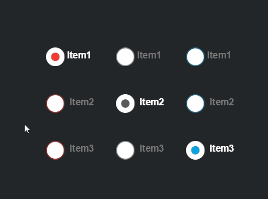

(Figure 3-1)
