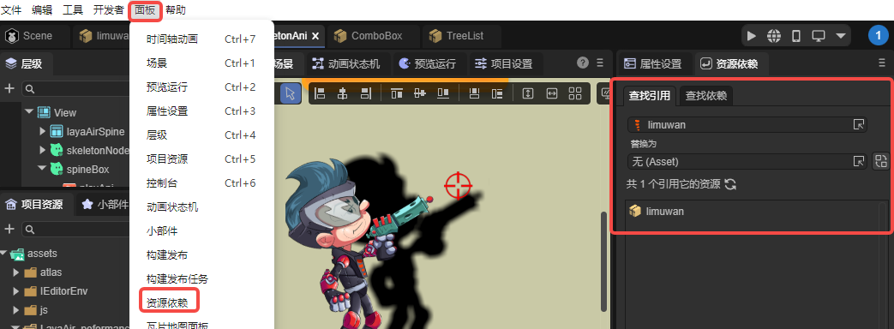
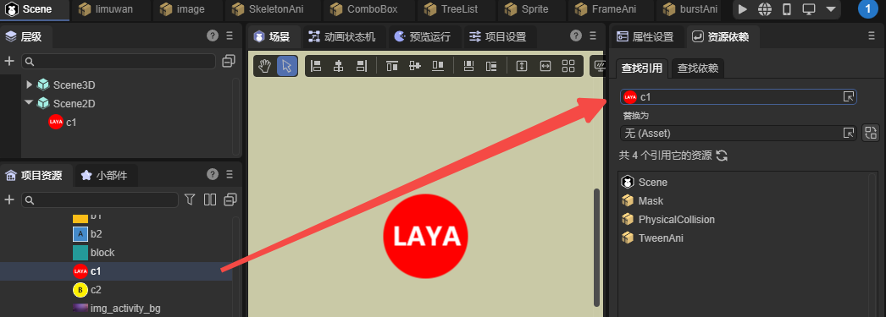
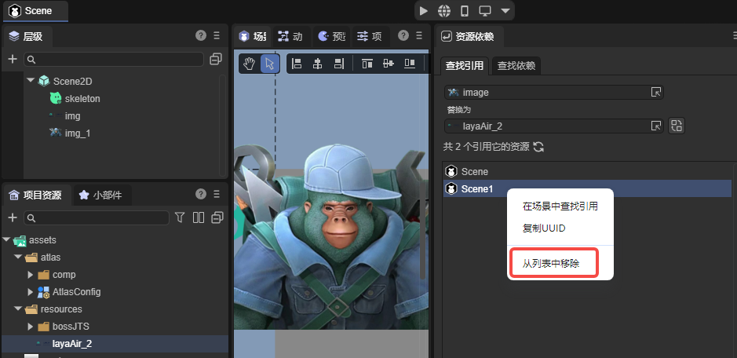

# Asset Dependency Panel

> Author: Charley

Asset Dependency is a built-in plugin tool newly added to `LayaAir3-IDE` in version 3.3.4, designed to help developers quickly analyze reference relationships between resources. Whether troubleshooting missing resources, cleaning up projects, replacing assets, or performing batch resource management, this tool can significantly improve project maintenance efficiency.

## 1. How to Open the Panel

The Asset Dependency panel is located by default on the right side of the property settings panel. If closed, it can be reopened through the top menu bar "Panel → Asset Dependency", as shown in Figure 1-1.



(Figure 1-1)

You can also right-click on any resource in the project resource panel and select **"Find References"** to jump directly to the Asset Dependency panel, as shown in Figure 1-2.


(Figure 1-2)

## 2. Finding References

### 2.1 Finding Where Resources Are Referenced

In projects, resource reference relationships are usually very complex. A texture, animation, or material may be deeply nested in multiple scenes and prefabs. Without understanding what's using a resource, you can't safely modify, replace, or delete it.

The "Find References" feature can quickly generate a clear reference list, allowing you to accurately determine whether a resource is still in use, whether it might be accidentally deleted, and whether it needs unified replacement. This feature is particularly critical for maintaining large projects.

In actual use, you can select a resource in the resource panel and right-click "Find References," or drag the resource into the reference input box. The system will immediately list all scenes, prefabs, animations, etc. that reference this resource, as shown in Figure 2-1.



(Figure 2-1)

### 2.2 Finding Lost Resource References

"Find References" can not only be used to analyze existing resources but also help locate already lost resources.

For example, when a resource has been deleted, a component's resource property may only have a `UUID` remaining. Just right-click copy the `UUID` in the property **input box**, paste it into the "Find References" input box, and you can find all places referencing this lost resource, as shown in Figure 2-2.


(Figure 2-2)

### 2.3 Batch Replace Resources

Whether replacing lost resources or performing resource upgrades, the replace feature in "Find References" can quickly complete the operation.

We only need to select or drag a new resource into the "Replace with" resource input box, then click the replace button on the right side of the resource input box, as shown in Figure 2-3, to batch replace all references in the result list.


(Figure 2-3)

If you don't want certain references to participate in replacement, you can select the corresponding entry in the list, right-click and select **"Remove from List"**, to exclude it from the replacement scope, as shown in Figure 2-4, making the replacement process safer and more flexible.



(Figure 2-4)

## 3. Finding Dependencies

### 3.1 Finding Dependencies

Another important feature of Asset Dependency, **"Find Dependencies"**, analyzes resource dependency chains in the reverse direction, helping developers quickly understand resource composition.

For example, which textures, materials, models, script files, etc. a prefab depends on. As shown in Figure 3-1.


(Figure 3-1)

The panel lists all dependencies in a list format, helping to evaluate the number of resources and textures, scripts, etc., and troubleshoot issues with abnormal missing or duplicate dependencies.

### 3.2 Finding References in Scene

Sometimes, through finding dependencies, we find all resources that a scene depends on. However, because nodes have been renamed, resource names don't match node names. When a scene has many nodes and complex structures, quickly finding all nodes corresponding to a resource isn't easy.

At this point, you can right-click on a resource entry in the dependency result list and select "Find References in Scene" to list all nodes that reference this resource in the currently open scene hierarchy panel, as shown in Figure 3-2.


(Figure 3-2)

## 4. Plugin Interface Usage

In addition to the built-in `IDE` operations, the `LayaAir3-IDE` plugin system also provides corresponding `APIs`, including query dependencies (`queryDependency`), query references (`queryReference`), and replace references (`replaceReference`). These interfaces are all located in the core class `IEditorEnv.AssetDependencyTool`, making it convenient for developers to use related features in their own plugins.

Example code is as follows:

```typescript
let result = await IEditorEnv.AssetDependencyTool.queryReference([
    "45897bb8-a4bd-4607-a70e-ba1a7546882f"
]);
```
