# Overview of Main IDE Modules

IDE is the English abbreviation for Integrated Development Environment. LayaAir3-IDE refers to the integrated development environment of the LayaAir3 engine.

This section aims to give novice developers a preliminary understanding of the main functions of the IDE.

## 1. IDE Account Login

LayaAir3.x requires account login to use the IDE because it incorporates features within the IDE that highly depend on the network, such as the resource store, community, and IDE core configuration cloud storage.

There are three ways to log in to an account. The Chinese version supports WeChat QR code login and mobile account login. The English version supports email registration and login.

The login interface is shown in Figure 1-1.

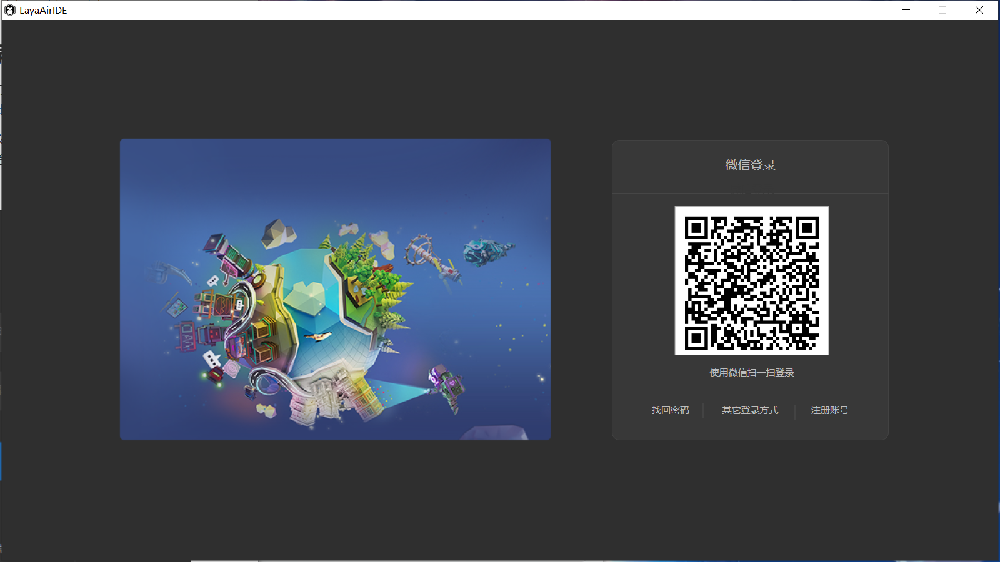

(Figure 1-1)

> Only WeChat login is supported before the public beta.

## 2. IDE Homepage

The IDE homepage after login integrates the account module, project list, create project, remove project references, project description settings, resource store, web links (engine updates, version logs, developer community, engine documentation), and other functions.

### 2.1 Project List

The default module after login is the project list. This is where imported or created projects are listed. Click on the highlighted area to open the project and enter editor mode.

The effect is shown in Figure 2-1.

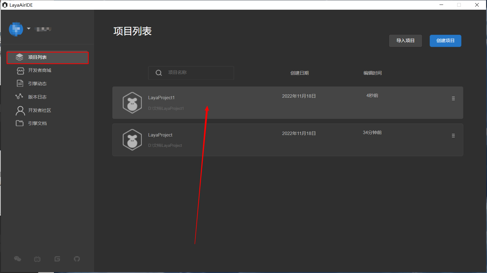

(Figure 2-1)

The default project order is based on the edit time from recent to distant. If there are many projects, you can also enter project keywords in the search box to find the corresponding project.

The effect is shown in Figure 2-2.

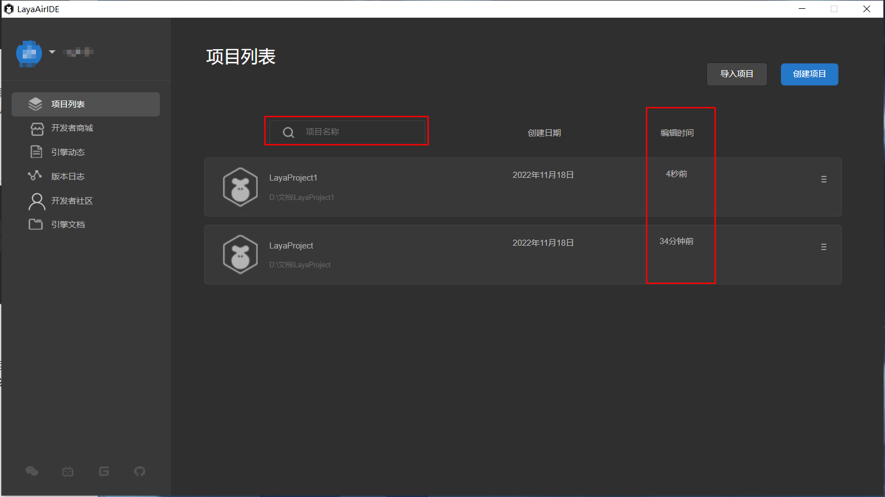

(Figure 2-2)

In the right menu of the project list unit, there are project-related setting functions: set project icon, set project description, open project directory, remove the project from the list. The effect is shown in Animated Figure 2-3.

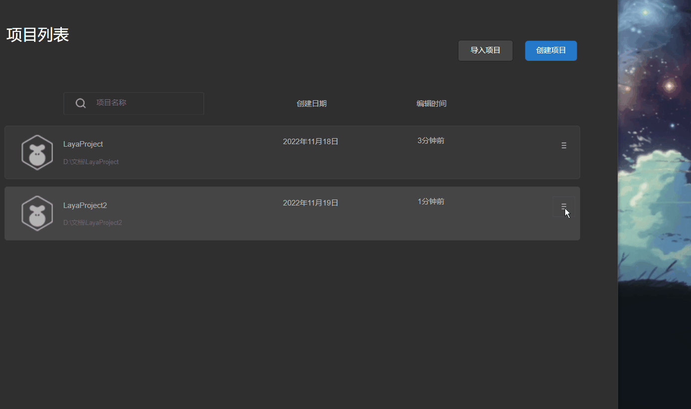

(Figure 2-3)

### 2.2 Import Project

Clicking Import Project allows you to import 3.x projects created on other computers or projects removed from the list into the project list. The operation is shown in Figure 2-4.

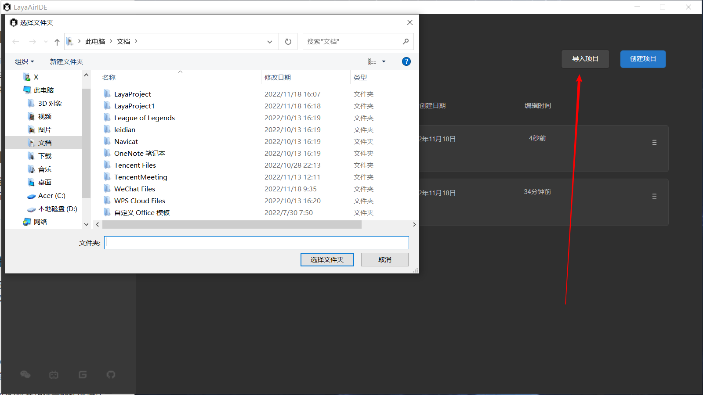

(Figure 2-4)

### 2.3 Create Project

To create a new project, we can click Create Project, as shown in Figure 3-1, to create a new project.

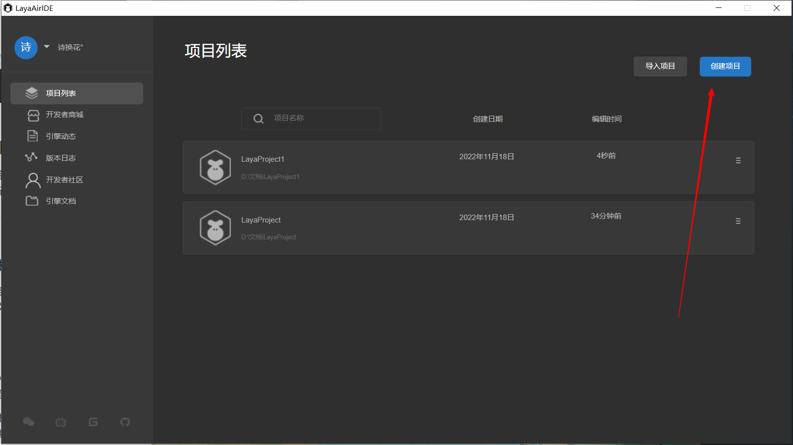

(Figure 3-1)

#### 2.3.1 Select Template

In the interface for creating a new project, we have three types of templates for developers to choose from, as shown in Figure 3-2.

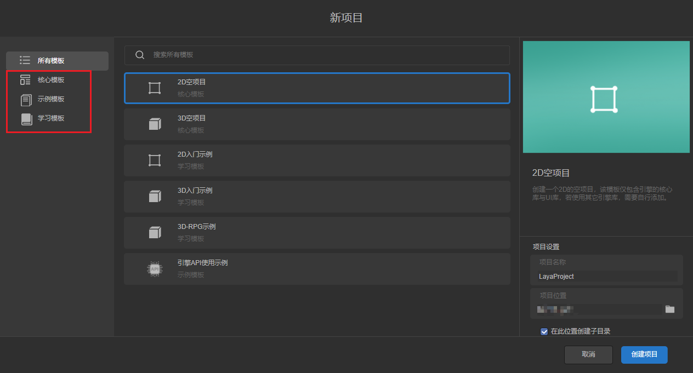

(Figure 3-2)

Core templates refer to 2D and 3D empty project templates, suitable for developers who are already familiar with the system to create a pure template environment.

Example templates are relatively simple and independent functional module examples, suitable for understanding specific functions.

Learning templates refer to templates where the project functions are relatively complete and rich, suitable for introductory learning and reference in project development.

#### 2.3.2 Project Name

As shown in Figure 3-3.

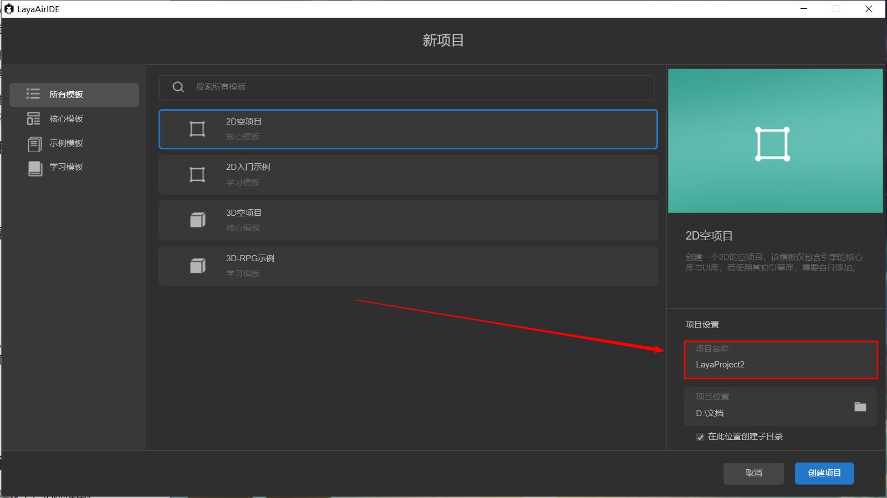

(Figure 3-3)

#### 2.3.3 Project Location

As shown in Figure 3-4.

(Figure 3-4)

#### 2.3.4 Create Project

After completing the above options, click Create Project, as shown in Figure 3-5. This completes the project creation and enters the IDE editing interface. As shown in Figure 3-5.

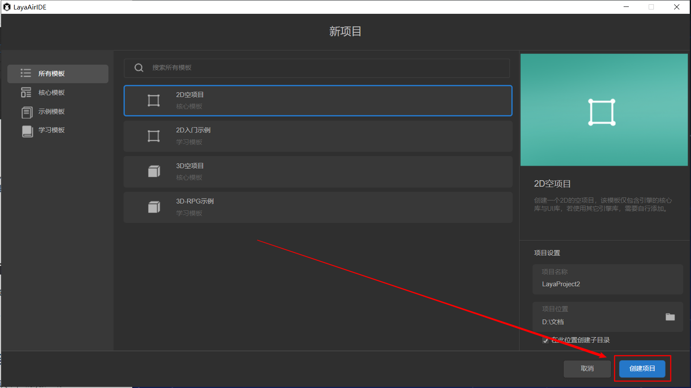

(Figure 3-5)

### 2.4 Developer Store

https://store.layaair.com/

### 2.5 Web Links

Link features are under construction and will be launched later.

### 2.6 Account Settings

The account settings function currently only supports logout. Other functions are under construction. As shown in Figure 4-6.

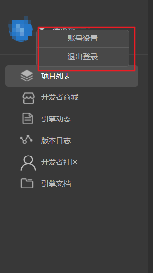

(Figure 4-6)

## 3. Editor Initial Interface

The editor's initial interface includes the hierarchy panel, project panel, UI layout widget panel, scene view, preview window, animation state machine panel, project settings panel, console, timeline animation panel, and property panel.

### 3.1 Hierarchy Panel

The hierarchy panel mainly includes 2D nodes and 3D nodes. If it's a pure 2D project, it can also include only 2D nodes. The panel is shown in Figure 5-1.

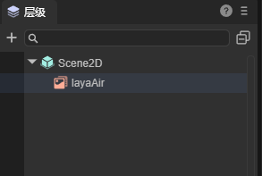

(Figure 5-1)

The hierarchy relationship represents the parent-child node relationship. Child nodes are affected by parent nodes. For example, if a parent node changes position or rotates, the child nodes will also change synchronously.

The root node of 3D nodes is Scene3D, and the root node of 2D nodes is Scene2D. 2D and 3D nodes cannot be mixed to form parent-child hierarchy relationships.

### 3.2 Project Panel

The project panel includes all project resources and code. Resources are located in the assets directory, and code is located in the src directory. The panel is shown in Figure 5-2.

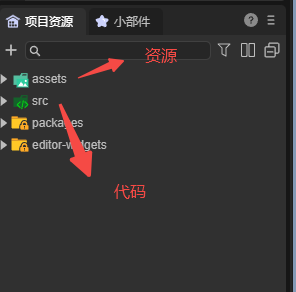

(Figure 5-2)

### 3.3 UI Layout Widget Panel

The UI layout widget panel includes 2D basic display objects, UI components, and skeleton nodes, used for UI layout and arrangement. The panel is shown in Figure 5-3.

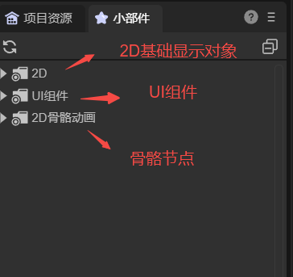

(Figure 5-3)

### 3.4 Scene View

The scene view is where 2D scenes and 3D scenes are edited. It's the window for developers to visually edit the virtual world. The panel is shown in Animated Figure 5-4.

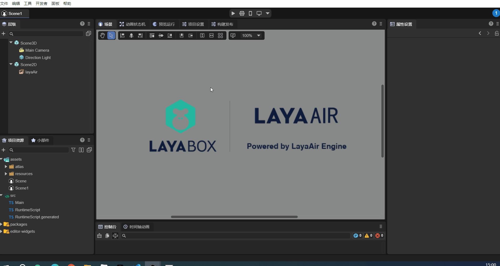

(Figure 5-4)

### 3.5 Preview Window

The preview window is a visual effect preview window presented to users through developer layout editing and code logic. The panel is shown in Figure 5-5.

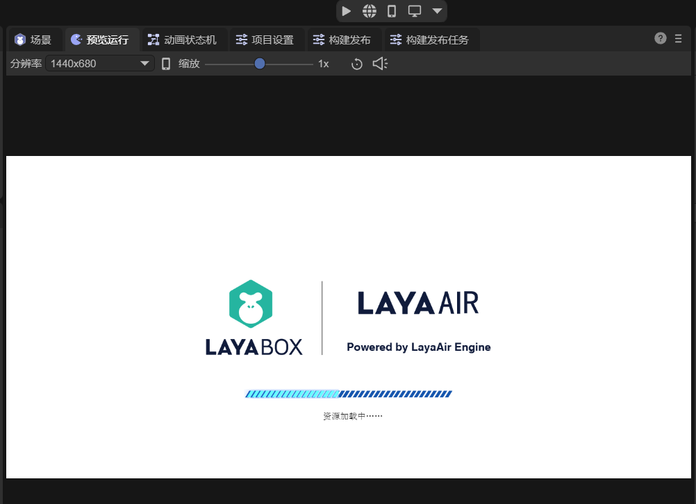

(Figure 5-5)

### 3.6 Animation State Machine Panel

The animation state machine is a tool for controlling timeline animation logic. The animation state machine panel includes animation layers and state machine-related functions. The panel is shown in Figure 5-6.

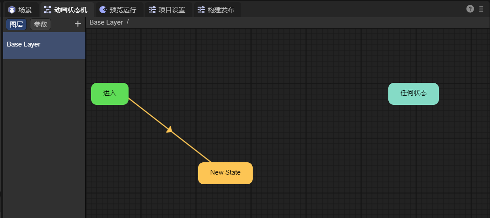

(Figure 5-6)

### 3.7 Project Settings Panel

The project settings panel includes screen adaptation settings, engine initialization settings, project startup settings, etc. The panel is shown in Figure 5-7.

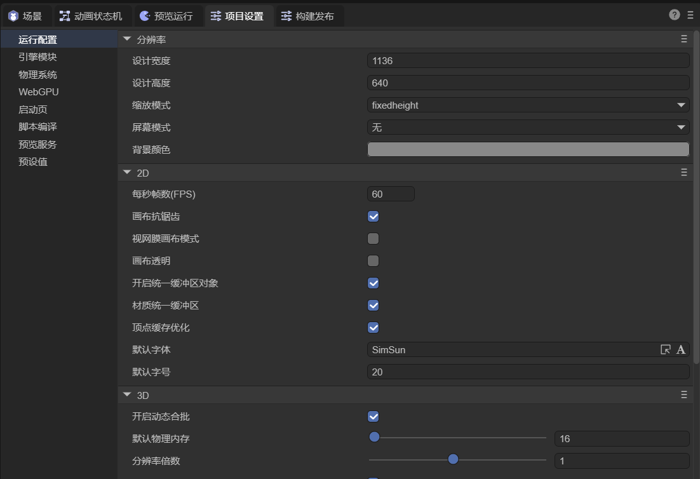

(Figure 5-7)

### 3.8 Console Panel

The console panel is used to print log information. You can copy and clear the printed log information. The panel is shown in Figure 5-8.

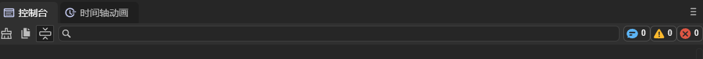

(Figure 5-8)

### 3.9 Timeline Animation Panel

The timeline animation panel is used for editing 2D and 3D animations. It has two modes: keyframe mode and curve mode. As shown in Figure 5-9.

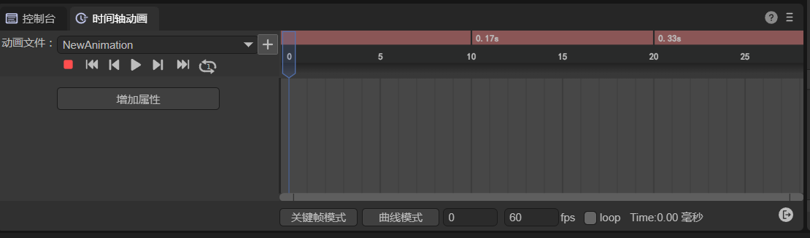

(Figure 5-9)

### 3.10 Property Settings Panel

The property panel is where object or file properties are set.

For example, 2D and 3D object properties in the IDE hierarchy panel, resource file property settings or preview viewing, as well as component addition.

**Object property settings, as shown in Figure 6-1:**

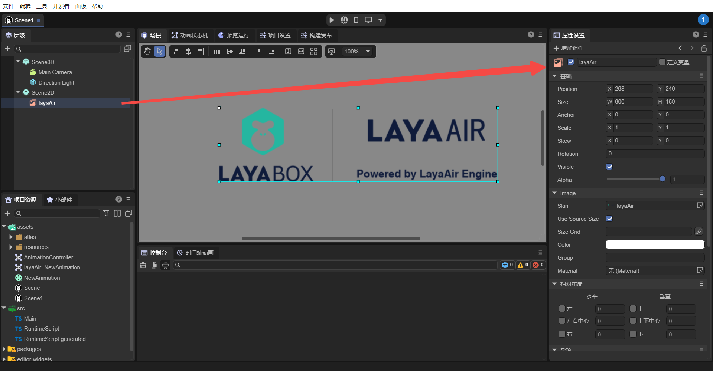

(Figure 6-1)

**Resource property settings, as shown in Figure 6-2:**

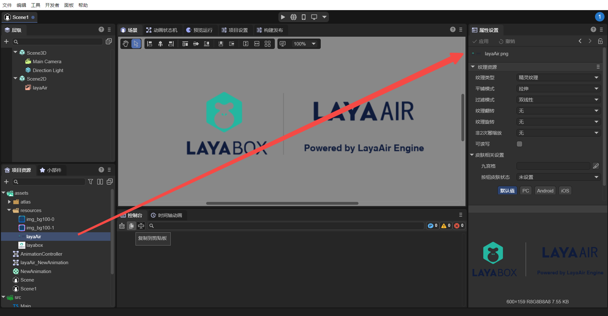

(Figure 6-2)

**Code preview, as shown in Figure 6-3:**

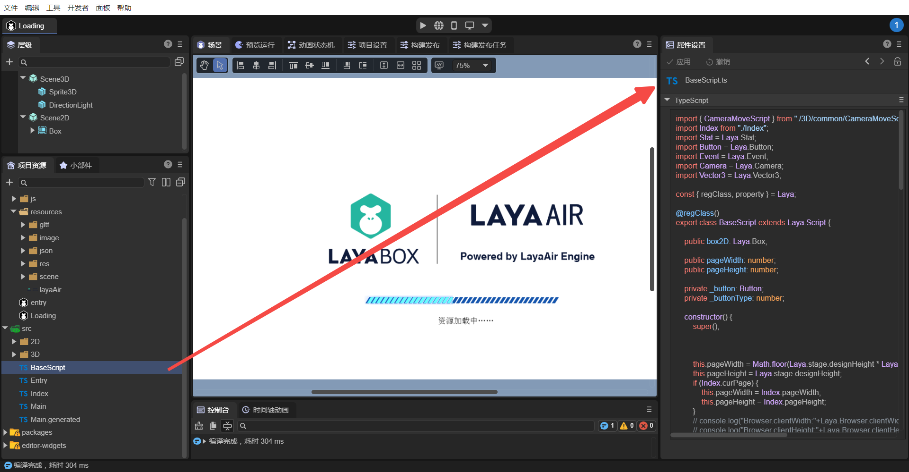

(Figure 6-3)

**Add component (custom properties), as shown in Figure 6-4:**

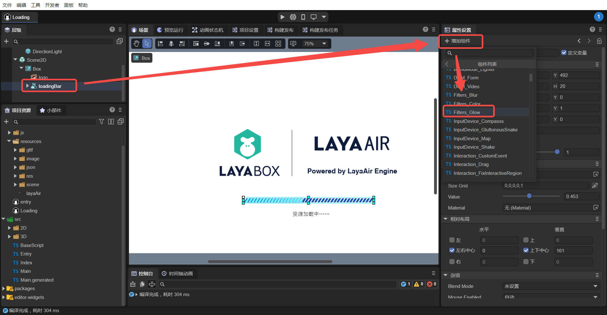

(Figure 6-4)

## 4. Other Editor Panels

In addition to the panels displayed in the initial interface, there are also prefab panel tabs opened by prefab files, and blueprint editing panels opened by blueprint files.

### 4.1 Prefab Panel Tab

The tabs opened by scene files are all the same. Clicking on a prefab file creates an independent prefab panel tab. The effect is shown in Animated Figure 7-1.

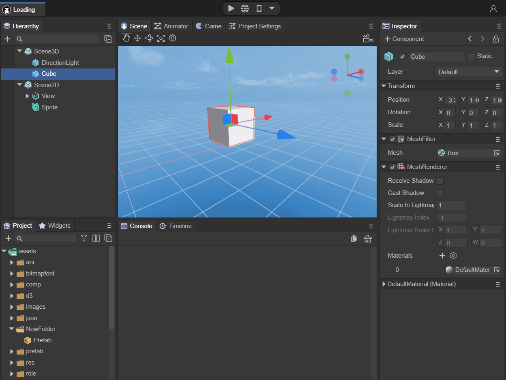

(Figure 7-1)

The prefab panel tab doesn't actually have its own unique panel. It's just that the root node of the hierarchy panel is different from the root node of scene files.

### 4.2 Blueprint Editing Panel

The blueprint editing panel allows you to quickly write custom materials without writing code, significantly lowering the barrier for developers.

Opening a Shader blueprint file or Shader blueprint function file enters the blueprint editing panel. As shown in Animated Figure 7-2.

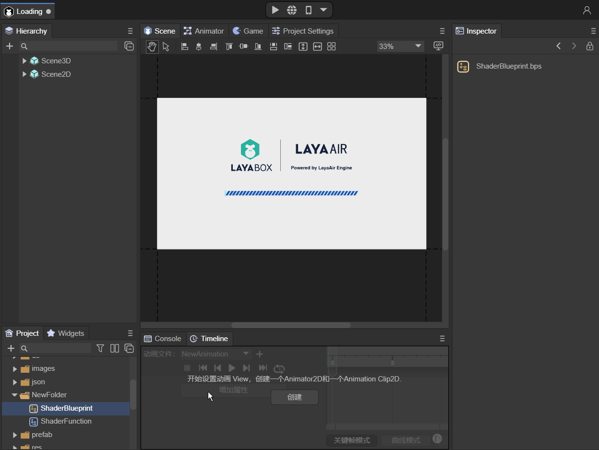

(Figure 7-2)

## 5. Project Preview and Publishing

### 5.1 Project Preview

Project preview is used to view the running effect of the project in different environments.

Project preview is divided into three modes: IDE preview, browser preview, and mobile preview. As shown in Figure 8.

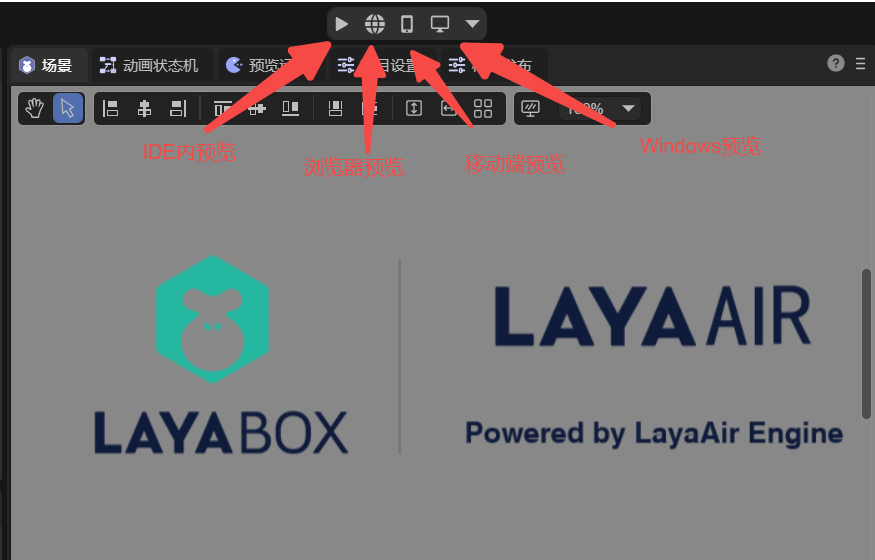

(Figure 8)

After enabling IDE preview, two buttons appear: restart and open developer tools.

#### 5.1.1 Restart

Restart, as the name suggests, restarts the current preview running scene, as shown in Figure 8-1.

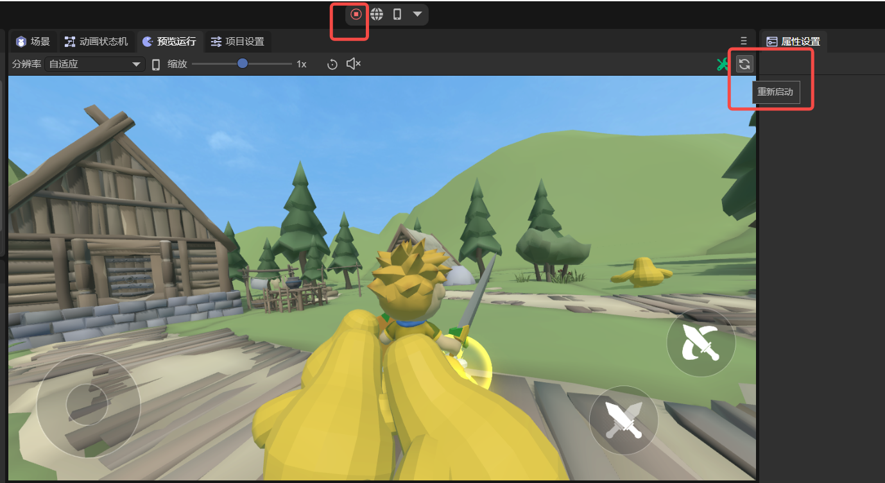

(Figure 8-1)

#### 5.1.2 Open Developer Tools

Clicking Open Developer Tools brings up Developer Tools for developers to debug. You can also open developer tools through the `Ctrl + Alt + I` shortcut.

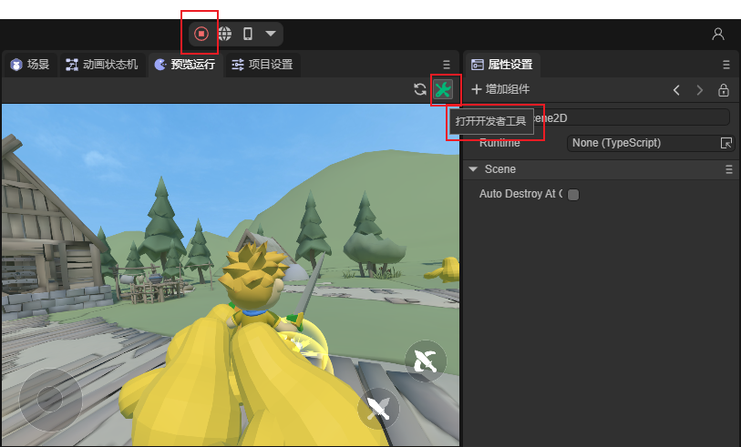

(Figure 8-2)

### 5.2 Project Publishing

Project publishing publishes the development version as a web version, mini-game version, or Native APP version.

Bring up the publishing interface through Build in the File menu, as shown in Figure 9.

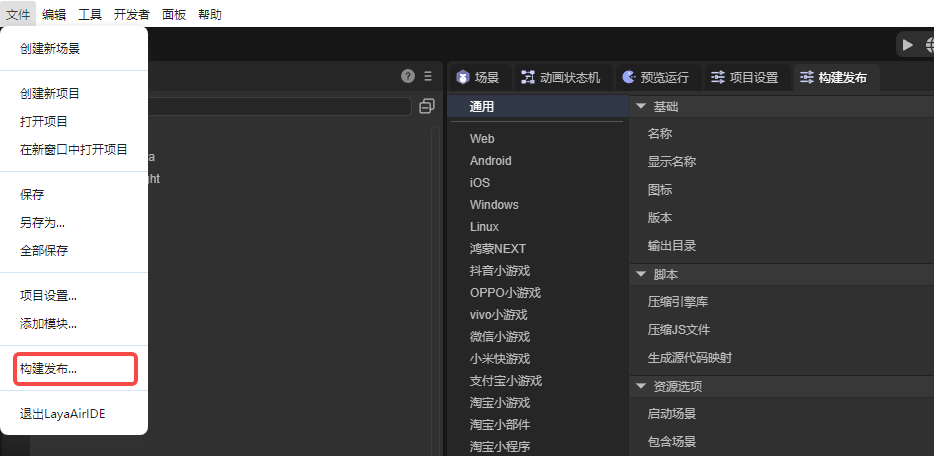

(Figure 9)
