# Hierarchy Panel Description

## 1. Function of the Hierarchy Panel

The hierarchy management panel provides visual operations for nodes, making it convenient to manage relationships between nodes. It mainly includes 2D nodes and 3D nodes. If it's a pure 2D project, it can include only 2D nodes. The panel is shown in Figure 1-1.

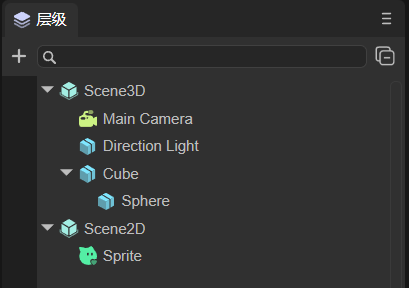

(Figure 1-1)

The hierarchy relationship represents the parent-child node relationship. Child nodes are affected by parent nodes. For example, if a parent node changes position or rotates, child nodes will also change synchronously.

The root node of 3D nodes is Scene3D, and the root node of 2D nodes is Scene2D. 2D and 3D nodes cannot be mixed to form parent-child hierarchy relationships.

## 2. Common Operations in the Hierarchy Panel

### 2.1 Creating Nodes

3D nodes that can be created include:

- Sprite3D (This is an empty node);
- Basic 3D nodes (Cube, Sphere, Cylinder, Capsule, Cone, Plane);
- Effects (Particle3D, PixelLine, Trail);
- Lights (DirectionLight, PointLight, SpotLight, AreaLight);
- Camera.

2D nodes that can be created include:

- Basic 2D nodes (Sprite, Animation, Text, SoundNode, VideoNode);
- UI components (Box, HBox, VBox, Image, Clip, Button, CheckBox, Radio, RadioGroup, ComboBox, Label, TextInput, TextArea, FontClip, ProgressBar, HSlider, VSlider, List, Panel, Tree, Tab, ViewStack, HScrollBar, VScrollBar, ColorPicker, View, Dialog, OpenDataContextView);
- 2D skeletal animation (Spine, Skeleton).

The above lists the types of nodes that can be created. Below, we introduce the ways to create nodes. There are mainly two types: one is to create a standalone node without a parent relationship, where 3D nodes are under Scene3D and 2D nodes are under Scene2D; the other is to create under a specific node as its child node.

In Figure 1-1, Sprite is a standalone node, and Sphere is a child node of Cube.

#### 2.2.1 Standalone Nodes

If no specific node is selected, as shown in Animated Figure 2-1, assuming something is selected, you can click on a blank area to deselect. At this point, clicking `+` can create a node. The node created at this time is a standalone node.

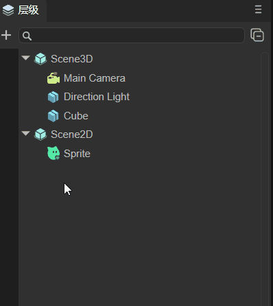

(Figure 2-1)

As shown in Animated Figure 2-2, when no node is selected, right-click in a blank area to create. At this time, a standalone node is also created.

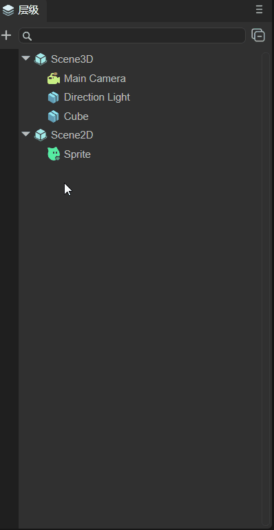

(Figure 2-2)

Careful developers may notice that in the creation menu bar, there are two places where Sprite can be created, as shown in Figure 2-3. One is to directly select `Create Sprite`, and the other is to create under `2D Node -> Sprite`. These two methods create the same Sprite. Method 1 is for operational convenience, while Method 2 is because Sprite, as a basic display sprite, is classified as a basic 2D node.

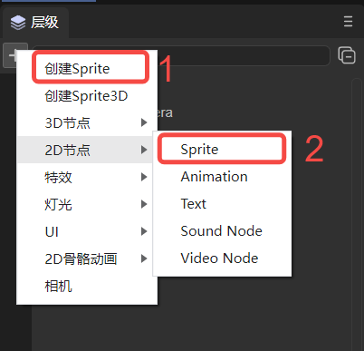

(Figure 2-3)

> Note: For shortcuts for creating empty nodes, please refer to the document ["Complete List of IDE Shortcuts and Mouse Interactions"](../shortcutKeyCombinations/readme.md) Section 1.3.1.

#### 2.2.2 Parent-Child Nodes

As shown in Animated Figure 2-4, if a node is selected for creation, whether clicking `+` to create or right-clicking to create, it creates a child node of the selected node.

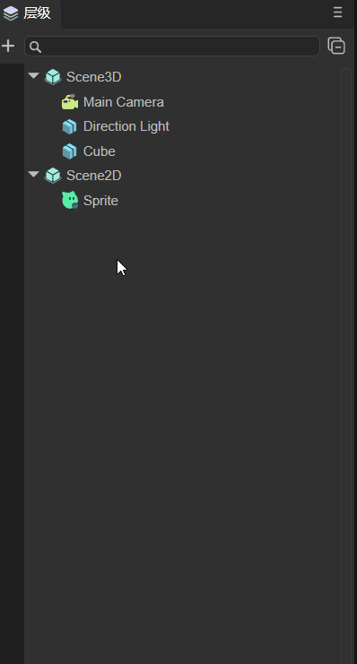

(Figure 2-4)

### 2.2 Searching Nodes

In the search bar, you can search for created nodes by node name. As shown in the following animated figure, searching for the Sphere node:

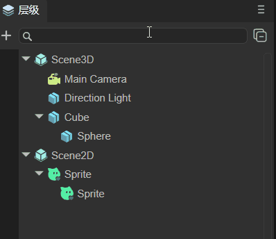

(Figure 2-5)

You can also combine it with the project resource panel. For example, if there's an image LayaAir.png in the project resource panel, and you set the skin of an Image component in the scene to this image, you can right-click this image and select Find References in Scene. As shown in Animated Figure 2-6, this allows you to search for components that reference this resource.

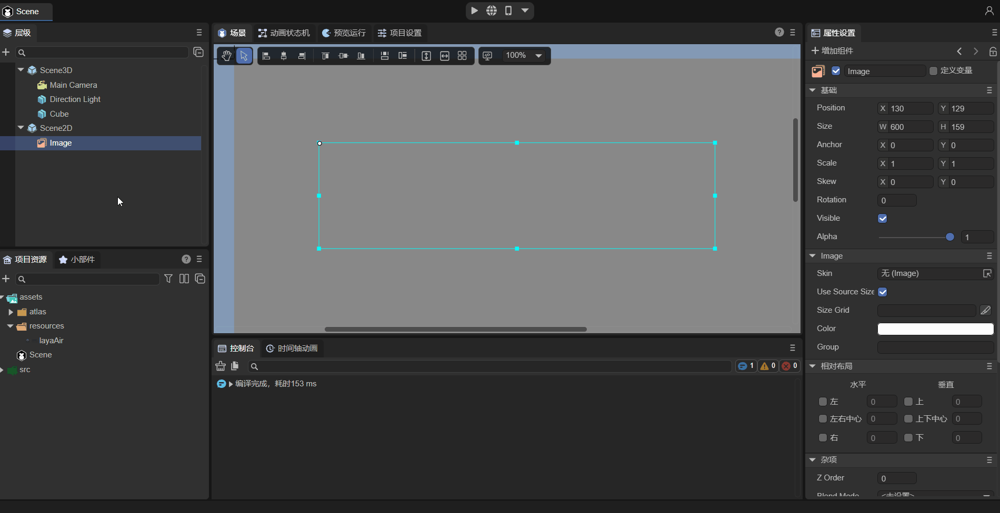

(Figure 2-6)

### 2.3 Hiding Nodes

As shown in Animated Figure 2-7, you can hide nodes. However, the hiding effect at this time is only in the `Scene` panel. The node still exists during `Preview Run`.

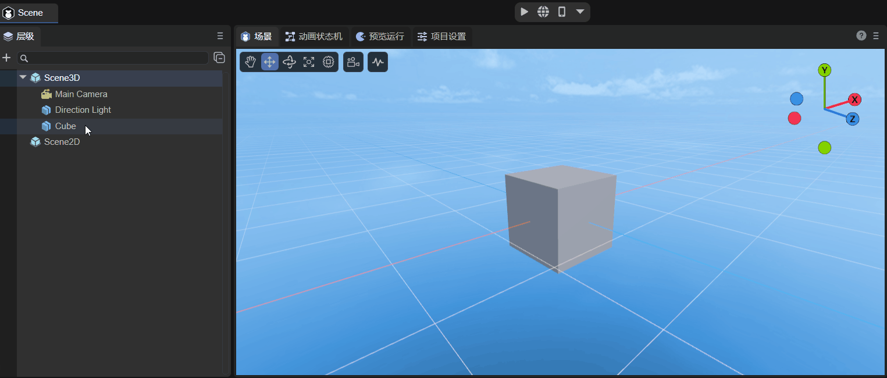

(Figure 2-7)

For parent-child nodes, hiding a child node only hides the node itself. If hiding a parent node, child nodes will also be hidden. The effect is shown in Animated Figure 2-8.

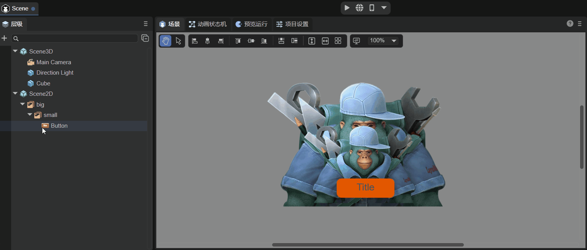

(Figure 2-8)

### 2.4 Locking Nodes

As shown in Animated Figure 2-9, you can lock nodes. After locking a node, it cannot be operated on in the scene panel. For example, in the animated figure, before locking, you can select Cube to move it, but after locking, you cannot select Cube anymore.

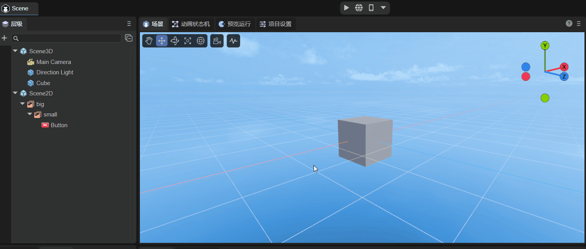

(Figure 2-9)

For parent-child nodes, as shown in Animated Figure 2-10, locking a child node does not affect the parent node. If locking a parent node, child nodes will also be locked.

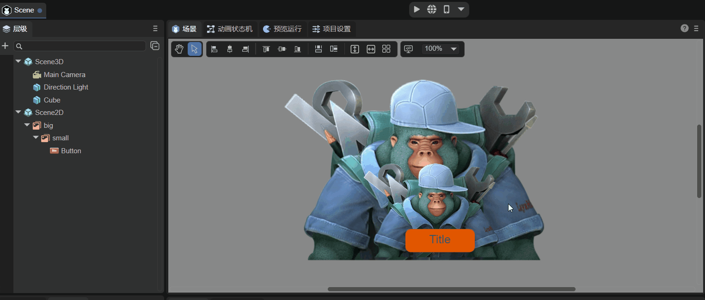

(Figure 2-10)

> Note here that locking a node only prevents the mouse from selecting it in the scene panel. It can still be operated on in the property settings panel. This function is often used for background images. After setting the background image, to prevent accidental selection, you can lock the background image first.

### 2.5 Collapsing and Expanding Nodes

The IDE provides a collapse all button. As shown in Animated Figure 2-11, after clicking, all child nodes can be collapsed.

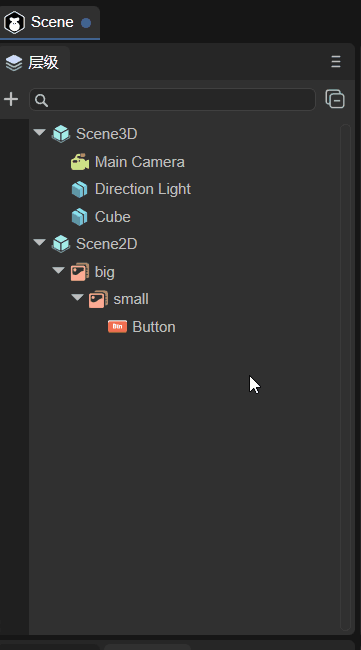

(Figure 2-11)

> Note: For shortcuts to expand all child nodes, please refer to the document ["Complete List of IDE Shortcuts and Mouse Interactions"](../shortcutKeyCombinations/readme.md) Section 1.3.2.

### 2.6 Node Ordering

For 3D nodes in a 3D coordinate system, their occlusion relationship is related to their coordinates and camera position. However, for 2D nodes, if added in order, they will increase downward in the hierarchy panel one by one. As shown in Animated Figure 2-12, the first added will be covered by the later added. At this time, if you want to modify their occlusion relationship, you can change the [ZOrder](../../../2D/displayObject/Sprite/readme.md) property.

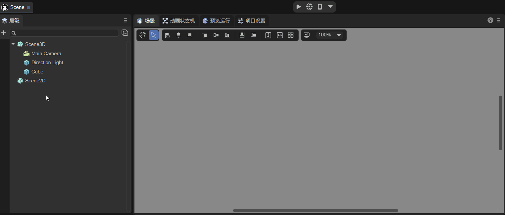

(Figure 2-12)

Of course, in addition to modifying the ZOrder property, you can also change the occlusion relationship by dragging the target node. There are mainly three types:

- Drag as a child node of the target node;
- Drag after the target node at the same level;
- Drag before the target node at the same level.

> Note: For operation demonstrations of dragging target nodes, please refer to the document ["Complete List of IDE Shortcuts and Mouse Interactions"](../shortcutKeyCombinations/readme.md) Section 1.3.3.

### 2.7 Common Functions of Right-Click Menu

In addition to the node creation function in 2.1, the right-click menu also has some common functions:

`Copy`, `Paste`: As shown in Animated Figure 2-13, select a node to copy (you can also select multiple nodes), then paste. After pasting, if there are nodes with duplicate names, the IDE will automatically rename them.

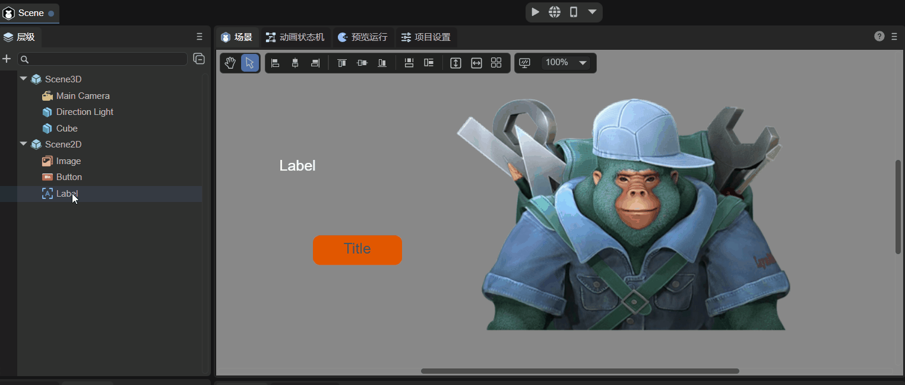

(Figure 2-13)

> 2D nodes can only be pasted under Scene2D, and 3D nodes can only be pasted under Scene3D.

`Rename`: As shown in Animated Figure 2-14, you can rename the selected node.

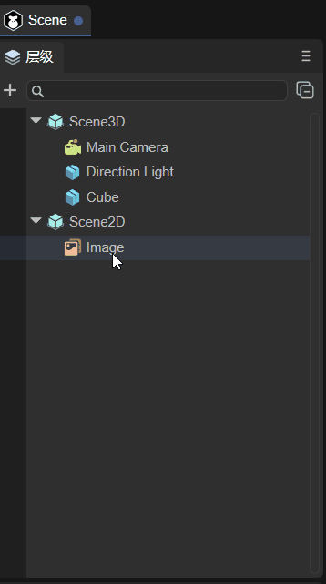

(Figure 2-14)

`Duplicate`: As shown in Animated Figure 2-15, you can create a copy of the selected node. It retains the original node's properties (position, size, specific properties, etc.).

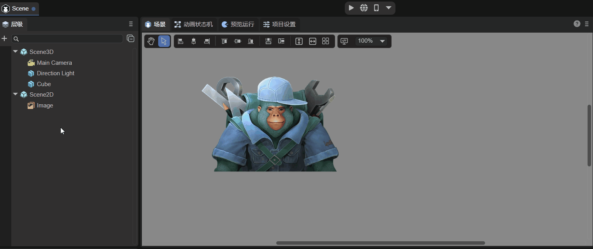

(Figure 2-15)

`Delete`: As shown in Animated Figure 2-16, you can delete the selected node. Deleting a parent node will also delete child nodes.

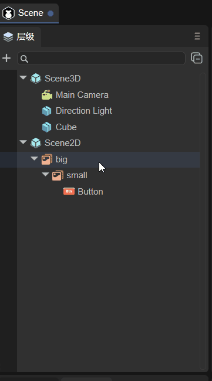

(Figure 2-16)

> Note: For shortcuts of the above operations, please refer to the document ["Complete List of IDE Shortcuts and Mouse Interactions"](../shortcutKeyCombinations/readme.md) Section 1.2.

### 2.8 Node Tree

During runtime, the hierarchy panel will display the node tree in the running state. As shown in Animated Figure 2-17, switching to which scene displays which scene's node tree.

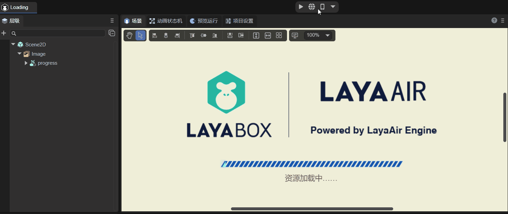

(Figure 2-17)

> The example in the animated figure is the "2D Introduction Example".

## 3. 3D Scene Node Operations

### 3.1 Deleting and Creating 3D Scene Root Nodes

At the beginning of this section, it was mentioned that if it's a pure 2D project, it can include only 2D nodes. This means that 3D nodes can be deleted, including the 3D root node Scene3D. As shown in Animated Figure 3-1, this is deleting the root node Scene3D. After deletion, it becomes a pure 2D scene.

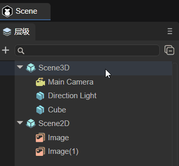

(Figure 3-1)

If you created a pure 2D project and want to add a 3D scene, you just need to add the required 3D nodes. As shown in Animated Figure 3-2, at this time it will automatically create the node under Scene3D.

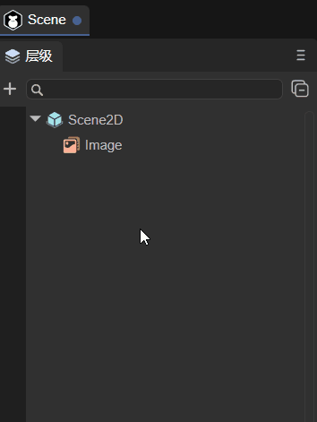

(Figure 3-2)

### 3.2 Basic 3D Nodes

Section 2.1 has already listed the 3D nodes that can be created. This section will provide an overview of their functions and provide links to detailed documentation for each node.

- Sprite3D

  This is an empty node, the most basic 3D node, containing many basic 3D sprite functional properties. After creation, you can assign properties such as Mesh to it to display effects. For detailed usage and methods, please refer to the document ["Using 3D Sprites"](../../../3D/Sprite3D/readme.md).

- Basic 3D Nodes

  Include: Cube, Sphere, Cylinder, Capsule, Cone, Plane. They are basic 3D display objects and can serve as auxiliary tools in 3D development, such as beginners using them to quickly learn the 3D development workflow, or experienced developers using them for simulation and testing. For detailed usage methods, please refer to the document ["3D Basic Display Objects"](../../../3D/displayObject/readme.md).

- Effects

  Effect-related nodes include: Particle3D, PixelLine, Trail;

  Particle3D is a 3D particle system that can be used to simulate non-fixed form natural phenomena such as smoke, fog, water, fire, rain, snow, flow, etc. For detailed methods, please refer to the document ["3D Particle Editor Module"](../../../IDE/particleEditor/readme.md).

  PixelLine is a pixel line that draws 3D sprites by rendering a set of colored lines. For a detailed introduction, please refer to the document ["Pixel Line"](../../../IDE/Component/PixelLine/readme.md).

  Trail is a trail renderer that can create trailing effects behind objects, such as air columns generated by bullets. For detailed content, please refer to the document ["Trail"](../../../IDE/Component/Trail/readme.md).

- Lights

  There are four types of light nodes: DirectionLight (parallel light), PointLight (point light), SpotLight (spotlight), AreaLight (area light). They determine the color and atmosphere of the environment, and different light sources will present different effects. For detailed setting methods, please refer to the document ["3D Lights and Shadows"](../../../3D/Light/readme.md).

- Camera

  The camera node is equivalent to eyes. All scenes are rendered through it. For a detailed description, please refer to the document ["Using 3D Camera"](../../../3D/Camera/readme.md).

### 3.3 Creating 3D Render Nodes

Render nodes refer to nodes that need to be rendered, such as static mesh sprites, skinned animation mesh sprites, etc. As shown in Figure 3-3, you can directly drag from the resource panel to the hierarchy panel.

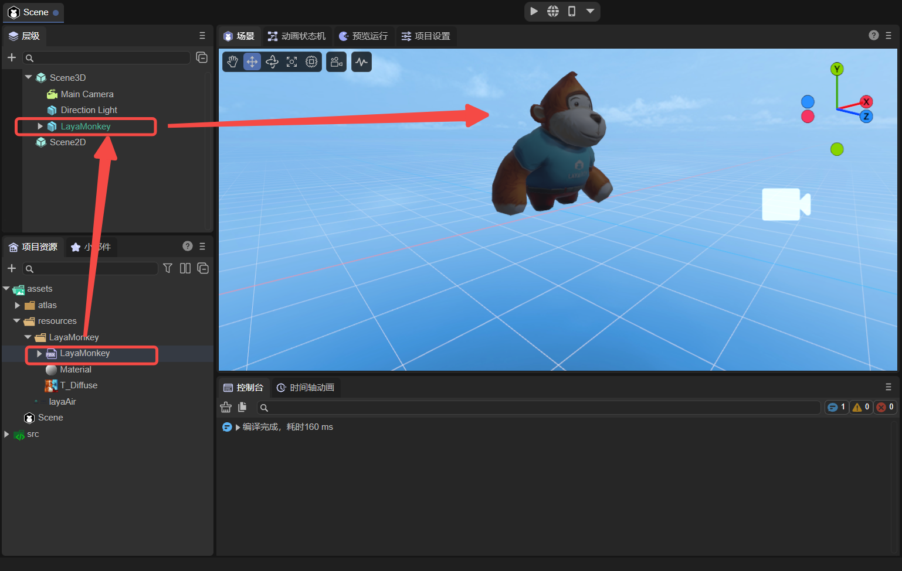

(Figure 3-3)

## 4. 2D Scene Node Operations

Section 2.1 has already listed the 2D nodes that can be created. This section will provide an overview of their functions and provide links to detailed documentation for each node. Developers should note that the Scene2D node is different from the Scene3D node and cannot be deleted.

### 4.1 Basic 2D Nodes

[Sprite](../../../2D/displayObject/Sprite/readme.md) is a 2D sprite, a display object that can be controlled on the screen.

[Animation](../../../2D/displayObject/Animation/readme.md) is a node animation that can conveniently create atlas animations and multi-frame animations.

[Text](../../../2D/displayObject/Text/readme.md) is a basic component for static text.

[SoundNode](../../../2D/displayObject/SoundNode/readme.md) is a component for playing sound.

[VideoNode](../../../2D/displayObject/VideoNode/readme.md) is a component for displaying video.

### 4.2 UI Nodes

[Box](../../../IDE/uiEditor/uiComponent/Box/readme.md) is the base class for container components, used to load other display object components.

[HBox](../../../IDE/uiEditor/uiComponent/HBox/readme.md) is a container component commonly used for horizontal layout.

[VBox](../../../IDE/uiEditor/uiComponent/VBox/readme.md) is a container component commonly used for vertical layout.

[Image](../../../IDE/uiEditor/uiComponent/Image/readme.md) is the most common image display component in UI, used to display bitmap images.

[Clip](../../../IDE/uiEditor/uiComponent/Clip/readme.md) component can be used to display bitmap slice animations.

[Button](../../../IDE/uiEditor/uiComponent/Button/readme.md) is a button component that can display text labels, icons, or both simultaneously.

[CheckBox](../../../IDE/uiEditor/uiComponent/CheckBox/readme.md) is a checkbox component.

[Radio](../../../IDE/uiEditor/uiComponent/Radio/readme.md) is a radio button component.

[RadioGroup](../../../IDE/uiEditor/uiComponent/RadioGroup/readme.md) is a radio button group.

[ComboBox](../../../IDE/uiEditor/uiComponent/ComboBox/readme.md) is a dropdown list option box component.

[Label](../../../IDE/uiEditor/uiComponent/Label/readme.md) is used to display a piece of text.

[TextInput](../../../IDE/uiEditor/uiComponent/TextInput/readme.md) is a text input box that can be used whenever input is needed.

[TextArea](../../../IDE/uiEditor/uiComponent/TextArea/readme.md) is a text area, inheriting from TextInput.

[FontClip](../../../IDE/uiEditor/uiComponent/FontClip/readme.md) performs proportional cutting of bitmaps in the direction.

[ProgressBar](../../../IDE/uiEditor/uiComponent/ProgressBar/readme.md) is used to display progress.

[HSlider](../../../IDE/uiEditor/uiComponent/HSlider/readme.md) is a horizontal slider that can select values by moving the slider between the slider track.

[VSlider](../../../IDE/uiEditor/uiComponent/VSlider/readme.md) is a vertical slider.

[List](../../../IDE/uiEditor/uiComponent/List/readme.md) can display a list of items.

[Panel](../../../IDE/uiEditor/uiComponent/Panel/readme.md) is a panel container class with clipping functionality, often used to set the display area of elements.

[Tree](../../../IDE/uiEditor/uiComponent/Tree/readme.md) component is used to display tree structures.

[Tab](../../../IDE/uiEditor/uiComponent/Tab/readme.md) component is used to define tab button groups.

[ViewStack](../../../IDE/uiEditor/uiComponent/ViewStack/readme.md) is mainly used for multi-page view switching.

[HScrollBar](../../../IDE/uiEditor/uiComponent/HScrollBar/readme.md) is a horizontal scrollbar component.

[VScrollBar](../../../IDE/uiEditor/uiComponent/VScrollBar/readme.md) is a vertical scrollbar component.

[ColorPicker](../../../IDE/uiEditor/uiComponent/ColorPicker/readme.md) displays a list containing multiple color samples.

[Dialog](../../../IDE/uiEditor/View/Dialog/readme.md) is mainly used for popup panels.

[OpenDataContextView](../../../IDE/uiEditor/uiComponent/OpenDataContextView/readme.md) is a component needed for the open data context.

### 4.3 Skeletal Nodes

[Spine](../../../IDE/Component/2D/2DRender/Spine2DRenderNode/readme.md) implements animations by binding images to bones and then controlling the bones.

[Skeleton](../../../IDE/uiEditor/uiComponent/skeleton/sk/readme.md) can convert some commonly used skeletal animation formats to skeletal animation formats supported by the LayaAir engine.
