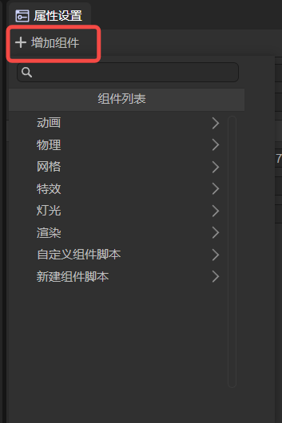
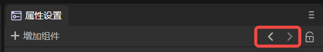
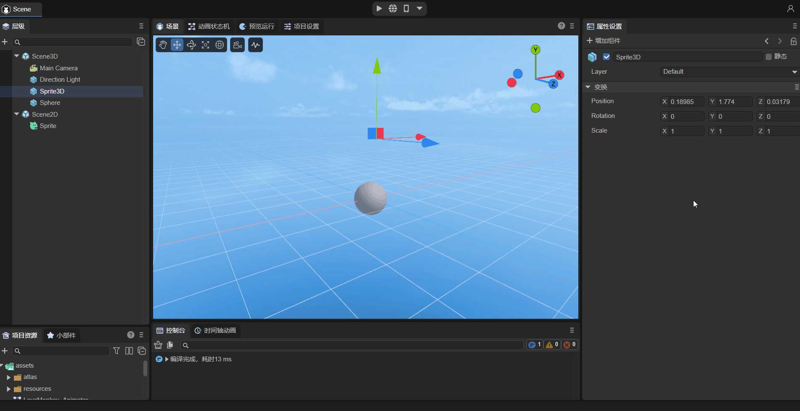
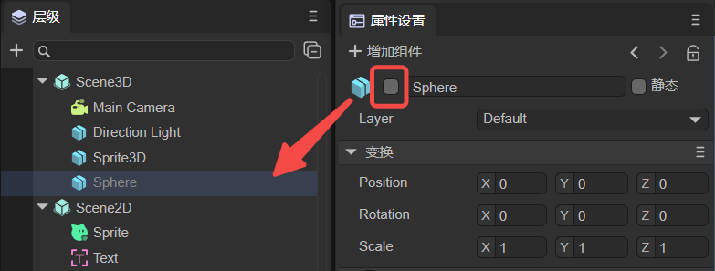
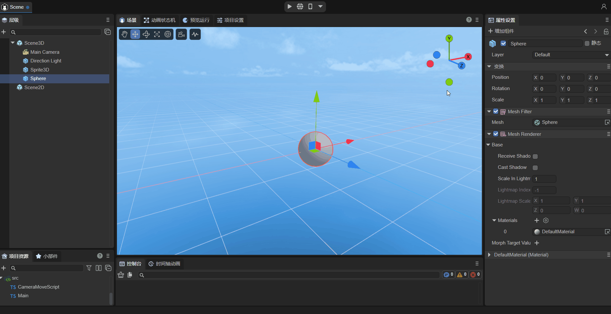
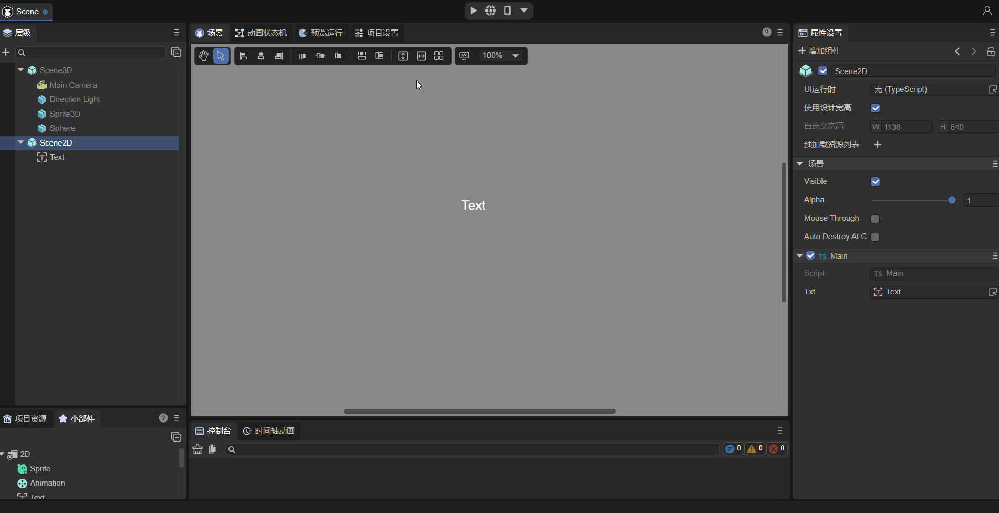
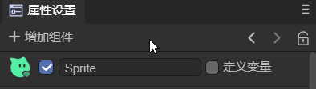
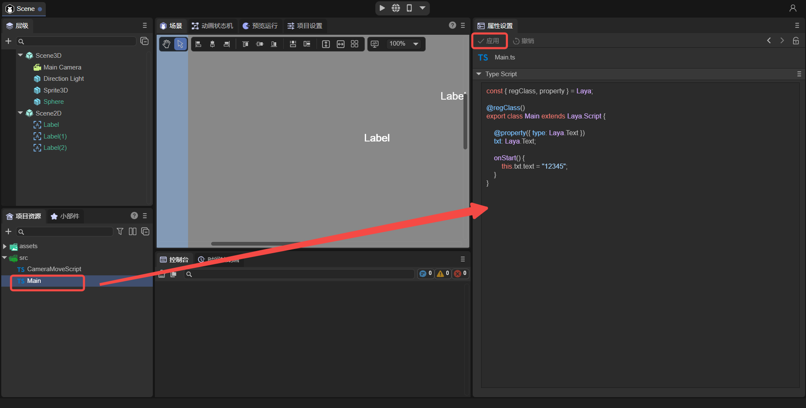

# Property Settings Panel Description

## 1. Common Functions

### 1.1 Adding Components

In the property settings panel, you can click `Add Component` to add corresponding components to nodes, as shown in Figure 1-1.

(Figure 1-1)

- Components that can be added to 3D nodes include: Animation ([Timeline Animation](../../../IDE/animationEditor/timelineGUI/readme.md), [Animation State Machine](../../../IDE/animationEditor/aniController/readme.md)), [3D Physics](../../../IDE/physicsEditor/physics3D/readme.md), [Mesh](../../../IDE/Component/Mesh/readme.md), [Light](../../../3D/Light/readme.md),
Rendering ([Particle](../../../IDE/particleEditor3D/readme.md), [Trail](../../../IDE/Component/Trail/readme.md), [PixelLine](../../../IDE/Component/PixelLine/readme.md), [UI3D](../../../IDE/uiEditor/3DUI/readme.md), [Reflection Probe](../../../IDE/Component/ReflectionProbe/readme.md), [Volumetric Global Illumination](../../../IDE/Component/VolumetricGI/readme.md), [Static Batching](../../../IDE/Component/StaticBatchVolume/readme.md), [LOD Group](../../../IDE/Component/LOD/readme.md)), [Custom Component Script](../../../basics/IDE/entry/readme.md), [New Component Script](../../../basics/common/Component/readme.md).
- Components that can be added to 2D nodes include: Mesh ([Mesh Renderer](../../../IDE/Component/2D/2DRender/Mesh2DRender/readme.md)),
Animation ([Timeline Animation](../../../IDE/animationEditor/timelineGUI/readme.md), [Animation State Machine](../../../IDE/animationEditor/aniController/readme.md)), [2D Physics](../../../IDE/physicsEditor/physics2D/readme.md), [Custom Component Script](../../../basics/IDE/entry/readme.md), [New Component Script](../../../basics/common/Component/readme.md).

> "Custom Component Script" adds an existing script file; "New Component Script" creates a new script file.

### 1.2 Previous, Next

As shown in Figure 1-2, clicking `<` can return to the previous node viewed, and clicking `>` can view the node seen before switching.

(Figure 1-2)

### 1.3 Lock

As shown in Animated Figure 1-3, clicking lock can lock the property panel. When switching nodes, the property settings panel does not switch.

(Figure 1-3)

## 2. Application Scenarios

### 2.1 Node Property Settings

#### 2.1.1 Common Property Settings

**1. `Active`**

Both 2D and 3D nodes have active functionality. When unchecked as shown in Figure 2-1, the node will turn gray in the hierarchy panel, and if the parent node is not active, child nodes will also be not active.

(Figure 2-1)

After deactivating, for 3D nodes, they will not display, even during runtime, as shown in Animated Figure 2-2.

(Figure 2-2)

However, for 2D nodes, deactivating does not affect the node itself, only deactivates the node's scripts. For example, as shown in Animated Figure 2-3, using a script to change displayed text, after deactivating, the text will not be changed.

(Figure 2-3)

**2. `Rename`**

You can rename nodes as shown in Animated Figure 2-4.

(Figure 2-4)

#### 2.1.2 3D Nodes

`Static`:

In game scenes, every Sprite3D has two states: static or dynamic. When an object is marked as static, it ensures that this object is static in the game scene and will not move, thereby providing a smoother running experience during game execution. For a detailed introduction, please refer to ["Using 3D Sprites"](../../../3D/Sprite3D/readme.md) Section 2.3.

`Layer`:

Mask layer. Rendering cameras can control the visible mask layer based on the mask layer, controlling whether sprites are rendered. For a detailed introduction, please refer to ["Using 3D Sprites"](../../../3D/Sprite3D/readme.md) Section 2.4.

> Scene3D does not have a Layer property.

#### 2.1.3 2D Nodes

**1. Define Variable**

After checking and saving the scene, you can manage nodes in `UI Runtime`. For detailed methods, please refer to ["UI Runtime"](../../../IDE/uiEditor/runtime/readme.md) Section 2.3.

> Scene2D does not have the define variable property.

**2. Scene2D Specific Properties**

- UI Runtime: Runtime entry. For detailed content, please refer to ["UI Runtime"](../../../IDE/uiEditor/runtime/readme.md).
- Use Design Width/Height: After checking, the width/height set in the `Project Settings` panel is used; if unchecked, you can customize width and height.
- Preload Resource List: You can add resources that need to be preloaded.

#### 2.1.4 Prefab

When a node is a prefab, it will have the following properties:

- Edit: Enter the prefab's editing page.

- Locate: Locate the prefab resource file in the project resource panel.

- Override Properties: Can override modifications to the prefab.

> For detailed content on prefabs, please refer to ["Prefab Module"](../../../IDE/prefab/readme.md).

### 2.2 Resource Property Settings

In the `Resource Panel`, clicking files of the following resource types allows you to set corresponding properties in the `Property Settings` panel.

- Images: You can set imported image properties. For detailed content, please refer to ["Project Resource Panel Description"](../../../basics/IDE/assets/readme.md) Section 1.4.
- Bitmap Fonts: You can customize bitmap fonts. For detailed content, please refer to ["Advanced Text Usage"](../../../2D/advanced/useText/readme.md) Section 2.2.
- Auto Atlas: Can automatically generate atlases after publishing. For detailed content, please refer to the detailed explanation of atlas packing in ["General Publishing Settings"](../../../released/generalSetting/readme.md).
- Materials: You can create custom materials. For detailed content, please refer to ["Material Editor Module"](../../../IDE/materialEditor/readme.md).
- Animations: There are 2D animation files and 3D animation files. For detailed content, please refer to ["Timeline Animation Editing Details"](../../../IDE/animationEditor/timelineGUI/readme.md).
- Lightmap Baking: You can set lighting properties. For detailed content, please refer to ["3D Scene Environment Settings"](../../../IDE/sceneEditor/environment/readme.md) Section 6.
- Third-party JS Files: Provides separate import functionality. For detailed content, please refer to ["Importing Third-Party JS Modules"](../../../basics/IDE/importJsLibrary/readme.md) Section 2.
- Models: Supports model files with fbx and gltf suffixes. For detailed content, please refer to ["Importing and Using Models and Animations"](../../../3D/useModel/readme.md).
- RenderTexture: You can modify render texture properties. For detailed content, please refer to ["Mixed Use of 3D"](../../../IDE/uiEditor/use3D/readme.md) Section 2.
- AvatarMask: Developers can use it to set action masks. For detailed content, please refer to ["Animation State Machine Details"](../../../IDE/animationEditor/aniController/readme.md) Section 3.5.1.

### 2.3 Code Preview

As shown in Figure 2-5, select a script file in the src folder to preview code. Developers can use a code editor (VS Code is recommended) to make modifications. If [importing third-party JS files](../../../basics/IDE/importJsLibrary/readme.md), you can set separate imports.

(Figure 2-5)
