# Creating a New Project

Creating a new project file is usually the first step in development. The LayaAir engine allows you to create a new project using templates.

## 1. Opening the Project Creation Interface

Run **LayaAirIDE**, and you can see the **Create Project** button in the upper-right corner. Click it to open the new project creation interface.

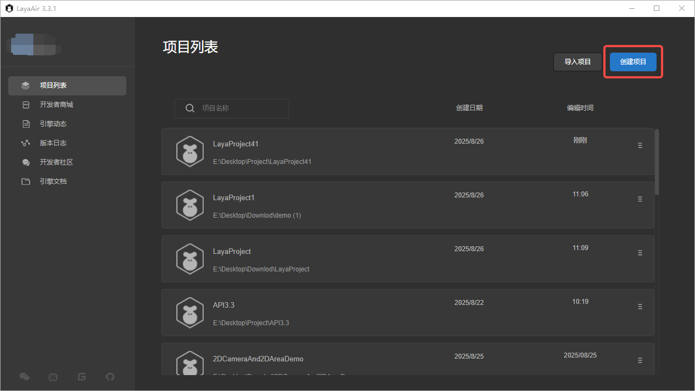  

On the left side of the interface are **template categories**. The IDE categorizes templates based on their intended use:

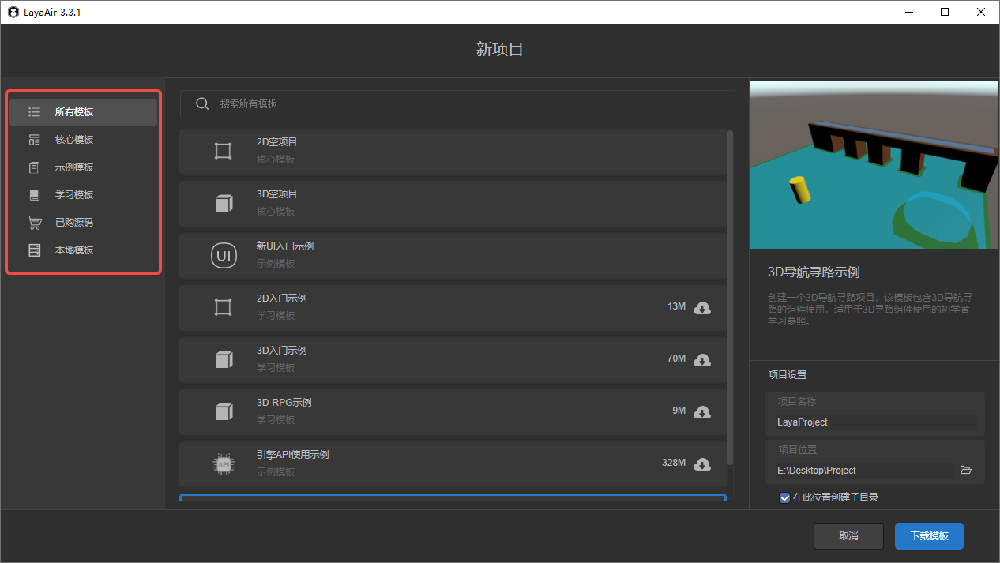  

The middle section is the **template selection panel**, where developers can choose the template they want to use. If there are many templates, you can also use the search function to quickly find the desired template:

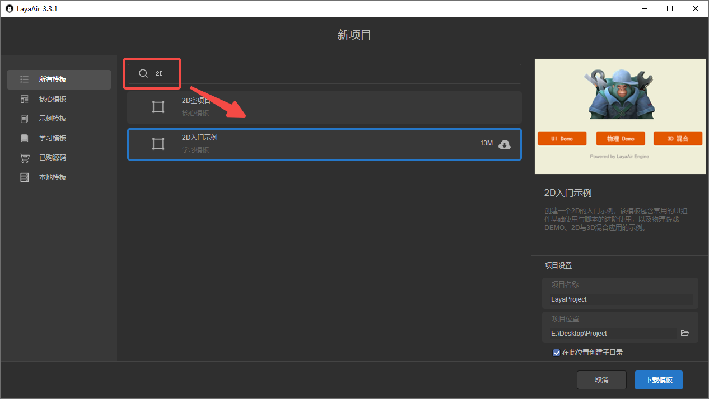  

On the right side is the **template description and project settings** section. Developers can read the description to get a basic understanding of the template’s purpose and features:

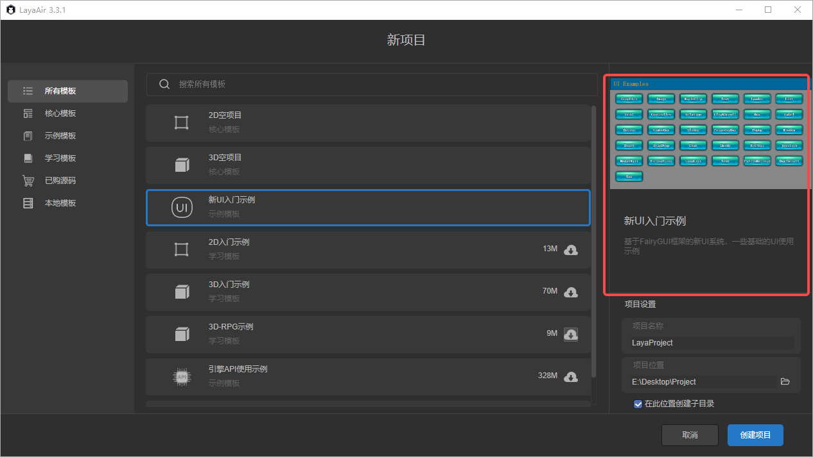  

In **Project Settings**, you can configure the project name and location:

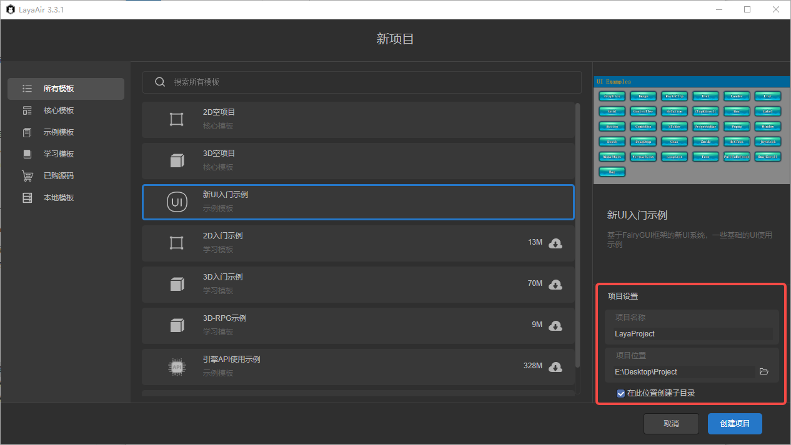  

* **Project Name**: The name of the project. If not set, the IDE will automatically name it as *LayaProject* followed by a number.
* **Project Location**: The directory where the project will be saved.

  * If you check **Create subdirectory in this location**, the IDE will create a folder with the project name in the selected path.
  * If unchecked, the project files will be placed directly in the selected path.

After setting everything, click **Create Project** to generate a new project.

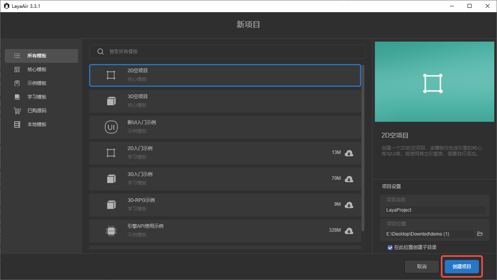  

## 2. Project Templates

Below is an introduction to the different types of templates available in the engine.

### 2.1 Core Templates

Core templates are the most basic project templates. These two templates are installed automatically with LayaAirIDE and do not require network downloads:

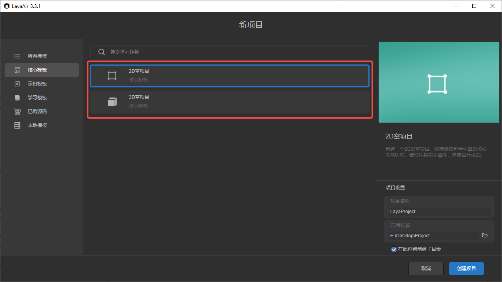  

Developers can choose either **2D Empty Project** or **3D Empty Project** depending on the project type. LayaAir does not strictly separate 2D and 3D projects—3D scenes can still be added and edited in a 2D project.

### 2.2 Example Templates

Example templates demonstrate the basic features of the engine. These three templates need to be downloaded online. Click the button on the right to download:

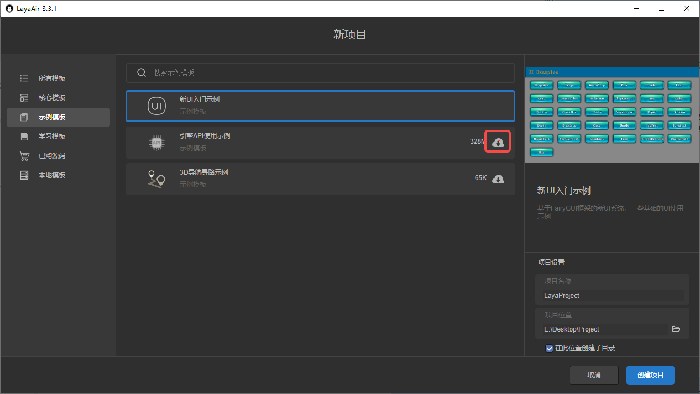  

If the icon shown below appears next to the template, the template needs to be updated. Otherwise, the created project may contain bugs that have already been fixed:

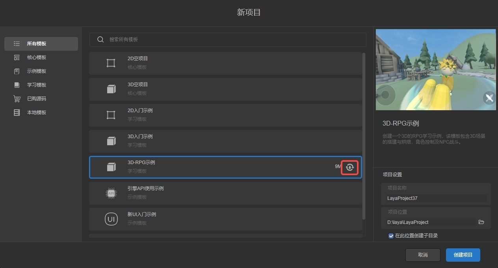  

Descriptions of the three templates:

* **New UI Beginner Demo**: Demonstrates the new UI system based on FairyGUI, introduced in LayaAir 3.3.0.
* **Engine API Usage Demo**: Provides examples of using LayaAir API directly through code. This template includes basic and advanced examples and is important for understanding engine functionalities.
* **3D Navigation & Pathfinding Demo**: Demonstrates the usage of 3D navigation components, suitable for beginners.

### 2.3 Learning Templates

Learning templates are more advanced, combining multiple engine features and IDE scene editing. Like example templates, these must also be downloaded and updated online:

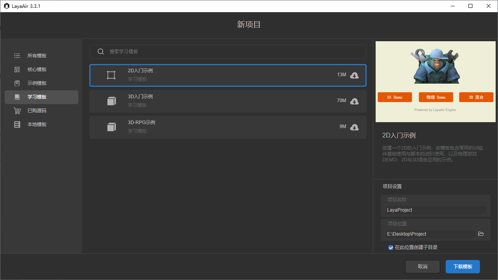  

* **2D Beginner Demo**: Includes integrated UI examples, advanced scripting techniques, physics game demos, and mixed 2D/3D applications.
* **3D Beginner Demo**: Demonstrates common 3D features and IDE usage, suitable for new developers.
* **3D RPG Demo**: Covers 3D scene creation and baking, character control, and NPC battle systems.

### 2.4 Purchased Source Projects

Purchased source projects are templates obtained (free or paid) from the **LayaAir Resource Store**. Developers can add resources to **My Resources**, and they will appear as templates in the IDE. These templates also require online download and updates:

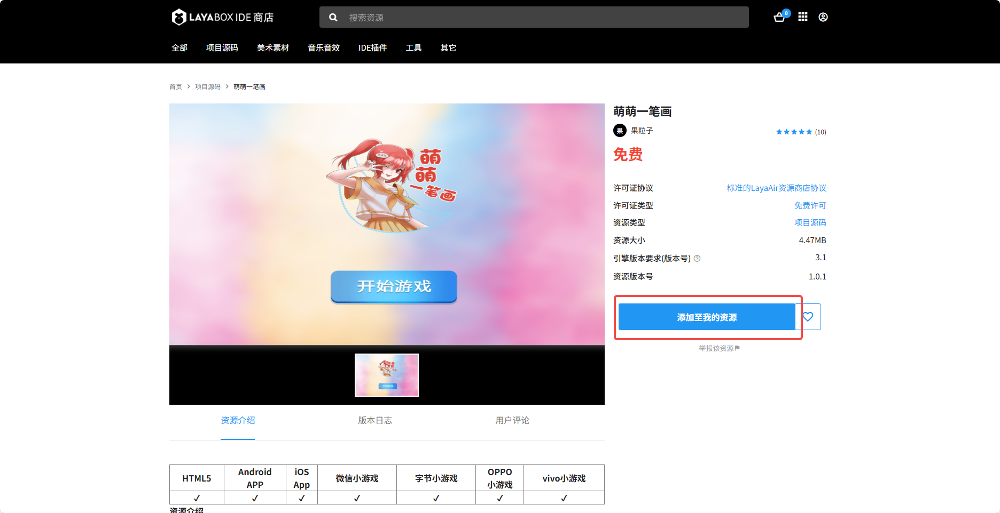  
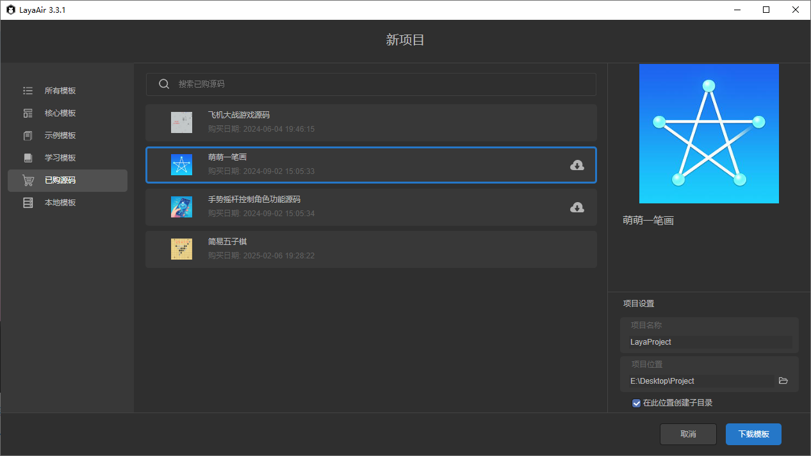  

### 2.5 Local Templates

Local templates are custom templates exported by developers. They do not need to be uploaded to the Resource Store, making them ideal for confidential projects.

For instructions on exporting local templates, refer to section 4 of **[Exporting Resource Packages and Submitting to the Resource Store](../../../IDE/layapackage/exportToStore/readme.md)**. Exported templates are `.zip` files.

The first time you use a local template, you must import it. Click **Local Templates**, and you will see an **Import Local Template** button in the upper-right corner:

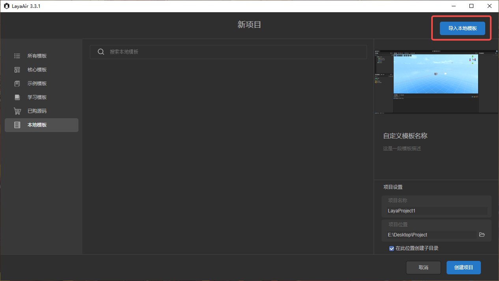  

Click the button, select the `.zip` template file, and confirm to import it.

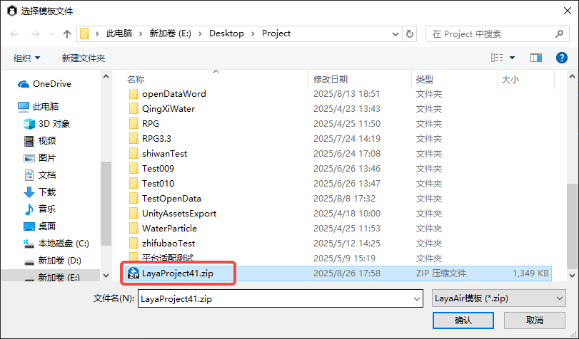

Once imported, you can use the template to create projects. Usage is the same as other templates.

You can manage templates using the menu on the right:

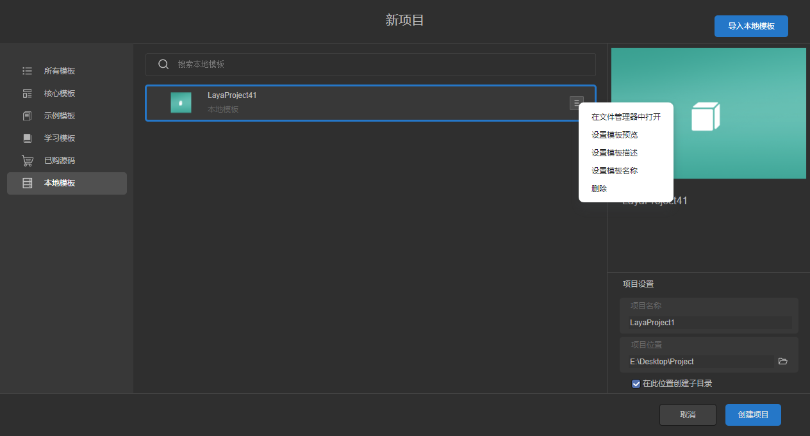  

* **Open in File Explorer**: Opens the folder where the template is stored.
* **Set Template Preview**: Select an image to use as the template preview. 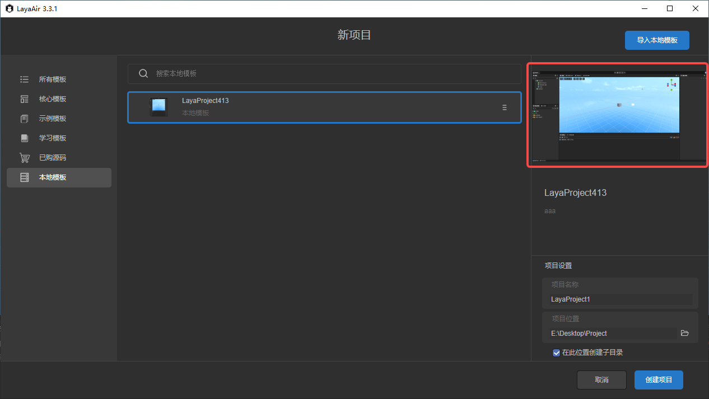
* **Set Template Description**: Add a description for the template’s purpose. 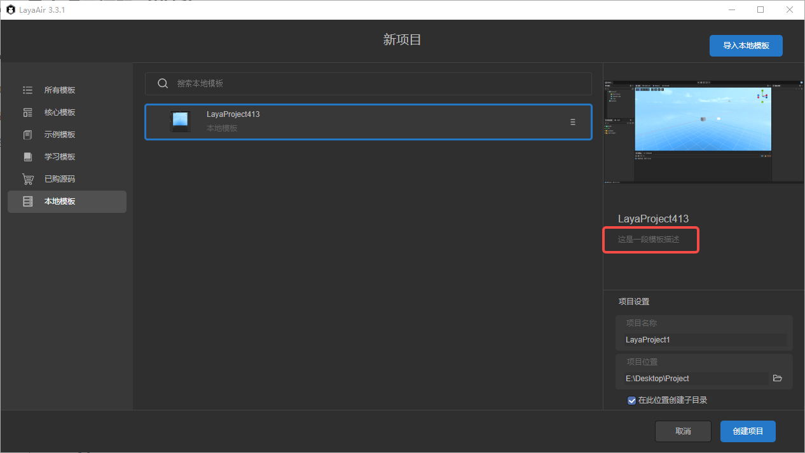
* **Set Template Name**: Customize the template’s display name (this does not affect project names). 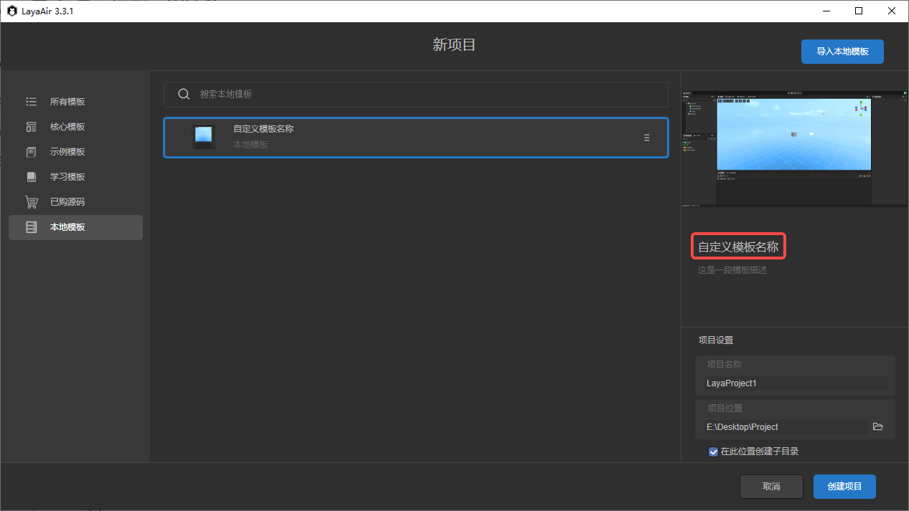
* **Delete**: Remove the template from the template directory.
