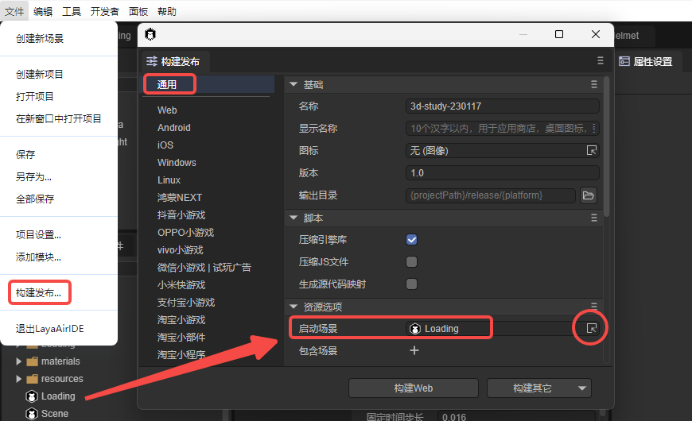
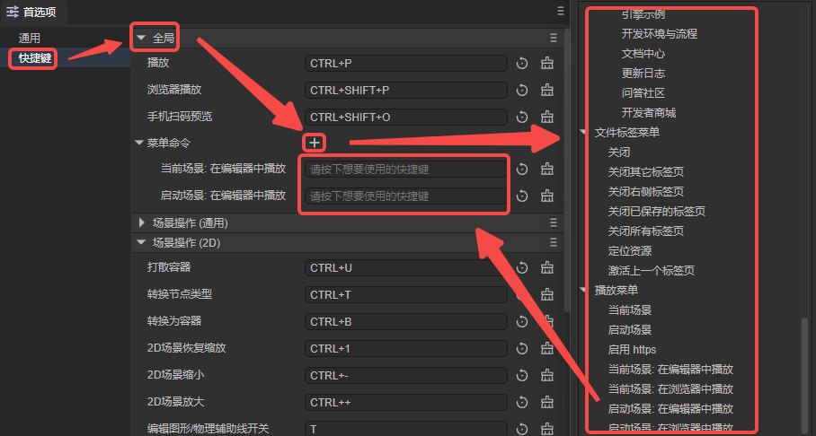
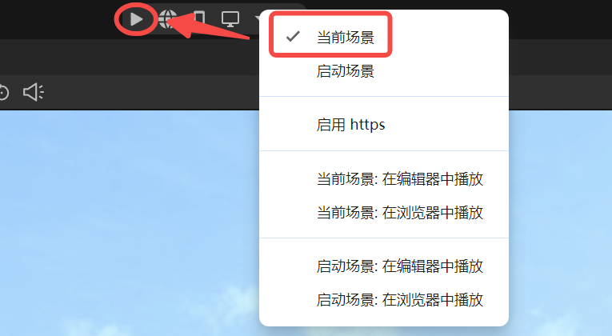
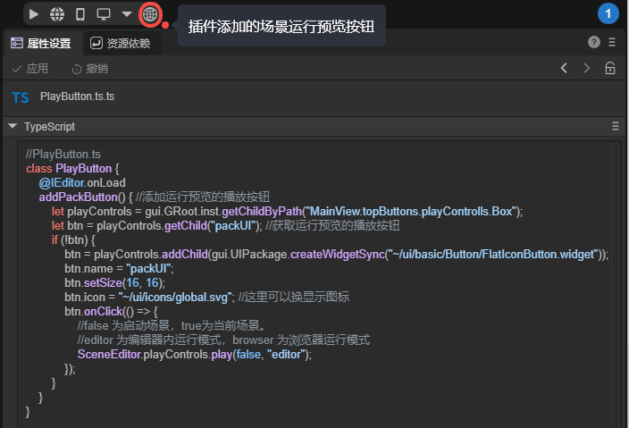
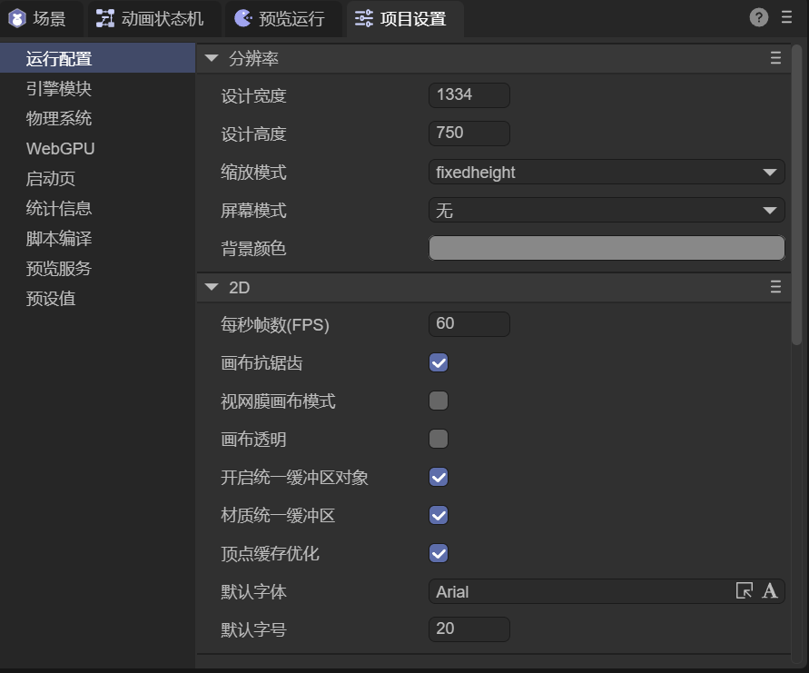
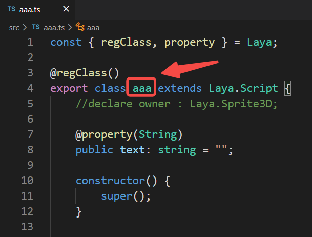
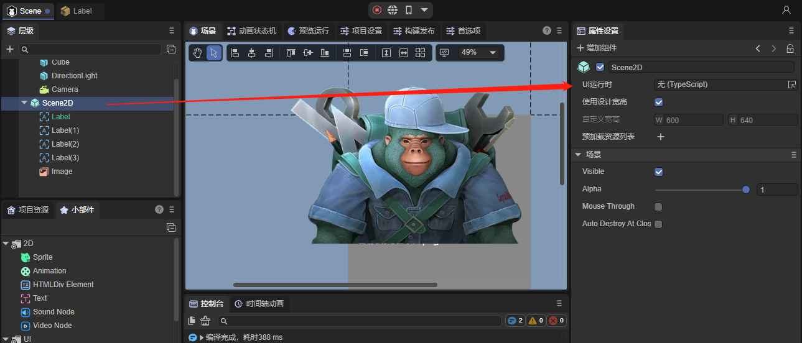
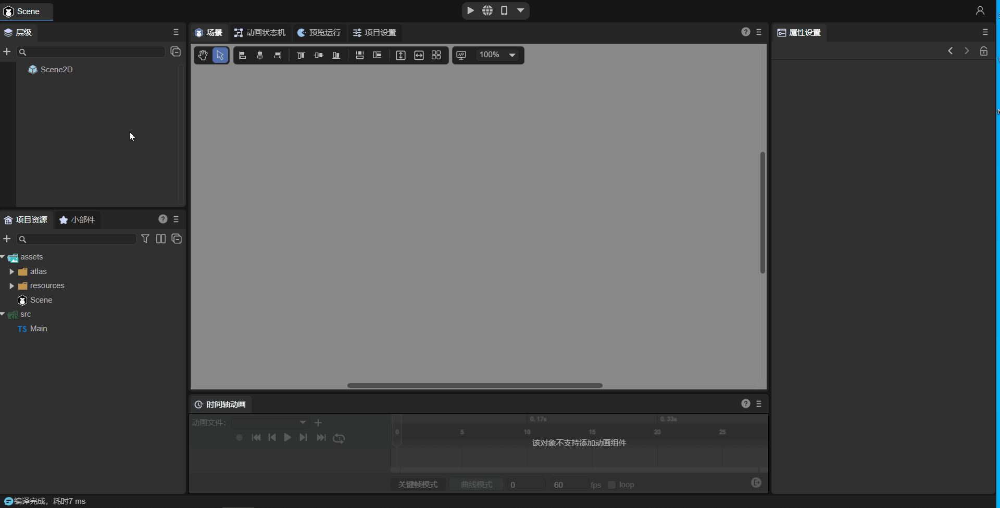

# Project Startup Entry Description

> Author: Charley
>

The project entry is the first place to execute after engine initialization.

For large projects, this is typically the entry point for resource preloading and global initialization. For mini products that don't need preloading, it's usually the main interface and global entry logic.

## 1. Project Startup Entry

There are two ways to set up the project entry in LayaAir3:

One is to **specify a startup scene** in the **Build & Publish** interface, so that the specified scene will be used as the entry after publishing.

The other is to **specify a startup script** in **Project Settings**, where developers can decide in the startup script which scene to open as the entry based on code logic.

### 1.1 Setting the Startup Scene

Let's first introduce how to set the startup scene through `Build & Publish`.

First, open the `Build & Publish` panel in the `File` navigation menu. Then, in the `General` tab, find the `Startup Scene` setting under `Resource Options`.

Select the target scene through the scene selector on the right side of the input box, or drag the scene directly into the input box.

 

(Figure 1-1)

Note that the settings here in Build & Publish are mainly for the entry startup scene after publishing. For testing within the IDE, it's more common to run the currently open scene rather than the startup scene.

So when running, we can choose whether to run the current scene or the startup scene. As shown in Figure 1-2.


(Figure 1-2)

### 1.2 Setting the Startup Script

First, we need to create a startup script (TS).

**This script must be an async main function and cannot be renamed.** We can write our entry logic inside the main function.

Create an `Entry.ts` with the following example code:

```typescript
export async function main() {
    console.log("Hello LayaAir!");

    //Load scene and open scene
    Laya.Scene.open('Scene.ls');
}
```

Then, in the `Script Compilation` tab of `Project Settings`, find the `Startup Script` setting under `Script Compilation Options`.

Select the target script through the script selector on the right side of the input box, or drag the script directly into the input box. As shown in Figure 1-3.


(Figure 1-3)

Once the startup script setting takes effect, whether in the IDE or after publishing, the default scene will no longer be opened.

Even if the running setting has "Open Default Scene" checked, only the logic within the startup script's main function will be executed by default.

For example, in Figure 1-3, Entry.ts executes the logic to open scene Scene.ls. If we add conditional logic, we can open different entry scenes based on different environments.

> [!Tip]
>
> It's important to note that the startup script only takes effect **after publishing** or when the preview mode is set to **startup scene** (not **current scene**).

### 1.3 How to Quickly Switch Startup Entry

During development, some developers may need to frequently switch between "entry scene" and "current scene" as the startup entry. The IDE currently offers two ways to achieve quick switching:

One is to set custom keyboard shortcuts; the other is to add additional shortcut buttons through plugins.

#### 1.3.1 Customizing Scene Preview Shortcuts

In the dropdown menu of scene preview settings, there are several quick features: **current scene** preview in editor or browser, **startup scene** preview in editor or browser.

Compared to opening the dropdown menu with the mouse each time, using keyboard shortcuts directly can significantly improve operational efficiency. Therefore, you can navigate through:

Edit (Application menu on macOS) → Preferences → Shortcuts → Global, and click the "+" next to the target command to bind the desired shortcut key, as shown in Figure 1-4.



(Figure 1-4)

#### 1.3.2 Adding Shortcut Buttons

If you prefer mouse operations, you can also add a new button to the main panel via a plugin to execute different logic from the default preview button.

For example, set the default button to play (run preview) the current scene. As shown in Figure 1-5.



(Figure 1-5)

Then, while keeping the IDE's default "preview current scene" behavior unchanged, use a plugin to add an additional "Run with Startup Scene as Entry" button. The effect is shown in Figure 1-6.

This way, developers can quickly achieve different startup entry requirements by clicking different buttons.



(Figure 1-6)

Plugin code is as follows:

```typescript
//PlayButton.ts
class PlayButton {
    @IEditor.onLoad
    addPackButton() { //Add play button for running preview
        let playControls = gui.GRoot.inst.getChildByPath("MainView.topButtons.playControlls.Box");
        let btn = playControls.getChild("packUI"); //Get the play button for running preview
        if (!btn) {
            btn = playControls.addChild(gui.UIPackage.createWidgetSync("~/ui/basic/Button/FlatIconButton.widget"));
            btn.name = "packUI";
            btn.setSize(16, 16);
            btn.icon = "~/ui/icons/global.svg"; //Can change the display icon here
            btn.onClick(() => {
                //false for startup scene, true for current scene.
                //editor for running in editor mode, browser for running in browser mode
                SceneEditor.playControls.play(false, "editor");
                console.log("Play button clicked");
            });
        }
    }
}
```

> Create a blank script in the assets directory and copy the above example code into the script file to use.

## 2. Other Entry Related

### 2.1 Custom Engine Startup Configuration

Before the project entry starts, the engine also has some initialization startup configurations.

Usually, we can configure them directly in the `Project Settings` panel, as shown in Figure 2-1.



(Figure 2-1)

For specific parameter setting instructions, please refer to the document ["Project Settings Panel"](../projectSettings/readme.md).

In addition to the settings that can be directly configured in the `IDE`, we can also add engine configurations or logic through code before or after engine initialization.

If we add it to the startup script, the example code is as follows:

```typescript
// Execute custom logic before engine initialization (this method is called before Laya.init)
Laya.addBeforeInitCallback(() => {
    // Enable WebGL2 rendering mode by default
    Laya.Config.useWebGL2 = true;
    console.log("before init");
});
// Execute custom logic after engine initialization (this method is called after Laya.init)
Laya.addAfterInitCallback(() => {
    console.log("after init");
});

export async function main() {
    console.log("Hello LayaAir!");
    //Load scene and open scene
    Laya.Scene.open('Scene.ls');
}
```

If there's no startup script, only a startup scene, then we add engine initialization logic configuration before the startup scene's script class.

Example code is as follows:

```typescript
// Execute custom logic before engine initialization (this method is called before Laya.init)
Laya.addBeforeInitCallback(() => {
    // Enable WebGL2 rendering mode by default
    Laya.Config.useWebGL2 = true;
    console.log("before init");
});
// Execute custom logic after engine initialization (this method is called after Laya.init)
Laya.addAfterInitCallback(() =>{
    console.log("after init");
});


const { regClass, property } = Laya;
@regClass()
export class Main extends Laya.Script {

    onStart() {
        console.log("Game start");
    }
}
```

### 2.2 Scene Script Description

The previous section covered the project entry.

This section briefly describes scene scripts. Scene scripts are mainly of two types:

One is custom `component scripts`. This type of script is universal for both 2D and 3D, and in general, we recommend using custom scripts.

The other is `UI runtime`, which can only be used for 2D scene root nodes and 2D prefabs. This is a UI component inheritance class designed to meet needs such as rewriting UI components and managing many UI child nodes.

#### 2.2.1 Basic Usage of Custom Component Scripts

**Custom component scripts** inherit from the Laya.Script class and define component event methods and their own lifecycle methods.

Animated Figure 2-1 demonstrates how to add a custom component script. In the `Property Settings` panel, click `Add Component` → `New Component Script`, then you can rename the script to be created (renamed to aaa in the figure), and finally click `Create and Add` to create the script.


(Figure 2-2)

The custom component script aaa.ts added as shown in the animated figure above generates a script template class named aaa, as shown in Figure 2-3. You can write code directly in this script.



(Figure 2-3)

For more information on custom component scripts (decorator exposed properties, event methods, lifecycle methods, etc.), please refer to ["Entity Component System (ECS)"](../../common/Component/readme.md)

#### 2.2.2 Using UI Runtime

In addition to custom component scripts, you can also use UI runtime (**UI component scripts**) as the logic code for the project entry.

UI runtime can be used independently or simultaneously with component scripts.

Application scenarios for UI runtime include managing many nodes, needing to pass parameters to scenes when opening them (e.g., dynamic prompts for popups), rewriting engine UI components, and reorganizing UI data sources.

UI runtime needs to be added in the `UI Runtime` property entry, as shown in Figure 2-4. It can only be added to 2D scene root nodes (Scene2D) or 2D prefab root nodes.



(Figure 2-4)

First double-click the `UI Runtime` input box, then in the pop-up panel, select the directory and rename the script filename, and click `Save`, as shown in Animated Figure 2-5.



(Figure 2-5)

For specific usage of UI runtime, please refer to related documentation: ["UI Runtime"](../../../IDE/uiEditor/runtime/readme.md)
