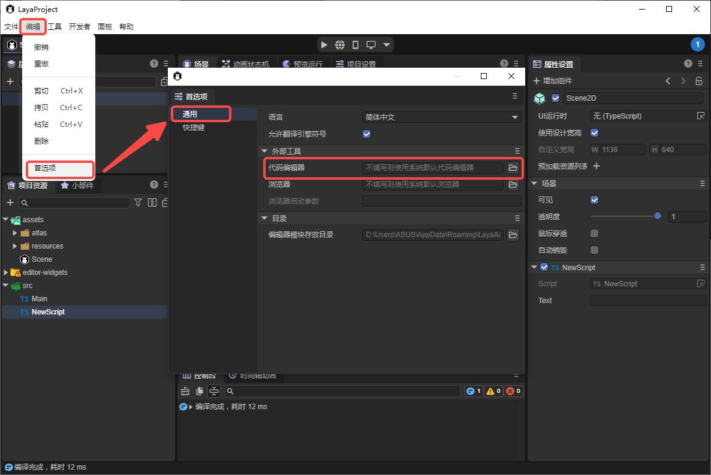
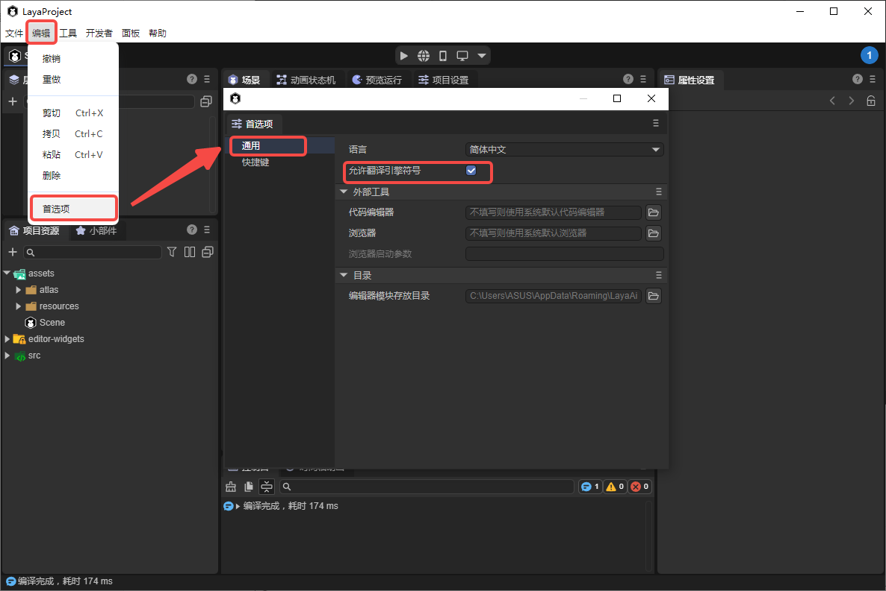
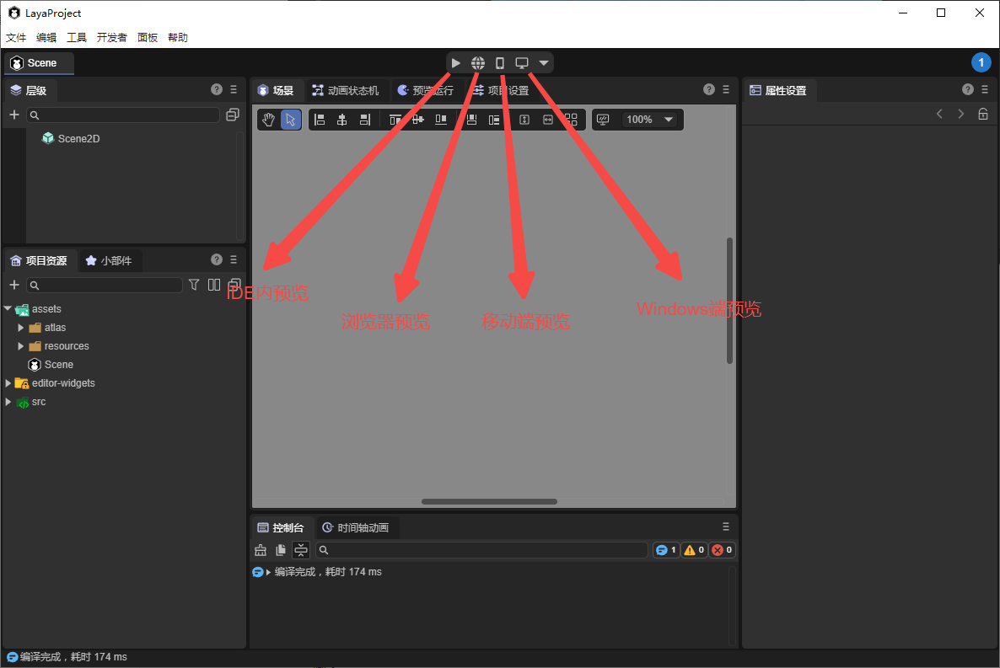
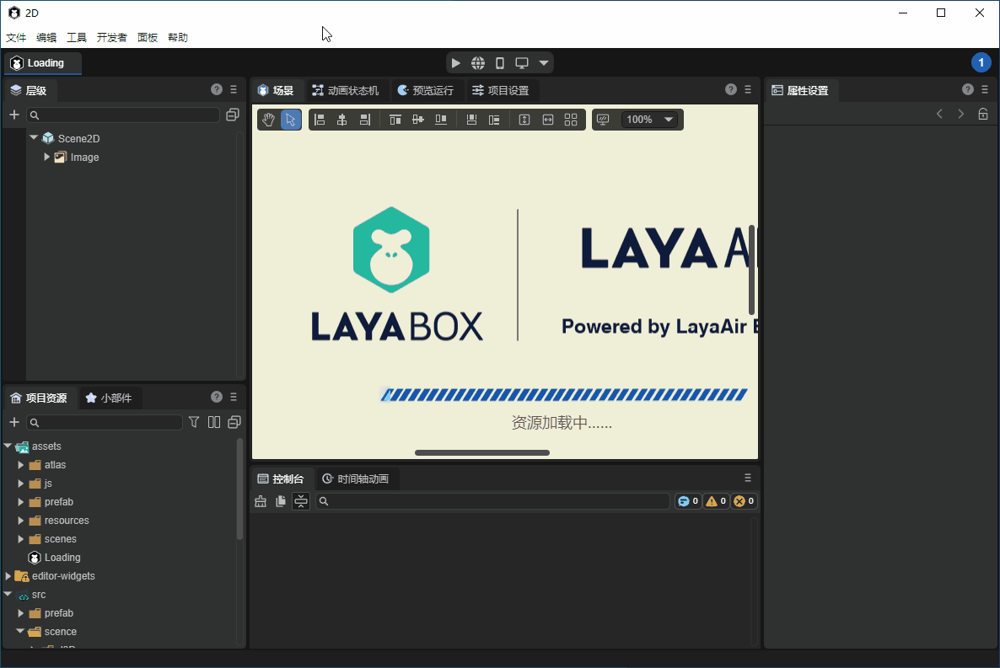
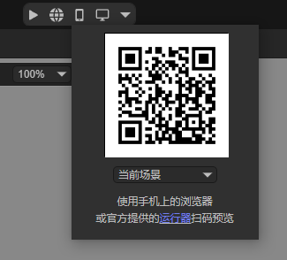
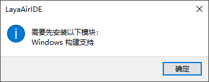
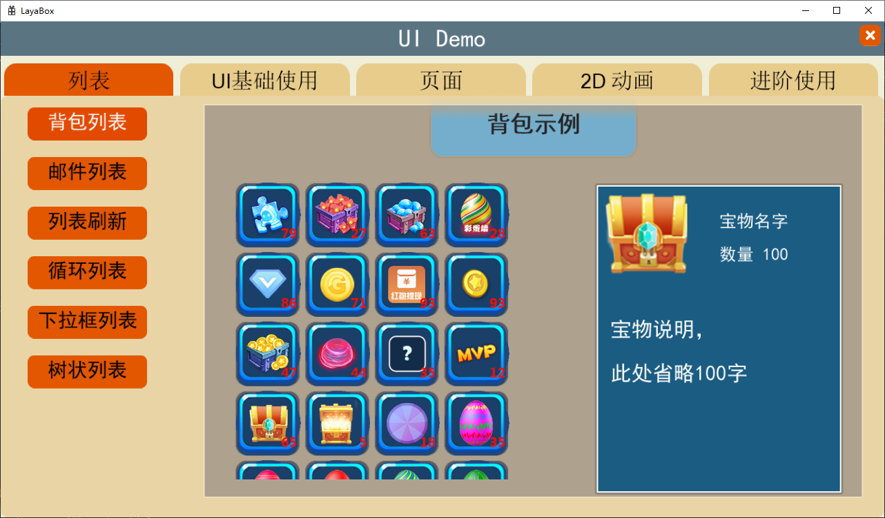
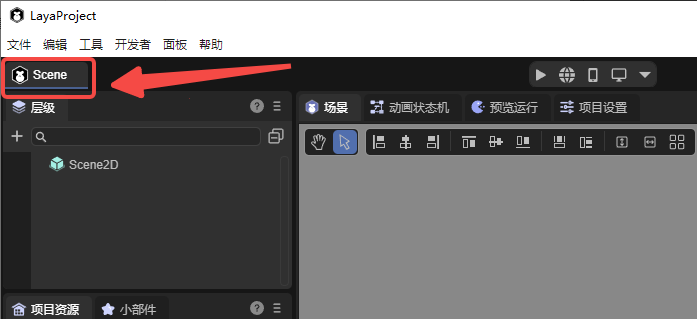
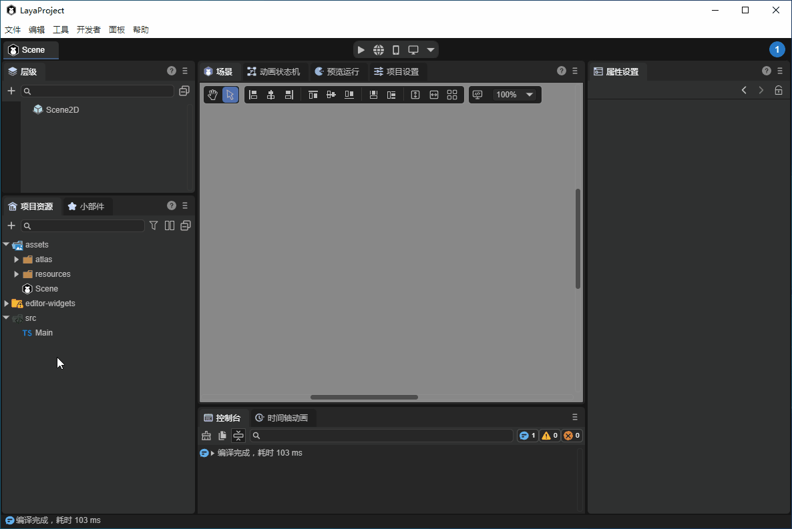
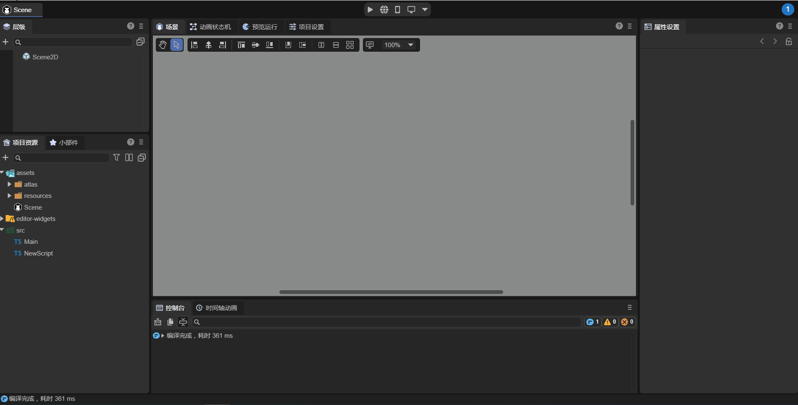

# Development Workflow: Hello World

This tutorial is designed to help developers who are new to the LayaAir engine understand the basic development workflow after setting up the development environment.

> If your environment is not yet set up, please refer to [“Setting Up the Basic Development Environment”](../../developmentEnvironment/download/readme.md).

---

## 1. Creating an Empty Project with LayaAir IDE

The LayaAir development workflow heavily relies on the **LayaAir IDE**.

The IDE (Integrated Development Environment) integrates the entire LayaAir development process, from project creation and visual editing to running previews and project publishing.

### 1.1 Creating a Project

First, open **LayaAir 3 IDE**, log in, and click **Create Project**, as shown in Figure 1-1.

In the new project creation panel, developers can choose different project templates. Here, we take a 2D or 3D empty project as an example. Enter the project name, select a project location, and click **Create Project**, as shown in Figure 1-2.

After creation, the project will automatically load and open, as shown in Figure 1-3.

A 2D empty project contains no 3D scene nodes by default, whereas a 3D empty project contains both 3D and 2D scene nodes, as shown in Figure 1-4.

### 1.2 Basic Environment Configuration

After installing the VS Code editor, the IDE usually associates itself with it automatically.

If you want to use a different editor, or if the IDE does not automatically recognize your editor, you can manually specify it in the **Preferences**, as shown in Figure 1-5.

> You can also configure the external browser used for debugging and previewing if you do not want to use the IDE's default.

### 1.3 IDE Language Settings

The LayaAir 3 IDE supports both Chinese and English. Developers can choose according to preference.

Notably, in the Chinese interface, property names can be optionally translated. Developers who prefer English property names for coding clarity, or Chinese property names for easier understanding, can check or uncheck **Translate Engine Symbols**. When unchecked, engine property names remain in English, as shown in Figure 1-6.

---

## 2. Preview and Run

Project preview allows developers to see how the project runs in different environments. LayaAir IDE provides four preview modes (version >=3.2), as shown in Figure 2-1: IDE Preview, Browser Preview, Mobile Preview, and Windows Preview.

### 2.1 IDE Preview and Debug

The IDE has a built-in browser preview environment. Clicking **IDE Preview** runs the project within the IDE. This mode allows developers to inspect node hierarchies and adjust node properties in real time, as shown in Animation 2-2.

> Example shown: "2D Beginner Example" project.

The preview panel toolbar allows adjusting resolution, zoom, reset, sound toggle, developer tools, and refresh, as shown in Figure 2-3.

### 2.2 Browser Preview

Browser Preview runs the project in an external browser, with Chrome recommended. If Chrome is not the default browser, you can select your preferred browser via **Preferences → General → External Tools → Browser**, as shown in Figure 2-4.

### 2.3 Mobile Preview

Mobile Preview allows scanning a QR code to preview the project in a mobile browser.

> Ensure that the mobile device and PC are on the same local network.

### 2.4 Windows Preview

Windows Preview runs the project in a native Windows environment, useful for testing stability or consistency in native builds.

If it’s the first time running and the native module is not installed, a prompt will appear, as shown in Figure 2-6, guiding you to install the necessary support package.

Click **OK** to install. After installation, click to preview the project, as shown in Figure 2-8.

> Example shown: "2D Beginner Example" project.

---

## 3. Entry Scene Explanation

### 3.1 Runtime Entry

LayaAir 3 runs projects based on scenes, so a pure code file cannot serve as the project entry point.

For both testing and official release, a **launch scene** must exist as the project’s entry scene. Click the icon shown in Figure 3-1 to select the preview entry scene—the scene that loads when previewing the project.

### 3.2 Current Scene

The **Current Scene** refers to the scene currently being edited. This is used only for preview testing, as shown in Figure 3-2.

### 3.3 Launch Scene

The **Launch Scene** is the project’s main entry point, typically used as a loading page to load resources and display a progress bar.

Set the launch scene via **Build & Publish → General → Launch Scene**, as shown in Figure 3-3.

After setting, the project will always start from the launch scene, both in preview mode and in the published build.

---

## 4. Scripts

Scenes support two types of scripts:

1. **UI Runtime Scripts** – only applicable to 2D UI scene root nodes.
2. **Custom Scripts** – can be used on any scene or node.

Scripts run along with the scene.

For beginners, this section uses **custom scripts** to guide developers to create and run scripts in a scene.

### 4.1 Creating a Script

Select the root node in the hierarchy panel. In the properties panel, click **Add Component → Create Script Component**, enter a name, and click **Create and Add**, as shown in Animation 4-1.

Alternatively, create a script in the resource panel and drag it to the properties panel to bind it, as shown in Animation 4-2.

### 4.2 Writing Script Code

VS Code is recommended for editing scripts. Double-clicking a script in the properties or resource panel opens it in VS Code, as shown in Figure 4-3.

In the `onAwake` lifecycle method, add the first line of code to print `"Hello, World!"`, as shown in Figure 4-4.

Return to the IDE and run the project. Check the console to see the log, as shown in Animation 4-5.

If debugging in a browser, press **F12** and view logs in DevTools.

> For more information on scripting with LayaAir’s component system, see [“Entity Component System (ECS)”](../../common/Component/readme.md).

---

## 5. Visual Development

LayaAir 3 IDE supports a variety of visual development modules. Below are links to the main modules for further exploration:

* [UI Editor](../../../IDE/uiEditor/basic/readme.md)
* [Animation Editor](../../../IDE/animationEditor/timelineGUI/readme.md)
* [2D Physics Editor](../../../IDE/physicsEditor/physics2D/readme.md)
* [3D Physics Editor](../../../IDE/physicsEditor/physics3D/readme.md)
* [2D Particle Editor](../../../IDE/particleEditor2D/readme.md)
* [3D Particle Editor](../../../IDE/particleEditor3D/readme.md)
* [Material Editor](../../../IDE/materialEditor/readme.md)
* [Shader Blueprint Editor](../../../IDE/ShaderBlueprint/blueprint/readme.md)
* [Shader Blueprint Module](../../../IDE/ShaderBlueprint/Shaderblueprint/readme.md)
* [IDE Plugin System](../../../IDE/layapackage/plug-in/readme.md)

---

## 6. Build & Publish

After development, you can publish the project. In the **Build & Publish** panel, click **Build Web**. Once completed, click **Run** to execute in a browser, as shown in Animation 6-1.

> For more on building and publishing, refer to [“General Publishing”](../../../released/generalSetting/readme.md).
