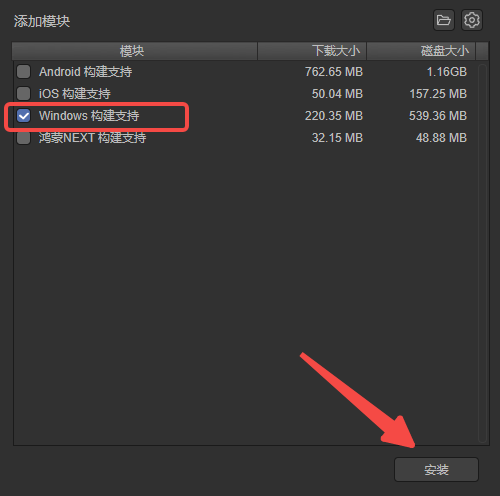

# Development Workflow: Hello World

This section aims to help developers who are new to the LayaAir engine to gain a preliminary understanding of the basic development workflow of the LayaAir engine after setting up the basic development environment.

> If the environment is not yet set up, please first check ["Setting Up the Basic Development Environment"](../../developmentEnvironment/download/readme.md).

## 1. Create an Empty Project Using LayaAir-IDE

The LayaAir development workflow relies heavily on LayaAir-IDE.

IDE is the abbreviation for Integrated Development Environment. As the name suggests, it integrates the entire workflow of LayaAir engine development from project creation to visual editing, as well as running preview and project publishing.

### 1.1 Create Project

First, open LayaAir3's IDE. After logging in, developers click on Create Project. As shown in Figure 1-1.

(Figure 1-1)

In the new project creation panel, developers can choose different project templates to create projects according to their needs. Here, we'll use a 2D or 3D empty project as an example to create an empty project. As shown in Figure 1-2, fill in the project name, select the project location, and click Create Project.

(Figure 1-2)

After creation, it will automatically load and open the created project, as shown in Figure 1-3.

(Figure 1-3)

The 2D empty project has no 3D scene nodes by default, while the 3D empty project will have both 3D scene nodes and 2D scene nodes. As shown in Figure 1-4.

(Figure 1-4)

### 1.2 Basic Environment Configuration

After developers install the Vscode coding tool, the IDE will usually associate with this coding tool automatically.

If developers want to use other coding tools, or in some cases where the IDE fails to automatically recognize the coding tool, they can also manually specify it in Preferences, as shown in Figure 1-5.

(Figure 1-5)

> For external browsers used for debugging and preview, if you don't want to use the IDE default, you can also set it here.

### 1.3 IDE Language Settings

LayaAir3's IDE supports both Chinese and English, and developers can choose freely.

It's worth mentioning that in the Chinese interface, there's support for optional translation of property names.

Considering that some developers are more accustomed to English property names for intuitive use in code, while others prefer Chinese property names for easier understanding, you can use a fully Chinese interface by checking `Translate Engine Symbols` (English property names can still be viewed in Tips), as shown in Figure 1-6. Unchecking it means engine properties will not be translated.

(Figure 1-6)

## 2. Preview and Run

Project preview is used to view the running effect of the project in different environments. LayaAir-IDE provides four modes (version >= 3.2), as shown in Figure 2-1: IDE preview, browser preview, mobile preview, and Windows preview.

(Figure 2-1)

### 2.1 IDE Preview and Debugging

The IDE has a built-in browser preview environment. Clicking on IDE preview directly shows the running effect within the IDE. In this mode, developers can more clearly view the node hierarchy after running, as well as directly adjust the effect of node property changes. As shown in Animated Figure 2-2.

(Figure 2-2)

> This effect is from the "2D Introduction Example" project.

The toolbar on the preview panel allows you to adjust preview resolution, zoom, reset, sound toggle, developer tools, and refresh. As shown in Figure 2-3.

(Figure 2-3)

### 2.2 Browser Preview

Browser preview calls the system's browser to run and debug. We usually recommend the Chrome browser. If the developer's system default is not Chrome, you can also specify a browser through `Preferences` → `General` → `External Tools` → `Browser`. As shown in Figure 2-4.

(Figure 2-4)

### 2.3 Mobile Preview

Mobile preview is used to scan QR codes with a phone to preview the real device effect running in a mobile browser. As shown in Figure 2-5.

> Note that the mobile device must be on the same local network as the computer.

(Figure 2-5)

### 2.4 Windows Preview

Windows preview is a preview mode based on the Windows native exe environment, usually used to check whether the Native installation package runs stably or performs consistently.

If running for the first time and the corresponding native module is not installed, a prompt will appear as shown in Figure 2-6. First install the environment build support package.

(Figure 2-6)

After clicking OK, it will automatically prompt for installation. Click Install.

(Figure 2-7)

After installation is complete, click to view the running effect, as shown in Figure 2-8.

(Figure 2-8)

> This effect is from the "2D Introduction Example" project.

## 3. Entry Scene Description

### 3.1 Running Entry

The LayaAir3 engine is scene-based and cannot set a pure code as the project entry.

In other words, whether for testing or official release, there must be an entry scene as the first scene to start when the project runs.

Click the icon shown in Figure 3-1 to select the preview running entry, which is the scene to load and run after clicking preview run.

(Figure 3-1)

### 3.2 Current Scene

`Current Scene` refers to the scene currently being edited. As shown in Figure 3-2, this is the current scene. This mode is only used for preview testing.

(Figure 3-2)

### 3.3 Startup Scene

The startup scene is the entry scene for the entire project, usually used for the loading page where game resources are loaded and the progress bar is displayed.

To set the startup scene, open `Build & Publish` → `General` → `Startup Scene`, as shown in Figure 3-3.

(Figure 3-3)

After setting, whether previewing with `Startup Scene` checked or building the project (publishing the product), the startup scene will be used as the project running entry scene.

## 4. Scripts

Scenes support two types of scripts: UI runtime, which only supports use on the root node of 2D UI scenes; and custom scripts, which can be used on any scene and node. Whichever developers choose, the script logic will execute as the scene runs.

For beginners, this section uses custom scripts as an example to guide developers in creating scripts on scenes and running those scripts.

### 4.1 Create Script

Developers first select the root node in the hierarchy panel, then in the property panel, click `Add Component` and `New Component Script`, then `Enter Name`, and click `Create and Add`. As shown in Animated Figure 4-1, this completes the script creation and the operation of binding the script to the scene.

(Figure 4-1)

In addition to this method, we can also create scripts in the project resource panel, then drag the script to the property panel to bind the component. The operation is shown in Animated Figure 4-2.

(Figure 4-2)

### 4.2 Script Coding

The script coding environment has been introduced earlier. We recommend using Vscode for coding. When we double-click the script in the property panel or the script in the resource panel, Vscode coding tool will open, as shown in Figure 4-3.

(Figure 4-3)

After entering the vscode coding tool, we add the first line of code in the onAwake lifecycle method to print "Hello, World!", as shown in Figure 4-4.

(Figure 4-4)

Return to LayaAir-IDE and run to view the console. As shown in Animated Figure 4-5, you can see the log printed.

(Figure 4-5)

If using a browser for debugging, press F12 to view logs in DevTools.

(Figure 4-6)

For more information on script writing based on the LayaAir component system, be sure to check the document ["Entity Component System (ECS)"](../../common/Component/readme.md).

## 5. Visual Development

LayaAir3-IDE supports rich visual development modules. Here are some links to main functional module documents that developers can check one by one when they have time.

[UI Editor Module](../../../IDE/uiEditor/basic/readme.md)

[Animation Editor Module](../../../IDE/animationEditor/timelineGUI/readme.md)

[2D Physics Editing](../../../IDE/physicsEditor/physics2D/readme.md)

[3D Physics Editing](../../../IDE/physicsEditor/physics3D/readme.md)

[2D Particle Editing](../../../IDE/particleEditor2D/readme.md)

[3D Particle Editing](../../../IDE/particleEditor3D/readme.md)

[Material Editor Module](../../../IDE/materialEditor/readme.md)

[Program Blueprint Editor Module](../../../IDE/ShaderBlueprint/blueprint/readme.md)

[Shader Blueprint Editor Module](../../../IDE/ShaderBlueprint/Shaderblueprint/readme.md)

[IDE Plugin System](../../../IDE/layapackage/plug-in/readme.md)

## 6. Build & Publish

When development is complete, the project can be published. In the "Build & Publish" panel, click "Build Web". After building, click Run, and it will run in the browser.

(Figure 6-1)

> For more build and publish content, please refer to ["General Publishing"](../../../released/generalSetting/readme.md).
