# Engine Modules

> Author: Charley

LayaAir Engine adopts a modular design with the core goal of **achieving optimal balance between on-demand loading and high performance**. By stripping non-essential features from the base engine, it effectively reduces engine package size and improves loading speed. At the same time, relying on a highly decoupled architecture, complex modules like physics and rendering can run independently and be flexibly extended, thereby supporting high-performance real-time interactive experiences with lower overhead in resource-constrained runtime environments.

In the IDE, engine modules are divided into **2D, 3D, Common**, and **Other** module groups based on functional attributes, making it easy for developers to quickly locate and manage required features. The engine core library is a basic dependency and must be used, so it's not included in the optional module list.

In the module options, **New UI System** and **3D Core Module** are checked by default. If the project doesn't use UI features, or is a pure 2D project, developers can uncheck the corresponding modules as needed to further streamline the package and reduce runtime overhead.

For most common feature modules, when developers create or add related components in the IDE, the IDE automatically detects the current engine library's check status. If not enabled, it automatically checks the corresponding module (deleting components won't automatically uncheck them).

It should be noted that if developers only use certain engine features in code without creating corresponding components through the IDE interface, they need to manually check the corresponding engine modules to ensure the related functions work properly.

## 1. 2D Module Group

The 2D module group contains engine feature modules commonly used in 2D project development, as shown in Figure 1-1. Developers can check them as needed based on project requirements.

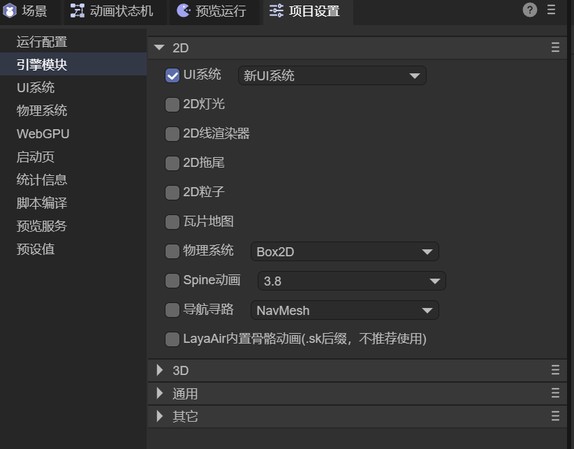

(Figure 1-1)

### 1.1 UI System

The UI System encapsulates a set of common UI components and layout capabilities based on the sprite system to improve interface design and layout efficiency.

In the module options, **New UI System** is checked by default. For compatibility with historical projects and old usage habits, developers can also choose **Classic UI System**, or **enable both UI systems simultaneously**. Note that using both UI systems simultaneously will increase the final build package size, as shown in Figure 1-2.

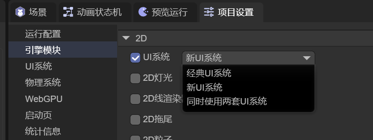

(Figure 1-2)

### 1.2 2D Lighting

The 2D lighting module supports lighting effects in 2D scenes. When using 2D lighting-related components, this module must be enabled.

When adding a 2D lighting component in the IDE, the system automatically checks the corresponding engine library, as shown in Figure 1-3.

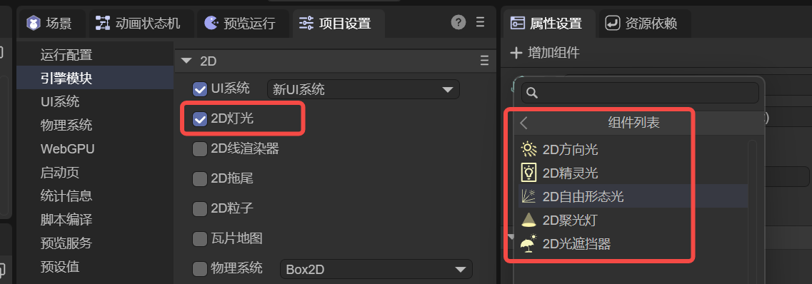

(Figure 1-3)

### 1.3 2D Line Renderer

The 2D line renderer module is used for drawing line segments and path effects.

When using the 2D line renderer component, this module is required and will be automatically enabled when adding components in the IDE, as shown in Figure 1-4.

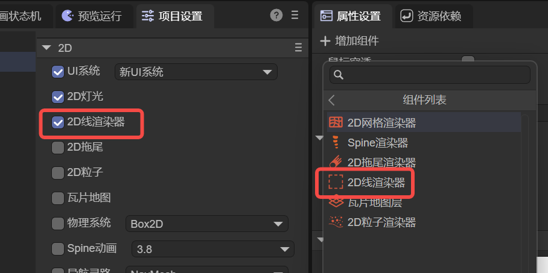

(Figure 1-4)

### 1.4 2D Trail

The 2D trail module is used for implementing motion trail-type visual effects.

When using the 2D trail renderer component, this module must be checked. The IDE will automatically complete the check when adding components, as shown in Figure 1-5.

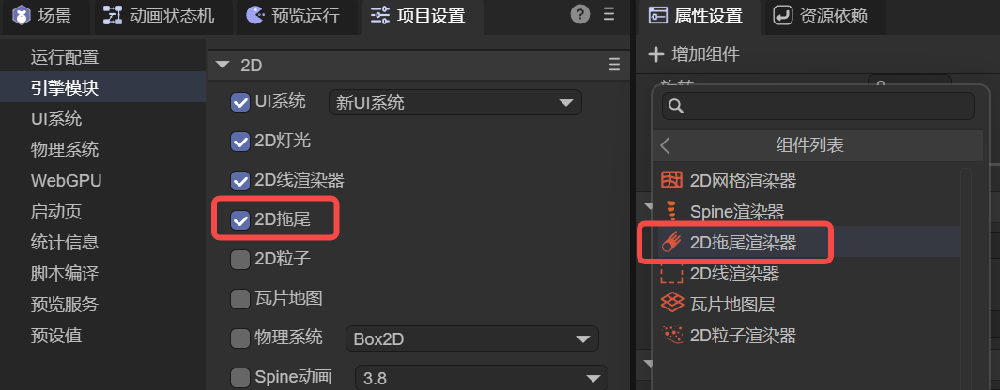

(Figure 1-5)

### 1.5 2D Particles

The 2D particle module supports the rendering and playback of 2D particle systems.

When using the 2D particle renderer component, this module must be enabled. The IDE will automatically detect and check it, as shown in Figure 1-6.

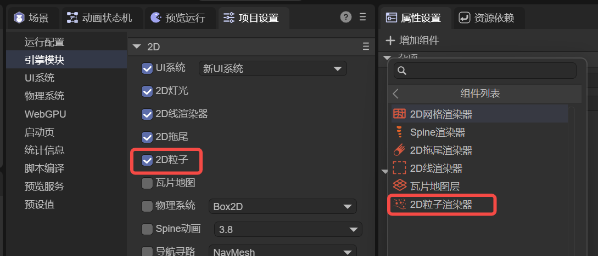

(Figure 1-6)

### 1.6 Tile Map

The tile map module supports TileMap scene structure.

When using the tile map layer component, this module is required and will be automatically checked when the IDE adds components, as shown in Figure 1-7.

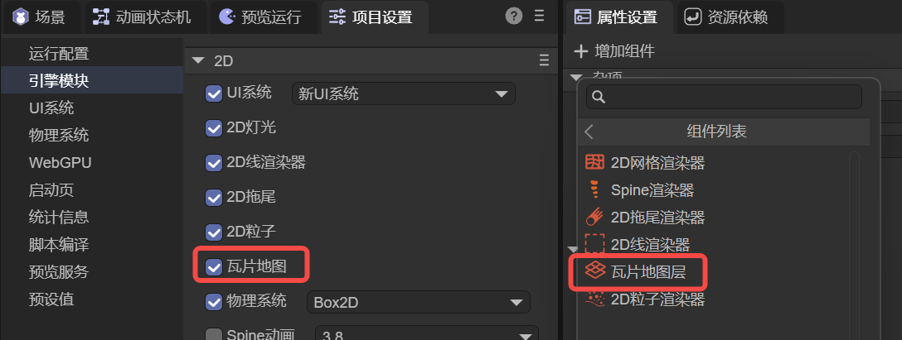

(Figure 1-7)

### 1.7 Physics System

LayaAir integrates **Box2D Physics Engine** by default, providing both **JavaScript version** and **Wasm version**. Developers can choose as needed, as shown in Figure 1-8.

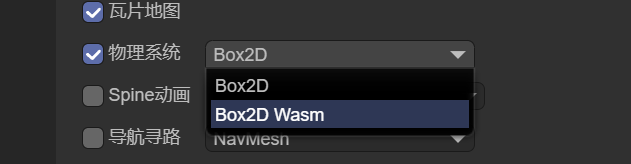

(Figure 1-8)

Developers can choose the JS or Wasm version themselves, or even customize the 2D physics system (for details, refer to the documentation: [Custom Physics Engine](../../../../3D/advanced/customPhysicsEngine/readme.md))

The physics system module must be enabled when using any physics-related components. The IDE will automatically check the corresponding engine library when adding physics components, as shown in Figure 1-9.

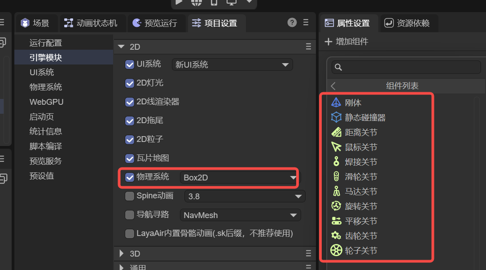

(Figure 1-9)

### 1.8 Spine Animation

The Spine animation module is a runtime implementation adapted and performance-optimized based on Spine's official JavaScript runtime library, currently supporting **Spine 3.7–4.2** versions, as shown in Figure 1-10.

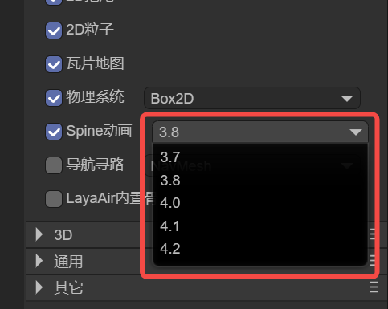

(Figure 1-10)

When using the Spine renderer component, the corresponding Spine animation module must be checked. The IDE will automatically complete the check, as shown in Figure 1-11.

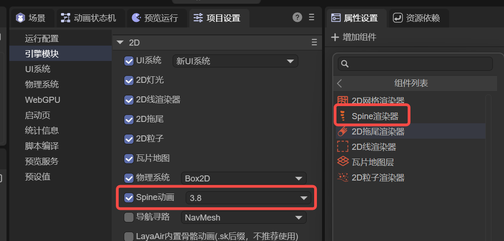

(Figure 1-11)

Note that the selected Spine module version must be consistent with the Spine resource version. Multiple Spine animation versions cannot be mixed, otherwise animation resources won't play properly.

### 1.9 Navigation and Pathfinding

The navigation and pathfinding module supports path search and navigation logic in 2D scenes.

When using navigation and pathfinding-related components, this module must be enabled. The IDE will automatically check it when adding components, as shown in Figure 1-12.

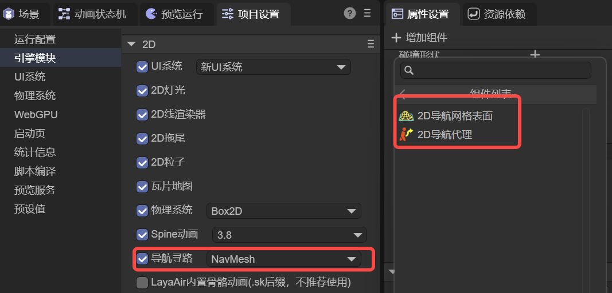

(Figure 1-12)

The navigation and pathfinding module also provides **JS version** and **Wasm version**. The JS version is used by default, and developers can switch as needed, as shown in Figure 1-13.

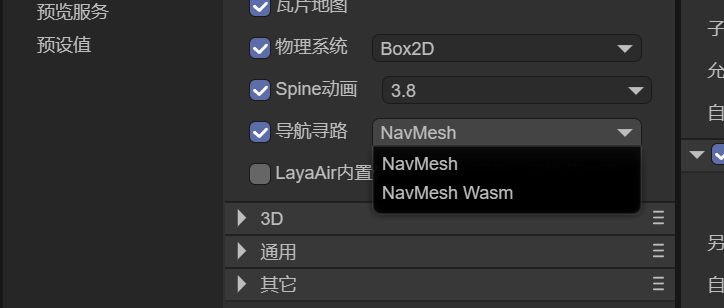

(Figure 1-13)

### 1.10 Built-in Skeletal Animation

The built-in skeletal animation module is mainly used to be compatible with skeletal animation solutions from older LayaAir versions, converting Spine or DragonBones animations to `.sk` format for use.

Since this solution has relatively limited support for Spine and DragonBones animation features, and some advanced features cannot be used, **it is only recommended to enable when compatible with historical projects**. For new projects, prioritize using the Spine animation runtime module.

## 2. 3D Module Group

The 3D module group contains engine feature modules commonly used in 3D project development, as shown in Figure 2-1. Developers can check them as needed based on project requirements.

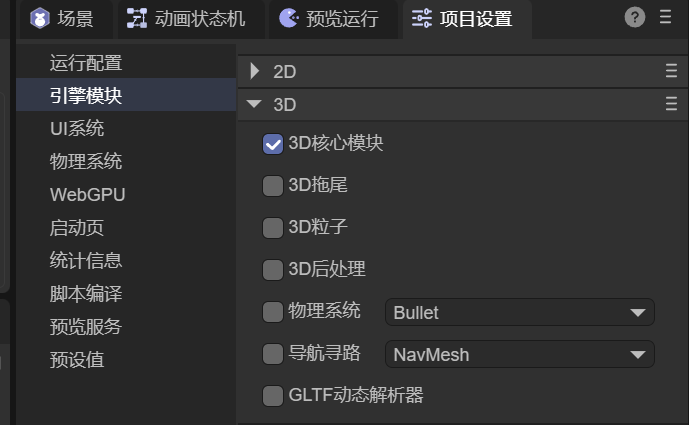

(Figure 2-1)

### 2.1 3D Core Module

The 3D core module is the base engine library **required for all 3D projects**.

If the project is a pure 2D project, you can uncheck this module to reduce unnecessary package size and runtime overhead.

### 2.2 3D Trail

The 3D trail module supports trail rendering effects in 3D scenes.

When using the 3D trail component, this module is required and will be automatically detected and checked when adding components in the IDE, as shown in Figure 2-2.

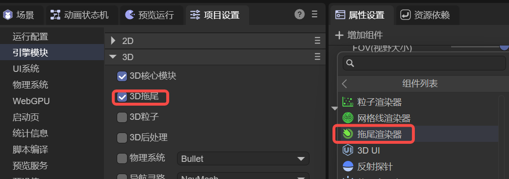

(Figure 2-2)

### 2.3 3D Particles

The 3D particle module supports the rendering and playback of 3D particle systems.

When using the 3D particle renderer component, this module must be enabled. The IDE will automatically complete the check when adding components, as shown in Figure 2-3.

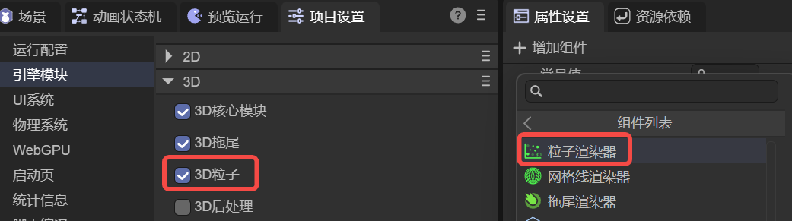

(Figure 2-3)

### 2.4 3D Post Processing

The 3D post-processing module supports camera post-processing effects.

When enabling 3D camera post-processing and creating a post-processing instance, this module is required and the IDE will automatically check the corresponding engine library, as shown in Figure 2-4.

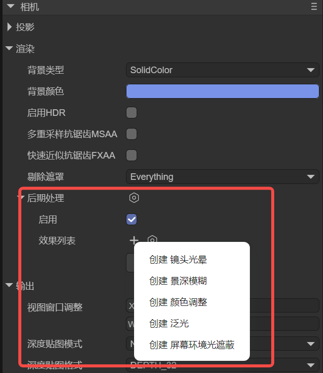

(Figure 2-4)

### 2.5 Physics System

The 3D physics system module includes multiple mainstream physics engine implementations, including **Bullet** and **PhysX**, providing both **JavaScript version** and **Wasm version**, as shown in Figure 2-5.

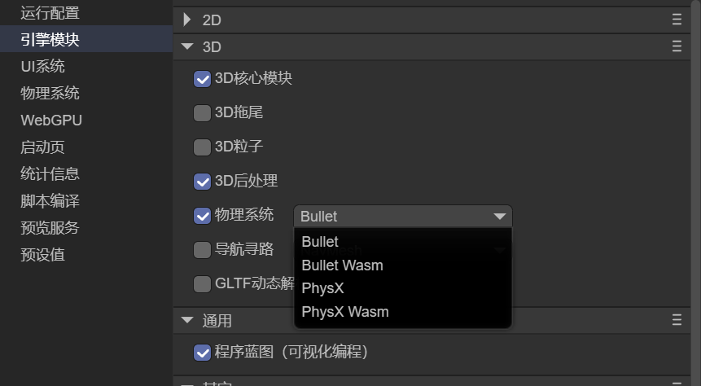

(Figure 2-5)

Developers can choose the JS or Wasm implementation of the corresponding physics engine based on performance requirements and platform environment. It also supports custom 3D physics systems. (For details, refer to the documentation: [Custom Physics Engine](../../../../3D/advanced/customPhysicsEngine/readme.md))

When using any 3D physics-related components, this module must be enabled. The IDE will automatically check it when adding components, as shown in Figure 2-6.

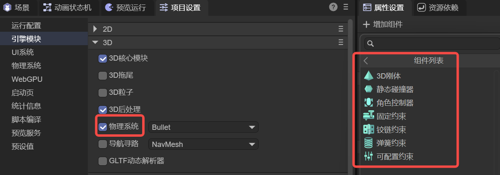

(Figure 2-6)

### 2.6 Navigation and Pathfinding

The 3D navigation and pathfinding module supports path search and navigation functions in 3D scenes.

When using 3D navigation and pathfinding-related components, this module is required and will be automatically checked when adding components in the IDE, as shown in Figure 2-7.

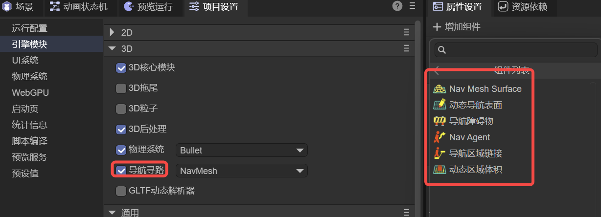

(Figure 2-7)

This module also provides **JavaScript version** and **Wasm version**. The JS version is used by default, and developers can switch as needed, as shown in Figure 2-8.

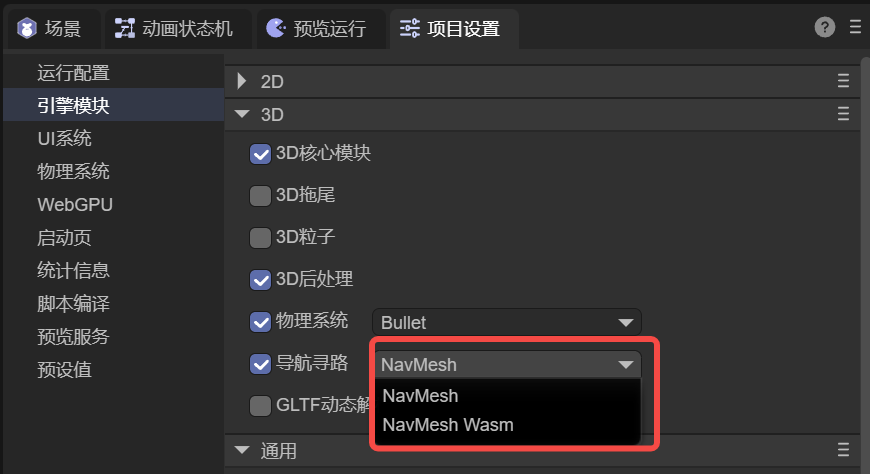

(Figure 2-8)

### 2.7 GLTF Dynamic Parser

When using glTF resources directly in the IDE, you don't need to enable the **GLTF Dynamic Parser** module.

Only when dynamically loading and parsing glTF model resources through code do you need to check this module to support runtime parsing of glTF resources.

## 3. Common Module Group

The common module group contains general engine feature modules that can be applied to both **2D and 3D projects**. Currently, the common module group only includes the **Program Blueprint Module**.

### 3.1 Program Blueprint

The program blueprint module supports visual programming, helping developers complete logic construction with little or no code through node-based logic editing, thereby improving development efficiency and project maintainability.

When using program blueprint features in a project, this module must be enabled.

## 4. Other Module Group

### 4.1 Hardware Device Support

After enabling the hardware device support module, the project can call relevant Web APIs provided by the browser to access hardware device capabilities such as **gyroscopes, accelerometers, geolocation, cameras, and microphones**.

### 4.2 Worker Async Loader

The Worker async loader module supports **WorkerLoader** async resource processing capabilities, mainly used for decoding image resources in Web Workers to reduce main thread load and improve runtime performance.

### 4.3 2.x Version File Format Support

This module supports code **dynamic loading of LayaAir 2.x engine format** `.ls` and `.lh` files.

Note that this module doesn't affect the use of LayaAir 2.x format resources in the IDE. Even if this module is not checked, corresponding format resource files can still be used normally in the IDE.

### 4.4 TiledMap Support

The TiledMap support module is used to **directly load and use third-party TiledMap map resources in code**.

If TiledMap map resources are imported into the IDE and used through the IDE's built-in **Tile Map Layer** component, you only need to check the corresponding tile map layer module. There's no need to enable this module.
