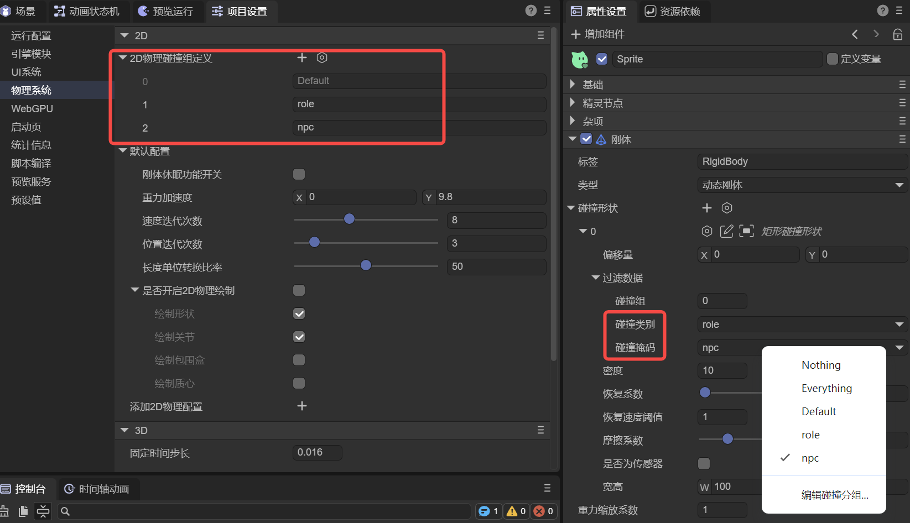
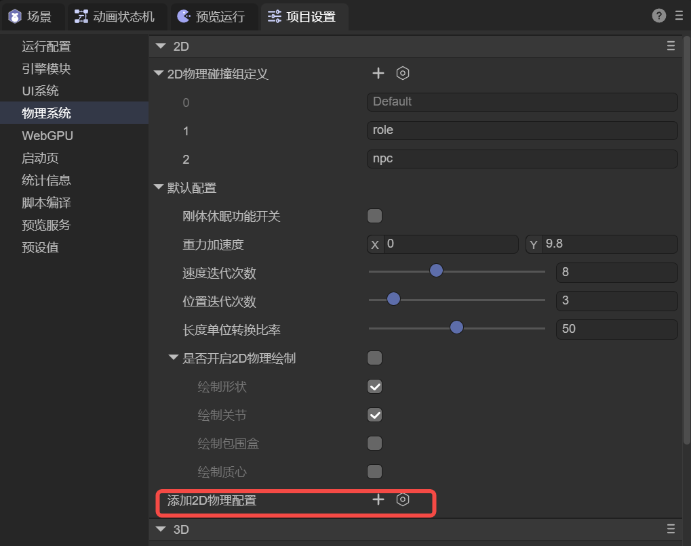
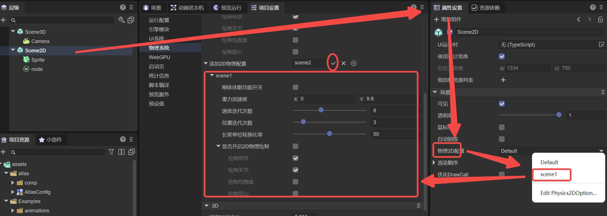
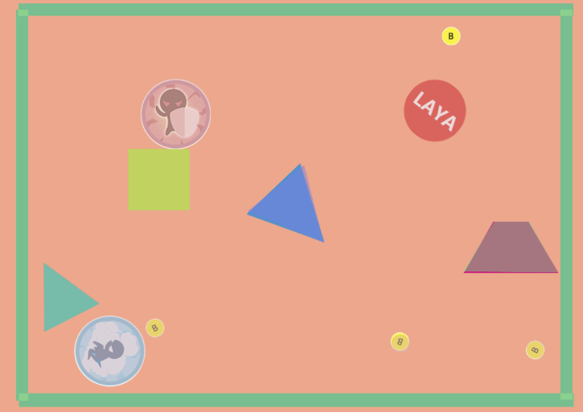
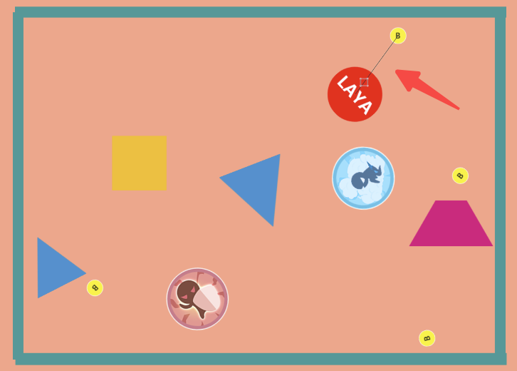
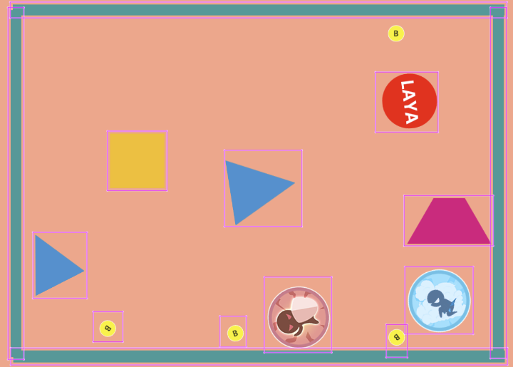
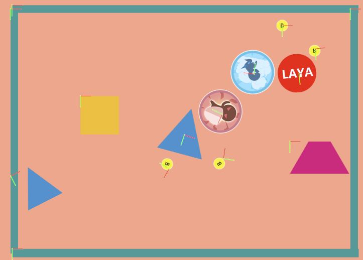
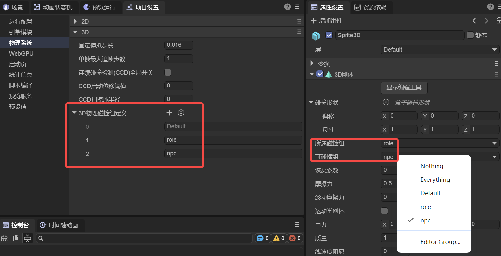

# Physics System Project Settings

> Author: Charley

LayaAir Engine supports both **2D and 3D physics systems**. In the default implementation, the engine has adapted mainstream physics engine solutions:

- **2D Physics**: Box2D
- **3D Physics**: Bullet and PhysX

Additionally, LayaAir supports **custom physics engine integration** to meet specific project or industry scenario requirements.

In the project settings' **Physics System** configuration section, global setting entries for 2D and 3D physics are provided to uniformly manage physics-related global parameters.

## 1. 2D Physics

### 1.1 2D Physics Collision Group Definition

2D physics collision group definition is used for visual and semantic management of **physics collision grouping**, which is an easy-to-use encapsulation of the underlying bitmask mechanism.

Without using collision group definitions, you typically need to directly manipulate collision masks through code. Example code is as follows:

```typescript
//Directly specify xxx collider can collide with a collision category (group)
xxx.mask = 1 << 2;  //Only collide with group ID 2 (value 4)

//Use bitwise OR to specify xxx collider can collide with multiple collision categories (groups)
xxx.mask = (1 << 1) | (1 << 2) | (1 << 5); //Only collide with groups 1, 2, 5

//Use bitwise negation to exclude specified collision groups
xxx.mask = ~((1 << 3) | (1 << 6)); // Don't collide with groups 3, 6; can collide with all others except 3 and 6
//-1 in bitwise operations means all bits are 1 (32-bit mask), use XOR to zero specified group bits
xxx.mask = -1 ^ (1 << 3) ^ (1 << 6)  //Don't collide with groups 3, 6; can collide with all others except 3 and 6
```

Although this approach is flexible, it's **not intuitive in the IDE's visual configuration environment** and not conducive to project maintenance.

To address this, LayaAir provides **2D Physics Collision Group Definition** functionality, converting number and bitwise operation-based grouping into **named tag form**, significantly improving readability and usability.

As shown in Figure 1-1, developers can add two groups in the collision group definition, such as `role` and `npc`, and set for the character object's rigid body collision shape:

**Collision Category**: `role`

**Collision Mask**: `npc`



(Figure 1-1)

This configuration indicates: `role` type colliders can collide with `npc` type colliders. When another object's collision category is set to `npc`, the two can normally produce a collision relationship in the physics world.

The entire configuration process is intuitive and clear, avoiding the understanding cost of directly manipulating bitmasks.

In terms of operation:

- Click **"+"** to add a new collision group definition;
- Click the delete icon before the ID to remove the corresponding collision group definition.

### 1.2 Default Configuration and Custom 2D Physics Configuration

In **Default Configuration**, the engine provides a set of global 2D physics parameter settings. Since the specific parameters included in default configuration and custom configuration are completely identical, related parameter descriptions will be introduced uniformly in subsequent sections.

This section focuses on **enabling and using custom 2D physics configuration**.

At the bottom of the 2D physics settings interface, an **"Add 2D Physics Configuration"** entry is provided, as shown in Figure 1-2.



(Figure 1-2)

After clicking **"+"**, you can create a custom configuration group. This group will have a set of **independent 2D physics global parameters** and can be selected and applied in the scene's 2D root node (Scene2D), as shown in Figure 1-3.



(Figure 1-3)

This way, developers can **use different physics global configurations in different scenes**, thereby meeting the needs of multi-level, multi-gameplay, or different physics rule coexistence, with significantly improved overall flexibility.

### 1.3 Rigid Body Sleep Enable `allowSleeping`

When this option is enabled, it allows rigid body properties to determine whether to sleep. When this option is disabled, all rigid bodies cannot be set to sleep. Enabling sleep for rigid bodies can save performance overhead but affects sensitivity when moving or subjected to external forces. Whether to enable sleep depends on specific needs and performance trade-offs.

### 1.4 Gravity Acceleration `gravity`

Gravity is a force that simulates the attraction of objects on the Earth's surface. Gravity is affected by two parameters: mass and acceleration. This setting is the gravity acceleration parameter. The XY values of this parameter affect the direction of gravity. X represents horizontal gravity, Y represents vertical gravity. Usually only vertical gravity is used. On the Earth's surface, the gravity acceleration value is 9.8, corresponding to 9.8 meters/second² (m/s²) in the real world.

### 1.5 Velocity Iterations `velocityIterations`

**Velocity Iterations (`velocityIterations`)** is a key parameter for each physics world update, used to control the number of iterations in the velocity constraint solving stage. This parameter directly affects collision response, friction effects, and joint system stability, and is an important adjustment factor between physics simulation accuracy and runtime performance.

Box2D uses an iterative numerical method based on **Sequential Impulse** to solve complex physics constraint systems. Since scenes often have multiple collision contact points, joint constraints, and objects with different masses and inertias simultaneously, the physics system cannot obtain an exact solution in a single calculation. Therefore, the engine gradually propagates and corrects impulses through multiple iterations to approach a relatively stable and reasonable solution within the current time step, thereby obtaining credible physics effects while ensuring real-time performance.

In each physics time step, Box2D's constraint solving process is mainly divided into two stages. The first stage is the **velocity constraint solving stage**, used to calculate and correct objects' linear and angular velocities under collision, friction, and joint effects. The second stage is the **position constraint solving stage**, used to correct object overlap and position deviations caused by numerical errors. **Velocity Iterations (`velocityIterations`)** only affects the first stage and is **used to determine the number of times velocity constraint solving is repeatedly executed**.

The core goal of the velocity constraint solving stage is not simply to calculate velocity values, but to make the impulses generated by each contact point and joint in the system gradually reach consistency and balance through multiple iterations. As the number of velocity iterations increases, the distribution of collision impulses and friction forces becomes more stable, and the interaction between objects becomes closer to real physical behavior. This typically manifests as smoother collision response, more stable object stacking, and significantly reduced joint system jitter.

It should be noted that the improvement of penetration problems by velocity iteration count is an **indirect effect**. By improving the stability of velocity solutions, it reduces the probability of unreasonable penetration continuing in the next frame, but it's not directly responsible for geometric-level overlap correction. What truly fixes object overlap and position errors is the position constraint solving stage, namely **position iterations (`positionIterations`)**. Therefore, when serious penetration or instability problems occur, you should comprehensively consider time step settings, object mass ratios, and position iterations, rather than just relying on increasing velocity iterations.

In actual projects, Box2D officials and the industry generally recommend setting **velocity iterations (`velocityIterations`)** to **8**, which achieves a good balance between stability and performance in most games and interactive scenarios. In performance-constrained platforms (such as mobile devices) or scenarios with lower physics complexity, it can be appropriately reduced to **6** to reduce CPU overhead; in scenarios with higher physics accuracy and stability requirements (such as physics puzzle games or systems containing complex joint structures), it can be increased to **10–12** for more reliable physics performance.

**Velocity iterations (`velocityIterations`)** is an engineering parameter used to adjust physics simulation quality. There's no "the larger the value, the better" scenario. When iterations exceed a certain threshold, computational costs continue to increase while physics performance improvements gradually diminish. In actual use, you should combine specific gameplay requirements, target device performance, and overall physics parameter configuration, and choose the most appropriate value range through testing and optimization.

### 1.6 Position Iterations `positionIterations`

**Position Iterations (`positionIterations`)** is a key parameter in the 2D physics system for each simulation step (Step), used to control the number of iterations in the **position constraint solving stage**. This parameter determines the strength and degree to which the physics engine corrects position errors generated by collisions, stacking, and joint constraints within a single time step.

Its core problem to solve is: when rigid bodies collide, stack, or are connected by joints, the system must not only calculate "how velocity changes" (velocity constraints), but also correct position errors that have already occurred (such as slight penetration, stacking subsidence, joints being stretched/jittered). The higher the positionIterations, the better it can converge these "position-level" errors within a single step, manifesting as less penetration/subsidence, more stable stacking, and joints less likely to jitter or stretch. The cost is higher CPU consumption per solving step.

When understanding and using it, don't treat it as an isolated knob. Delta and subStep in the engine significantly affect stability: when frame rate is low or fluctuation causes larger single-step displacement, penetration and jitter are more likely to occur. In this case, increasing subStep is often more effective than simply cranking positionIterations very high, combined with appropriately increasing positionIterations to converge position errors. Meanwhile, **velocity iterations (`velocityIterations`)** leans more towards collision response, friction, and joint velocity constraint convergence, and the two need to be adjusted together.

In application scenarios, the default value of 3 leans towards "balance between performance and effect," suitable for lightweight collisions and low-speed movement. If you have obvious box stacking subsidence, chain/vehicle suspension or other joint structure jitter or stretching, obvious overlap after high-speed motion contact, and other stability issues, you can use small incremental steps (e.g., 4→6→8) to observe improvement amplitude while monitoring performance changes; if problems mainly occur during frame drops, prioritize checking if you need to increase subStep or improve frame time stability, then decide whether to increase this parameter.

### 1.7 Length Unit Conversion Ratio `pixelRatio`

The length unit conversion ratio (`pixelRatio`) is used to define the conversion ratio between rendered pixels (px) and 2D physics world length units (Box2D's "meters"). The default value is 50, meaning: physics world 1 length unit ≈ rendered 50 pixels. From the developer's perspective, sprite positions, collision box widths/heights, joint anchor points, etc. that you see in the scene are usually intuitively in "pixel" units, while the physics engine internally is more suitable for calculations in "meter" units with stable magnitude. pixelRatio is the bridge that aligns the two.

In the engine source code, this ratio is read and cached by Physics2DWorldManager as `_pixelRatio` and `_RePixelRatio=1/_pixelRatio`, used for coordinate/length bidirectional conversion. It's also written to box2DWorld._pixelRatio for use by WASM physics factories when creating shapes, joints, rigid bodies, etc. The conversion relationship can be intuitively understood as: `physics value (meters) = pixel value / pixelRatio, pixel value = physics value (meters) * pixelRatio`.

#### 1.7.1 What It Affects

pixelRatio affects "all places that need to convert pixel quantities to physical quantities": rigid body positions and linear velocities, shape dimensions (box/circle/polygon vertices), joint anchor points and joint lengths/movement ranges, raycast/query inputs and outputs (hit points are converted back to pixels), and debug drawing display positions when converting from physics coordinates back to screen coordinates. In the source code, physics2DwasmFactory.convertLayaValueToPhysics() directly uses 1/world._pixelRatio for scaling, meaning as long as your input data is in pixel units, it will be converted according to this ratio before entering Box2D.

A key point accompanying this is gravity: the engine uses gravity values directly as Box2D's gravity vector (default 9.8, understood as "meters/second²"). When pixelRatio=50, 9.8 m/s² in screen intuition approximately equals 9.8×50=490 px/s²; if you change pixelRatio, the "pixel representation of falling speed" you see will change linearly (because the pixel-to-meter mapping has changed).

#### 1.7.2 Typical Application Scenarios and Recommended Usage

In most 2D games/interactive applications, the default pixelRatio=50 is usually a good starting point: for example, character heights of 50~100px can correspond to 1~2m physics height, both intuitive and relatively stable. If your project's overall art ratio is larger (e.g., character 300px tall) or smaller (e.g., pixel style 16px/32px), you can adjust pixelRatio so "character height converted to meters" still falls within a reasonable range, rather than making characters in the physics world giants of tens of meters or dots of a few centimeters.

When you encounter scenarios that "need more stability" (e.g., dense stacking, complex joint chains, relatively high-speed motion), prioritize not using pixelRatio to "force save stability," because it's a scale definition rather than solver precision parameter. More appropriate is to work with subStep, velocityIterations, positionIterations, and other solver parameters to improve stability; pixelRatio should only be adjusted when you confirm "overall scale is unreasonable," otherwise it affects everything (physical meaning of all length/velocity/joint parameters will change).

### 1.8 Enable 2D Physics Debug Draw `debugDraw`

When 2D nodes have physics properties (such as rigid bodies, colliders, joints, etc.) added, enabling **2D Physics Debug Draw (`debugDraw`)** can display physics system debug information in the scene in real-time, including collision shapes, joint connection relationships, and related auxiliary visual elements.

This feature is mainly used for physics debugging and parameter calibration. It can intuitively reflect the actual calculation results of physics data in the engine, helping quickly locate collision anomalies, joint configuration errors, and stability issues. It's usually only recommended to enable during development and debugging.

#### 1.8.1 Draw Shapes `drawShape`

Whether to draw physics collision shapes, default is enabled.

When enabled, the scene displays the actual shapes participating in physics calculations used by rigid bodies, such as collision boxes, circles, polygons, etc., as shown in Figure 1-4. Through this visual information, you can intuitively confirm whether collider size, position, and rotation align with art nodes, often used to troubleshoot "looks like it hit but didn't trigger collision" or "collision range abnormal" issues.



(Figure 1-4)

#### 1.8.2 Draw Joints `drawJoint`

Whether to draw physics joints, default is enabled.

When enabled, it displays the connection relationship and constraint positions at both ends of the joint in the form of lines or auxiliary graphics, as shown in Figure 1-5, making it easy to observe whether joints are correctly connected to target rigid bodies, and whether abnormal stretching, jitter, or breakage occurs during force or movement. This option is particularly useful when debugging chain, vehicle, pendulum, and other joint structures.



(Figure 1-5)

#### 1.8.3 Draw AABB `drawAABB`

Whether to draw axis-aligned bounding boxes (AABB) of physics objects, default is disabled.

When enabled, it displays the bounding box range used for broad-phase collision detection, as shown in Figure 1-6, helping analyze the area where objects participate in detection in the physics system. When performance issues occur, abnormal collision triggers, or you suspect collision detection range is too large, you can use this option to help locate the cause.



(Figure 1-6)

#### 1.8.4 Draw Center of Mass `drawCenterOfMass`

Whether to draw the rigid body's center of mass position, default is disabled.

When enabled, it displays the mass center point on the rigid body, as shown in Figure 1-7. This information is very helpful for analyzing object force, rotation behavior, and stability, especially when rigid body shape is asymmetric, mass distribution is abnormal, or rotation results don't meet expectations. It can be used to determine whether to adjust collision shapes or mass parameters.



(Figure 1-7)

## 2. 3D Physics

### 2.1 Fixed Time Step `fixedTimeStep`

**Fixed Time Step (`fixedTimeStep`)** is used to define **the time length corresponding to a single physics simulation step (Step)** in the physics world (unit: seconds). The physics system doesn't directly use the render frame's `deltaTime` for solving, but always advances simulation with this fixed time slice, thereby reducing the impact of frame rate fluctuations on physics results.

In the engine implementation, elapsed real time is accumulated each frame and divided into complete physics steps according to `fixedTimeStep`. When frame rate is high, physics steps may not need to be executed within a single frame; when frame rate is low, multiple physics steps may be executed within a single frame to "catch up" to real time. Therefore, `fixedTimeStep` actually determines **physics simulation time precision and update frequency**.

The smaller `fixedTimeStep` is, the more physics steps executed per unit time, and usually better collision, joint, and stacking stability, but CPU overhead also increases accordingly; conversely, larger step size means lower performance pressure but more prone to high-speed penetration, joint softening, or stacking instability.

Generally recommend starting from **1/60 second** and adjusting based on project stability and performance requirements.

### 2.2 Max Sub Steps Per Frame `maxSubSteps`

**Max Sub Steps Per Frame (`maxSubSteps`)** is used to limit **the maximum number of complete physics simulation steps allowed within a single render frame**. The main purpose of this parameter is to prevent the physics system from executing too many steps in a single frame to catch up during severe frame drops, causing CPU spikes and further exacerbating stuttering.

When a frame's `deltaTime` is large, the physics system theoretically needs more fixed steps to catch up to real time; `maxSubSteps` caps this number. If exceeded, excess time is postponed, manifested as the physics world possibly slightly "slowing down" during frame drops, but effectively avoids physics calculations dragging down the main thread.

This parameter is essentially a **safety valve between stability and performance**. Larger values mean physics results during frame drops are closer to real time but higher single-frame load; smaller values favor limiting performance fluctuations. Common configuration range is **1–4**, and should be considered together with `fixedTimeStep`.

### 2.3 Continuous Collision Detection Global Enable `enableCCD`

**Continuous Collision Detection Global Enable (`enableCCD`)** is used to indicate whether the physics system enables continuous collision detection (CCD) related mechanisms to reduce the probability of high-speed, small-volume objects penetrating during discrete collision detection.

This parameter expresses the **global-level enable intent or default strategy**. When this option is disabled, the physics system won't enable any CCD-related processing; when enabled, it indicates the physics system is allowed to use CCD when conditions are met, but **doesn't guarantee all rigid bodies will actually use continuous collision detection**. Whether it truly takes effect also needs to be combined with the rigid body's own collision detection mode and CCD-related threshold parameters (such as displacement threshold, sweep radius).

### 2.4 CCD Activation Displacement Threshold `ccdThreshold`

**CCD Activation Displacement Threshold (`ccdThreshold`)** is used to define: continuous collision detection logic is only triggered when a rigid body's **displacement distance within a single physics simulation step** exceeds this threshold. Its purpose is to avoid all objects using the more expensive CCD calculation in all situations.

The physical intuition of this parameter can be understood as:

Single-step displacement approximately equals `velocity × fixedTimeStep`. Penetration risk only becomes obvious when this displacement approaches or exceeds the object's effective thickness, making it necessary to enable CCD.

Reasonable settings should be consistent with scene scale, object size, speed limit, and `fixedTimeStep`. Too small a threshold causes CCD to trigger frequently, increasing computational cost; too large a threshold may lose anti-penetration significance.

### 2.5 CCD Sweep Sphere Radius `ccdSphereRadius`

**CCD Sweep Sphere Radius (`ccdSphereRadius`)** is used to define the **sweep approximation radius** used in continuous collision detection. In CCD calculations, an object's motion trajectory within a physics step is usually approximated as a "sphere swept along the motion direction," and this radius determines the conservativeness of the sweep volume.

This parameter doesn't represent the object's true geometric shape, but an approximation used to improve detection reliability. Too small a radius makes the sweep volume too "thin," still possibly causing missed detections; too large a radius makes the object appear "thicker" physically, possibly causing early collisions or introducing unnecessary contacts.

Generally recommend setting based on the object's **minimum thickness or effective radius**, and balance between "anti-penetration capability" and "physical conservativeness" through actual testing.

### 2.6 3D Physics Collision Group Definition

3D physics collision group definition is the same as the 2D physics collision group definition introduced in section 1.1, also used for visual and semantic management of **physics collision grouping**, an easy-to-use encapsulation of the underlying bitmask (Bit Mask) mechanism.

The only difference is that the collision group names defined here are used for 3D physics component collision shapes, as shown in Figure 2-1.



(Figure 2-1)
