# Project Settings Explained

> Author: Charley, Meng Xingyu

## 1. Run Configuration

### 1.1 Resolution Settings

Resolution settings affect the preview effect inside the IDE, as well as the canvas width and height, scaling mode, alignment, and background color at runtime. Available properties are shown in Figure 1-1:


(Figure 1-1)

#### 1.1.1 Screen Width and Height Adaptation

Three settings affect the display size of the product: **Design Width**, **Design Height**, and **Scale Mode**.

The **Design Width** and **Height** represent the dimensions set and visible in the IDE.

These values determine the background size of the UI scene and the preview mode within the IDE.

However, in actual runtime environments (e.g., different mobile devices), the screen ratios vary, so the designed resolution cannot perfectly match all devices.

Therefore, the engine provides multiple **scale adaptation modes** to adjust the canvas according to different screens.

Scale adaptation involves concepts such as the **canvas**, **stage**, and **adaptation algorithms** — these are explained in detail in the [Screen Adaptation](../../common/adaptScreen/readme.md) document.

#### 1.1.2 Orientation (Landscape/Portrait)

Sometimes, you may want to force a specific screen orientation. This can be set via the **Screen Mode** property in the IDE.

There are three orientation modes, as shown in Figure 1-2.


(Figure 1-2)

**1. None**

When set to `none`, the game’s orientation will not change when the device is rotated.

Example shown in Animation 1-3:

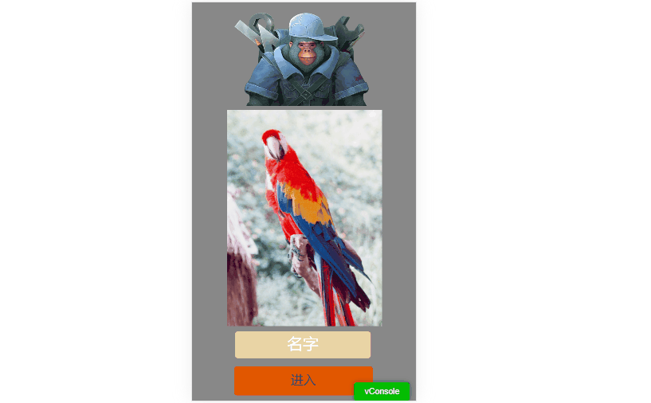

(Animation 1-3)

As shown, when the screen rotates, the designed portrait interface may not display correctly in landscape and vice versa.

With proper layout strategies, you can make the UI adaptive to both orientations (Animation 1-4).


(Animation 1-4)

However, the best practice is to keep **portrait mode** aligned with the device’s portrait orientation and **landscape mode** with the device’s landscape orientation.

**2. Always Landscape (horizontal)**

If your game is designed for landscape, this is the optimal choice.


(Animation 1-5)

When `screenMode` is set to `horizontal`, the game’s horizontal axis always stays perpendicular to the shorter screen edge, ensuring proper display orientation.

**3. Always Portrait (vertical)**

For portrait games, this setting is ideal.


(Animation 1-6)

When `screenMode` is set to `vertical`, the game’s horizontal axis always stays perpendicular to the longer screen edge.

Even if users rotate the device, the display remains vertical.

> [!Tip]
> In browsers, the engine’s auto-rotation only affects the **canvas**, not the browser itself.
> If the phone is locked, the canvas may rotate but the browser remains fixed, which may cause input issues (e.g., rotated keyboard).
>
> Mini-game platforms handle orientation at the system level, so this issue does not occur there.

#### 1.1.3 Canvas Background Color

This property defines the canvas background color. The default value is `#888888`, as shown in Figure 1-7.

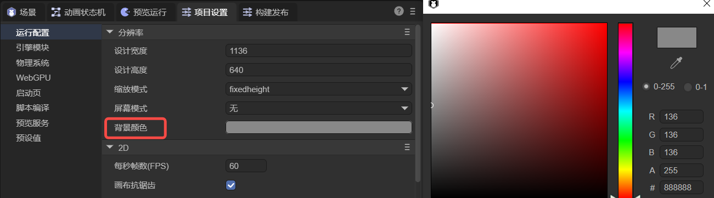

(Figure 1-7)

---

### 1.2 Engine Initialization Settings

Some engine options must be configured at initialization, as shown in Figure 1-8.


(Figure 1-8)

**2D Parameters:**

| Property                  | Description                                                                      |
| ------------------------- | -------------------------------------------------------------------------------- |
| FPS                       | Frames per second. Controls frame duration; e.g., 60 FPS means 16.6ms per frame. |
| Canvas Antialias          | Enables WebGL `antialias` to smooth jagged edges; consumes extra performance.    |
| Retina Canvas             | Enables high-DPI rendering for sharper visuals at the cost of performance.       |
| Canvas Transparency       | Makes the canvas background transparent.                                         |
| Vertex Cache Optimization | Allocates 64k vertex buffer for 2D rendering to improve performance.             |
| Default Font              | Sets the default font for new text objects in the IDE.                           |
| Default Font Size         | Sets the default font size for new text objects.                                 |

**3D Parameters:**

| Property               | Description                                                   |
| ---------------------- | ------------------------------------------------------------- |
| Dynamic Batching       | Reduces render batches by merging compatible meshes.          |
| Default Physics Memory | Sets default 3D physics memory allocation (MB).               |
| Resolution Scale       | Adjusts 3D rendering resolution (2D UI unaffected).           |
| Multiple Lights        | Enables multiple light sources.                               |
| Max Light Count        | Default 32.                                                   |
| Cluster Count (x,y,z)  | Defines light clusters; affects light distribution accuracy.  |
| Max Blend Shape Count  | Maximum number of blend shapes per mesh renderer. Default 32. |

---

### 1.3 Miscellaneous

As shown in Figure 1-9, LayaAir IDE allows enabling debug modules:


(Figure 1-9)

#### 1.3.1 Show Statistics

Displays frame rate, memory usage, and node counts (Figure 1-10).

  

(Figure 1-10)

For detailed metric explanations, see [Performance Statistics and Optimization](../../common/Stat/readme.md).

#### 1.3.2 Show VConsole

On mobile devices, `VConsole` provides lightweight debugging tools (Figure 1-11).

  

(Figure 1-11)

#### 1.3.3 Show Global Error Popup

When `window.onerror` catches a global error, enabling this option will display a popup with stack details.

Example:

```typescript
let err = new Error("Custom Error");
Laya.Browser.window.onerror(err.message, "", "", "", err);
```

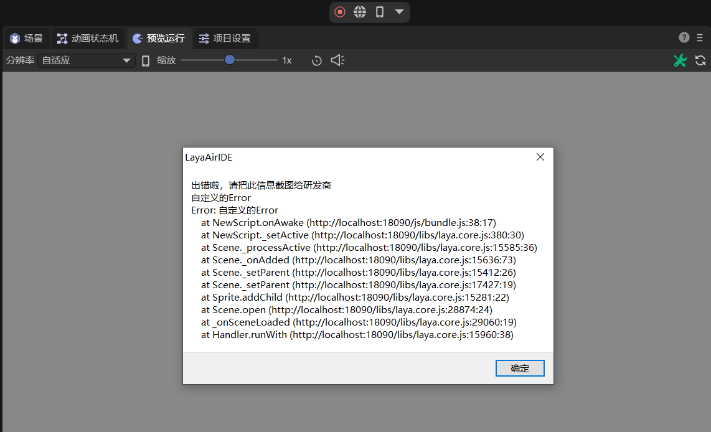  

(Figure 1-12)

---

## 2. Engine Modules

LayaAir Engine consists of multiple modules. Only basic modules are enabled by default (Figure 2-1).

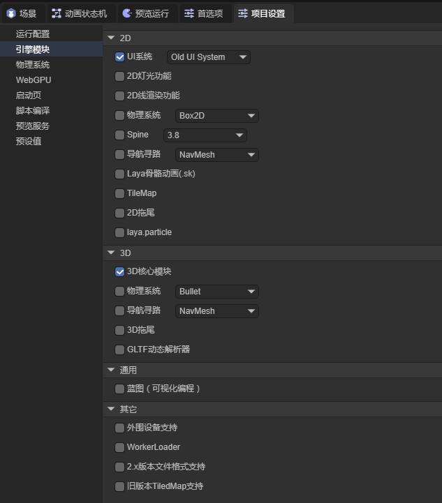

(Figure 2-1)

If your project uses additional features, you must enable the corresponding module, or runtime errors will occur.

**2D Modules:**

| Module            | Description                                 |
| ----------------- | ------------------------------------------- |
| UI System         | Includes two UI frameworks (classic & new). |
| 2D Lighting       | Components for 2D lighting.                 |
| 2D Line Rendering | Line renderer for 2D.                       |
| Physics System    | Box2D physics library (JS or WASM).         |
| Spine             | Spine animation support.                    |
| Navigation        | 2D pathfinding.                             |
| Laya Skeleton     | Built-in `.sk` skeleton animation.          |
| TileMap           | Built-in tile map support.                  |
| 2D Trail          | 2D trail renderer.                          |
| Particle          | 2D particle system.                         |

**3D Modules:**

| Module      | Description                |
| ----------- | -------------------------- |
| Core 3D     | Base 3D functionality.     |
| Physics     | Bullet or PhysX (JS/WASM). |
| Navigation  | 3D pathfinding.            |
| Trail       | 3D trail system.           |
| GLTF Parser | Runtime GLTF model loader. |

**Common Modules:**

| Module    | Description              |
| --------- | ------------------------ |
| Blueprint | Visual scripting system. |

**Other Modules:**

| Module             | Description                                  |
| ------------------ | -------------------------------------------- |
| Peripheral Support | Access to sensors, camera, mic, GPS, etc.    |
| WorkerLoader       | Asynchronous image decoding.                 |
| 2.x Format Support | Load `.ls` and `.lh` from older LayaAir 2.x. |
| Legacy TiledMap    | Old TiledMap support.                        |

---

## 3. Physics System

### 3.1 2D Physics

Global configuration options (Figure 3-1):

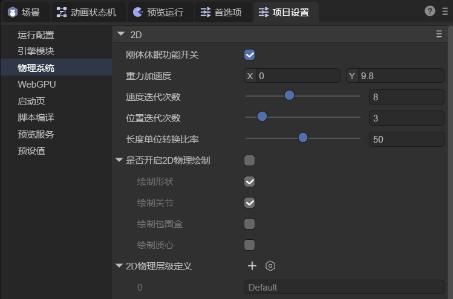

(Figure 3-1)

| Setting             | Description                                                          |
| ------------------- | -------------------------------------------------------------------- |
| Rigidbody Sleep     | Allows rigid bodies to sleep when inactive to save performance.      |
| Gravity             | Sets gravity acceleration vector (X,Y). Usually only Y is used.      |
| Velocity Iterations | Iterations for solving velocity constraints. More = higher accuracy. |
| Position Iterations | Iterations for solving position constraints. More = higher accuracy. |
| Unit Ratio          | Converts physics units to pixels (default 1 unit = 50px).            |
| Show Physics Gizmos | Displays collision boxes, joints, etc.                               |

### 3.2 3D Physics

Global configuration options (Figure 3-2):


(Figure 3-2)

| Setting                        | Description                                           |
| ------------------------------ | ----------------------------------------------------- |
| Fixed Time Step                | Physics simulation timestep, default 0.016s (≈60FPS). |
| Max Substeps                   | Maximum substeps per frame for stability.             |
| Continuous Collision Detection | Prevents fast-moving objects from tunneling.          |
| CCD Threshold                  | Speed threshold for enabling CCD.                     |
| CCD Sphere Radius              | Defines the sweep sphere radius used in CCD.          |

---

## 4. WebGPU

WebGPU is a new web standard providing high-performance rendering and computation. Enable it in supported browsers to improve rendering performance (Figure 4-1).

  

(Figure 4-1)

Note: IDE preview does not support WebGPU — use an external browser.

In Chrome, visit `chrome://flags` and search for **WebGPU** to enable it (Figure 4-2).

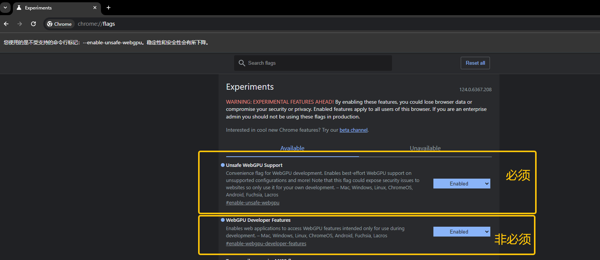  

(Figure 4-2)

---

## 5. Splash Screen

The splash screen displays before the game starts. You can customize it (Figure 5-1).

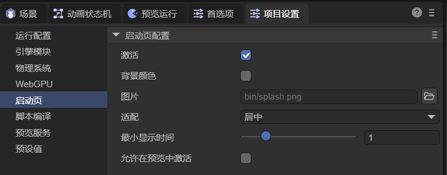

(Figure 5-1)

| Option           | Description                                  |
| ---------------- | -------------------------------------------- |
| Enable           | Shows splash before game starts.             |
| Background Color | Sets splash background color.                |
| Image            | Custom splash image (must be in `bin/`).     |
| Fit Mode         | Icon fit mode: center, fill, contain, cover. |
| Min Display Time | Minimum display time (seconds).              |
| Show in Preview  | Shows splash during preview mode.            |

---

## 6. Script Compilation

IDE provides script compilation and release options (Figure 6-1).

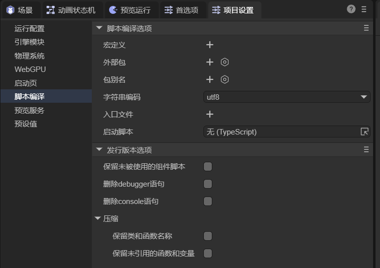

(Figure 6-1)

**Compilation Options:**

| Option            | Description                                            |
| ----------------- | ------------------------------------------------------ |
| Macros            | Define constants or conditional flags (e.g., `DEBUG`). |
| External Packages | Add third-party SDKs or libraries.                     |
| Aliases           | Create path or module aliases.                         |
| Encoding          | Set character encoding (usually UTF-8).                |
| Entry File        | Specifies the startup script file.                     |
| Startup Script    | Custom startup logic before loading scenes.            |

**Release Options:**

| Option              | Description                                           |
| ------------------- | ----------------------------------------------------- |
| Keep Unused Scripts | Includes unused component scripts in release build.   |
| Remove `debugger`   | Strips `debugger` statements.                         |
| Remove `console`    | Removes `console.log`/`console.warn`.                 |
| Keep Names          | Keeps original class/function names in minified code. |
| Keep Unused Vars    | Retains unused variables/functions.                   |

---

## 7. Preview Server

You can configure the preview server address and port (Figure 7-1).

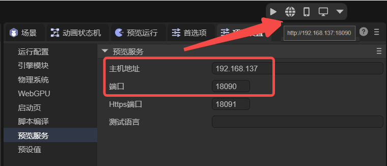

(Figure 7-1)

Enabling **Protect Source Maps** ensures only local preview requests receive `.map` files, protecting code from internal network leaks (Figure 7-2).

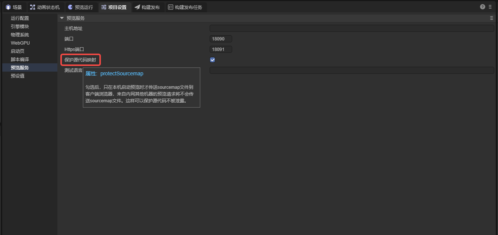

(Figure 7-2)

---

## 8. Presets

### 8.1 Texture Type

When importing external textures (PNG/JPG), the IDE assigns a default texture type (e.g., Sprite Texture) as shown in Figure 8-1.

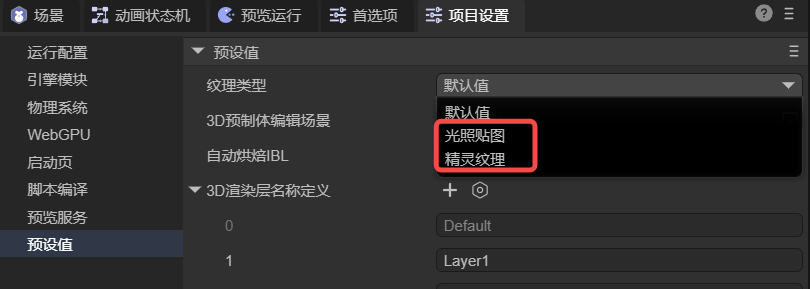

(Figure 8-1)

### 8.2 3D Prefab Editing Scene

By default, 3D prefabs are edited in a system environment scene (`DefaultPrefabEditEnv`).

You can specify a custom scene as the prefab editing environment (Figure 8-2).

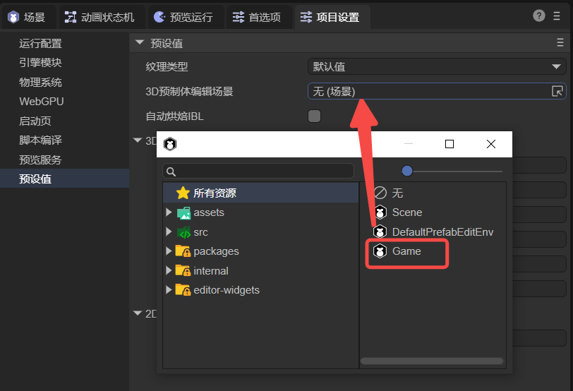

(Figure 8-2)

### 8.3 Auto Bake IBL

When **Auto Bake IBL** is checked (Figure 8-3), changing the skybox material in Scene3D will trigger automatic IBL re-baking after saving.

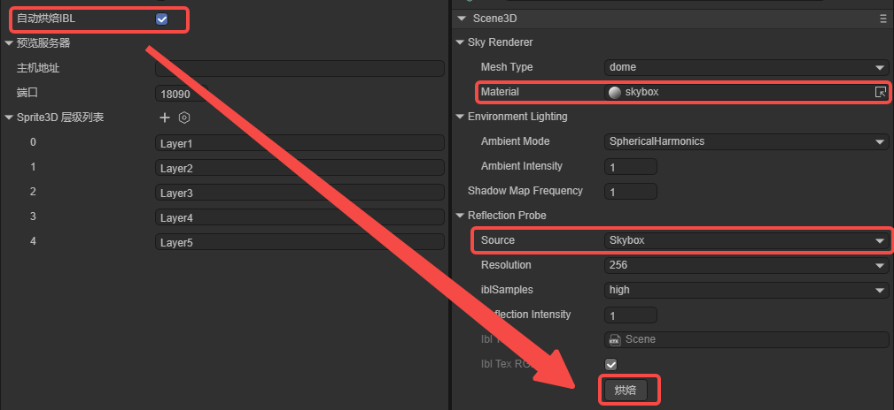  

(Figure 8-3)

> Only effective when Reflection Probe Source = Skybox. “Custom” sources require manual baking.

### 8.4 3D Render Layer Definitions

You can add, delete, or rename 3D rendering layers via the editor (Figure 8-4).


(Figure 8-4)

See [Using 3D Sprites](../../../3D/Sprite3D/readme.md) for more details.

### 8.5 2D Render Layer Definitions

2D rendering components (e.g., mesh renderer, trail, line, light) can specify render layers (Figure 8-5).

  

(Figure 8-5)
