# Run Configuration

> Author: Charley

The Run Configuration section is used to centrally manage common basic configuration items used during project startup and running, including screen adaptation settings, default font and font size, `2D` lighting global parameters, `3D` global configuration, and debugging-related options.

## 1. Resolution-Related Settings

Settings related to resolution directly affect the preview effect of project running, screen adaptation methods, canvas background color, etc.

Settable properties are shown in Figure 1-1:

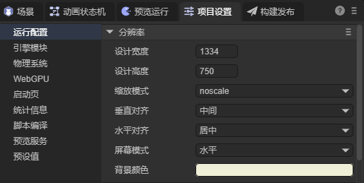

(Figure 1-1)

### 1.1 Screen Width/Height Adaptation

Three core settings affect the product's screen width/height performance: **Design Width/Height** (`designWidth`, `designHeight`) and **Scale Mode** (`scaleMode`).

The design width/height determines the default size of the `2D` scene editing area in the `IDE`. Developers typically build and arrange `UI` at this size.

When the scene runs, the engine calculates the final display size suitable for the target device based on the design width/height and current scale mode.

In actual runtime environments, device screen proportions vary widely, and it's almost impossible for all devices to match the design width/height. To solve this difference, the engine adapts through different scale modes, such as scaling the display proportionally to fullscreen to meet project display needs on various devices.

The complete screen adaptation mechanism involves not only scale mode but also canvas, stage size, and adaptation algorithms. Developers can view a more detailed introduction in another document [Screen Adaptation](../../../common/adaptScreen/readme.md).

### 1.2 Canvas Alignment Mode

Canvas alignment modes include **vertical alignment** (`alignV`) and **horizontal alignment** (`alignH`). When the stage size doesn't fill the canvas (i.e., stage resolution is smaller than canvas resolution), alignment mode is used to control the display position of the stage on the canvas.

**Vertical alignment mode (`alignV`)** specifies the vertical alignment of the stage on the canvas, supporting the following values:
`top` (top alignment), `middle` (vertical center), `bottom` (bottom alignment), indicating the stage is located at the top, middle, or bottom of the canvas.

**Horizontal alignment mode (`alignH`)** specifies the horizontal alignment of the stage on the canvas, supporting the following values:
`left` (left alignment), `center` (horizontal center), `right` (right alignment), indicating the stage is located at the left, middle, or right of the canvas.

Some scale modes force the stage to scale to completely fill the canvas, at which point the stage size matches the canvas and alignment mode has no visible effect. Therefore, **`IDE` only displays canvas alignment options when the scale mode may cause stage and canvas size inconsistency.**

> Note: Canvas alignment is different from relative layout within a scene. If you want alignment centered on a certain position within the scene, please search for "relative layout" keywords in the documentation search bar to view relevant documentation.

### 1.3 Landscape/Portrait Adaptation

Sometimes, we need to force landscape or portrait settings based on screen proportions. In the `IDE`, this can be set through **Screen Mode** (`screenMode`).

There are three adaptation modes for landscape/portrait, as shown in Figure 1-2.

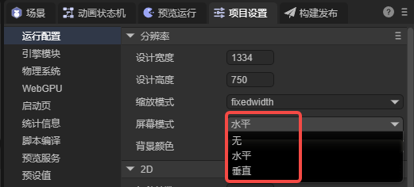

(Figure 1-2)

**No Change: None**

When selecting `None`, the game's horizontal direction won't change following screen rotation regardless of how the device screen rotates. The effect is shown in Animated Figure 1-3.


(Animated Figure 1-3)

As you can see, with no change, when the screen rotates, an interface designed for portrait appears unsuitable in landscape, and similarly, an interface designed for landscape appears unsuitable in portrait.

Of course, if we reasonably use relative layout functionality, we might be able to accommodate both landscape and portrait experiences. The effect is shown in Animated Figure 1-4.

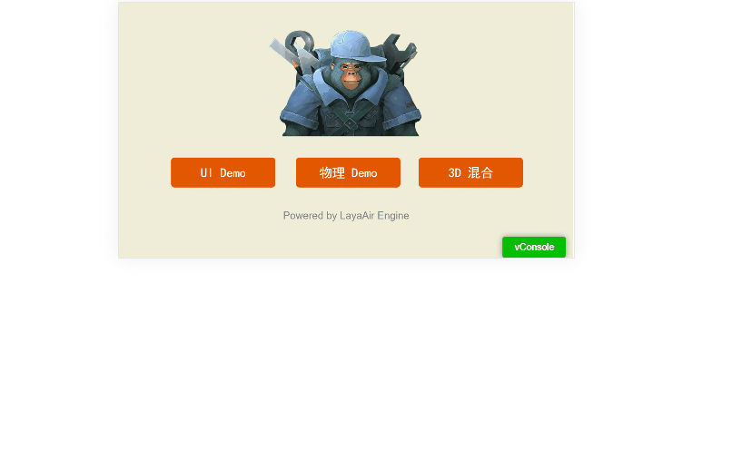

(Animated Figure 1-4)

But to achieve the best effect, the best solution is to keep portrait always consistent with the device's portrait direction, and landscape consistent with the device's landscape direction.

**Always Landscape: Horizontal**

When the designed width/height is for a landscape product, **Horizontal** is undoubtedly the best experience. Regardless of screen direction rotation, the design's horizontal direction always remains perpendicular to the screen's shortest edge, so when users see landscape display on portrait devices, they naturally turn the device landscape, matching the product design. The effect is shown in Animated Figure 1-5.


(Animated Figure 1-5)

**Always Portrait: Vertical**

When the designed width/height is for a portrait product, **Vertical** is undoubtedly the best experience. Regardless of screen direction rotation, the game's horizontal direction always remains perpendicular to the screen's longer edge. So even if users turn the device landscape, they still see portrait display and naturally return the device to portrait, matching the product design. The effect is shown in Animated Figure 1-6.

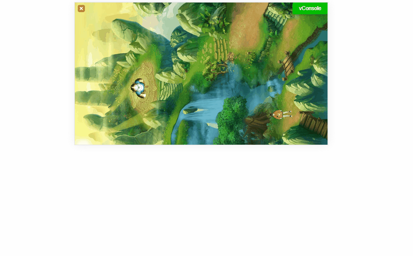

(Animated Figure 1-6)

> [!Tip]
>
> Note that when running in a browser, the engine's automatic landscape and portrait can only rotate the canvas. If the user's phone is locked, although the display rotates automatically, the browser doesn't rotate, which may cause the input method to still pop up according to the browser's direction. At this point, it may cause the input method and browser display to be at 90 degrees.
>
> When running on mini-game platforms, this problem won't occur because the mini-game underlying layer has landscape or portrait configuration.

### 1.4 Canvas Background Color Setting

Canvas background color is used to set the background color for the canvas, and also serves as the background color for the `2D` scene editing interface in the `IDE`.

Note that in actual running, if the scene has `3D` skybox enabled, or the `3D` camera itself has set a background color, in fullscreen adaptation mode these contents will cover the canvas, so the canvas background color usually won't be seen. Only when the display has areas not filled by content that can "reveal" the canvas will the canvas background color be displayed, as shown in Figure 1-7:

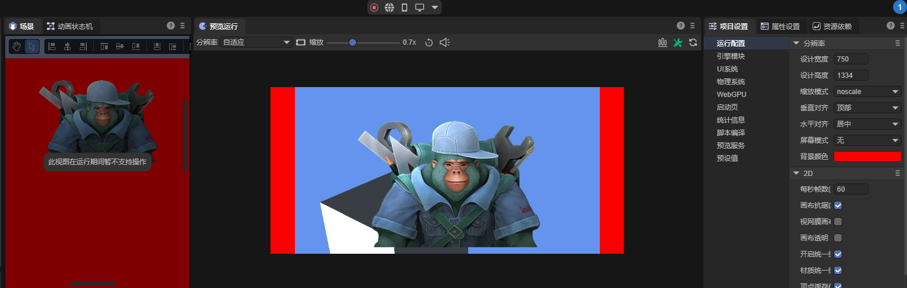

(Figure 1-7)

## 2. Engine General Initialization Settings

Under the 2D tab, it's mainly 2D and general global configuration, as shown in Figure 2-1:

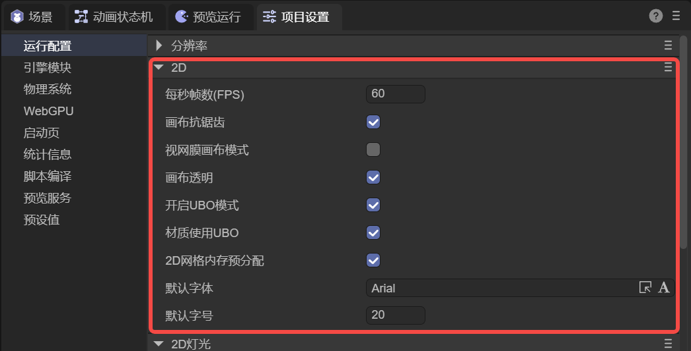

(Figure 2-1)

### 2.1 Frames Per Second `FPS`

In game development, **FPS (Frames Per Second)** represents the number of frames per second, i.e., the number of display updates per unit time, and is an important performance indicator for measuring running smoothness. Higher FPS means more frequent display updates, smoother visual experience, and typically lower input response latency; conversely, lower FPS results in display stuttering and discontinuity (commonly called "frame drops"), seriously affecting game experience.

In most scenarios, **60 FPS** can already provide a relatively smooth experience. With the proliferation of high refresh rate screens, more mobile devices and VR devices support **90Hz, 120Hz** or even higher refresh rates, increasing demand for higher frame rates.

In actual projects, to maintain consistent running pace across different devices, or to balance smoothness with performance consumption (higher FPS usually means higher CPU and GPU consumption), you can uniformly configure through "**Frames Per Second (FPS**)" in the IDE.

For example, when the default value is 60, it means the engine's logic frame rate upper limit is 60; if set to 90, it means the logic update target upper limit is 90. This setting controls the update rhythm of the engine's main loop, not forcibly changing the device's display refresh rate itself.

If developers don't want to fix the logic frame rate upper limit, they can set `Config.fixedFrames` to `false` to disable fixed frame mode, making logic updates follow the platform's `requestAnimationFrame` call frequency as much as possible.

```typescript
// - When true: Rendering and logic updates are limited to the frame rate defined by Config.FPS. Ensures consistent application running speed across different devices.
// - When false: Updates on every requestAnimationFrame callback. May cause different application running speeds on different devices.
Laya.Config.fixedFrames = false;
```

### 2.2 Canvas Antialiasing `isAntialias`

Canvas antialiasing `isAntialias` is a global configuration property used to control **whether WebGL canvas enables antialiasing**. This property takes effect by setting the `antialias` switch of the WebGL context, mainly acting on **2D WebGL rendering**, used to reduce jagged edges on graphics and improve overall visual effect. The default value is `true`.

During engine initialization, `Config.isAntialias` is passed to the underlying WebGL configuration and used as a parameter when creating the WebGL context, handled by the browser. Once the WebGL context is created, this setting can no longer be dynamically modified. If controlling the switch through code, configuration needs to be done before engine initialization.

```typescript
// Execute custom logic before engine initialization (this method is called before Laya.init)
Laya.addBeforeInitCallback(() => {
    // Don't enable antialiasing
    Laya.Config.isAntialias = false;
    console.log("before init");
});
```

Enabling antialiasing can improve display quality for curved lines and non-rectangular graphics, but brings certain GPU performance overhead. In performance-sensitive or scenarios with low image quality requirements, it can be set to `false`. Note that this property only affects 2D WebGL rendering; 3D scene antialiasing needs to be separately configured through FXAA or MSAA on the camera.

### 2.3 Retinal Canvas Mode `useRetinalCanvas`

Retinal canvas mode `useRetinalCanvas` is a global configuration property used to enable retinal (high DPI) canvas mode to improve display clarity and rendering precision on high-resolution screens. The default value is `false`. When set to `true`, the engine creates a higher-resolution canvas based on device pixel ratio (DPR), using more pixels for rendering at the same physical display size to achieve sharper visual effects.

In most adaptation (scale) modes, the engine scales stage content to fill the screen, and using a smaller canvas for drawing can effectively reduce performance consumption. Therefore, for projects not pursuing ultimate image precision, performance-optimized scaling solutions are usually preferred. But in scenarios needing to maintain high-resolution display, especially involving small font text or fine graphics, simply relying on scaled enlargement may cause image blurring. At this point, retinal mode can be enabled to improve display quality.

After enabling retinal canvas mode, regardless of which adaptation (scale) mode, the canvas uses screen physical resolution size, improving overall rendering precision and image clarity without changing layout and logic dimensions.

Retinal mode is suitable for scenarios with high display precision requirements, such as applications requiring precise pixel picking, high text clarity requirements, or pursuing high-quality visual performance.

Note that enabling `useRetinalCanvas` significantly increases GPU computation and video memory usage, because a larger canvas means processing more pixel data. In performance or memory resource-constrained scenarios, this mode should be enabled cautiously, only when truly needing high-resolution display effects.

### 2.4 Canvas Transparency `isAlpha`

Canvas transparency `isAlpha` is a global configuration property used to control whether the canvas supports transparency rendering. The default value is `false`, indicating an opaque canvas background is created; when set to `true`, the engine enables the canvas's Alpha channel support, allowing the canvas background to present fully transparent or semi-transparent rendering effects.

At the rendering implementation level, `isAlpha` affects the underlying graphics context creation method: in WebGL rendering mode, this property is passed as an `alpha` parameter to the underlying context; in WebGPU rendering mode, the Alpha mode is set to `premultiplied` to ensure correct transparency blending calculations.

When canvas transparency is enabled and the background color is simultaneously set to transparent, canvas content no longer blocks the running platform's background (e.g., browser page background color), allowing direct viewing of content below the canvas, as shown in Figure 2-2.

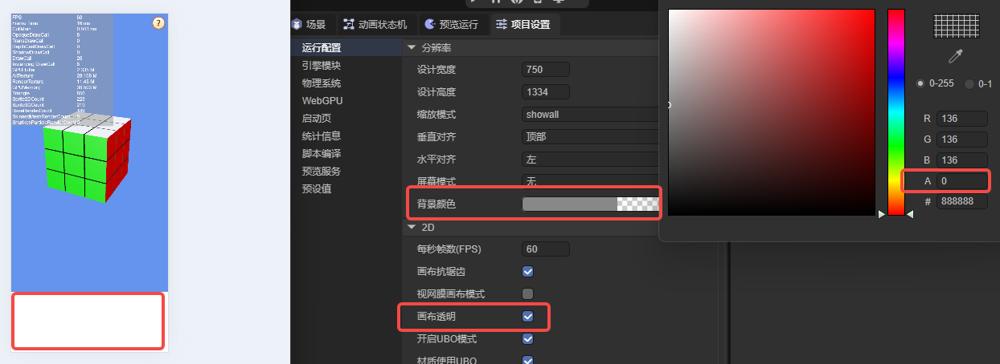

(Figure 2-2)

Transparent canvas provides greater flexibility for rendering expression, especially suitable for scenarios needing to overlay LayaAir rendered content with other HTML elements. For example, overlaying 3D particle effects on web UI, embedding 3D scenes in HTML pages, or implementing special transparent overlay effects in visualization and AR applications. This approach can break traditional canvas visual boundaries and build richer layers and interactive experiences.

Note that enabling transparent canvas increases GPU blending computation overhead and may have compatibility and performance pressure on some mobile devices or low-performance environments. Therefore, when enabling `isAlpha`, evaluate based on specific usage scenarios and performance budget to achieve a reasonable balance between visual effects and overall performance.

### 2.5 Enable UBO Mode `enableUniformBufferObject`

Enable UBO mode `enableUniformBufferObject` is used to control whether to enable **Uniform Buffer Object (UBO)** functionality. The default value is `true`. UBO is an important optimization technique in modern graphics rendering pipelines, mainly relying on the uniform buffer mechanism provided by WebGL 2.0 to efficiently manage and transfer uniform data in shaders.

After enabling this function, the engine no longer sets uniform variables individually in the traditional way, but stores multiple related uniform data centrally in a unified buffer and binds it to the shader at once. This approach can significantly reduce the number of `gl.uniform*` API calls, lower communication overhead between CPU and GPU, thereby improving overall rendering performance, especially in scenarios containing many materials or frequent state changes.

At the implementation level, the engine detects whether the current hardware and runtime environment support UBO functionality during render device initialization, and enables or disables internal UBO-related logic accordingly. In the WebGL rendering process, the engine creates a dedicated Uniform Buffer manager to uniformly allocate, maintain, and reuse material-related uniform memory blocks, achieving efficient batch upload and binding.

Note that using UBO may bring certain additional video memory usage, so in scenarios with tight video memory resources or high memory usage sensitivity, you can choose whether to enable it based on actual conditions. For devices or native platforms that don't support WebGL 2.0, the engine automatically disables this function to ensure compatibility.

Additionally, the engine provides more fine-grained control methods, such as managing material-level UBO usage through the `matUseUBO` property, allowing developers to perform targeted optimization configuration based on specific needs and hardware performance. This layered design fully utilizes modern GPU performance while also accommodating adaptation needs for low-end devices and different platforms.

### 2.6 Material Use UBO `matUseUBO`

Material use UBO `matUseUBO` is a configuration property used to control whether materials enable Uniform Buffer Object (UBO). The default value is `true`, belonging to a performance optimization mechanism for 3D material rendering. After enabling this function, the engine creates dedicated Uniform Buffers for material-related data, uniformly packaging originally分散设置的 material uniform variables (such as color parameters, texture properties, lighting-related data, etc.) into continuous memory blocks and uploading them to the GPU at once. Compared to the traditional method of setting uniforms individually, this batch transmission method can significantly reduce material global variable binding times, lower data interaction overhead between CPU and GPU, and improve memory access efficiency and overall rendering performance.

At the specific implementation level, `matUseUBO` affects multiple key links. First, in the GLSL shader code generation stage, this configuration affects the declaration method of material uniforms, converting originally independently declared uniform variables into Uniform Block structures; second, in actual rendering execution, the engine decides whether to create corresponding sub-Uniform Buffers for materials based on this configuration and synchronizes material data to the GPU through a unified upload process. Additionally, to accommodate 2D rendering's special needs, the engine temporarily adjusts this configuration when creating shader instances, ensuring 2D materials still use the traditional uniform setting method while 3D materials can fully utilize the performance advantages of UBO.

This design reflects the engine's refined optimization strategy for different rendering scenarios. By separating material-level UBO control from the global UBO switch, developers can more flexibly adjust the transmission and management methods of material data without affecting other Uniform Buffer usage. At the same time, the engine performs hardware capability detection during initialization and runtime, automatically degrading functionality on devices that don't support UBO, ensuring rendering process stability and compatibility. This layered and controllable design fully utilizes modern GPU performance potential while also supporting low-end devices and cross-platform environments.

### 2.7 2D Mesh Memory Pre-allocation `webGL2D_MeshAllocMaxMem`

2D mesh memory pre-allocation `webGL2D_MeshAllocMaxMem` is a configuration property for optimizing 2D WebGL rendering performance, used to control whether 2D vertex buffers (VB) adopt maximum capacity pre-allocation strategy. The default value is `true`. When enabled, the engine allocates memory space capable of accommodating approximately 64K vertices at once when creating 2D vertex buffers, rather than dynamically expanding based on actual vertex count. By pre-allocating larger continuous buffers, it can effectively reduce memory reallocation and data copy operations caused by buffer expansion during runtime, thereby improving overall 2D rendering performance and stability.

At the implementation level, this configuration directly affects the 2D rendering system's memory management strategy. When set to `true`, the vertex buffer has higher vertex carrying capacity, capable of continuously processing large amounts of 2D geometric data, avoiding frequent buffer adjustment overhead; when set to `false`, the engine adopts a more conservative on-demand allocation method, only allocating buffer size needed for current rendering, thereby saving video memory (can reduce video memory usage corresponding to approximately 64K vertices), but in complex or highly dynamic 2D scenarios, may introduce additional performance consumption.

This optimization strategy is suitable for scenarios containing large amounts of 2D graphic elements, such as complex UI interfaces, 2D particle systems, or dynamically generated graphic content. It trades appropriately increased memory usage for higher rendering efficiency, reflecting the engine's trade-off between memory usage and performance performance. On devices with limited video memory or memory resources, developers can choose to disable this configuration to save memory space but need to accept possible performance degradation in some scenarios.

### 2.8 Default Font and Font Size

The default font for text is **Arial**, and the default font size is **12**. If font or font size is not specified when creating text, the system automatically uses the default values from the engine's global configuration.

Developers can also modify these settings in the IDE, as shown in Figure 2-3, changing the engine's global default font and font size, thereby affecting the default display effect of newly created text.

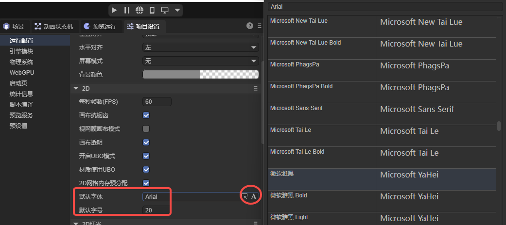

(Figure 2-3)

## 3. 2D Lighting Global Configuration

### 3.1 Ambient Light Color `ambientColor`

Ambient light color `ambientColor` is the basic ambient light color configuration in the 2D lighting system, used to define the overall basic lighting intensity and tone of the scene. Ambient light has no directionality and doesn't produce shadows. Its default value is semi-transparent gray new Color(0.2, 0.2, 0.2, 0), as shown in Figure 3-1, used to provide a uniform, soft basic lighting effect to avoid the display becoming completely dark when lacking light sources.

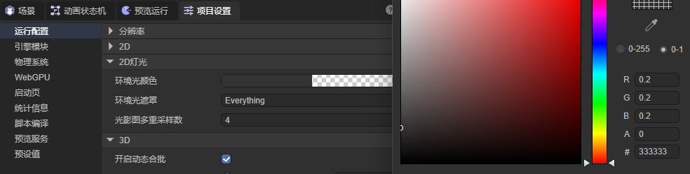

(Figure 3-1)

At the rendering implementation level, `ambientColor` is passed to the 2D rendering pipeline's fragment shader, participating in final pixel color calculation as a basic lighting component.

**When there are no other lights in the scene, ambient light directly multiplies with material color to form the most basic brightness;**

**When directional lights or other lights exist, it serves as underlying lighting superimposed with other lighting effects, enhancing overall brightness hierarchy and color stability.**

Ambient light color directly affects the entire scene's tone atmosphere. For example, cool ambient light can create night or shadow feeling, while warm ambient light is more suitable for sunlight or indoor scenes. This design simulates scattered light from various directions in the real world, maintaining certain visibility even in shadow areas. By adjusting the `RGB` components of `ambientColor`, developers can flexibly control the scene's basic brightness and overall atmosphere, naturally expressing everything from weak moonlight effects to bright indoor environments.

### 3.3 Ambient Light Mask `ambientLayerMask`

Ambient light mask `ambientLayerMask` is a configuration parameter in the LayaAir 2D lighting system used to control the scope of ambient light, using bitmask method, identifying through each bit of a 32-bit integer whether the corresponding rendering layer is affected by ambient light.

Its default value is -1 (all bits are 1 in binary), indicating ambient light by default acts on all 2D rendering layers in the scene.

During rendering, the engine determines whether the specified layer enables ambient light through bitwise operation `ambientLayerMask & (1 << layer)`: if the result is true, ambient light color participates in that layer's lighting calculation; otherwise, that layer ignores ambient light, equivalent to using transparent ambient light color.

In the IDE, developers can set readable names for each layer in "Project Settings → Presets → 2D Rendering Layer Name Definition" and configure through ambient light mask `ambientLayerMask`, as shown in Figure 3-2, thereby precisely controlling which layers 2D mesh renderers are on will be affected by ambient light, achieving more flexible lighting layer management.

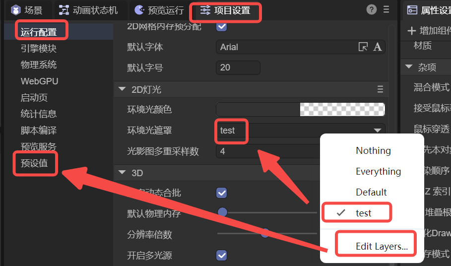

(Figure 3-2)

### 3.4 Shadow Map Multi-Sample Count `multiSamples`

Shadow map multi-sample count `multiSamples` is a key configuration parameter in the LayaAir 2D lighting system used to control shadow map rendering quality, improving shadow edge visual effects through multi-sample anti-aliasing technology.

The default value of this parameter is set to 4, indicating the shadow map performs 4x multi-sampling during rendering, meaning each pixel is sampled 4 times, then averaged to calculate the final color, effectively reducing the jagged effect on shadow edges. Developers can also set it to 1 to disable multi-sampling, which can achieve better performance but shadow edges may appear relatively rough.

When the multiSamples value changes, the system rebuilds the entire shadow render texture (RenderTexture) because the multi-sample count directly affects the creation parameters of the render target. Notably, this configuration only applies to shadow map rendering in the 2D lighting system and doesn't affect anti-aliasing processing for other 2D elements in the scene, which is usually controlled through independent canvas settings or material properties.

In actual use, developers need to make trade-offs between visual quality and performance: higher multi-sample values (such as 4) can provide smoother shadow edges but consume more GPU resources and memory; lower values (such as 1) can improve rendering performance but may produce obvious jaggedness in shadow transition areas.

## 4. `3D` Related Parameter Descriptions:

### 4.1 Enable Dynamic Batching `enableDynamicBatch`

Enable dynamic batching `enableDynamicBatch` is used to control the switch of dynamic batching functionality. This configuration defaults to true, indicating dynamic batching is enabled by default.

Dynamic batching is an optimization mechanism using `GPU` instancing rendering technology that can merge multiple rendering elements with the same geometry and material but different transforms into a single draw call, significantly reducing Draw Call count and improving rendering performance. When this configuration is enabled, the engine automatically detects rendering elements meeting conditions during rendering and groups them for batch processing.

For dynamic batching to take effect, multiple conditions need to be met simultaneously: first, the `enableDynamicBatch` configuration must be true; second, the rendering engine must support instancing rendering capability; third, the rendering element itself needs to support dynamic batching (`canDynamicBatch property is true`); fourth, the corresponding shader must enable instancing (`enableInstancing is true`). Only when all conditions are met will the system merge qualifying rendering elements for instancing.

Developers can disable this function, which usually appears in debugging stages needing precise control of rendering order, or in special rendering requirements needing to avoid side effects from batching. In production environments, it's recommended to keep the default enabled state for best performance performance, especially for scenes containing many similar objects, such as particle systems, vegetation rendering, or repeated architectural elements.

### 4.2 Default Physics Memory `defaultPhysicsMemory`

Default physics memory `defaultPhysicsMemory` is used to control the memory size allocated when the physics engine initializes. This configuration is in MB units, with a default value of 16MB, used to pre-allocate heap memory for the physics engine to store calculation data for physics objects like colliders, rigid bodies, and joints in the physics world.

In code implementation, the system determines final memory allocation through Math.max(16, Config3D.defaultPhysicsMemory) * 16 calculation, ensuring minimum memory is not less than 16MB, then converting MB units to page units used internally by the physics engine (typically 64KB per page). This design ensures the physics engine reserves sufficient continuous memory space during initialization, avoiding frequent memory allocation and release operations during runtime.

Developers can adjust the defaultPhysicsMemory value to accommodate different physics scene complexity: for simple physics scenes, appropriately lower this value to save memory; for scenes containing many colliders and complex physics interactions, increase this value to ensure physics simulation stability and performance. If set too small, it may cause physics engine memory shortage leading to exceptions or performance degradation; if set too large, it increases application memory usage.

This configuration only takes effect during physics engine initialization. Once the physics world is created, it cannot be dynamically modified. Therefore, it's recommended to reasonably set this parameter at application startup based on expected physics scene complexity, and perform performance testing on different devices to find the best balance point.

### 4.3 Resolution Multiplier `pixelRatio`

Resolution multiplier pixelRatio is used to set the resolution multiplier for 3D render targets. This configuration affects the entire 3D rendering pipeline's resolution calculation through a floating-point multiplier, with a default value of 1.0, indicating rendering at basic resolution.

In code implementation, pixelRatio mainly affects camera clientWidth and clientHeight property calculation, where if custom resolution is enabled (`Config3D.customResolution`), actual rendering resolution is `Config3D.resoluWidth/_resoluHeight multiplied by pixelRatio`; if using automatic resolution, it's `RenderContext3D.clientWidth/clientHeight multiplied by pixelRatio`. This design allows developers to uniformly control all 3D render target resolutions by adjusting a single parameter.

pixelRatio application runs through multiple key 3D rendering links: used in viewport coordinate conversion functions to ensure correct mapping from screen coordinates to world coordinates; used in ray calculation functions for precise mouse picking and collision detection; used in 3D UI interaction handling for correct viewport range judgment; and used in world coordinate to viewport coordinate conversion processes to maintain coordinate system consistency.

Developers can set Config3D.pixelRatio = 2.0 to obtain 2x resolution 3D rendering effects, which can provide clearer visual quality on high-resolution display devices but also correspondingly increases GPU rendering load; conversely, setting a smaller value like 0.5 can reduce rendering resolution to improve performance, suitable for scenarios with low image quality requirements. It's recommended to test different pixelRatio values on different target devices to find the best balance between performance and image quality.

Note that this setting only affects 3D resolution, not 2D UI resolution.

### 4.4 Enable Multi-Light `enableMultiLight`

Enable multi-light `enableMultiLight` is used to decide whether to enable modern multi-light cluster rendering technology. This configuration defaults to true, indicating multi-light system is enabled by default, but final determination is based on hardware capability.

When enableMultiLight is enabled, the system initializes a complete multi-light rendering pipeline: creating Cluster instances to manage light clusters, dividing frustum space into multiple small 3D grid regions; generating dedicated light texture buffers to store data for up to `Config3D.maxLightCount` lights; and using advanced cluster algorithms to assign lights to corresponding frustum regions based on spatial position. This design allows a large number of lights (point lights, spotlights, directional lights) to exist simultaneously in the scene, with each pixel able to be illuminated by multiple lights.

When enableMultiLight is disabled, the system switches to traditional single-light rendering mode: adding `LEGACYSINGLELIGHTING` shader definition, limiting light calculation to at most 1; using fixed uniform variables to pass single light property data; and calling `legacyLightingValueInit()` to initialize traditional single-light shader parameters. This mode has better performance but can only render single main light effects.

Using single-light mode is very useful when debugging lighting effects during development or optimizing performance for low-end devices; in production environments, for scenes needing complex lighting effects like interior design, multi-character combat, etc., should keep the default multi-light mode for better visual expression. Note that multi-light mode has high requirements for graphics card texture buffer capability and calculation performance, automatically degrading to single-light mode on devices that don't support floating-point textures.

### 4.5 Maximum Light Count `maxLightCount`

Maximum light count maxLightCount is used to control the maximum number of lights that can be simultaneously active in the scene. This configuration defaults to 32, indicating by default, at most 32 lights can participate in rendering calculation simultaneously in the scene.

In code implementation, maxLightCount is first limited by the system upper limit. If set over 2048, it's automatically adjusted to 2048 with a warning prompt. Second, this value performs coordinated calculation with light cluster configuration (lightClusterCount), ensuring each cluster region can reasonably allocate light resources, avoiding situations where distant cluster regions ignore too many lights.

When the number of lights in the scene exceeds maxLightCount, excess lights are placed in a backup queue (alternateLights). These lights don't participate in actual rendering calculation but remain in the scene for subsequent management. The system outputs warning information to the console, reminding developers that the current light count has exceeded the limit.

The maxLightCount value is used in multiple key links: in the multi-light rendering system initialization stage, it determines the size of the light texture buffer (width × maxLightCount); in GLSL code generation, it's defined as MAX_LIGHT_COUNT macro, controlling the upper limit of light traversal loops in shaders; and in runtime light management, it serves as the judgment threshold for adding new lights.

Developers can adjust the maxLightCount value based on project needs: for simple scenes, appropriately lower this value to save memory and calculation overhead; for complex interior scenes or games needing many dynamic lights, appropriately increase this value for better lighting effects. But note that too high maxLightCount significantly increases GPU calculation burden and memory usage, possibly causing performance issues on mobile devices. It's recommended to perform performance testing on different target platforms to find the best balance between visual effects and running performance.

### 4.6 Light Cluster Count `lightClusterCount`

Light cluster count lightClusterCount is used to define the 3D spatial division of light clustering technology. This configuration is a Vector3 value, default set to (12, 12, 12), representing clustering counts on X, Y, Z three axes respectively.

In the light cluster system, camera frustum space is divided into a 3D grid: X and Y axes evenly divide the viewport into multiple rectangular regions, while Z axis uses logarithmic distribution to divide the depth range, because near objects need more refined lighting calculation, while distant objects are less sensitive to lighting changes. This division method ensures lighting calculation efficiency and quality balance.

The three components of lightClusterCount play different roles in the system: X and Y values determine cluster resolution in screen space, affecting the amount of light data each pixel needs to query; Z value not only controls cluster count in depth direction but also directly affects the maximum area light count each cluster region can accommodate, with calculation formula `Math.floor(2048 / lightClusterCount.z - 1) * 4`.

These cluster parameters are used in multiple key links: creating Cluster instances and corresponding texture buffers during initialization; dynamically calculating cluster plane positions based on camera parameters during runtime; defining CLUSTER_X_COUNT, CLUSTER_Y_COUNT, and CLUSTER_Z_COUNT macro constants in GLSL code generation for shader use; and determining the maximum light count each cluster region can handle during light allocation.

Developers can adjust the lightClusterCount value based on project needs: for scenarios needing refined lighting control, appropriately increase X and Y values for better lighting precision; for large outdoor scenes, increase Z value to better handle light distribution at different distances. But note that each component's maximum is limited to 128, and too high cluster count significantly increases memory usage and calculation overhead. It's recommended to perform performance testing on different devices, balancing visual quality and running efficiency.

### 4.7 Maximum Morph Target Count `maxMorphTargetCount`

Maximum morph target count maxMorphTargetCount is the quantity limit configuration for the morph target system in the LayaAir 3D engine, used to control the maximum number of morph targets that can be simultaneously active per mesh renderer. This configuration defaults to 32, indicating by default, each mesh can simultaneously apply blending effects from at most 32 morph targets.

Morph targets are a 3D animation technology that achieves smooth mesh deformation effects through predefined vertex deformation data, commonly used in animation scenarios needing fine control like facial animation, muscle simulation, expression changes, etc. Each morph target contains a complete set of vertex position, normal, tangent, and other deformation data. Multiple morph targets can create complex deformation effects through weight blending.

The maxMorphTargetCount value plays multiple key roles in the system: during mesh renderer initialization, it determines the size of morph target activation data buffer (maxMorphTargetCount × 4 floats); in GLSL code generation, it's defined as MORPH_MAX_COUNT macro constant, controlling the declaration size of morph target arrays in shaders; during runtime morph target activation, it serves as an upper limit to restrict simultaneously active target count, with targets exceeding the limit being ignored.

At the shader level, maxMorphTargetCount defines the size of the u_MorphActiveTargets array, which stores index and weight information for each active morph target. During rendering, the vertex shader traverses all active morph targets, performing linear interpolation calculation on original vertex data based on weights to achieve smooth deformation transition effects.

Developers can adjust the maxMorphTargetCount value based on project needs: for character systems needing refined facial animation, appropriately increase this value to support more expressions and muscle deformation; for simple mesh deformation needs, lower this value to save memory and calculation overhead. But note that too high morph target count significantly increases GPU vertex processing burden, possibly affecting rendering performance on mobile devices. It's recommended to perform performance testing on target platforms, balancing animation quality and running efficiency.

## 5. Miscellaneous

In miscellaneous, it's mainly debugging-related function items, as shown in Figure 5-1:

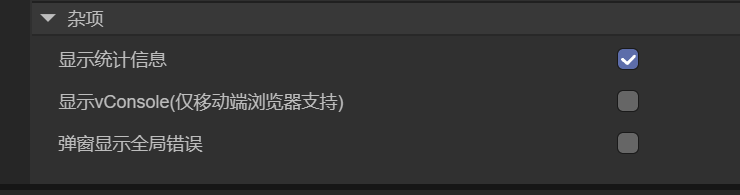

(Figure 5-1)

### 5.1 Show Statistics

In the IDE, show statistics is used to monitor project running status and performance indicators in real-time, including frame rate, render batches, vertex and triangle counts, memory usage, and rendering mode information, helping developers analyze performance bottlenecks, optimize resource management, and debug rendering effects, improving project running efficiency and visual experience.

After checking show statistics, as shown in Figure 5-2.

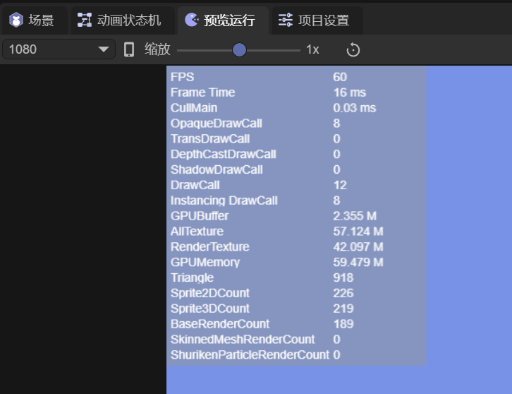

(Figure 5-2)

If you want to understand more detailed parameters on the statistics panel and custom statistics, please refer to the document [Performance Statistics and Optimization](../statistics/readme.md).

### 5.2 Show VConsole (Mobile Debug Tool)

For mobile debugging, usually need to connect to a computer-side browser.

If developers don't need breakpoints, just some common log printing, loading viewing, etc., can enable `Show VConsole`. When viewing on mobile browsers, a debug tool panel appears as shown in Figure 5-3.

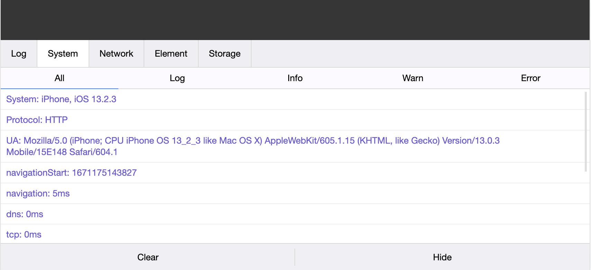

(Figure 5-3)

> Note: Only supports enabling VConsole on mobile browsers
>

### 5.3 Popup Display Global Errors

If capturing global errors [window.onerror](https://www.w3school.com.cn/jsref/event_onerror.asp), checking `Popup Display Global Errors` can popup detailed error stacks. For example, you can customize a global error with code as follows:

```typescript
// Customize a global error
let err = new Error("Custom Error");
Laya.Browser.window.onerror(err.message, "", "", "", err);
```

At runtime, it will popup exceptions, with effect as shown in Figure 5-4.

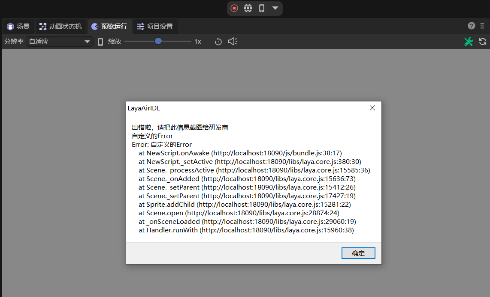

(Figure 5-4)
