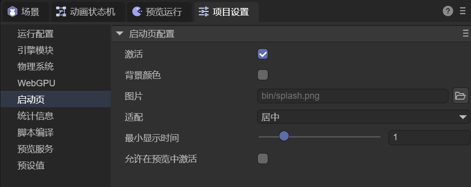

# Startup Page Configuration

> Author: Charley

## 1. Startup Page Configuration

The startup page refers to the **first screen displayed before the game officially enters the loading and running process**, used to display the game or company logo (please display the engine LOGO logo side by side), while visually buffering the black screen wait time caused by loading the engine base library.

Without any settings, the system only uses the engine's built-in default startup icon. Developers can also customize the startup page's display content and style according to project needs to improve product professionalism and brand recognition.

The startup page configuration interface is shown in Figure 1-1:



(Figure 1-1)

### 1.1 Enable

Used to control whether to enable the startup page.

When checked, the game will display the startup page before officially entering the runtime phase.

When unchecked, the startup page function is disabled, and the game goes directly to loading or the first scene.

### 1.2 Background Color

Used to set the background color of the startup page.

When checked, you can customize the startup page's solid background color, often used to match the LOGO color, avoiding visual awkwardness caused by the default background color not coordinating with the custom LOGO.

### 1.3 Image

Used to specify the icon or image content displayed in the startup page.

By default, the engine's built-in icon is used. When developers customize the image, **the image resource must be placed in the `bin` directory** to ensure it can be loaded correctly during the startup phase.

Recommend using clear, appropriately proportioned image resources to adapt to different resolution devices.

### 1.4 Fit

Used to set the startup page image's display and scaling mode on the screen, supporting the following modes:

- **center**: Image centered, no scaling
- **fill**: Stretch image to fill screen, may cause distortion
- **contain**: Scale to fullscreen while maintaining complete aspect ratio, may leave blank space
- **cover**: Scale to cover entire screen while maintaining aspect ratio, may crop some content

Developers can choose the appropriate fit mode based on image design and platform characteristics.

### 1.5 Minimum Display Time

Used to set the minimum display duration of the startup page in seconds.

Even if game initialization is very fast, the startup page will display for at least this time to avoid flashing and affecting visual appearance.

This parameter is typically used to ensure brand display completeness.

### 1.6 Allow Enable in Preview

Used to control whether the startup page takes effect in preview mode.

When checked, the startup page effect can be seen in the editor or preview environment.

When unchecked, the startup page is only displayed in the officially released version, facilitating quick debugging during development without interference.

## 2. Other Notes

Although technically, we have opened the ability to change the startup page image and control whether to display it.

However, it's recommended that developers display the LayaAir Engine brand logo side by side with their custom LOGO.

If due to special circumstances the startup page is not displayed, please retain the engine copyright text logo in any visible position on the startup page or loading page, as follows:

```
Powered by LayaAir Engine
```
