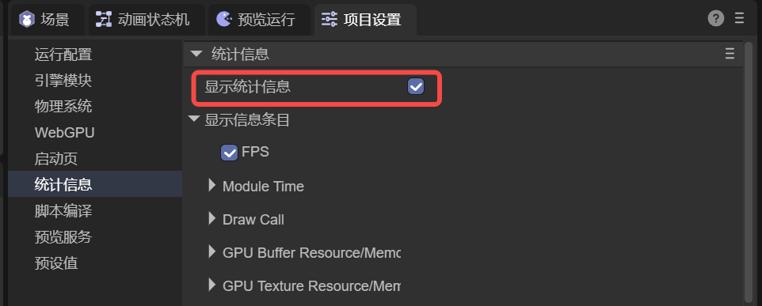

# Engine Statistics Information

> Author: Charley

The engine's statistics panel is essentially a set of **real-time, visual performance and resource monitoring tools**. It continuously presents the most critical performance data (FPS, Frame Time, per-stage time consumption, DrawCall, geometry counts, GPU memory, loading and scripts, etc.) from engine runtime on the screen. Its purpose is:

> **Turn "feeling laggy" into "locatable, comparable, verifiable numbers."**

It's the **first line of performance debugging**: used to quickly determine bottleneck direction, guide optimization decisions, and verify whether each modification is truly effective.

This section will comprehensively introduce the role of every configurable parameter in the IDE's engine statistics.

## 1. Enable/Disable Statistics Display

### 1.1 Enable/Disable Statistics Panel

The statistics panel is typically used during **IDE development and debugging**. Usually, developers only need to check **"Show Statistics"** in the IDE panel to enable the statistics panel, as shown in Figure 1-1.



(Figure 1-1)

After the statistics panel is enabled, it will **continuously display and refresh in real-time** the data of currently selected statistics items during runtime.

In certain scenarios, developers may wish to dynamically control the statistics panel's display status in code or through the DevTools console. At this point, you can directly call the engine-provided API.

- **Enable Statistics Panel**
   After calling `Laya.Stat.show()`, the statistics panel displays on the screen and refreshes according to currently configured statistics items.
- **Disable Statistics Panel**
   After calling `Laya.Stat.hide()`, the statistics panel stops refreshing and is removed from the screen.

> The statistics panel refreshes at **once per frame**, used to reflect current frame performance and resource status in real-time.

### 1.2 Enable/Disable Statistics Items

If the default displayed statistics information doesn't meet development needs, developers can customize the statistics items to display by checking or unchecking in the **IDE Statistics Configuration Panel**, as shown in Figure 1-2.


(Figure 1-2)

Besides IDE panel configuration, the statistics panel also supports precise control through code. Developers can specify the set of statistics items to display by setting `Laya.Stat.elements`.

Example code is as follows:

```ts
const { regClass, property } = Laya;

@regClass()
export class Demo extends Laya.Script {
    onEnable(): void {
        Laya.Stat.elements = [
            Laya.StatElement.CT_FPS,
            Laya.StatElement.CT_DrawCall,
            Laya.StatElement.M_GPUMemory
        ];
        // Enable statistics panel (parameters are x,y coordinates, default 0,0)
        Laya.Stat.show(5, 5);

        // Disable example:
        // Laya.Stat.hide();
    }
}
```

Configuring the statistics panel via code is suitable for the following scenarios:

- Only display statistics information during specific debugging phases
- Dynamically switch statistics items based on runtime state
- Use different statistics configurations in different devices or modes

### 1.3 Statistics Item Prefix Identifiers

In the engine, different statistics types are distinguished by name prefixes, as follows:

Starting with `T_`: **Time statistics items**, unit is **milliseconds (ms)**

Starting with `M_`: **Memory statistics items**, unit is **MB**

Starting with `C_` / `CT_`: **Count or frequency statistics items**, displayed as **integers (no decimals)**

Although these prefixes aren't displayed in the IDE statistics configuration items for better readability, it's important to note in actual engine and project use that statistics item prefixes exist.

## 2. FPS (CT_FPS)

FPS (Frames Per Second) represents **the number of rendering frames the current device can complete per second during runtime**, directly reflecting whether the overall game runs smoothly.

In most projects, FPS is often the first statistic newcomers notice, but also the **most easily misunderstood**. Therefore, in actual analysis, it needs to be interpreted together with **Frame Time** and per-module time consumption, rather than serving as the sole basis for performance judgment.

### 2.1 Significance and Application of FPS

FPS has two main purposes. First, it's the first signal for judging game smoothness. Generally, 60FPS is considered completely smooth, while below 20FPS, player subjective experience noticeably decreases. Second, FPS can serve as a comparison baseline for performance regression. In the same scene, device, and operation path, if FPS drops after introducing new features, you can quickly determine whether performance regression exists.

In the development phase, FPS is often used for quick self-checking. For example, after adding AI, physics, effects, or post-processing systems, you can first observe if FPS drops, then use the statistics panel to analyze specific performance pressure sources. In device adaptation and performance tier adjustment, when FPS is low on low-end devices, developers can decide optimization strategies through the statistics panel, including reducing shadow resolution, decreasing particle count, lowering texture precision, or disabling some post-processing effects.

It should be emphasized that FPS is a performance result, not a cause. When FPS drops, you should联动查看 other key indicators:

- **Frame Time** (`T_Frame_Time`): Whether it exceeds target threshold (e.g., >16ms corresponds to 60FPS, >33ms corresponds to 30FPS)
- **Script Update Time** (`T_ScriptUpdateTime`): Determine if script logic is too heavy
- **Shadow and Rendering Overhead** (`T_ShadowPass` / `CT_ShadowDrawCall`): Analyze shadow calculation pressure
- **Resource Usage** (`M_AllTexture` / `M_GPUMemory`): Check if memory or resource usage affects performance

Initial optimization can start from these directions: when DrawCall is high, prioritize batching, reducing material and texture switches, and UI node fragmentation. When shadow overhead is large, reduce projection objects, lower resolution or update frequency. When script logic is complex, split or lower update frequency, and use caching and object pools for optimization.

### 2.2 Performance Debugging Overview

To make the statistics panel truly guide performance optimization, follow a clear process: **first determine bottleneck category → then locate specific stage → finally verify optimization effectiveness**.

First, clarify the target frame rate (commonly 60FPS or 30FPS) and fix reproduction conditions, including device, scene, camera angle, and operation path. Only under consistent conditions do FPS and Frame Time comparisons have reference value, where FPS shows overall result while Frame Time is better suited to judge if targets are met.

Next, perform rapid triage to determine whether performance pressure mainly comes from CPU or rendering. General process is as follows:

- **Script Overhead**: Check `T_ScriptUpdateTime` / `T_ScriptLateUpdateTime`. If significantly high, CPU script logic is the main bottleneck.
- **2D Rendering Overhead**: Observe `T_AllRender2D` and `CT_2DDrawCall`. Common in overly complex UI or severe node fragmentation.
- **3D Rendering Overhead**: Check `T_AllRender3D` and `T_ShadowPass`, `T_DepthPass`, `T_3DMainPass_*` indicators to analyze rendering pressure sources.

When locating causes, it's recommended to use correlated indicators for comprehensive judgment.

High time-consuming indicators (`T_`) can be analyzed together with count or scale indicators (`CT_ / C_`). For example, when `T_3DMainPass_Opaque` is high, check `CT_OpaqueDrawCall`, `CT_ShaderChange`, or `CT_Triangle`.

When resource usage is high (`M_`), also refer to count indicators (`C_`). For example, when `M_AllTexture` is high, check `C_AllTexture` and `M_RenderTexture`. For loading or network-related issues, distinguish between slow download or slow parsing by comparing `T_LoadRequestTime` and `T_LoadResourceTime`.

Finally, after each optimization, effectiveness must be verified. Focus on three aspects: whether core indicators improve (target `T_ / CT_` decrease), whether overall performance improves and stabilizes (FPS and Frame Time improve), and whether side effects are introduced (image quality acceptable, other performance indicators normal, such as DrawCall decreases but triangle count explodes or memory spikes).

## 3. Module Time (Module Time Consumption)

In the IDE, `Module Time` is a group title used to centrally display "time statistics items (`T_`)". Values in this group are mainly written by `LayaGL.statAgent.recordTimeData(...)`.

**Usage Guide**

- **Look at overall first**: First check `FPS` and `T_Frame_Time` to confirm "is it really laggy" (FrameTime obviously >16ms/33ms).
- **Find the big one next**: Compare `T_ScriptUpdateTime`, `T_AllRender3D`, `T_AllRender2D`, `T_ShadowPass`, `T_Render_PostProcess` to find the module with the highest occupation.
- **Drill down last**: Within 3D, further check `T_CullMain`, `T_DepthPass`, `T_3DMainPass_*`, `T_3DContext*` to gradually narrow down to specific stages.

**Debugging and Optimization Quick Reference**

> Usage: First find the "highest/most abnormal" `T_` item, then execute according to "common causes → priority optimization recommendations" in the table; after optimization, use `T_Frame_Time` and corresponding `T_` items for regression verification.

| Indicator | Abnormal Signal (Experience Judgment) | Common Causes (High to Low Probability) | Priority Optimization Recommendations (Suggested Order) |
| --- | --- | --- | --- |
| `T_Frame_Time` | Long-term higher than target (>16ms/33ms) or large fluctuations | Any module time consumption exceeds standard; occasional spikes may be resource creation/compilation/GC | First use other `T_` items to find "big ones"; then check `CT_*/C_*/M_*` related indicators; for spikes, prioritize investigating resource creation and first compilation |
| `T_AllRender3D` | 3D total time significantly higher than 2D/script | 3D main process heavy (main rendering/shadows/depth/transparent/material complexity) | First split and check `T_ShadowPass`/`T_DepthPass`/`T_3DMainPass_*`; then use `CT_*DrawCall`/`CT_ShaderChange`/`CT_Triangle` to find root cause |
| `T_DepthPass` | Significantly rises after enabling post-processing/depth | Depth/DepthNormals additional drawing; too many participating objects | Reduce dependent depth effect quality/quantity; reduce participating objects; check if DepthNormals is unnecessarily enabled |
| `T_ShadowPass` | Significantly rises after enabling shadows | High shadow resolution, many cascades, many projecting objects, high update frequency | Prioritize reducing shadow projecting objects; lower shadow resolution/cascades; reduce shadow update frequency; if necessary, disable shadows or switch to baking |
| `T_3DMainPass` | Main rendering stage very high | Heavy opaque/transparent drawing, complex materials, complex lighting | First check `T_3DMainPass_Opaque/Trans` distribution; then reduce DrawCall/ShaderChange/triangles; reduce transparent overdraw |
| `T_3DContextPre` | "Preparation phase" very high | Shader first compilation, frequent define/state changes, frequent UBO/resource updates | Preheat shaders; reduce per-frame dynamic material/macro definition changes; reduce frequent create/destroy resources; reduce UBO uploads (see `CT_UBO*`) |
| `T_3DContextRender` | "Rendering phase" very high | Many DrawCalls, many triangles, transparent overdraw, many state switches | First reduce `CT_DrawCall/CT_3DDrawCall`; then reduce `CT_Triangle`; then reduce `CT_ShaderChange`; reduce full-screen transparent/particles |
| `T_3DMainPass_Opaque` | Opaque time consumption accounts for highest proportion | Many opaque objects, fragmented materials, complex lighting | Batching/instancing/static merging; reduce material types; optimize lighting and shadow participation; LOD/culling |
| `T_3DMainPass_Trans` | Transparent time abnormally high | Many transparent objects/particles, severe sorting and overdraw | Reduce transparent quantity and coverage area; merge effects; try to avoid large-area semi-transparent overlay; prioritize optimizing particles |
| `T_3DBatchTime` | Batching time high but DrawCall doesn't significantly decrease | Extremely many scene objects, batching strategy mismatch, frequent dynamic changes | First confirm if batching brings DrawCall benefits; if no benefit, reduce participation/change strategy; reduce dynamic change frequency |
| `T_CullMain` | Rises when many scene objects | Many 3D nodes/renderers, culling/cutting cost increases | Reduce on-screen object count; enable/optimize culling strategy; try to reduce objects still in list but invisible |
| `T_CullShadow` | Culling very expensive when shadows enabled | Too many shadow projecting objects, cascades/multiple lights cause repeated culling | Reduce projecting objects; lower shadow range; reduce cascades/light count; improve filtering conditions |
| `T_Render_PostProcess` | Significantly rises after enabling post-processing | Post-processing chain too long, effects too heavy, resolution too high | Disable or reduce heavy effects; lower post-processing resolution; reduce overlay effect count |
| `T_AllRender2D` | Significantly rises in UI/2D scenes | UI nodes fragmented, many masks/filters, frequent rebuilding | First check `CT_2DDrawCall`; reduce masks/filters; implement list virtualization; reduce per-frame layout/text rebuilding |
| `T_2DPass` | Rises when multiple Passes | Many Passes, many off-screen/post-processing | Reduce Passes; merge effects; lower off-screen RT resolution |
| `T_2DContextPre` | 2D preparation phase high | Heavy 2D element preparation/data upload | Reduce dynamic changes; cache/reuse; reduce geometry rebuilding |
| `T_2DContextRender` | 2D rendering phase high | Many DrawCalls, transparent overlay, overdraw | Reduce `CT_2DDrawCall`; merge texture atlases; reduce layers and transparent coverage |
| `T_ScriptUpdateTime` | High per-frame script time | Heavy logic, large iterations, frequent allocation/GC, many events | Prioritize reducing per-frame allocation; split heavy logic/reduce frequency; cache lookup results; object pools; reduce full iterations |
| `T_ScriptLateUpdateTime` | LateUpdate very high | Heavy follow/interpolation/post-processing logic, linked with animation/skeleton | Same as `T_ScriptUpdateTime`; also check if logic can be moved to low-frequency updates or event-driven |

### 3.1 Frame Time (T_Frame_Time)

Represents the approximate value of **single frame time consumption (ms)**, internally calculated as \(1000 / FPS\).

In projects, the value of Frame Time is that it can quantify "smoothness/lag" directly into milliseconds, making it easy to judge whether the current frame rate meets the target (for example, 60FPS≈16.6ms, 30FPS≈33.3ms). When optimizing, Frame Time is also the most intuitive measure of "whether optimization is effective."

**Typical Uses:**

- **Mobile Frame Stability**: When targeting 30FPS, Frame Time needs to remain stable within ~33ms. Occasional spikes will bring noticeable frame drops.
- **Feature Regression Verification**: After adding new systems, if Frame Time rises, it indicates overall cost has increased. Need to further investigate whether scripts or rendering are becoming heavier.

### 3.2 All Render 3D (T_AllRender3D)

Represents the **total time consumption (ms) of all 3D scene rendering submissions this frame**. It statistics the total time consumption of calling `renderSubmit()` for all `Scene3D` during stage rendering.

In projects, this indicator is most commonly used to answer two questions:

- **"Is lag mainly coming from 3D?"**: Compare it with `T_AllRender2D` and `T_ScriptUpdateTime` to quickly determine the bottleneck category.
- **"Has a certain 3D scene/camera become more expensive?"**: When you switch scenes, enable/disable effects or post-processing, this value often changes immediately.

**Typical Uses:**

This item often rises significantly in large scenes, complex materials, dense lighting, enabled shadows, or excessive transparency.

### 3.3 Depth Pass (T_DepthPass)

Represents the **total time consumption (ms) of depth-related Passes**, including:

- Generating Depth Texture (Depth)
- Generating DepthNormals Texture (DepthNormals)

In projects, this item is commonly used to judge "whether depth preprocessing is worth it": when you enable depth textures (for example, post-processing needs Depth/DepthNormals), Depth Pass will draw scene objects an additional time (or multiple times), and the cost will be directly reflected here.

**Typical Uses:**

- When **using post-processing that depends on depth** (depth of field, fog effects, screen space effects, etc.), Depth Pass is usually indispensable.
- When **object count is very high**, Depth Pass may become a significant overhead. You need to consider reducing participating objects or lowering related effect quality.

### 3.4 Shadow Pass (T_ShadowPass)

Represents the **total time consumption (ms) of the shadow map rendering stage**, statistics cover the overall stage time consumption of "rendering shadow maps" in the main rendering process.

In projects, this item is used to measure "the overall cost of the shadow system." Shadow maps often require additional drawing of objects casting shadows (and may be executed repeatedly according to cascades/light source types), making it one of the most common performance hotspots on mobile.

**Typical Uses:**

- **FPS drops significantly after enabling real-time shadows**: Prioritize checking `T_ShadowPass` and `CT_ShadowDrawCall`.
- **Shadow quality too high**: Shadow resolution, cascade count, update frequency, etc., will all significantly affect this value.

### 3.5 3D Main Pass (T_3DMainPass)

Represents the **total time consumption (ms) of the 3D main rendering Pass**, usually including the main processes of opaque drawing, skybox/environment drawing, transparent drawing, etc.

When you need further subdivision, you can work with the following two sub-items (3.8, 3.9) to locate the proportion of opaque and transparent.

In projects, this indicator is commonly used to judge "whether main rendering is the biggest overhead." If `T_3DMainPass` is very high while `T_ShadowPass` and `T_DepthPass` are not high, it usually indicates that the main cost occurs in the actual main scene drawing stage (complex materials, complex lighting, transparent overdraw, etc.).

### 3.6 3D Context Pre (T_3DContextPre)

Represents the **time consumption (ms) of the 3D rendering context's "pre-drawing preparation phase"**. Usually includes:

- Context-level Shader Define merging and preparation
- Pre-update of RenderElement (such as material/shader preparation, necessary compilation and state preparation)
- Preparation and triggering before Uniform/Buffer uploads, etc.

**Typical Uses:**

- **"DrawCall is not high but still laggy"**: May be stuck in the preparation phase (for example, frequent shader compilation, frequent UBO updates, frequent state changes).
- **"Lag when first loading/switching materials"**: May be spikes caused by shader first compilation or resource preparation.

### 3.7 3D Context Render (T_3DContextRender)

Represents the **time consumption (ms) of the 3D rendering context's "actual drawing phase"**. It statistics the time of RenderElement executing the `_render(...)` process, usually closer to GPU submission/drawing-related CPU overhead.

In projects, if `T_3DContextRender` is significantly higher than `T_3DContextPre`, it often means the actual drawing submission is heavier (for example, many draws, state switches, high triangle count, transparent overdraw, etc.).

### 3.8 3D Main Pass Opaque (T_3DMainPass_Opaque)

Represents the **drawing time consumption (ms) of the opaque queue in the 3D main rendering Pass**.

**Typical Uses:** Opaque drawing usually accounts for the largest proportion. When many static objects, complex materials, or dense lighting are enabled, it may rise significantly.

### 3.9 3D Main Pass Trans (T_3DMainPass_Trans)

Represents the **drawing time consumption (ms) of the transparent queue in the 3D main rendering Pass**.

**Typical Uses:** Transparent queues are often accompanied by sorting, blending, and overdraw, which can easily cause frame time increases. When transparent object count/area is large, this needs focus.

### 3.10 3D Batch Time (T_3DBatchTime)

Represents the **time consumption (ms) of the 3D batching (Batch) phase**. Before the opaque rendering queue renders, the engine attempts to execute instanced batching/queue merging. This item records the CPU overhead of this step.

**Typical Uses:** When dynamic batching/instanced batching is enabled and there are many scene objects, it's used to observe whether batching itself becomes a bottleneck.

### 3.11 Cull Main (T_CullMain)

Represents the **time consumption (ms) of main camera frustum culling (and related culling logic)**, statistics cover the stage cost of filtering objects that need rendering this frame from the rendering list.

**Typical Uses:** When scene objects are very numerous, culling costs may be significant. Can be optimized using BVH/occlusion culling, etc.

### 3.12 Cull Shadow (T_CullShadow)

Represents the **time consumption (ms) of culling during the shadow rendering stage**, i.e., the cost of filtering the set of objects that need to cast shadows from the rendering list (including cascade/spotlight shadow culling paths).

**Typical Uses:** After enabling shadows, besides Shadow Pass itself, Shadow Cull may also become an additional overhead source.

### 3.13 Render PostProcess (T_Render_PostProcess)

Represents the **time consumption (ms) of the post-processing (PostProcess) stage**. When a camera enables post-processing and the effect chain is not empty, this item will statistics the time consumption of the post-processing command execution stage.

**Typical Uses:** Locate whether the post-processing chain is the main cause of frame time (Bloom/SSR/SSAO, etc., usually have high costs).

### 3.14 All Render 2D (T_AllRender2D)

Represents the **total time consumption (ms) of all 2D scene rendering this frame**, statistics cover the overall time consumption of `_render2d()` in stage rendering.

**Typical Uses:** When UI/2D effects are dense, used to determine whether 2D is the main time consumption source.

### 3.15 2D Pass (T_2DPass)

Represents the **time consumption (ms) of 2D Pass manager execution**, statistics cover the overall stage time of 2D PassManager `apply(...)`.

**Typical Uses:** When 2D has multiple Passes (for example, off-screen, post-processing, masks, etc.), can be used to evaluate Pass management and switching overhead.

### 3.16 2D Context Pre (T_2DContextPre)

Represents the **time consumption (ms) of the 2D rendering context's "pre-drawing preparation phase"**. Commonly includes:

- `_prepare(...)` of RenderElement2D
- Uniform/Buffer upload triggering, etc.

### 3.17 2D Context Render (T_2DContextRender)

Represents the **time consumption (ms) of the 2D rendering context's "actual drawing phase"**, statistics cover the stage time of RenderElement2D's `_render(...)`.

### 3.18 Script Update Time (T_ScriptUpdateTime)

Represents the **total time consumption (ms) of all component scripts' `onUpdate()` execution this frame**. It statistics the time consumption of traversing and executing script updates within `ComponentDriver.callUpdate()`.

**Typical Uses:** Judge whether CPU is mainly consumed in script logic (AI, pathfinding, numerical calculations, state machines, etc.).

### 3.19 Script Late Update Time (T_ScriptLateUpdateTime)

Represents the **total time consumption (ms) of all component scripts' `onLateUpdate()` execution this frame**. It statistics the time consumption of traversing and executing script LateUpdate within `ComponentDriver.callLateUpdate()`.

**Typical Uses:** Judge whether LateUpdate has heavy logic (for example, follow/interpolation, delayed refresh, skeleton/IK driving, etc.).

## 4. Draw Call (Draw Calls)

In the IDE, `Draw Call` is a group title used to centrally display "per-frame draw call counts (`CT_`)". `CT_` types are usually displayed as averages calculated over a 1-second window.

**Usage Guide**

- DrawCall can be understood as "render submission count." The more submissions, the higher the CPU-side rendering organization and state switching costs usually are.
- Many projects' optimization paths are: **first reduce DrawCall** (batching/reduce material and texture switches), then look at triangle and pixel pressure.
- When judging whether DrawCall is abnormal, it's recommended to also check: `CT_ShaderChange` (Shader switching) and `CT_Triangle` (triangle count).

**Debugging and Optimization Quick Reference**

| Indicator | Abnormal Signal | Common Causes | Priority Optimization Recommendations (Suggested Order) | How to Verify |
| --- | --- | --- | --- | --- |
| `CT_DrawCall` | Overall very high and rises linearly with scene scale | Objects/materials too fragmented; batching ineffective; frequent texture/material switches | Merge atlases and unify materials → Batching/instancing/static merging → Reduce UI fragmentation and layers | Observe `CT_DrawCall` decrease, while `T_3DContextRender`/`T_AllRender2D` also decreases |
| `CT_2DDrawCall` | Very high in UI scenes | UI nodes too fragmented, many masks/filters, atlases not unified | UI atlases → Reduce masks/filters → List virtualization → Reduce dynamic text/layout rebuilding | `CT_2DDrawCall` decreases and `T_AllRender2D` decreases |
| `CT_3DDrawCall` | Very high in 3D scenes | Meshes/materials fragmented, lighting/shadows split batches | Batching/instancing/static merging → Reduce material types → Merge small objects | `CT_3DDrawCall` decreases and `T_AllRender3D`/`T_3DContextRender` decreases |
| `CT_OpaqueDrawCall` | High opaque batches | Many opaque objects, many materials | First do static merging/instancing; Reduce material variants | `CT_OpaqueDrawCall` decreases, `T_3DMainPass_Opaque` decreases |
| `CT_TransDrawCall` | High transparent batches | Too many particles/transparent materials, hard to batch | Reduce transparent quantity and coverage area; Merge effects; Make opaque if possible | `CT_TransDrawCall` and `T_3DMainPass_Trans` both decrease |
| `CT_ShadowDrawCall` | High shadow batches | Many shadow casting objects, cascades/multiple lights cause repeated drawing | Reduce casting objects; Lower shadow resolution/cascades/update frequency | `CT_ShadowDrawCall` and `T_ShadowPass` decrease |
| `CT_DepthCastDrawCall` | High depth batches | Too many Depth/DepthNormals participating objects | Only enable depth when necessary; Reduce participating objects | `CT_DepthCastDrawCall` and `T_DepthPass` decrease |
| `CT_Instancing_DrawCall` | Value is 0 but instancing expected | Instancing not enabled/material doesn't match/data doesn't match | Confirm same material and render state; Use instancing instead of duplicate objects | `CT_Instancing_DrawCall` increases and `CT_DrawCall` decreases |
| `CT_IndirectDrawCall` | Value suddenly rises | Using Indirect Draw (WebGPU) | Usually normal; If abnormally high, check for duplicate indirect command submission | Judge with `CT_DrawCall`, `T_3DContextRender` whether it brings benefits |

### 4.1 Opaque DrawCall (CT_OpaqueDrawCall)

Represents the **DrawCall count in the opaque rendering queue** (counted by render elements).

**Typical Uses:**

- **Opaque usually accounts for the majority of 3D drawing.** When this value is very high, common causes are: objects too fragmented, too many materials, poor batch merging effects.
- Interpret together with `T_3DMainPass_Opaque`:  
  - High DrawCall + high time: Mostly "too many submissions" or "too frequent state switches."  
  - Low DrawCall + high time: Mostly "single draw is very heavy" (complex shader, many triangles, complex lighting, etc.).

### 4.2 Trans DrawCall (CT_TransDrawCall)

Represents the **DrawCall count in the transparent rendering queue** (counted by render elements).

**Typical Uses:**

- Transparent objects often need sorting and blending, **harder to batch**, and more prone to "more transparent = more lag" situations.
- When transparent DrawCall is high, common corresponding phenomena are: too many particles/effects, overly complex UI transparent layers, overly fragmented semi-transparent materials.

### 4.3 Depth Cast DrawCall (CT_DepthCastDrawCall)

Represents the **DrawCall count in Depth/DepthNormals Pass** (draw call count for generating depth-related textures).

**Typical Uses:**

- This value rising usually means: **large number of objects participating in depth pre-rendering**. When you enable post-processing or effects that depend on depth, need to focus on whether it's "drawing the entire scene again."
- If `T_DepthPass` also rises, it indicates Depth Pass has become a visible cost. Can consider reducing participating objects, lowering depth requirements, or reducing effect quality.

### 4.4 Shadow DrawCall (CT_ShadowDrawCall)

Represents the **DrawCall count in shadow map rendering** (draw call count of objects casting shadows).

**Typical Uses:**

- High shadow DrawCall usually means: **too many objects casting shadows**, or shadow cascades/multiple lights cause repeated drawing.
- If mobile performance is tight, shadow-related DrawCalls are usually one of the first indicators that need to be pressed (reduce casting objects, lower shadow resolution/update frequency).

### 4.5 2D DrawCall (CT_2DDrawCall)

Represents the **DrawCall count submitted by the 2D rendering context** (counted by 2D RenderElement).

**Typical Uses:**

- High 2D DrawCall usually comes from: UI nodes too fragmented, too many masks/filters, frequent texture/material switches, frequent dynamic text/atlas changes, etc.
- When you find `T_AllRender2D` rising, prioritize checking this value. Usually can quickly determine whether it's caused by "too many submissions."

### 4.6 3D DrawCall (CT_3DDrawCall)

Represents the **DrawCall count submitted by the 3D rendering context** (counted by 3D RenderElement).

**Typical Uses:**

- Compare it with `CT_2DDrawCall` to quickly determine whether DrawCall pressure mainly comes from 2D or 3D.
- When you do 3D batching, instancing, or LOD, 3D DrawCall changes are the most direct benefit reflection.

### 4.7 DrawCall (CT_DrawCall)

Represents the **overall DrawCall count**. This value usually comes from the count when the underlying rendering device executes each draw instruction (including 2D, 3D).

**Typical Uses:** It's the final summary of "total submission count." In performance optimization, can usually treat `CT_DrawCall` as one of the first target indicators (especially when CPU-side is bottlenecked).

### 4.8 Indirect DrawCall (CT_IndirectDrawCall)

Represents the **call count of Indirect Draw** (such as WebGPU's `drawIndirect/drawIndexedIndirect`).

Note: In WebGL path, Indirect Draw is usually not generated. If the current runtime environment doesn't support/doesn't use Indirect, this may be 0.

### 4.9 Instancing DrawCall (CT_Instancing_DrawCall)

Represents the **DrawCall count of instanced drawing (Instancing)**.

**Typical Uses:**

- This item is used to judge "whether instancing is really working." For example, grass fields/trees/bullet holes/same material duplicate objects. If instancing is effective, can usually significantly reduce overall DrawCall.
- View together with `CT_DrawCall`: When `CT_Instancing_DrawCall` rises but `CT_DrawCall` decreases or stays stable, it usually means instancing is playing a role.

## 5. GPU Buffer Resource/Memory (GPU Buffer Resources/Memory)

This group contains **memory (`M_`, unit MB)** and **count (`C_`)** of Buffer class resources. Statistics data is usually accumulated and updated when Buffer is created, expanded, or destroyed.

**Usage Guide**

- This set of indicators is mainly used to answer two questions: **"Are there too many GPU Buffers/is there leakage?"** and **"Is Buffer memory abnormally rising?"**  
- A very useful practice is: compare these values before and after key scene switches (enter battle/exit battle/load large map/open close UI) to observe whether "should decrease but doesn't" (leakage/not released) or "sudden spike" (unreasonable resource configuration).

### 5.1 GPU Buffer Memory (M_GPUBuffer)

Represents the **total memory sum (MB) of all GPU Buffers**. Buffers include vertex buffers, index buffers, Uniform/UBO, etc.

**Typical Uses:** Used to monitor "how much space geometry/Uniform and other data occupy on the GPU." When this value continues to rise and doesn't fall back, it often means unreleased resources, constantly expanding dynamic mesh/particle buffers, etc.

### 5.2 GPU Buffer Count (C_GPUBuffer)

Represents the **object count of GPU Buffers** (create +1, destroy -1).

**Typical Uses:** Used to investigate "whether Buffer objects are becoming more and more." If the count doesn't decrease after switching scenes or closing systems, usually need to check resource lifecycle and reference relationships.

### 5.3 Vertex Buffer Memory (M_VertexBuffer)

Represents the **memory occupation (MB) of vertex buffers (Vertex Buffer)**.

**Typical Uses:** Vertex buffers directly correspond to vertex data of meshes/particles/2D generated meshes. When you do "reduce mesh subdivision, reduce particle count, reduce UI dynamic rebuilding", this item usually decreases.

### 5.4 Vertex Buffer Count (C_VertexBuffer)

Represents the **vertex buffer object count**.

**Typical Uses:** Used to judge whether vertex data is overly split (many small VBs) or not released. Too many objects may also bring management and upload overhead.

### 5.5 Index Buffer Memory (M_IndexBuffer)

Represents the **memory occupation (MB) of index buffers (Index Buffer)**.

**Typical Uses:** Index buffers are related to mesh topology. If you find this item very high, it usually means there are many meshes or particle systems using larger index data in the scene.

### 5.6 Index Buffer Count (C_IndexBuffer)

Represents the **index buffer object count**.

**Typical Uses:** Similar to `C_VertexBuffer`, used to investigate whether index data is overly split or not released.

### 5.7 UBO Buffer Memory (M_UBOBuffer)

Represents the **memory occupation (MB) of Uniform Buffers (UBO)**.

**Typical Uses:** UBOs are often used for uniform data blocks like materials/cameras/scene parameters. This item being too large may mean unreasonable UBO allocation strategy or many dynamic UBOs.

### 5.8 UBO Buffer Count (C_UBOBuffer)

Represents the **object count of Uniform Buffers (UBO)**.

**Typical Uses:** When this count is abnormally high, it usually means each object/material is generating an independent UBO. May need merging/sharing strategies.

### 5.9 Device Buffer Memory (M_DeviceBuffer)

Represents the **memory occupation (MB) of device-side Buffers (WebGPU DeviceBuffer/StorageBuffer, etc.)**.

> More common in WebGPU path. In WebGL path, may be 0 or only generated in certain extension implementations.

Used in WebGPU path to observe whether resource occupation of "StorageBuffer/Compute and other related data structures" is reasonable.

### 5.10 Device Buffer Count (C_DeviceBuffer)

Represents the **object count of device-side Buffers**.

**Typical Uses:** Used together with `M_DeviceBuffer` to investigate whether device buffer objects are leaking or created too many.

## 6. GPU Texture Resource/Memory (GPU Texture Resources/Memory)

This group contains **memory (`M_`, unit MB)** and **count (`C_`)** of Texture class resources. Statistics data is accumulated and updated when texture/RenderTexture is created, memory estimates updated, or destroyed.

**Usage Guide**

- Textures and render textures (RenderTexture) are usually one of the easiest sources to "explode memory" on mobile.  
- When **lag, visual artifacts, black screen, WebGL context lost, or severe device heating** occurs, prioritize checking this group of indicators, especially `M_GPUMemory`, `M_AllTexture`, `M_RenderTexture`.

**Debugging and Optimization Quick Reference**

| Indicator | Abnormal Signal | Common Causes | Priority Optimization Recommendations (Suggested Order) | How to Verify |
| --- | --- | --- | --- | --- |
| `M_AllTexture` | Total texture memory very high or doesn't fall after scene switch | Texture resolution too high/too many; Atlas fragmentation; Not released | Prioritize compression/reduce resolution → Reduce resident textures → Check resource release and cache strategy | Values can fall after switching scenes/closing systems; Loading peak decreases |
| `M_RenderTexture` | RT memory very high | Too many post-processing/off-screen RTs, resolution too high, RT not recycled | Lower RT resolution (especially post-processing) → Reduce effect chains/Passes → Check RT pooling/recycling | `M_RenderTexture` and `C_RenderTexture` both decrease |
| `C_AllTexture` | Count continuously rising | Repeated creation/repeated loading, cache out of control, references not released | Check resource lifecycle and references; Avoid repeated loading; Reasonable grouping and release | Can fall back to stable value after scene switch |
| `M_Texture2D`/`C_Texture2D` | UI/texture class indicators abnormally high | Too many/too large UI atlases; Multi-language/skin resources resident | Merge atlases/load on demand; Lower texture size; Do scene分包 | Indicators decrease and UI rendering performance improves |
| `M_TextureCube` | Cubemap memory abnormal | Skybox/reflection probe resolution too high | Lower cube resolution; Reduce probe count; Enable by scene | Memory decreases and no obvious visual degradation |
| `M_Texture2DArray` | Array texture memory abnormal | Too many layers/too high resolution | Control layer count and resolution; Create on demand | Memory decreases and function works normally |

### 6.1 All Texture Memory (M_AllTexture)

Represents the **total memory occupation (MB) of all textures (including normal textures and RenderTexture)**.

**Typical Uses:** It's the most intuitive "texture memory overview." When you suspect textures are too large, too many textures loaded, or RT usage is excessive, first check whether it exceeds the target device's tolerable range.

### 6.2 All Texture Count (C_AllTexture)

Represents the **total texture object count**.

**Typical Uses:** Used to investigate whether textures are "being used more and more." If the count doesn't fall after scene switching, usually texture resources are not released or cache strategy is improper.

### 6.3 Texture2D Memory (M_Texture2D)

Represents the **2D texture memory occupation (MB)**.

**Typical Uses:** The vast majority of art textures and UI atlases in projects belong to Texture2D. When this item is too high, common handling is: compress textures, reduce resolution, reduce resident textures, split loading strategy.

### 6.4 Texture2D Count (C_Texture2D)

Represents the **2D texture object count**.

**Typical Uses:** Too many Texture2D objects usually means: atlas fragmentation, repeated loading, or resources not released. When investigating, it's recommended to cross-reference resource loading points and cache strategies.

### 6.5 TextureCube Memory (M_TextureCube)

Represents the **cubemap texture memory occupation (MB)**.

**Typical Uses:** Often used for skyboxes, reflection probes, etc. Cubemap resolution can easily cause memory to spike (6 faces), need special caution on mobile.

### 6.6 TextureCube Count (C_TextureCube)

Represents the **cubemap texture object count**.

**Typical Uses:** Used to investigate whether reflection probe/skybox resources are repeatedly created or not released.

### 6.7 Texture3D Memory (M_Texture3D)

Represents the **3D texture memory occupation (MB)**.

**Typical Uses:** 3D textures are often used for volume data, certain advanced effects, or GPU calculation-related data. If the project doesn't use related functions but the value is not 0, it's recommended to check whether it's misused or resources not recycled.

### 6.8 Texture3D Count (C_Texture3D)

Represents the **3D texture object count**.

**Typical Uses:** Used to judge whether 3D textures are frequently created (may bring memory and creation costs).

### 6.9 Texture2DArray Memory (M_Texture2DArray)

Represents the **2DArray texture memory occupation (MB)**.

**Typical Uses:** Texture2DArray is often used for batch texture sampling, instanced rendering, etc. When this item is high, need to focus on whether array layer count and resolution are too large.

### 6.10 Texture2DArray Count (C_Texture2DArray)

Represents the **2DArray texture object count**.

**Typical Uses:** Used to investigate whether Texture2DArray is repeatedly created or not released.

### 6.11 RenderTexture Memory (M_RenderTexture)

Represents the **memory occupation (MB) of all RenderTextures**.

**Typical Uses:** RenderTextures are often used for post-processing, off-screen rendering, UI effects, reflections, etc. They often have high resolution and large count, bringing very high memory and bandwidth costs, making them a high-incidence area for performance problems.

### 6.12 RenderTexture Count (C_RenderTexture)

Represents the **RenderTexture object count**.

**Typical Uses:** When this count is too high, common causes are: multiple cameras/multiple post-processing chains/frequently creating temporary RTs without recycling. It's recommended to check RT pooling and lifecycle management.

## 7. GPU Misc (GPU Other Statistics)

**Usage Guide**

This group is more focused on "rendering details." When you already know rendering is slow (for example `T_AllRender3D` is high), they can help you further determine whether "slow in submission count, Shader switching, geometry count, or data upload."

**Debugging and Optimization Quick Reference**

| Indicator | Abnormal Signal | Common Causes | Priority Optimization Recommendations (Suggested Order) | How to Verify |
| --- | --- | --- | --- | --- |
| `M_GPUMemory` | Total memory high or doesn't fall | Texture/RT/Buffer occupation too high or leaking | Prioritize compressing textures and lowering RT → Check resource release → Reuse and pooling | Falls after scene switch/close system; Peak decreases |
| `CT_ShaderChange` | Frequent switching | Materials/Shaders too fragmented; Many different material small objects on screen | Unify materials and shader variants; Reduce material types; Merge small objects | `CT_ShaderChange` decreases and `T_3DContextRender` decreases |
| `CT_Triangle` | Triangles abnormally high | High model face count, missing LOD, too many particle meshes | LOD/simplified models; Reduce high-poly models on screen; Reduce particle meshes | `CT_Triangle` decreases and visuals acceptable |
| `CT_BufferUploadCount` | High upload count | Frequent dynamic VB/IB/UBO updates | Reduce per-frame updates; Merge batch updates; Cache and object pools | Count decreases and frame time spikes reduce |
| `CT_GeometryBufferUploadCount` | High geometry upload | Dynamic mesh/text/particle rebuilding | Cache geometry, lower rebuild frequency, reduce dynamic text updates | Count decreases and 2D/3D corresponding time decreases |
| `CT_UBOBufferUploadCount`/`CT_UBOBufferUploadMemory` | High UBO upload count or amount | Modify many material/object parameters per frame | Reduce unnecessary parameter changes; Share batch parameters; Merge updates | Upload indicators decrease and `T_3DContextPre`/`Render` decreases |

### 7.1 GPU Memory (M_GPUMemory)

Represents the **GPU-side total memory estimate (MB)**. Usually accumulated and updated synchronously when Buffer and Texture memory changes, is an "overview-type" indicator.

**Typical Uses:** This is one of the most recommended indicators for long-term attention. Too high memory can cause loading stuttering, unstable rendering, or even crashes (especially on mobile). If you see it continuously rising and not falling after certain operations, prioritize investigating resource release and RT pools.

### 7.2 Shader Change (CT_ShaderChange)

Represents the **Shader Program switch count** (averaged over 1-second window). Increases when frequently `useProgram` during rendering.

**Typical Uses:**

- High shader switch count usually means materials/Shaders are too fragmented, causing frequent GPU state switches.
- Common in: scenes with many different material small objects on screen, UI mixing many different shaders, too many effect material types, etc.

### 7.3 Triangle (CT_Triangle)

Represents the **triangle count** (per-frame/per-second window average, depending on statistics window display strategy).

**Typical Uses:**

- Triangle count directly reflects "geometric complexity", is one of the core indicators for judging vertex processing pressure.
- Commonly used for: evaluating whether model face count exceeds standard, whether LOD is needed, whether simplified models or batching are needed.

### 7.4 Buffer Upload Count (CT_BufferUploadCount)

Represents the **BufferSubData upload count** (for example, data update count to buffers in WebGL).

**Typical Uses:**

- This value being high indicates frequent CPU->GPU data updates, easily causing CPU overhead and bandwidth pressure.
- Common sources: particle systems writing VB every frame, frequent dynamic text/graphics rebuilding, frequent dynamic mesh/skin data updates, etc.

### 7.5 Geometry Buffer Upload Count (CT_GeometryBufferUploadCount)

Represents the **geometry Buffer (VB/IB) upload count**.

**Typical Uses:** More focused on "geometry data upload." When you see DrawCall is not high but still laggy, if this item is high, it often means "upload is slowing you down". Need to reduce per-frame updates or change to caching/batch updates.

### 7.6 UBO Buffer Upload Count (CT_UBOBufferUploadCount)

Represents the **UBO upload count**.

### 7.7 UBO Buffer Upload Memory (CT_UBOBufferUploadMemory)

Represents the **data amount (MB) of UBO uploads** (statistics of uploaded size accumulation).

**Typical Uses:**

- These two items together are used to measure "whether Uniform data updates are excessive." When object count is high and many material parameters are modified every frame, UBO upload count and upload amount will significantly rise.
- Common optimizations: reduce unnecessary per-frame parameter changes, merge same material parameters, try to share in batches, use instancing to package per-object data for upload.

## 8. Other Game Count/Time (Other Object Counts/Time)

**Usage Guide**

- This group is used to answer "how large is the scene scale, how many objects, whether animation/skeleton/particle updates become heavy".  
- When you don't know where to start optimizing, first check whether object counts are abnormal (`C_Sprite2DCount/C_Sprite3DCount/C_BaseRenderCount`), then check whether update time consumption is abnormal (`T_AnimatorUpdate/T_SkinBoneUpdate/T_ShurikenUpdate`).

### 8.1 Sprite2D Count (C_Sprite2DCount)

Represents the **2D node (Node/Sprite) count in active hierarchy levels**. +1 when node activation enters hierarchy, -1 when exiting.

**Typical Uses:**

- Too high 2D node count usually means overly complex UI structure or overly fragmented splitting, bringing: traversal/layout/event/script/rendering comprehensive pressure.
- Common scenarios: lists not virtualized, complex HUDs resident, dynamically generated nodes not recycled, etc.

### 8.2 Sprite3D Count (C_Sprite3DCount)

Represents the **3D node (Sprite3D) count in active hierarchy levels**.

**Typical Uses:** Too high 3D node count usually means large scene object scale, culling and rendering organization costs will rise. Can judge together with `T_CullMain` whether "culling stage is already very expensive."

### 8.3 BaseRender Count (C_BaseRenderCount)

Represents the **count of all renderers (BaseRender derived classes)**, for example MeshRenderer, SkinnedMeshRenderer, ParticleRenderer, etc.

**Typical Uses:** Renderer count determines "the object scale that needs to be managed by the rendering system." When this value is high, it usually means many rendering objects, and DrawCall/culling/update pressures will all increase.

### 8.4 MeshRender Count (C_MeshRenderCount)

Represents the **MeshRenderer count**.

**Typical Uses:** Used to judge whether normal mesh renderer count is too high. If huge, it's recommended to check: can static objects be merged, can instancing be used, is LOD/culling strategy needed.

### 8.5 SkinnedMeshRender Count (C_SkinnedMeshRenderCount)

Represents the **SkinnedMeshRenderer count**.

**Typical Uses:** Skinned mesh renderer count brings pressure to both CPU (bone calculation) and GPU (skin data/vertex processing). When many characters/monsters/many simultaneous animations, need focus.

### 8.6 ShurikenParticleRender Count (C_ShurikenParticleRenderCount)

Represents the **ShurikenParticleRenderer count**.

**Typical Uses:** Used to judge particle renderer count scale. When particle systems are too many, often brings transparent drawing, overdraw, VB update and other problems. Can investigate together with `CT_TransDrawCall`, `T_ShurikenUpdate`.

### 8.7 Animator Update (T_AnimatorUpdate)

Represents the **Animator update time consumption (ms)**. Statistics cover the total time consumption of Animator in update/blending/event script and other processes.

**Typical Uses:** When lag occurs as on-screen character/monster count increases, this item is often an important CPU consumption point "outside scripts". If this item is high, usually need to lower animation update frequency, reduce state machine complexity, reduce simultaneous active character count, etc.

### 8.8 SkinBone Update (T_SkinBoneUpdate)

Represents the **skin bone data update time consumption (ms)**. This item statistics the time consumption of SkinnedMeshRenderer performing bone matrix calculation and submission during the rendering update phase.

**Typical Uses:** This item being high usually means many bones, many skinning characters, or too frequent updates. Common optimization directions are: lower bone count, reduce simultaneous skinning objects, use simplified skeletons/LOD, reduce invisible character updates.

### 8.9 Shuriken Update (T_ShurikenUpdate)

Represents the **Shuriken particle system update time consumption (ms)**. This item statistics the phase cost of particle systems performing emission, updates per frame (or according to update mask) and possibly writing back to VertexBuffer.

**Typical Uses:** Particles are often a high-incidence area for performance problems on mobile (especially transparent overdraw + per-frame updates). When this item is high, common strategies are: reduce particle count, lower emission frequency, merge effects, shorten lifecycle, reduce full-screen covering transparent particles.

## 9. Physics 3D (3D Physics)

`physics 3D` is a group title used to summarize physics module related statistics. Need to note: **physics module has two sets of statistics sources**:

- One type writes directly to `LayaGL.statAgent` (so can be directly displayed by statistics panel).
- One type writes to `Physics3DStatInfo` (needs developers to synchronize to `statAgent` when needed, otherwise statistics panel may display as 0). This type is more suitable for physics internal "per-frame reset" event counting.

**Usage Guide**

- Physics-related lag's most common manifestation is: **frame rate drops when on-screen rigid body/collider count increases**, or **event storms (Enter/Stay/Exit) cause scripts and event dispatch to slow down**.
- Recommend first checking: `T_Physics_Simulation` (simulation itself), `T_Physics_UpdateNode` (synchronization), `T_PhysicsEvent` (dispatch) and `C_PhysicsEventCount` (event quantity), quickly determine whether the problem belongs to "simulation can't keep up" or "too many events".

**Debugging and Optimization Quick Reference**

| Indicator | Abnormal Signal | Common Causes | Priority Optimization Recommendations (Suggested Order) | How to Verify |
| --- | --- | --- | --- | --- |
| `T_Physics_Simulation` | Significantly rises when many rigid bodies on screen | Many dynamic rigid bodies, complex collision shapes, many constraints | Reduce dynamic rigid bodies; Simplify colliders; Lower update frequency/substeps | Simulation time decreases and behavior acceptable |
| `T_Physics_UpdateNode` | High sync time | Many rigid bodies writing back transform | Reduce dynamic rigid bodies; Reduce per-frame forced sync; Lower update frequency | Sync time decreases |
| `T_PhysicsEvent` | High event dispatch time | Event storms (many Stay), insufficient filtering | Do layer/event filtering; Reduce trigger density; Reduce continuous contact | Dispatch time and event count decrease |
| `C_PhysicsEventCount` | Abnormally high quantity | Too many Stay, trigger range too large, collision groups not filtered | Prioritize collision group/layer filtering; Reduce trigger coverage; Avoid meaningless Stay listeners | Quantity decreases and gameplay unaffected |
| `C_Physica*`/`C_PhysicsJoint` | Too large quantity or doesn't fall | Physics objects not destroyed/removed | Check lifecycle; Release on scene switch; Avoid repeated creation | Falls back to stable value after scene switch |

### 9.1 Physics Simulation (T_Physics_Simulation)

Represents the **physics world simulation phase time consumption (ms)** (usually corresponds to `simulate + fetchResults` and other steps).

> If the current runtime backend doesn't write this item to `statAgent`, the statistics panel may display 0.

**Typical Uses:** This item being high usually means large simulation calculation volume (many rigid bodies/colliders, many constraints, high iteration count, etc.). Common strategies for newcomer optimization are: reduce simultaneous dynamic rigid bodies, lower physics update frequency/substeps, simplify collision shapes.

### 9.2 Physics Update Node (T_Physics_UpdateNode)

Represents the **physics-to-rendering transform synchronization time consumption (ms)** (for example, rigid body transform writing back to nodes).

### 9.3 Physics Event (T_PhysicsEvent)

Represents the **physics event dispatch phase time consumption (ms)** (collision/trigger enter/stay/exit event distribution).

### 9.4 Physics Event Count (C_PhysicsEventCount)

Represents the **physics event quantity** (accumulated total count of Enter/Stay/Exit and other events).

> In PhysX implementation, this count mainly writes to `Physics3DStatInfo`.

**Typical Uses:** When event-related logic is heavy or event storms occur, this item is often a high-incidence area. It's recommended to do layer filtering/mask filtering, and reduce Stay events through trigger overlap avoidance.

### 9.5 Physics Rigid Body Count (C_PhysicsRigidbodyCount)

Represents the **rigid body object count**.

### 9.6 Physics Collider Count (C_PhysicsColliderCount)

Represents the **collider object count**.

**Typical Uses:** These two items together are used to evaluate "physics simulation scale". When the count is very high, simulation and event overhead will both rise. Common optimization is to reduce dynamic rigid bodies, use static colliders, optimize shape types.

### 9.7 Physics Joint Count (C_PhysicsJointCount)

Represents the **joint (constraint) object count**.

**Typical Uses:** Too many joints will significantly increase simulation complexity. When this item is high, need to check whether joint usage is reasonable.

---

**Conclusion**

The statistics panel is a very important performance debugging tool. Through reasonable use of various statistical indicators, you can quickly locate performance bottlenecks and verify optimization effects. It's recommended to use it flexibly in combination with actual project needs during development.
