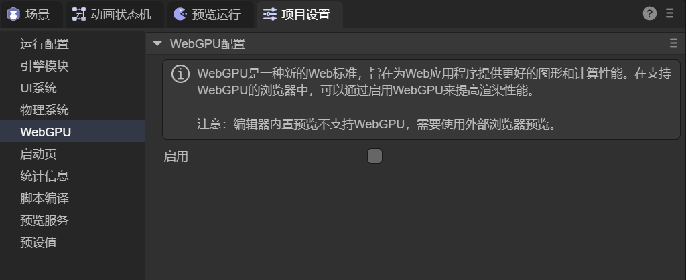
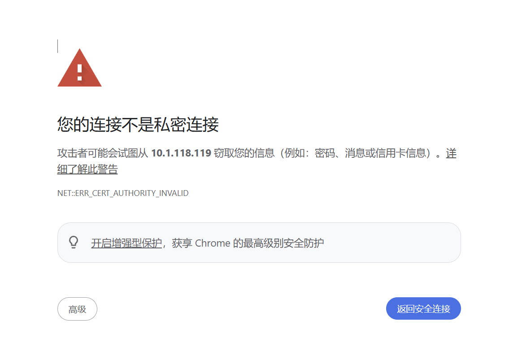
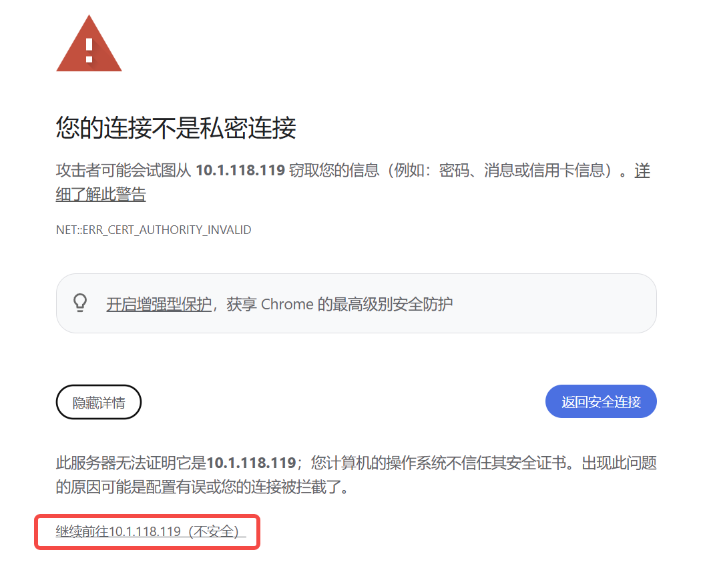

# WebGPU Configuration

> Author: Charley

## 1. Enabling WebGPU

`WebGPU` is the next-generation Web graphics and computing standard designed to provide **higher performance and lower overhead** `GPU` access for Web applications. Compared to traditional `WebGL`, `WebGPU` has a closer interface design to modern native graphics `API`s (such as `Vulkan`, Metal, `DirectX` 12), with obvious advantages in rendering efficiency, resource management, and parallel computing capabilities.

In browser environments that support `WebGPU`, enabling `WebGPU` can significantly improve the runtime performance of Web applications in **3D rendering, complex post-processing, and GPU computing tasks**. As shown in Figure 1-1, after enabling `WebGPU` in the browser, relevant rendering capabilities can be used normally.

(Figure 1-1)

## 2. Debugging WebGPU Rendering

Note that **the IDE editor's built-in preview environment currently does not support `WebGPU`**. To verify `WebGPU` rendering effects, you must publish the project and use an external browser that supports `WebGPU` for preview and testing.

Taking Chrome browser as an example, developers can enable `WebGPU` support through experimental feature switches.

1. Enter `chrome://flags` in the browser address bar and visit it;
2. Type `WebGPU` in the search box at the top of the page;
3. Set relevant options to **Enabled**;
4. Restart the browser as prompted for the configuration to take effect.

The specific operation interface is shown in Figure 2-1.

(Figure 2-1)

It should also be noted that **`WebGPU` can only run in a secure context (Secure Context)**. This means that during `WebGPU` debugging and runtime, the page must be accessed via `HTTPS`.

In actual development, developers often use local `HTTPS` services for debugging. However, local `HTTPS` services usually cannot use trusted authority certificates, so when accessing locally in the browser, you may see a "**Your connection is not private**" security warning page, as shown in Figure 2-2.

(Figure 2-2)

When you encounter this prompt, click **"Advanced"** on the page, expand the detailed information, and select **Continue to** the corresponding link, as shown in Figure 2-3, to enter the page for `WebGPU` effect debugging.

(Figure 2-3)

It should be emphasized that this warning is only related to the certificate's trust chain and does not affect the normal use of `WebGPU` functionality itself. During local development and debugging, this is a common and acceptable behavior.

In production deployment environments, it's recommended to configure trusted `HTTPS` certificates to avoid security warnings and improve user experience.
