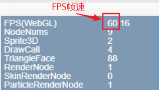
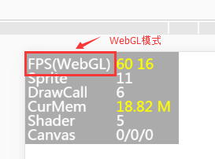
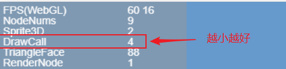

# Performance Statistics Panel Introduction

The LayaAir engine was designed with performance as the primary goal, incorporating extensive performance optimizations within the engine. Proper use of the engine can allow games and other engine products to achieve native APP experience. If developers cannot fully leverage the engine's advantages, the final performance experience of the game may be difficult to discuss. Therefore, in the process of making games, mastering game and engine optimization techniques is very necessary.

> To understand engine performance, you must first understand the performance statistics panel. Below, we will provide a detailed introduction to the performance statistics panel.

## 1. Calling the Performance Statistics Panel

The LayaAir engine's built-in performance statistics panel can monitor current performance in real time. Calling the statistics panel varies depending on the development language.

In TS language, simply input `Laya.Stat.show(0,0);` in the code to bring up the performance statistics panel.

Example Demo.ts code is written as follows:

```typescript
//Initialize stage
Laya.init(1136, 640);
//Call performance statistics panel method, (0,0) are panel position coordinates
Laya.Stat.show(0,0);
```

**Tips**: Pay attention to case.

## 2. Introduction to FPS

### 2.1 FPS Overview

FPS is the abbreviation for Frames Per Second. Assuming a game frame rate of 60 FPS, it indicates that each frame's execution time during game running is 1/60 second. The higher the frame rate value, the smoother the visual experience.

<br />	(Figure 1)

The current full frame for devices such as PCs and mobile phones is 60 frames, as shown in Figure 1. However, some games do not have high requirements for picture smoothness, and can also use the engine's frame rate limiting method `Stage.FRAME_SLOW` to limit the FPS frame rate to a maximum of 30 frames.

Since the actual runtime environment is in a browser, performance also depends on the efficiency of the JavaScript interpreter. Therefore, the FPS value of the same game may vary in different browsers. This part is not something developers can decide. What developers can do is make the best use of the engine and optimize the project to improve FPS frame rates on low-end devices or low-performance browsers.

#### 2.2 FPS in Different Modes

The LayaAir engine supports both Canvas and WebGL rendering modes. Therefore, when viewing FPS frame rates, pay attention to which mode is being used. `FPS(Canvas)` indicates the frame rate in Canvas mode, as shown in Figure 1; `FPS(WebGL)` indicates the frame rate in WebGL mode, as shown in Figure 2.

<br />	(Figure 2)

#### 2.3 FPS Value Description

In Figures 1 and 2, the first yellow value `60` in FPS is the current **FPS frame rate**, which is better when higher.

The second yellow value `16` is **the time consumed per frame rendering**, in milliseconds. This value is better when smaller.

These two values, if they cannot be maintained at full frame, will change during product operation, as shown in Animated Figure 3.

 <br /> (Animated Figure 3)

## 3. Introduction to DrawCall

**The number of DrawCalls is an important indicator determining performance**, located on the third line of the statistics panel, as shown in Figure 4. DrawCall represents different meanings under Canvas and WebGL rendering, but in both cases, less is better. **It is recommended that developers try to limit it to below 100**.

 <br /> (Figure 4)

#### 4.1 DrawCall under Canvas

Under Canvas mode, DrawCall represents the number of draws per frame, including images, text, and vector graphics.

#### 4.2 DrawCall under WebGL

Under WebGL mode, DrawCall represents render submission batches. The process of preparing data and notifying the GPU to render and draw each time is called 1 DrawCall. In each DrawCall, besides notifying the GPU rendering, switching materials and shaders is also a very time-consuming operation.

**Tips**: For more optimization introduction about CacheAs, you can refer to the document "CacheAs Static Cache Optimization"
