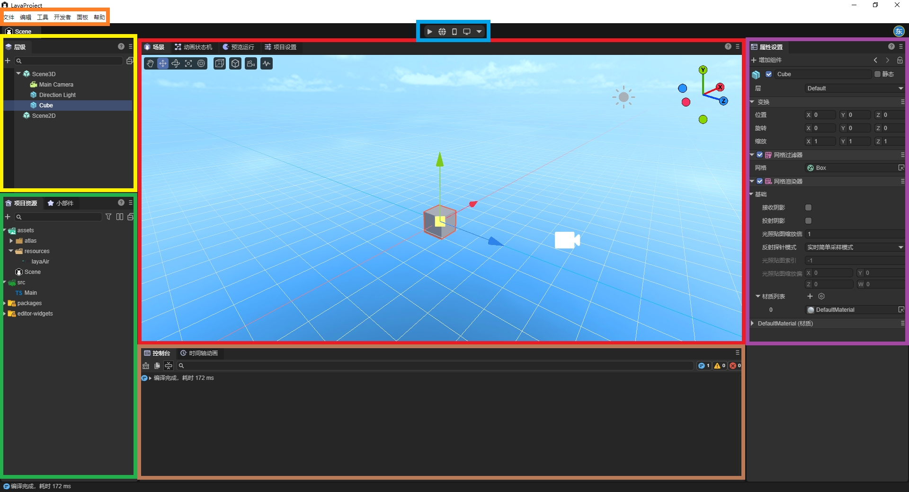
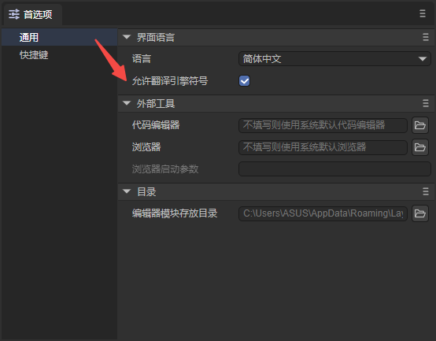
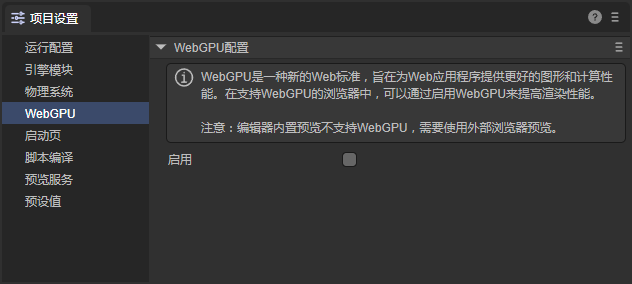

# LayaAir3 Guide for Unity Developers

> The LayaAir-IDE version used to write this document is 3.2.1

Unity is the leading 3D engine for mobile platforms. LayaAir is the leading 3D engine in the mini-game and HTML5 market.

Compared to Unity, the LayaAir engine focuses more on cross-platform publishing. It not only supports publishing native installation packages for mobile platforms (Android, iOS, HarmonyOS NEXT) but also supports publishing `.exe` installation packages for Windows. It has a more significant advantage on HTML5 web platforms and mini-game platforms (WeChat, TikTok, Taobao, Alipay, OPPO, vivo, Xiaomi, etc.). For example, the engine has a smaller base package size, higher loading efficiency, and better performance.

More and more developers whose market focus is shifting towards mini-games and the web are turning to the LayaAir engine to get a better user experience and a more comprehensive platform publishing effect, saving a lot of R\&D costs.

Therefore, this document provides an overview of the main technical differences for users familiar with Unity, helping Unity developers get started with the LayaAir engine quickly.

Click [here](https://layaair.com/#/engineDownload) to download the LayaAir editor, and click [here](https://github.com/layabox/LayaAir) to clone the engine source code.

## I. Overview

### 1.1 LayaAir-IDE

Development with LayaAir is highly dependent on the LayaAir-IDE. The function comparison between the different areas of the Unity editor (Figure 1-1) and the LayaAir-IDE (Figure 1-2) is shown below, with the same colors indicating the same functionality.

(Figure 1-1) Unity Editor

(Figure 1-2) LayaAir3-IDE Editor

### 1.2 Panel Terminology Table

LayaAir supports [custom layouts](https://www.google.com/search?q=../IDE/layouts/readme.md), allowing you to drag and drop panels, pop them out as floating windows, etc. While using it, you can also click the "?" icon in the top-right corner of a panel to view its documentation. The table below lists common terms from Unity on the left and their corresponding (or similar) terms in the LayaAir-IDE on the right.

| Unity        | LayaAir英文                                | LayaAir中文                                                  |
| ------------ | ------------------------------------------ | ------------------------------------------------------------ |
| Hierarchy    | Hierarchy                                  | [层级](../IDE/Hierarchy/readme.md)                           |
| Project      | Project / Widgets                          | [项目资源](../IDE/assets/readme.md) / [小部件](../../IDE/uiEditor/widgets/readme.md) |
| Scene / Game | Scene / Animator / Game / Project Settings | [场景](../IDE/shortcutKeyCombinations/readme.md) / [动画状态机](../../IDE/animationEditor/aniController/readme.md) / [预览运行](../IDE/Game/readme.md) / [项目设置](../IDE/projectSettings/readme.md) |
| Console      | Console / Animation                        | [控制台]() / [时间轴动画](../../IDE/animationEditor/timelineGUI/readme.md) |
| Inspector    | Inspector                                  | [属性设置](../IDE/Inspector/readme.md)                       |

### 1.3 Projects and Files

Like Unity projects, LayaAir projects are also saved in a dedicated directory structure and have their own project file with the `.laya` extension. The file name is also the project name.

The [project directory](https://www.google.com/search?q=../IDE/projecFolders/readme.md) contains different subdirectories that store game assets, source code, and various configuration files.

In LayaAir, the directory for storing game assets is the **Assets** folder, and the source code (TypeScript classes) can be placed in the **src** directory for easy management.

LayaAir supports some of the most common file types:

| Asset Type | Supported Formats |
|---|---|
| 3D | .fbx, .obj, .gltf, .glb |
| Textures | .png, .jpg, jpeg, .tiff, .tif, .tga, .dds, .webp |
| Audio | .mp3, .wav |
| Video | .mp4, .webm |
| Fonts | .ttf, .fnt |
| Spine | .json, atlas, .skel |
| TiledMap | .tsx, .tmx, .tx |

-----

## II. Assets

### 2.1 Common Asset Types

The common asset types in LayaAir are as follows:

| File Extension | File Type Description |
|---|---|
| **.laya** | Project file, located in the project root directory. For example, "ProjectName.laya". |
| **.ls** | Scene file. |
| **.lh** | Prefab file. |
| **.shader** | Shader file. |
| **.bps** | Shader blueprint file. |
| **.bpsf** | Shader blueprint function file. |
| **.bp** | Program blueprint file. |
| **.lmat** | Material data file. |
| **.bundledef** | Script bundle definition file. |
| **.cubemap** | Cube map texture file. |
| **.rendertexture** | Render texture file. |
| **.tex2darray** | 2D texture array file. |
| **.lavm** | Animation mask file. |
| **.mcc** | 2D animation state machine file. |
| **.mc** | 2D animation data file. |
| **.controller** | 3D animation state machine file. |
| **.lani** | 3D animation data file. |
| **.atlascfg** | Auto atlas configuration file. |
| **.lighting** | Lightmap baking configuration file. |
| **.fnt** | Bitmap font file. |

### 2.2 Exporting Assets from Unity to LayaAir

If you want to export assets from a Unity project for development in LayaAir, you need to use the "Unity Asset Export Plugin."

Note that this plugin does not support exporting all asset types. For specific supported types and usage instructions, please refer to the [《Unity Resource Export Plugin》](../../3D/advanced/Unity/readme.md) document.

-----

## III. Development Workflow

### 3.1 Basic Workflow

Developers can refer to the [《Development Workflow: Hello World》](https://www.google.com/search?q=../IDE/helloWorld/readme.md) document to understand the overall development process, including essential operations like environment setup, project creation, basic settings, and running and debugging.

### 3.2 UI Editing

In LayaAir, if you are working on a pure 2D project, you can simply delete the "Scene3D" node from the scene. Developers can use various [widgets](../../IDE/uiEditor/widgets/readme.md)to edit the UI.

### 3.3 Blueprints and TS

When developing games in LayaAir, you will write script code for logic control. Scripts need to be developed using the TypeScript language.

The program blueprint feature allows developers to write a script component using a node-based "connect the dots" method or extend built-in UI controls.

For information on using program blueprints, please refer to the [《haderBlueprint》](../../IDE/ShaderBlueprint/blueprint/readme.md)document.

### 3.4 Animation Editing

Similar to creating and editing animations in Unity, LayaAir provides related functionality.

If you want to create an animation file and edit custom animations, refer to the [《animationEditor》](../../IDE/animationEditor/timelineGUI/readme.md)document.

If you already have usable animation files, you can refer to the [《animationEditor》](../../IDE/animationEditor/aniController/readme.md) document to learn how to use them.

### 3.5 Rendering

Both LayaAir and Unity can achieve rich effects through Shaders. The usage is similar: apply the Shader to a material, and then apply the material to an object.

To use 3D shaders, refer to the [《customShader3D》](../../3D/advanced/customShader/readme.md)document. To use 2D shaders, refer to the [《customShader2D》](../../2D/advanced/customShader/readme.md) document.

### 3.6 Physics System

LayaAir has a built-in Box2D 2D physics engine and Bullet/PhysX 3D physics engines.

For using the 2D physics engine, refer to the[《physics2D》](../../IDE/physicsEditor/physics2D/readme.md) document. For the 3D physics engine, refer to the [《physics3D》](../../IDE/physicsEditor/physics3D/readme.md) document.

Of course, developers can also integrate other third-party physics engines into the LayaAir engine and switch between them directly through LayaAir's physics interface. For the specific process, refer to the [《customPhysicsEngine》](../../3D/advanced/customPhysicsEngine/readme.md)document.

### 3.7 Custom Plugins

LayaAir-IDE supports user-defined plugins to develop more extended features. The plugin system encapsulates most functions based on the Electron framework, so plugin developers don't need to learn front-end frameworks; they can complete custom plugins using only the UI framework provided by the IDE.

To develop plugins within the LayaAir-IDE, refer to the[《plug-in》](../../IDE/layapackage/plug-in/readme.md) document. To import and use plugins from the LayaAir Asset Store, refer to the [《pluginImport》](../../IDE/layapackage/pluginImport/readme.md) document.

### 3.8 Build and Publish

LayaAir supports publishing projects to numerous platforms, allowing for "develop once, publish everywhere" across different platforms. By using the same codebase, it ensures a consistent game experience across all platforms.

When building and publishing, first configure the [generalSetting](../../released/generalSetting/readme.md) settings, and then configure options for each specific platform. Currently supported platforms include: （[wechat](../../released/miniGame/wechat/readme.md)、[byteDance](../../released/miniGame/byteDance/readme.md)、[OPPO](../../released/miniGame/OPPO/readme.md)、[vivo](../../released/miniGame/vivo/readme.md)、[xiaomi](../../released/miniGame/xiaomi/readme.md)、[alipaygame](../../released/miniGame/alipaygame/readme.md)、[tbgame](../../released/miniGame/tbgame/readme.md)）、（[Android](../../released/native/build_Tool/readme.md)、[iOS](../../released/native/build_Tool/readme.md)、[HarmonyNEXT](../../released/native/build_Harmony/readme.md)）、and PC （[Windows](../../released/native/build_Windows/readme.md)）

-----

## IV. LayaAir Engine Ecosystem

For Unity developers, LayaAir's tutorials, community, and asset store can help them quickly master the use of LayaAir.

### 4.1 Tutorials

LayaAir officially provides documentation and video tutorials.

In addition to the module-specific documents mentioned here, you can find more detailed introductions by clicking on the directory on the left.

For video tutorials, please check out LayaAir's [Bilibili homepage](https://space.bilibili.com/1736809941).

### 4.2 Developer Community

Developers can join the [community](https://ask.layaair.com/) to ask questions, share experiences, report bugs, and more.

### 4.3 Asset Store

The Asset Store helps developers monetize within the engine ecosystem and enables them to develop products with higher efficiency and lower costs.

The LayaAir3 [Asset Store](https://store.layaair.com/) allows developers to add free or paid assets for their projects. It also supports developer certification for individuals or companies to upload plugins developed with the IDE, as well as art assets, sound effects, development tools, or source code for project or feature demos.

You can watch a [video tutorial](https://www.bilibili.com/video/BV1oQ4y1E7j3/?share_source=copy_web&vd_source=f3dd357b10b2bb3c4e1be310439eb5cd) on the Asset Store upload process.

-----

## V. Frequently Asked Questions

**How can I have multiple versions of LayaAir-IDE on my Windows machine?**

Currently, you can only have one installed version, but this doesn't affect the portable version. You can copy the current version to another directory, send a shortcut to the main executable (.exe) to your desktop, and use that as a portable version. This version won't be overwritten the next time you install a new version.

**What does it mean if scanning the QR code on my phone doesn't work for preview?**

If you have software like a virtual machine installed, it might create a virtual network adapter, preventing your phone and PC from being on the same local network. You can disable the virtual network adapter or use the `ipconfig` command to find your IP address and set the preview address in the LayaAir-IDE's Project Settings panel.

(Figure 5-1)

**Why are the property names in the IDE not in Chinese?**

If you want the property names to be displayed in Chinese, you need to check "Allow translation of engine symbols" in the "Edit -\> Preferences" panel in the menu bar.

(Figure 5-2)

**What are the measurement units in the physics system?**

In the LayaAir-IDE's Project Settings panel, you can customize the length unit conversion ratio.

(Figure 5-3)

**Why are some modules unavailable?**

In the LayaAir-IDE, you need to check the corresponding modules in the Project Settings panel. Otherwise, you will get an error at runtime saying the module or method cannot be found.

(Figure 5-4)

**Does it support WebGPU?**

Yes, it does. You need to check the option in the Project Settings panel to enable it.

(Figure 5-5)