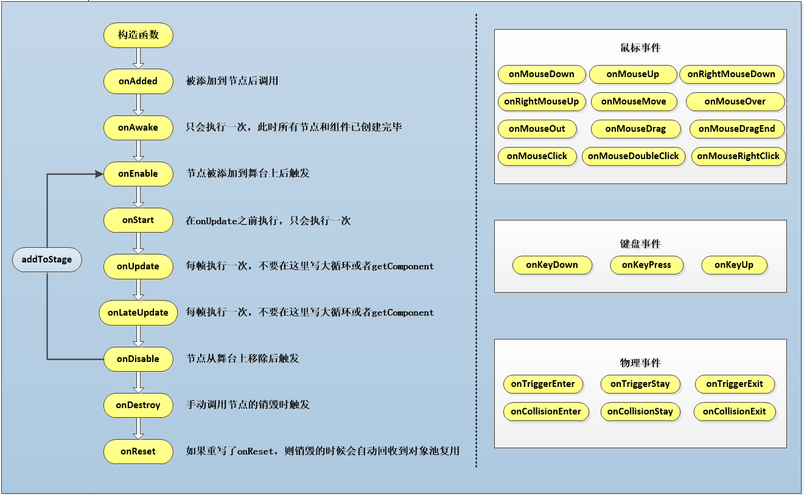
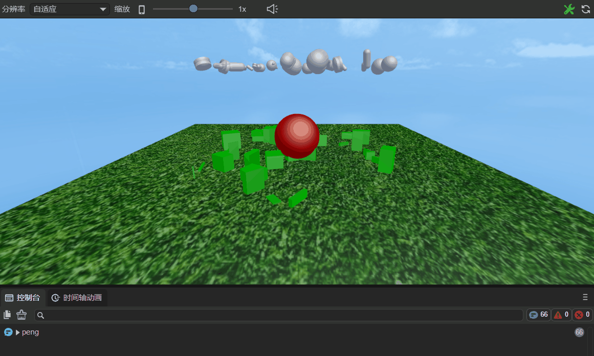
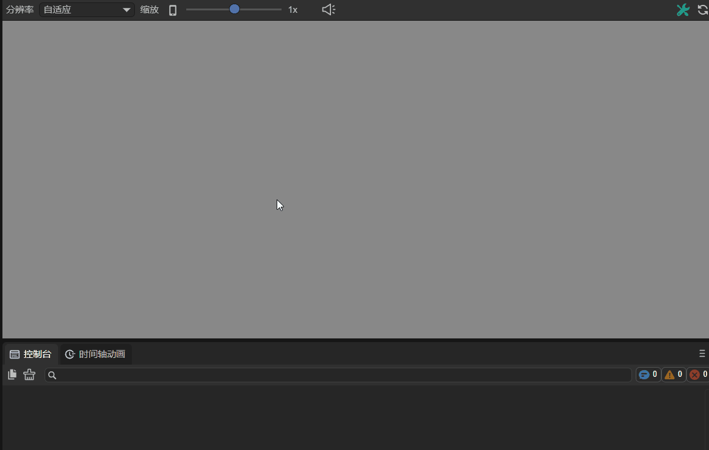
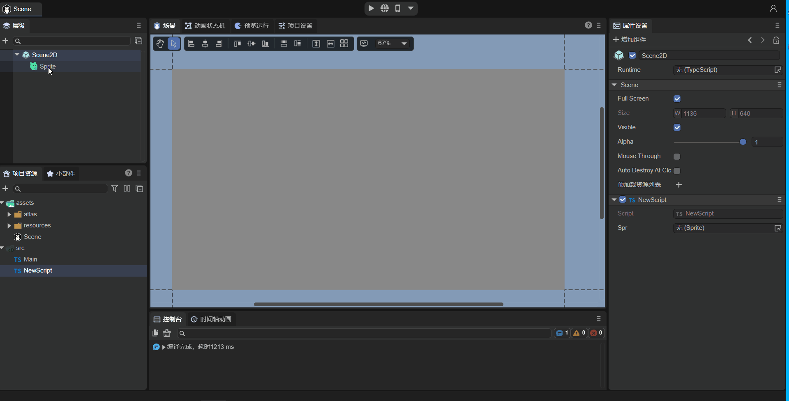
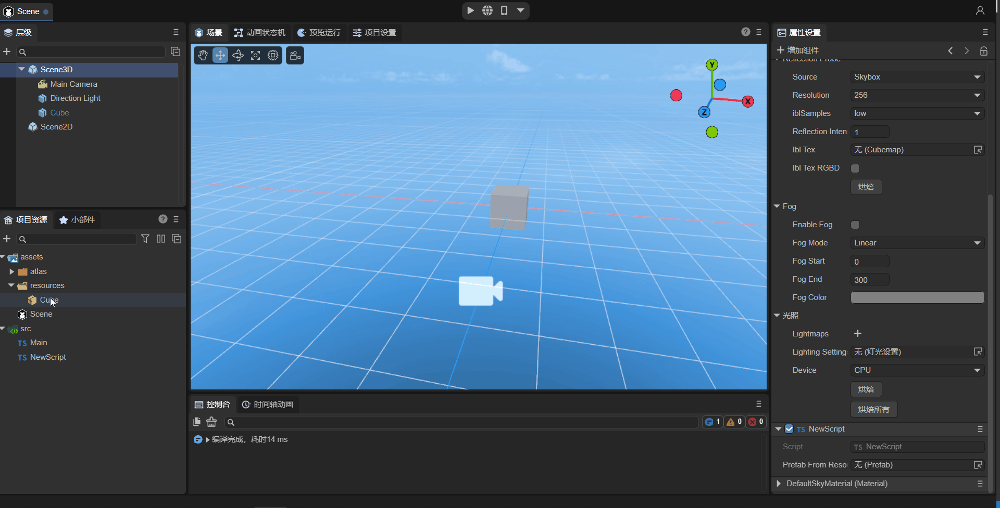

# Entity Component System (ECS)

> Author: Charley, 谷主、孟星煜

## 1\. Basic Concepts

### 1.1 What is ECS?

ECS is an acronym for Entity-Component-System, a data-driven game design pattern.

### 1.2 LayaAir's Entities

In standard ECS theory, an entity is defined as a unique **identifier (ID)**, whose core function is solely to associate components via ID, containing no data or object properties. This design aims to achieve **complete decoupling of data and logic**.

In the LayaAir engine, the basic game objects are **nodes (Node)**, and developers' component scripts are added based on Node objects or objects inherited from Node.

Therefore, a LayaAir entity refers to a **node object in the scene**, and each entity can have one or more different component scripts added to it.

### 1.3 LayaAir's Components and Systems

In the ECS architecture, components and systems each have distinct responsibilities: components are responsible for storing data and contain no business logic; systems are purely logic processing units that drive entity behavior based on the data provided by components.

In the LayaAir engine, the responsibilities of components and systems are integrated and manifested in **component scripts** (i.e., classes inheriting from `Laya.Script`):

**Component Part**: This part undertakes the data responsibility of the component through class properties or accessors. These fields are typically marked with the `@property()` decorator to expose them to the IDE's property panel, facilitating visual configuration and data transfer for developers.

> Details about decorators will be introduced in a later section.

**System Part**: This part undertakes the logic responsibility of the system through engine-provided lifecycle methods (such as `onEnable`, `onStart`, etc.) or event methods (such as `onMouseClick`, `onKeyDown`, etc.). These methods form the entry points for system logic execution, used to implement specific behavior control based on component data.

This design approach centralizes component and system responsibilities within a single script, simplifying the usage process and facilitating logic reuse and module decoupling. It represents LayaAir's engineering implementation of the ECS pattern.

These scripts, which simultaneously handle both data and logic, are typically referred to as **component scripts**.

### 1.4 What are Lifecycle Methods?

In the LayaAir engine, lifecycle methods are a series of methods automatically called by the engine at specific stages throughout the entire process of a game object (such as scenes, characters, UI elements, etc.) from creation to destruction. These methods allow developers to execute specific code logic at different stages to control operations such as initialization, updating, rendering, and destruction of game objects.

For example, the `onEnable` method is called when a component is enabled, such as after a node is added to the stage. You can perform initialization operations here, like getting component references or setting initial states. The `onDestroy` method is called when a game object is destroyed. In this method, you can release resources occupied by the game object, such as memory and textures, to avoid memory leaks and resource waste. By properly utilizing these lifecycle methods, developers can better manage the state and behavior of game objects, improving game performance and stability.

### 1.5 What are Event Methods?

In the LayaAir engine, event methods are script methods used to respond to various events. These events can be user actions (like mouse clicks, keyboard input), physical state changes (like collision start, collision ongoing, collision end), etc. By registering event methods, developers can make the game execute corresponding logic when specific events occur.


## 2\. Built-in Methods of Component Scripts

In LayaAir engine development, when a component script class inherits from `Laya.Script`, it can use a series of lifecycle methods provided by the engine (such as `onAwake`, `onEnable`, `onUpdate`, etc.) and event response methods (such as `onMouseDown`, `onMouseClick`, etc.). These built-in methods serve as the logic execution entry points for component scripts, corresponding to the logic processing part of systems in the ECS architecture.

The complete composition of built-in methods is shown in Figure 2-1:



(Figure 2-1) Lifecycle Methods of Component Scripts

### 2.1 Component Lifecycle Methods

Lifecycle methods are methods that are automatically called during the creation, destruction, activation, and deactivation of an object. When using custom component scripts, you can implement the following lifecycle methods for convenient and rapid development of business logic. You can print a log in each method for easy testing by developers.

| Name | Condition |
|---|---|
| onAdded | Called after being added to a node. Unlike `onAwake`, `onAdded` is called even if the node is not active. |
| onReset | Resets component parameters to default values. If this function is implemented, the component will be reset and automatically recycled to the object pool for future reuse. If not reset, it will not be recycled and reused. |
| onAwake | Executed after the component is activated. At this point, all nodes and components have been created. This method is executed only once. |
| onEnable | Executed after the component is enabled, e.g., after the node is added to the stage. |
| onStart | Executed before the first `onUpdate`. It is executed only once. |
| onUpdate | Executed every frame update. Try not to write large loop logic or use `getComponent` methods here. |
| onLateUpdate | Executed every frame update, after `onUpdate`. Try not to write large loop logic or use `getComponent` methods here. |
| onPreRender | Executed before rendering. |
| onPostRender | Executed after rendering. |
| onDisable | Executed when the component is disabled, e.g., after the node is removed from the stage. |
| onDestroy | Executed when the node is manually destroyed. |

Usage in code is as follows:

```typescript
	// Called after being added to a node. Unlike Awake, onAdded is called even if the node is not active.
    onAdded(): void {
        console.log("Game onAdded");
    }

    // Resets component parameters to default values. If this function is implemented, the component will be reset and automatically recycled to the object pool for future reuse. If not reset, it will not be recycled and reused.
    onReset(): void {
        console.log("Game onReset");
    }

    // Executed after the component is activated. At this point, all nodes and components have been created. This method is executed only once.
    onAwake(): void {
        console.log("Game onAwake");
    }

    // Executed after the component is enabled, e.g., after the node is added to the stage.
    onEnable(): void {
        console.log("Game onEnable");
    }

    // Executed before the first update. It is executed only once.
    onStart(): void {
        console.log("Game onStart");
    }

    // Executed every frame update. Try not to write large loop logic or use getComponent methods here.
    onUpdate(): void {
        console.log("Game onUpdate");
    }

    // Executed every frame update, after update. Try not to write large loop logic or use getComponent methods here.
    onLateUpdate(): void {
        console.log("Game onLateUpdate");
    }

    // Executed before rendering.
    onPreRender(): void {
        console.log("Game onPreRender");
    }

    // Executed after rendering.
    onPostRender(): void {
        console.log("Game onPostRender");
    }

    // Executed when the component is disabled, e.g., after the node is removed from the stage.
    onDisable(): void {
        console.log("Game onDisable");
    }

    // Executed when the node is manually destroyed.
    onDestroy(): void {
        console.log("Game onDestroy");
    }
```

Let's take the `Bullet.ts` script from the "2D Getting Started Example" as an example to explain lifecycle methods. Here is the code for this script file:

```typescript
const { regClass, property } = Laya;
/**
 * Bullet script, implementing bullet flight logic and object pool recycling mechanism
 */
 @regClass()
export default class Bullet extends Laya.Script {
    constructor() { super(); }

    onEnable(): void {
        // Set initial velocity
        let rig: Laya.RigidBody = this.owner.getComponent(Laya.RigidBody);
        rig.setVelocity({ x: 0, y: -10 });
    }

    onTriggerEnter(other: any, self: any, contact: any): void {
        // If hit, remove the bullet
        this.owner.removeSelf();
    }

    onUpdate(): void {
        // If the bullet goes off screen, remove the bullet
        if ((this.owner as Laya.Sprite).y < -10) {
            this.owner.removeSelf();
        }
    }

    onDisable(): void {
        // When the bullet is removed, recycle it to the object pool for future reuse, reducing object creation overhead.
        Laya.Pool.recover("bullet", this.owner);
    }
}
```

In the game, when a bullet is added to the stage, it needs an initial velocity every time it's added. However, if `onEnable()` were replaced with `onAwake()`, this initial velocity would not be applied. `onUpdate()` is executed every frame; if the bullet goes off-screen, it's removed. The `if` condition here is checked every frame. `onDisable()` is triggered when a node is removed from the stage. When the bullet goes off-screen and is removed, this method is triggered, and here, the bullet is recycled to the object pool.

### 2.2 Component Event Methods

Event methods are functions that are automatically triggered under certain specific conditions. When using custom component scripts, you can quickly develop business logic through event methods.

#### 2.2.1 Physics Events

When using a physics engine, we sometimes need to implement logical interactions in code based on physics collision events. For this purpose, the LayaAir engine triggers specific physics event methods when physics collisions first occur, persist, and end. These methods do not include specific implementations by default in the engine; they can be considered methods to be overridden by developers. Developers only need to inherit the `Laya.Script` class and override these methods within it to achieve custom logical responses, replacing the default empty implementation.

By overriding these specific methods, developers can execute corresponding game logic or interactive effects based on the specific stage of a physics collision, allowing the game or application to respond more naturally and realistically when physics collisions occur. The table below lists all physics event methods:

| Name | Condition |
|---|---|
| onTriggerEnter | 3D physics trigger event and 2D physics collision event. Executed at the start of a collision, only once. |
| onTriggerStay | 3D physics trigger event and 2D physics collision event (does not support sensors). Executed during continuous collision, every frame. |
| onTriggerExit | 3D physics trigger event and 2D physics collision event. Executed at the end of a collision, only once. |
| onCollisionEnter | 3D physics collider event (not applicable to 2D). Executed at the start of a collision, only once. |
| onCollisionStay | 3D physics collider event (not applicable to 2D). Executed during continuous collision, every frame. |
| onCollisionExit | 3D physics collider event (not applicable to 2D). Executed at the end of a collision, only once. |

From the table above, it can be seen that 2D physics events only have three event methods, while 3D physics events are divided into two categories: trigger events and collider events, with six event methods.

Collider events refer to events that cause physical feedback, while trigger events are events that only trigger a physics event without actual physical collision feedback. This is similar to the effect when a 2D collider has its sensor enabled, except that 2D physics uses only `onTrigger` events for both collision feedback events and sensor-enabled no-feedback object events.

It is especially important for new developers to note that the `onTriggerStay` event is not triggered when 2D physics sensors are enabled.

An example of event usage in a script is as follows:

```typescript
class DemoScript extends Laya.Script {
    
    /**
     * 3D physics trigger event and 2D physics collision event. This event method is called once by the engine at the beginning of each physical collision.
     * @param other The collider of the colliding target object and its parent node object information, etc.
     * @param self  Own collider and parent node object information, etc. (This parameter is only available in 2D physics; 3D physics only has 'other')
     * @param contact  The collision information b2Contact carried by the physics engine. Developers can query the b2Contact object to get detailed information about the collision of the two rigid bodies. However, it's usually not needed, as common required information is already present in 'other' and 'self', which is sufficient. (This parameter is only available in 2D physics; 3D physics only has 'other')
     */
     onTriggerEnter(other: Laya.PhysicsComponent | Laya.ColliderBase, self?: Laya.ColliderBase, contact?: any): void {
        // If it hit a bomb
        if (other.label == "bomb") {
            // Explosion damage logic omitted here

            console.log("Hit bomb: " + self.label + " took damage, health decreased by xx");

        } else if (other.label == "Medicine") {  // If it hit a medicine box
            // Health recovery logic omitted here

            console.log("Hit medicine box: " + self.label + " healed, health restored by xx");
            
        }
        console.log("onTriggerEnter:", other, self);
    }	

    /**
    * 3D physics trigger event and 2D physics collision event (does not support sensors). This event method is called every frame when a continuous physical collision occurs, i.e., from the second collision within the collision lifecycle until the collision ends.
    * Try not to execute complex logic and function calls in this event method, especially computationally expensive code, as it will significantly impact performance.
    * @param other The collider of the colliding target object and its parent node object information, etc.
    * @param self  Own collider and parent node object information, etc. (This parameter is only available in 2D physics; 3D physics only has 'other')
    * @param contact  The collision information b2Contact carried by the physics engine. Developers can query the b2Contact object to get detailed information about the collision of the two rigid bodies. However, it's usually not needed, as common required information is already present in 'other' and 'self', which is sufficient. (This parameter is only available in 2D physics; 3D physics only has 'other')
    */
    onTriggerStay(other: Laya.PhysicsComponent | Laya.ColliderBase, self?: Laya.ColliderBase, contact?: any): void {
        // During continuous collision, print logs. Try not to use this event method, as improper use can significantly impact performance.
        console.log("onTriggerStay====", other, self);
    }

    /**
    * This event method is called once by the engine at the end of each physical collision.
    * @param other The collider of the colliding target object and its parent node object information, etc.
    * @param self  Own collider and parent node object information, etc. (This parameter is only available in 2D physics; 3D physics only has 'other')
    * @param contact  The collision information b2Contact carried by the physics engine. Developers can query the b2Contact object to get detailed information about the collision of the two rigid bodies. However, it's usually not needed, as common required information is already present in 'other' and 'self', which is sufficient. (This parameter is only available in 2D physics; 3D physics only has 'other')
    */
    onTriggerExit(other: Laya.PhysicsComponent | Laya.ColliderBase, self?: Laya.ColliderBase, contact?: any): void {   
        // Simulate character leaving poisoned area, triggering escape reward
        if (other.label == "poison") {
            // Escape reward logic omitted here

            console.log("Leaving poisoned area: " + self.label + " received escape reward, health +10");
        }

        console.log("onTriggerExit========", other, self);
    }

    /**
     * 3D physics collider event (not applicable to 2D). This event method is called once by the engine at the beginning of each physical collision.
     * @param other Colliding target object
     */
    onCollisionEnter(other:Laya.Collision): void {
        // After collision starts, object changes color
        (this.owner.getComponent(Laya.MeshRenderer).material as Laya.BlinnPhongMaterial).albedoColor = new Laya.Color(0.0, 1.0, 0.0, 1.0);// Green
    }

    /**
    * 3D physics collider event (not applicable to 2D) during continuous physical collision. This event method is triggered and called every frame from the second collision within the collision lifecycle until the collision ends.
    * Try not to execute complex logic and function calls in this event method, especially computationally expensive code, as it will significantly impact performance.
    * @param other Colliding target object
    */
    onCollisionStay(other:Laya.Collision): void {
    	// During continuous collision, print logs. Try not to use this event method, as improper use can significantly impact performance.
        console.log("peng");
    }

   /**
    * 3D physics collider event (not applicable to 2D). This event method is called once by the engine at the end of each physical collision.
    * @param other Colliding target object
    */
    onCollisionExit(other:Laya.Collision): void {
        //// After collision ends, object reverts to original color
		(this.owner.getComponent(Laya.MeshRenderer).material as Laya.BlinnPhongMaterial).albedoColor = new Laya.Color(1.0, 1.0, 1.0, 1.0);// White
    }
}
```

Based on the above code example, add the script to a 3D model, as shown in animated GIF 2-2.



(Animated GIF 2-2)

#### 2.2.2 Mouse Events

| Name | Condition |
|---|---|
| onMouseDown | Executed when the mouse button is pressed. |
| onMouseUp | Executed when the mouse button is released. |
| onRightMouseDown | Executed when the right or middle mouse button is pressed. |
| onRightMouseUp | Executed when the right or middle mouse button is released. |
| onMouseMove | Executed when the mouse moves over the node. |
| onMouseOver | Executed when the mouse enters the node. |
| onMouseOut | Executed when the mouse leaves the node. |
| onMouseDrag | Executed when the mouse is held down on an object and dragged. |
| onMouseDragEnd | Executed when the mouse is held down on an object, dragged a certain distance, and then the mouse button is released. |
| onMouseClick | Executed when the mouse is clicked. |
| onMouseDoubleClick | Executed when the mouse is double-clicked. |
| onMouseRightClick | Executed when the right mouse button is clicked. |

Usage in code is as follows:

```typescript
	// Executed when the mouse button is pressed.
    onMouseDown(evt: Laya.Event): void {
    }

    // Executed when the mouse button is released.
    onMouseUp(evt: Laya.Event): void {
    }

    // Executed when the right or middle mouse button is pressed.
    onRightMouseDown(evt: Laya.Event): void {
    }

    // Executed when the right or middle mouse button is released.
    onRightMouseUp(evt: Laya.Event): void {
    }

    // Executed when the mouse moves over the node.
    onMouseMove(evt: Laya.Event): void {
    }

    // Executed when the mouse enters the node.
    onMouseOver(evt: Laya.Event): void {
    }

    // Executed when the mouse leaves the node.
    onMouseOut(evt: Laya.Event): void {
    }

    // Executed when the mouse is held down on an object and dragged.
    onMouseDrag(evt: Laya.Event): void {
    }

    // Executed when the mouse is held down on an object, dragged a certain distance, and then the mouse button is released.
    onMouseDragEnd(evt: Laya.Event): void {
    }

    // Executed when the mouse is clicked.
    onMouseClick(evt: Laya.Event): void {
    }

    // Executed when the mouse is double-clicked.
    onMouseDoubleClick(evt: Laya.Event): void {
    }

    // Executed when the right mouse button is clicked.
    onMouseRightClick(evt: Laya.Event): void {
    }
```

Now, let's take `onMouseDown` and `onMouseUp` as examples. Add the following code to your custom component script "Script.ts":

```typescript
const { regClass, property } = Laya;

@regClass()
export class Script extends Laya.Script {
    /**
     * Executed when the mouse button is pressed.
     */
	onMouseDown(evt: Laya.Event): void {
        console.log("onMouseDown");
    }
    /**
     * Executed when the mouse button is released.
     */
    onMouseUp(evt: Laya.Event): void {
        console.log("onMouseUp");
    }
}
```

As shown in Figure 2-3, after adding the component script to the Scene2D properties panel, do not check "Mouse Through" initially, because if it's checked, mouse events under Scene2D will not respond. If it's a 3D scene, it will pass through to Scene3D.


(Figure 2-3)

Run the project. As shown in animated GIF 2-4, `onMouseDown` is executed and "onMouseDown" is printed when the mouse button is pressed; when the mouse button is released, `onMouseUp` is executed and "onMouseUp" is printed.



(Animated GIF 2-4)

#### 2.2.3 Keyboard Events

| Name | Condition |
|---|---|
| onKeyDown | Executed when a key is pressed down. |
| onKeyPress | Executed when a character is produced by the keyboard. |
| onKeyUp | Executed when a key is released. |

Usage in code is as follows:

```typescript
	// Executed when a key is pressed down.
     onKeyDown(evt: Laya.Event): void {
    }

    // Executed when a character is produced by the keyboard.
    onKeyPress(evt: Laya.Event): void {
    }

    // Executed when a key is released.
    onKeyUp(evt: Laya.Event): void {
    }
```

> Note: `onKeyPress` is executed when a character is produced, such as letters "a", "b", "c", etc. Keys like arrow keys, F1, F2, etc., which are not character inputs, will not trigger this method.

## 3\. Component Exposure in IDE

In the ECS (Entity-Component-System) architecture adopted by the LayaAir engine, **components are the core units that carry data. Each component focuses on storing specific attributes and states of an entity**, such as a character's position, velocity, health, etc. This data provides the basis for systems to process logic, and systems execute corresponding business logic based on component data.

The primary role of **decorators** in LayaAir-IDE is to help the IDE recognize developer-defined components. **By using decorator identifiers, developers can conveniently and quickly expose configurable data within their components to the IDE's property panel.** This allows developers to directly adjust component parameters in the visual interface without writing additional configuration code, greatly enhancing development efficiency and operational convenience for data transfer and component configuration.

For a complete explanation of decorators, please refer to the《[Decorators](../../../IDE/customComponent/decorators/readme.md)》document.


## IV. Using Properties in Code

The previous sections have introduced how to add and recognize components. I believe developers with some basic knowledge can directly use LayaAir's Entity Component System.

However, for some novice developers, this section will further help you understand the basics of component-based development through examples of using several common property types.

### 4.1 Node Type Usage

LayaAir distinguishes between 2D node types and 3D node types. When set as a 2D node `Laya.Sprite`, a 3D node cannot be used as its property value. Similarly, when set as a 3D node `Laya.Sprite3D`, a 2D node cannot be used as its property value.

#### 4.1.1 2D Node Usage

First, as shown in animated GIF 4-1, drag the 2D node (Sprite) that has already been added to the scene into the property input exposed by `@property` to get a reference to this node.



(Animated GIF 4-1)

Then, you can use code in the script to change the node's properties, for example, adding a texture to the Sprite. The example code is as follows:

```typescript
const { regClass, property } = Laya;

@regClass()
export class NewScript extends Laya.Script {

    @property({ type : Laya.Sprite})
    public spr: Laya.Sprite;
    
    onAwake(): void {
        this.spr.size(512, 313); // Set Sprite size
        this.spr.loadImage("atlas/comp/image.png"); // Add texture
    }

}
```

The effect is shown in Figure 4-2:


(Figure 4-2)

#### 4.1.2 Basic 3D Node Usage

First, as shown in animated GIF 4-3, drag the 3D node (Cube) that has already been added to the scene into the property input exposed by `@property` to get a reference to this node.


(Animated GIF 4-3)

Then, you can use code in the script to change the node's properties, for example, making the Cube rotate around itself. The example code is as follows:

```typescript
const { regClass, property } = Laya;

@regClass()
export class NewScript extends Laya.Script {

    @property({ type : Laya.Sprite3D})
    public cube: Laya.Sprite3D;

    private rotation: Laya.Vector3 = new Laya.Vector3(0, 0.01, 0);

    onStart() {
        Laya.timer.frameLoop(1, this, ()=> {
            this.cube.transform.rotate(this.rotation, false);
        });
    }
}
```

The effect is shown in animated GIF 4-4:


(Animated GIF 4-4)

#### 4.1.3 Advanced 3D Node Usage

```typescript
    @property( { type :Laya.Sprite3D } ) // Node type
    public p3d: Laya.Sprite3D;

    onAwake(): void {

        this.p3d.transform.localPosition = new Laya.Vector3(0,5,5);
        let p3dRenderer = this.p3d.getComponent(Laya.ShurikenParticleRenderer);
        p3dRenderer.particleSystem.simulationSpeed = 10;
    }
```

By exposing the `@property({ type: Laya.Sprite3D })` node type attribute and dragging a particle node into it, you can obtain the particle node object. `transform` can be modified directly, while the `simulationSpeed` property is accessed via `getComponent(Laya.ShurikenParticleRenderer).particleSystem`.

### 4.2 Component Type Usage

```typescript
    @property( { type : Laya.ShurikenParticleRenderer } ) // Component type
    public p3dRenderer: Laya.ShurikenParticleRenderer;

    onAwake(): void {

        (this.p3dRenderer.owner as Laya.Sprite3D).transform.localPosition = new Laya.Vector3(0,5,5);
        this.p3dRenderer.particleSystem.simulationSpeed = 10;
    }
```

By exposing the `@property({ type: Laya.ShurikenParticleRenderer })` component type attribute and dragging a particle node into it, you can obtain the particle's `ShurikenParticleRenderer` component. `transform` can be modified via `(this.p3dRenderer.owner as Laya.Sprite3D)`, while the `simulationSpeed` property is accessed via `this.p3dRenderer.particleSystem`.

> You cannot directly use `Laya.ShuriKenParticle3D` as the property type because the IDE cannot recognize it. Only node and component types are recognized.
>
> Even if you set the type to `Laya.Sprite3D`, while the IDE identifies the property as a `Sprite3D` node, it still cannot be converted to a `Laya.ShuriKenParticle3D` object.

### 4.3 Prefab Type Property

When using `Laya.Prefab` as a property, for example:

```typescript
@property( { type : Laya.Prefab } ) // Object to load Prefab
private prefabFromResource: Laya.Prefab;    
```

At this point, as shown in animated GIF 4-5, you need to drag the prefab resource from the `assets` directory. At runtime, you will directly obtain the loaded and instantiated prefab.



(Animated GIF 4-5)