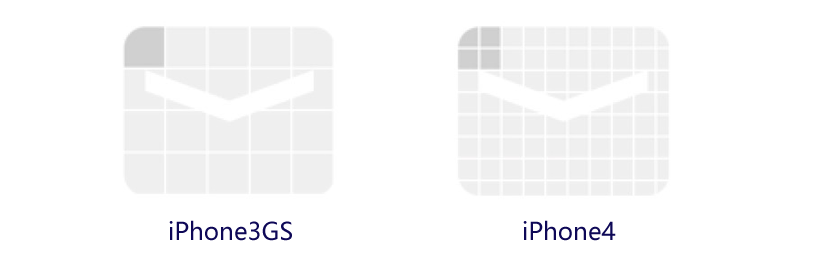
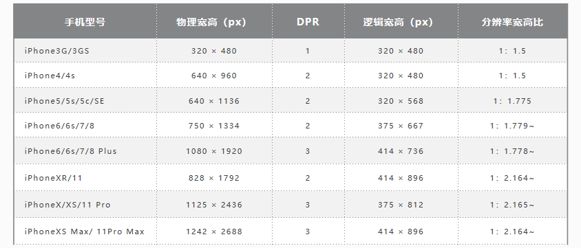
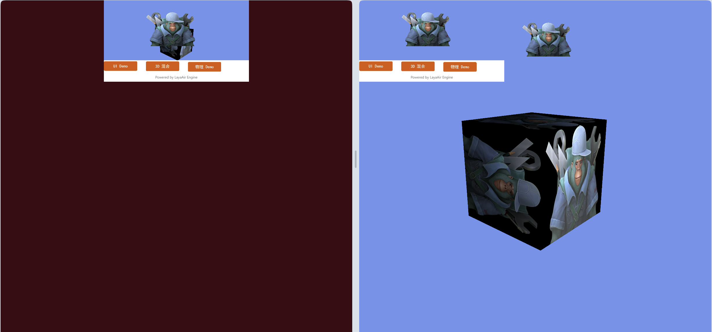
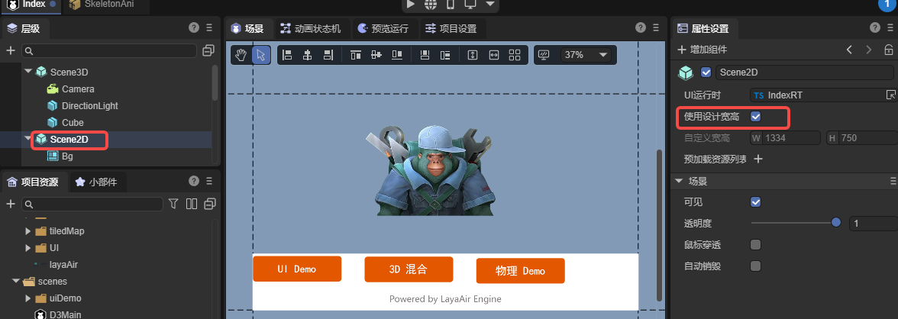
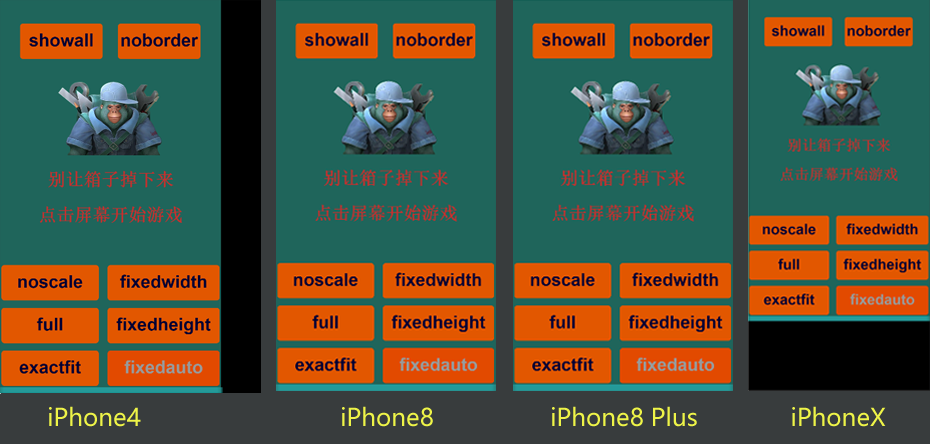
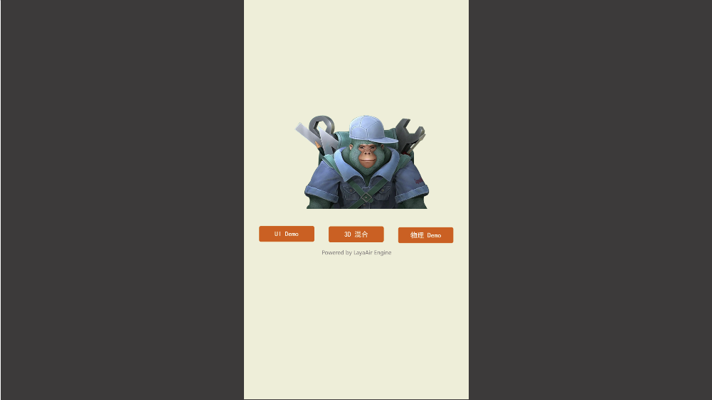

## Detailed Explanation of LayaAir Screen Adaptation

> Author: Charley

Screen adaptation involves many knowledge points, and many developers struggle to truly understand it.

This article starts with basic concepts and provides a detailed introduction to the various screen adaptation scaling modes in the LayaAir engine.

## 1\. Basic Concepts

**The following basic concepts are very important and will affect your understanding of the engine's adaptation principles. Please read them carefully.**

### 1.1 Physical Resolution

Physical resolution can be simply understood as the resolution supported by the hardware, measured in pixels (px). We call each pixel on the hardware a physical pixel, also known as a device pixel. The physical resolution is represented by the actual number of pixels on the screen in a `rows × columns` format.

When the LayaAir engine runs in a browser or another runtime environment and performs screen adaptation, the physical resolution is actually the screen resolution of the browser or runtime environment. It is expressed as `number of pixels in screen width × number of pixels in screen height`. Therefore, the width and height of the physical resolution will be different in landscape and portrait modes.

For example, on an iPhone 8 in the default portrait orientation, the physical resolution is `750 × 1334`. In landscape orientation, it is `1334 × 750`.

### 1.2 Scaling Factor and Logical Resolution

#### 1.2.1 The Origin of the Scaling Factor

iOS draws graphics in units of `point` (pt). In the early days, `1 point = 1 pixel`. With the launch of the iPhone 4 in 2010, which adopted Retina display technology, the physical resolution increased fourfold. At this time, if the iPhone 4 still used the `1pt = 1px` scheme, it would result in the display effect shown in Figure 1-1.

 

(Figure 1-1)

In Figure 1-1, if the design was full-screen based on the iPhone 3GS's `320 × 480` resolution, the display on an iPhone 4 would look like the left side of the image, where the full-screen content occupies only a quarter of the screen, leaving the rest empty. If the design was based on the iPhone 4's `640 × 960` resolution, the display on an iPhone 3GS would look like the right side of the image, with a large amount of content extending beyond the viewable area.

Clearly, Apple would not let this happen. In reality, the iPhone 4 has a scaling factor of `@2X`. This means that on this model, one point is represented by a `2 × 2` pixel matrix, as shown in Figure 2, which perfectly solves the potential problem in Figure 1-2.

 

(Figure 1-2)

As technology advanced, subsequent models had increasingly higher physical resolutions, and one point occupied more and more physical pixels, as shown in Figure 1-3.

 

(Figure 1-3)

> The concept of the scaling factor also applies to Android models.

#### 1.2.2 Logical Resolution

Logical resolution is simply the resolution used by the software. We design our adaptations based on it. It is also expressed using multiplication. To better understand this concept, let's look at a data table. See Figure 1-4.

 

(Figure 1-3)

From the data in Figure 4, we can see that with the advancement of mobile devices, physical resolution has become higher and higher. If we were to adapt based on physical resolution, just considering iPhones (not even Android), the device fragmentation would be huge. Fortunately, with the help of the scaling factor, we see that the logical resolution has remained relatively consistent. Therefore, the engine adaptation we discuss later is mainly for the logical resolution.

### 1.3 Device Pixel Ratio

When we develop for browsers, the scaling factor concept corresponds to **DPR** (Device Pixel Ratio). In the LayaAir engine, you can get the browser's DPR value through `Laya.Browser.pixelRatio`.

Let me elaborate a bit here. In browsers, scaling is controlled by the user by default. For example, when you pinch-to-zoom on a mobile browser, the page gets larger, but the clarity does not decrease. This is user-controlled scaling and is not determined by the DPR value. If we want to adapt based on logical resolution like in app development, we need to let the browser decide how many physical pixels a CSS pixel occupies based on the device's DPR. This requires related configuration in the `viewport` meta tag on the main HTML page. The code is as follows:

```html
<meta name='viewport' content='width=device-width,initial-scale=1.0,minimum-scale=1.0,maximum-scale=1.0,user-scalable=no'/>
```

> The above code is added by default in the LayaAir engine and is mandatory.

With this `viewport` configuration, the page will prevent the user from manual scaling while automatically scaling according to the device's DPR.

### 1.4 Logical Width and Height

Logical width and height refer to the width and height of the logical resolution. In the browser, the scalable logical resolution unit is the CSS pixel. With the `viewport` set, the browser determines how many physical pixels one CSS pixel occupies based on the DPR value. For example, if the DPR is 3, one CSS pixel occupies a `3 × 3` physical pixel grid.

In the LayaAir engine, you can get the logical width and height using `Laya.Browser.clientWidth` and `Laya.Browser.clientHeight`.

In portrait mode on mobile devices, the narrower side is the width and the longer side is the height. If the screen is rotated to landscape, the longer side becomes the width and the narrower side becomes the height.

On PC browsers, these values correspond to the visible width and height of the browser window.

### 1.5 Physical Width and Height (Screen Width and Height)

Physical width and height correspond to the physical resolution concept and are also called screen width and height. Developers can get these values using the engine's encapsulated interfaces. `Laya.Browser.width` gives you the number of pixels on the screen's width, and `Laya.Browser.height` gives you the number of pixels on the screen's height.

> The screen width and height are the hardware screen dimensions only when the application is running in fullscreen mode. Developers should understand that screen width and height actually refer to the dimensions of the running environment's window. For example, on a browser, it's the size of the browser's display window.

The physical width and height in the LayaAir engine are calculated as `Logical Width × DPR`.

The relevant code in the engine is as follows:

```typescript
    /**
     * @en The physical width of the browser window, taking into account the device pixel ratio.
     * @zh 浏览器窗口的物理宽度，考虑了设备像素比。
     */
    static get width(): number {
        Browser.__init__();
        return ((ILaya.stage && ILaya.stage.canvasRotation) ? Browser.clientHeight : Browser.clientWidth) * Browser.pixelRatio;
    }

    /**
     * @en The physical height of the browser window, taking into account the device pixel ratio.
     * @zh 浏览器窗口的物理高度，考虑了设备像素比。
     */
    static get height(): number {
        Browser.__init__();
        return ((ILaya.stage && ILaya.stage.canvasRotation) ? Browser.clientWidth : Browser.clientHeight) * Browser.pixelRatio;
    }
```

### 1.6 Design Width and Height

Design width and height are the dimensions a developer chooses when designing a product. When faced with so many device models, as shown in Figure 1-5, choosing which one to use as the design width and height can be confusing for new developers. Here's a brief explanation.

 

 (Figure 1-5)

When choosing design width and height, you should first consider compatibility with the most common screen aspect ratios. From the table in Figure 5, we can see that if we remove outdated models, mobile screens are basically divided into two categories: one with an aspect ratio of about `1:1.78` (non-full-screen phones), and another with an aspect ratio of about `1:2.17` (full-screen phones). Most Android models have aspect ratios that are either one of these two or close to them.

Based on the principle of prioritizing performance, developers often choose a smaller resolution as the primary design resolution and then adapt it to other aspect ratio screens. For example, common choices are `750 wide × 1334 high` or `720 wide × 1280 high`.

> The dimensions above describe a portrait design; for landscape, they should be reversed.

Open the LayaAir3-IDE's **Project Settings** panel to directly set the design width and height, as shown in Figure 1-6.

 

(Figure 1-6)

In the engine, the design width and height are located in the `Stage` class and can be set using `Laya.stage.designWidth` and `Laya.stage.designHeight`.

Here is a code example:

```typescript
import { IndexRTBase } from "./IndexRT.generated";

const { regClass } = Laya;

@regClass()
export default class IndexRT extends IndexRTBase {

    onAwake(): void {
        // Set the stage's design width and height.
        Laya.stage.designWidth = 1080;
        Laya.stage.designHeight = 1920;
        // If you change stage settings after engine initialization, you must manually call updateCanvasSize() for it to take effect.
        Laya.stage.updateCanvasSize();
    }
}
```

### 1.7 Canvas Width and Height

As is well known, `<canvas>` is the canvas element in HTML5, and its `width` and `height` attributes are the canvas's width and height.

**The canvas's width and height are not set directly. They are calculated based on the design width and height, according to the rules of the `adaptation mode` and whether `Retinal Canvas Mode` is enabled.**

The canvas width and height values affect the final clarity and performance of the rendering. Even jagged edges or blurriness can be related to these values.

A larger canvas width and height results in a clearer display, especially for small text.

However, **a larger canvas also puts more pressure on performance and memory**. Developers need to weigh the trade-offs.

If you run any page in the IDE and open the DevTools in Chrome with F12, find the canvas tag with the ID `layaCanvas` in the main HTML file. Remember this position. The red circle in Figure 1-7 marks the initial canvas width and height. When understanding the screen adaptation modes later, pay close attention to this value.

 

 (Figure 1-7)

### 1.8 Adapted Width and Height

Since Canvas is based on bitmap pixel drawing, the canvas width and height affect image quality and performance. To optimize for performance and memory, the default approach is not to directly modify the canvas width and height.

Instead, the LayaAir engine uses different adaptation mode rules to calculate a scaling ratio for the adapted width and height. It then uses a `transform` matrix to scale the canvas to the logical resolution, and then scales it back up using the DPR mechanism.

Based on all of this, we need to understand that the **adapted width and height are the final effective dimensions after the LayaAir engine's adaptation rules are applied**. They directly influence the final result after being scaled back up by the DPR.

When you're trying to understand each adaptation mode, you can observe the canvas width and height and the `transform` matrix's scaling effect in the HTML entry page to compare the differences between modes. As shown in the red circle in Figure 1-8, the adapted width and height are 249.99975 and 444.666222. After being scaled back to the physical resolution size, although there is a slight loss of precision, it is barely noticeable.

 

 (Figure 1-8)

**It is important to note that:**

The engine provides `Laya.stage.useRetinalCanvas` to control whether a high-resolution canvas is used. This is not enabled by default. Once enabled, it will directly modify the canvas width and height, allowing the canvas to achieve the maximum high-resolution.

### 1.9 Stage Width and Height

Stage width and height refer to the dimensions of the LayaAir engine's stage. They are the actual adapted dimensions (already considering the DPR of different devices) of the designed content **before scaling** (usually for full-screen or max-size scaling).

**By default, the stage width and height will be equal to the canvas width and height.**

However, if the developer enables `Laya.stage.useRetinalCanvas`, the canvas will use the **scaled** high-resolution dimensions.

The stage's width and height, on the other hand, will remain the dimensions of the canvas *before* scaling, as if `Laya.stage.useRetinalCanvas` was not enabled.

The engine's node objects are added and controlled on the stage. Within the stage's boundaries, you can control display, listen for events, perform collision detection, etc. Therefore, adapting the stage's width and height is very important.

In the DevTools console, you can view the stage width and height using the engine's API (`Laya.stage.width` and `Laya.stage.height`).


## 2\. Detailed Explanation of LayaAir Screen Adaptation Modes

To help everyone truly understand the adaptation strategies of each mode and better perform screen adaptation, this section will set the scene's design width and height to a portrait interface of `750×1334` and explain each adaptation mode by comparing it across different devices.

For device selection in the adaptation comparison, the iPhone 4's `640 × 960` represents an older model with an aspect ratio of 1.5, used only to compare the adaptation effect. The iPhone 8's `750 × 1334` is our chosen design resolution, with an aspect ratio of approximately 1.78, which will be a perfect 1:1 adaptation in any mode. The iPhone 8 Plus represents a model with a similar 1.78 aspect ratio but different physical resolution and DPR. The iPhone X represents various full-screen models with aspect ratios greater than 2.

### 2.1 The Easiest Adaptation Modes to Understand

#### 2.1.1 Default Unscaled Mode `noscale`

The `noscale` mode is the engine's default. In this mode, the design resolution is maintained as-is on any screen, essentially pasting the unscaled design-sized canvas directly onto the screen.

If the physical dimensions are smaller than the design dimensions, the content will be clipped. If the physical dimensions exceed the design dimensions, the screen background color will be exposed.

This mode is generally not used on mobile devices as it **cannot achieve full-screen adaptation across all devices.**

Even on PC web pages, you must consider whether it's acceptable for the design to be clipped on older, low-resolution monitors or appear as a small block on ultra-high-resolution monitors. **This mode is typically only used for specific devices with a fixed screen size or for embedded scenes with a fixed size.**

The effect on a high-resolution PC browser is shown in Figure 2-1.

 

(Figure 2-1)

#### 2.1.2 Physical Resolution Canvas Mode `full`

The `full` mode, like `noscale`, does not scale the design dimensions.

However, there is a fundamental difference: in `full` mode, the canvas size is directly set to the physical resolution. Whatever the physical width and height are, the canvas will be that size.

For example, in the scene shown in Figure 2-2, the width and height are 1334 and 750.

 

(Figure 2-2)

The comparison between `noscale` and `full` modes is shown in Figure 2-3.

 

(Figure 2-3)

The specific differences are as follows:

  - **Exposed Background Color**:
     The exposed background color is the color outside the canvas. In `noscale` mode, the canvas is the same size as the design dimensions, so the background color (set in the IDE) is exposed. In `full` mode, the canvas fills the entire screen (browser window), so there is no exposed background color.

  - **Difference in Content Centering**:
    With both modes set to align the canvas vertically to the top and horizontally to the center, the `noscale` mode on the left centers and top-aligns the content within the canvas, which does not fill the screen. In `full` mode on the right, the canvas already fills the entire screen, so the canvas's centering and background color are not visible.

  - **Whether content outside the design dimensions is displayed in the scene editor**:
    In `noscale` mode, since the canvas is the same size as the design dimensions, only content within those dimensions will be displayed. Anything outside will not appear on the canvas. In `full` mode, as long as the screen is larger than the design dimensions, content outside the design dimensions will be displayed.

Additionally, when using `full` mode, it is best to keep the "Use Design Resolution" setting checked for the scene, as shown in Figure 2-4.

  

(Figure 2-4)

When checked, the stage becomes full-screen, which is more suitable for dynamic UI layouts. A comparison of effects is shown in Figure 2-5.

 

(Figure 2-5)

**It is important to note that:**

Because `full` mode does not scale based on DPR, the designed content will appear smaller on high-DPR screens. Therefore, this mode is only suitable for 3D games where the 2D part is just the UI, and you must consider button sizes on different devices or handle scaling based on the pixel ratio.

### 2.2 Mobile Adaptation Modes

On mobile devices, we usually need a full-screen adaptation solution that maintains the aspect ratio of the design dimensions. The following modes are the ones we recommend developers prioritize.

> If you are creating a 3D game or require high clarity for small text, it is recommended to enable Retinal Canvas (`useRetinalCanvas`) mode.

#### 2.2.1 Fixed Width Adaptation Mode `fixedwidth`

`fixedwidth` mode is a proportional scaling mode that guarantees the content of the design width will always be fully displayed. This mode is recommended for portrait games.

In this mode, the canvas and stage width will be equal to the design width. However, the **canvas and stage height** will be **scaled and changed** based on the ratio of the physical width to the design width, ignoring the configured design height. Therefore, if the new canvas and stage height is greater than the original design height, the stage background color (`Laya.stage.bgColor`) will be exposed at the bottom. If the new height is smaller, the excess content will be clipped.

The comparison of `fixedwidth` mode on different devices is shown in Figure 2-6.

 

(Figure 2-6)

Seeing the black background color in Figure 2-6, some developers might think this mode is not suitable for full-screen adaptation. Don't worry, this is just to help you understand the `fixedwidth` adaptation rules, with the stage background color intentionally exposed.

In this mode, the stage's width and height have been scaled to fill the screen. Therefore, developers can use relative layout properties (like `top` and `bottom`) to stretch the background to fill the screen and position buttons at relative screen positions, achieving perfect full-screen adaptation across all screens.

#### 3.2.2 Fixed Height Adaptation Mode `fixedheight`

`fixedheight` mode is a proportional scaling mode that guarantees the content of the design height will always be fully displayed. This mode is recommended for landscape games.

In this mode, the canvas and stage height will be equal to the design height. However, the **canvas and stage width** will be **scaled and changed** based on the ratio of the physical height to the design height, ignoring the configured design width. Therefore, if the new canvas and stage width is smaller than the original design width, the excess content will be clipped, as shown in Figure 2-7.

 

(Figure 2-7)

If the new canvas and stage width is greater than the original design width, the stage background color (`Laya.stage.bgColor`) will be exposed, as shown in Figure 2-8.

 

(Figure 2-8)

Figures 2-7 and 2-8 again show the intentional exposure of the stage background. You can use relative layout properties (`left` and `right`) to stretch the background to fill the screen and position buttons at relative screen positions to achieve perfect full-screen adaptation across all screens.

#### 3.2.3 Automatic Fixed Width/Height Mode `fixedauto`

`fixedauto` mode guarantees that **all content within the design dimensions** will always be **completely visible** on **any device resolution without being clipped**. However, it may **expose the stage background color** (`Laya.stage.bgColor`), as shown in Figure 2-9. You **need to combine this with relative layout properties** to achieve full-screen adaptation and solve the background color issue.

 

(Figure 2-9)

This mode ultimately uses either `fixedwidth` or `fixedheight`, based on a comparison between the physical aspect ratio and the design aspect ratio. If the physical aspect ratio is smaller than the design aspect ratio, it uses `fixedwidth`; otherwise, it uses `fixedheight`.

### 2.3 PC Adaptation Mode `showall`

The adaptation result of the `showall` mode is very similar to `fixedauto`, as it also guarantees that the design dimensions will be fully visible within the screen. The difference and a potential issue is that `showall` mode's canvas and stage do not achieve full-screen adaptation for all resolutions. Instead, it scales proportionally using the minimum ratio of `(physical width / design width)` and `(physical height / design height)`. Therefore, on devices with a different aspect ratio than the design, the browser's background color will be exposed.

The advantage of this adaptation mode is that it does not require a second round of relative layout adaptation. The design effect remains exactly as intended—it is always fully displayed, not distorted, and not clipped.

For PC devices, where there is a wide range of hardware differences, there is usually no need to guarantee full-screen filling on all devices.

Therefore, the `showall` adaptation mode is **typically only used for PC web pages** and is almost never used for mobile devices.

The effect of `showall` mode on different screens is shown in Figure 2-10.

 

(Figure 2-10)

For PC browsers, especially for portrait games, `showall` is the recommended mode, as shown in Figure 2-11.

 

(Figure 2-11)

### 2.4 Other Adaptation-Related Learning

Besides adaptation modes, there are other adaptation-related topics, such as portrait/landscape adaptation and canvas alignment.

You can refer to the IDE's basic documentation in the 《[projectSettings](../../IDE/projectSettings/readme.md)》 section.