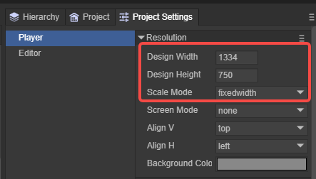

# 2D Basic Concepts

> Author: Charley

This article introduces some fundamental engine concepts other than 3D basics.

## 1. General Basic Concepts

### 1.1 Canvas

The **canvas** refers to the `canvas` element provided by the browser, as shown in Figure 1-1:

(Figure 1-1)

All visible frames rendered by the LayaAir engine are drawn on the canvas frame by frame. The engine achieves smooth animation by rendering multiple frames per second—this frame rate is an important performance metric indicating how smoothly the game runs.

The canvas functions like a painter’s paper—it’s the carrier for each frame’s image. Without the canvas, the engine wouldn’t be able to perform visual rendering.

> The higher the frame rate, the smoother the display. Typically, 60 FPS is considered full frame, but this can vary depending on the device—some support 90 or even 120 FPS.

In the LayaAir engine, the canvas size depends on the project’s **design resolution** and **screen adaptation strategy**, as shown in Figure 1-2:

(Figure 1-2)

Different device resolutions may result in varying canvas sizes. These details are further explained in the **Screen Adaptation** documentation.

### 1.2 Stage

The **Stage** in LayaAir is the actual visible area drawn on the canvas that handles both rendering and input interaction.

Think of the canvas as a piece of paper, and the stage as the portion of the paper where the artist (the engine) is allowed to paint. Regardless of the canvas size, any content outside the stage will not be displayed.

For example:
Imagine spreading a large sheet of paper across a table (the full-screen canvas), but only allowing painting within the center area (a non-full-screen stage). In this case, the final visible image is restricted to that central region; everything else will be cropped or ignored.

Therefore, for full-screen games, it’s not enough to simply make the canvas full-screen — you must also ensure that the **stage size matches the canvas** to display the full visual content.

> The stage size depends on the project’s design resolution and screen adaptation strategy. For a deeper understanding, see the **Screen Adaptation** documentation.

### 1.3 Object

For readers familiar with programming, an **object** usually refers to an instance of a class — the foundation of object-oriented programming.

In a broader sense, any data structure with attributes, or that allows dynamic property assignment, can also be considered an object. For example, in JavaScript, a JSON object or even an empty literal `{}` are both objects.

### 1.4 Node

In the LayaAir engine, the `Node` class is the base class for all objects that can be added to the display list. Both the 2D base sprite (`Sprite`) and the 3D base sprite (`Sprite3D`) inherit from `Node`.

Any subclass or descendant of `Node` is also called a **node** — for example, `Sprite` node, `Image` node, and so on.

> Only objects derived from `Node` can contain child nodes.

### 1.5 Display Objects and Container Objects

In the node system, nodes that have visual content (such as images, text, animations, or models) are called **display objects**.

Nodes that are not rendered themselves but are used to organize or contain other nodes are called **container objects**, such as `Sprite`, `Sprite3D`, or `Box`.

A single node can serve both roles.
For instance, a `Sprite` acts as a display object when assigned a texture, but functions as a container when it only holds other child nodes.

### 1.6 Display List

The **display list** is an abstract concept representing the hierarchical node tree under the stage.
All nodes involved in rendering or hierarchy organization exist within the display list, which manages every visible node during runtime.

Note that `Sprite` (2D) and `Sprite3D` (3D) belong to distinct node systems — they **cannot be nested** within each other.
In other words, a `Sprite` cannot be a child of `Sprite3D`, and vice versa.

### 1.7 Graphics API

A **Graphics API** (Application Programming Interface) is the bridge between developers and the underlying graphics hardware. It provides functions for rendering shapes, textures, and transformations.
The GPU then interprets these instructions to produce visible images.

In HTML5 environments, the main 3D graphics API is **WebGL**, while its next-generation successor **WebGPU** is gradually being adopted by modern browsers.
The LayaAir3 engine supports both WebGL and WebGPU.

### 1.8 Image

An **image** is a 2D visual asset, usually sourced from local files or network resources. It can be displayed directly or used as input for textures, sprites, or shaders.

Common image formats include `.png` and `.jpg`.
Images are among the most frequently used resources in games, alongside audio, video, animation, and atlases.

### 1.9 Texture

New developers often confuse **textures** with **images**, but they are different concepts.

A **texture** is an image in a format optimized for GPU rendering — it represents image data uploaded to the GPU as a renderable resource.
In simple terms, an image is the source, and a texture is its GPU-ready version.

For example, **compressed textures** differ from regular images like PNGs or JPGs.
They are pre-encoded in a GPU-native format and can be directly uploaded without decoding, providing faster loading and lower memory usage — ideal for optimizing large-scale resource-heavy games.

A **render texture** (`RenderTexture`) is a special kind of texture generated by rendering output directly into a texture rather than onto the screen.
This allows developers to capture scenes, nodes, or camera views as textures and reuse them for post-processing or UI display.

Unlike static images, render textures are dynamic and can be updated every frame or on demand.
They are essential for off-screen rendering, frame capture, post-effects, and other advanced rendering techniques in both 2D and 3D systems.

## 2. 2D-Specific Concepts

### 2.1 UI

**UI** stands for *User Interface*.
In games and applications, it refers to all the visible and interactive screen elements — buttons, text boxes, sliders, progress bars, menus, panels, etc.

The UI serves as a bridge between the user and the system.
Players interact with the game through UI elements, while the game communicates back through UI indicators such as health bars, scores, quest updates, and dialogs.

LayaAir provides a complete UI component system for building such interfaces.
However, the concept of UI is broader than just the component system — any interactive or display object that facilitates user interaction qualifies as UI, even a manually coded `Sprite`-based interface.

In short, **UI** is a functional concept, not limited to any specific component system.
The **UI System** is merely one of the ways to implement it.

### 2.2 Widget

A **UI widget** is a functional, reusable building block of the user interface, such as buttons, sliders, checkboxes, and text fields.
They encapsulate both presentation and interaction logic, allowing developers to efficiently construct and manage layouts.

In the LayaAir3 engine, widgets are divided into two main categories:

* **2D Base Objects** — Native 2D nodes that work independently of any UI framework.
* **UI System Components** — Visual controls that depend on a specific UI system.

See Figure 2-1:

(Figure 2-1)

For more information, refer to the **UI Widgets** documentation.

### 2.3 UI Runtime

The **UI Runtime** in LayaAir is a binding mechanism that simplifies code management for complex 2D UI structures.

It allows developers to name and declare variables for nodes directly in the editor, making them accessible via `this.xx` in scripts, without manually finding nodes through methods like `getChildByName`.
This significantly improves script clarity and development efficiency in large UIs.

Under the hood, UI runtime works by having custom classes inherit from base UI component classes.
Developers can override logic, modify data bindings, and extend behaviors for greater flexibility and control.

For more information, refer to the **UI Runtime** documentation.

### 2.4 2D Area

A **2D Area (Area2D)** in LayaAir is a container specifically designed for camera-based view management in 2D games.
Each 2D Area can have only one main 2D camera that controls viewing angles, positions, and transformations of all contained nodes.

Nodes outside of a 2D Area belong to **static UI**, which is unaffected by the camera and always remains fixed on screen.
At runtime, the rendering order is: **3D content below, 2D content above**.

Within 2D elements, render order follows the node hierarchy — nodes appearing later in the hierarchy are drawn on top.

All display objects (2D nodes and UI components) added to a 2D Area are affected by the camera. When the camera moves, they move accordingly.

Static UI elements, on the other hand, remain fixed regardless of camera movement — ideal for on-screen controls such as joysticks, skill buttons, and navigation menus.

Avoid placing fixed UI elements inside a 2D Area, as they would shift with the camera and potentially move off-screen.
