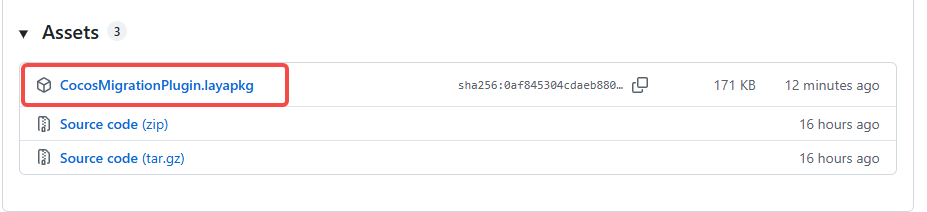
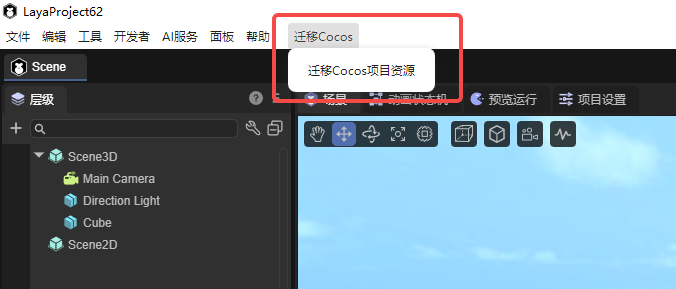

# Cocos Resource Export Plugin

## I. About the Plugin

With LayaAir Engine's continuous development, more and more developers are choosing LayaAir Engine for game development. Some developers have already developed part of their game content using Cocos Engine but wish to switch engines to continue development. The Cocos Resource Export Plugin is a LayaAir plugin used to migrate Cocos Creator project resources to LayaAir. The plugin converts supported resource types to LayaAir resource formats by scanning Cocos project resources and meta files, and automatically handles common components (UI, meshes, lights, cameras, colliders, rigid bodies, animations, etc.).

## II. Basic Usage

Plugin download address: https://github.com/layabox/CocosMigrationPlugin/releases

Environment requirements:

LayaAir version: 3.3.6 or higher.

Cocos version: Known to support Cocos Creator 3.x series, theoretically also supports 2.x series.

## III. How to Use

1. Download the resource package and import the plugin into the project via the IDE's import resource package functionality. For specific process, refer to [Package Manager and Resource Package Import Guide](../../../IDE/layapackage/pluginImport/readme.md) section II.

2. After importing the resource package, a new option appears in the main menu: `Migrate Cocos / Migrate Cocos Project Resources`

3. Click this option, and two dialog boxes will pop up:

- First dialog: Select **source Cocos resource directory** (usually the `assets` directory under the Cocos project, can also be a subdirectory)

- Second dialog: Select **target LayaAir resource directory** (must be a subdirectory under the current LayaAir project's `assets` directory)

4. Wait for conversion to complete. Developers can view console output to understand migration progress and possible warnings.

## IV. Known Limitations and Notes

1. The plugin only converts extensions registered in `core/Registry.ts`. Other types will be ignored or print warnings. Currently supported resource types include:

- Image resources: png, jpg, jpeg, hdr
- Model resources: fbx, gltf, glb, obj
- Shader resources: effect
- Material resources: mtl
- Animation resources: animgraph, anim
- Prefabs and scenes: prefab, scene

2. Some Cocos-specific components/material parameters may not have one-to-one mapping in LayaAir and require manual adjustment.

3. Custom Effect conversion is not supported.

4. Physics parameters (mass, friction, elasticity, etc.) and engine implementation differences may cause runtime effects to not completely match the original project.

## V. Extension and Secondary Development

The Cocos Resource Export Plugin is an open-source project. Developers can extend the plugin according to their own needs.

1. Add new resource conversion:

- Add a conversion class implementing `ICocosAssetConversion` interface in `core/assets`
- Register extension and conversion class mapping in `core/Registry.ts`'s `ConversionRegistry`

2. Add/modify component conversion:

- Add or modify corresponding component conversion files in `core/components`
