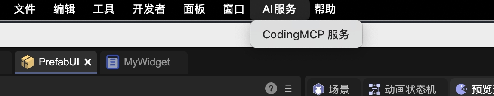
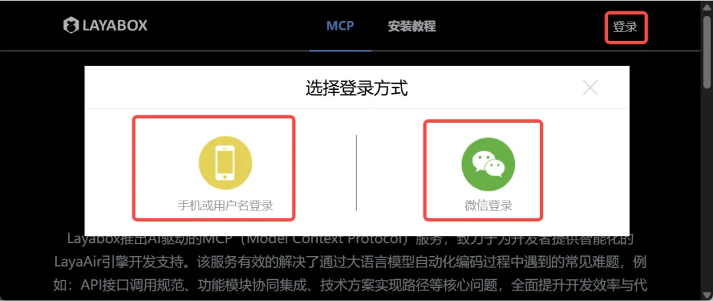
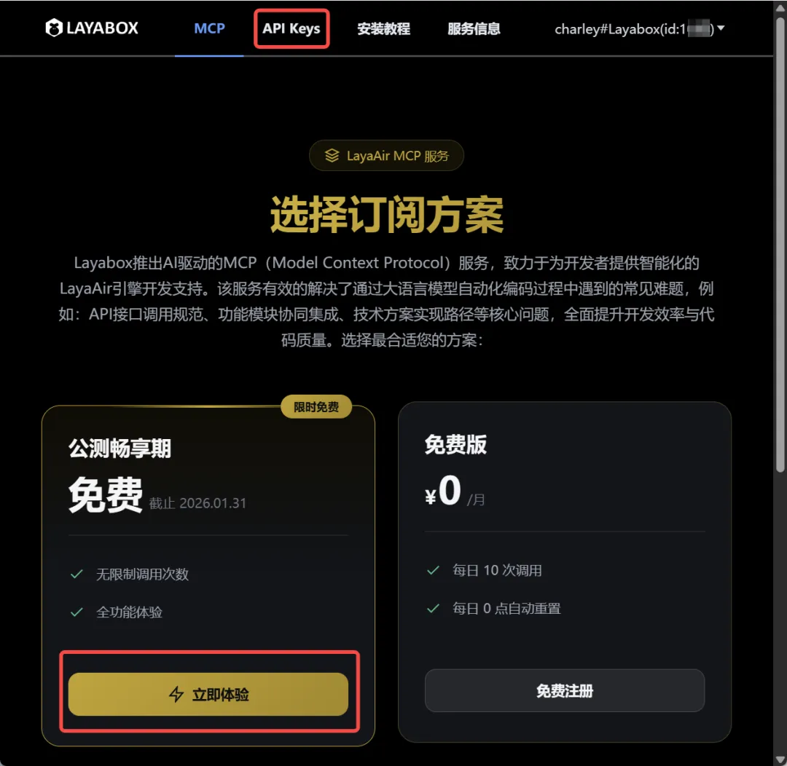
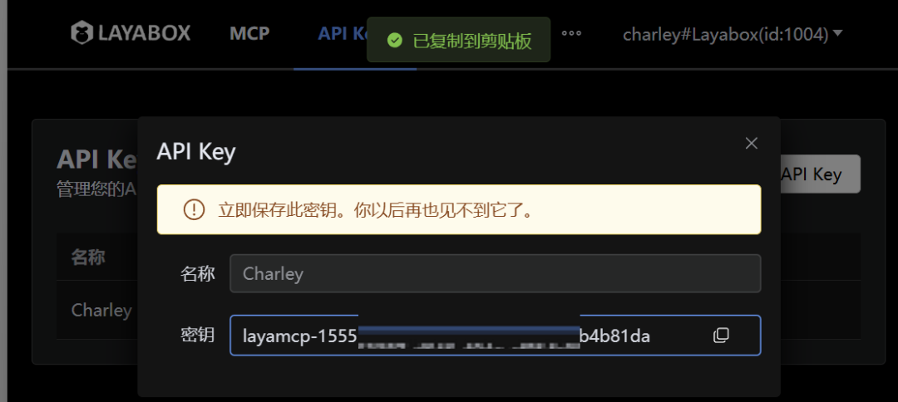
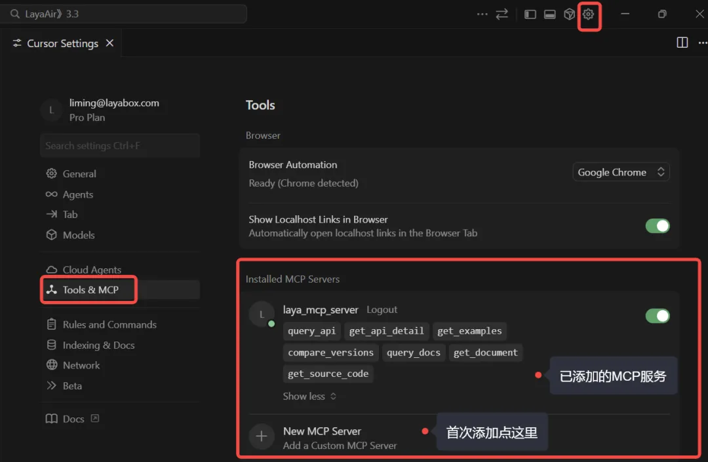
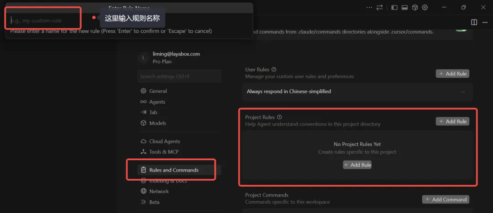

# AI Coding Environment: CodingMCP

> Author: Charley

The LayaAir engine has launched the LayaAir-CodingMCP service, eliminating engine hallucination problems in AI coding environments. This solves a major challenge when combining AIGC with engine development.

## 1. Pain Points Solved by CodingMCP

### 1.1 Zero-Cost LayaAir Onboarding, Eliminating the "API Familiarity Period"

In game and interactive project development, regardless of which engine is used, developers go through a similar stage in the beginning:

**Need to invest time to familiarize themselves with the engine's API system and the usage boundaries of various features.**

Even experienced developers must build intuition about engine interfaces and usage through actual coding when switching to a completely new engine.

This familiarization process often doesn't manifest in obvious logical errors—it could be misuse caused by differences in API usage between engines, or problems from not knowing or being unfamiliar with engine APIs.

When project schedules are relaxed, this磨合 is acceptable. But in scenarios requiring rapid advancement, this "API familiarity period" becomes a key factor affecting overall efficiency. Developers clearly have sufficient programming capability but are still forced to spend significant time on accurate usage of engine interfaces.

Even with the introduction of AI-assisted coding, this problem hasn't automatically disappeared. General AI models, when faced with vertical domain engines, often lack sufficient specialized training data, leading to mixed API information between different engines or even between different versions of the same engine, easily causing AI hallucination phenomena. The result is code that appears reasonable but calls non-existent or inapplicable interfaces.

In this situation, even mainstream and well-known AI models struggle to accurately invoke APIs according to a specific version of the engine based solely on their own capabilities. Development efficiency may actually be worse than developers manually consulting official documentation, which makes AI coding in actual projects often must be built on the premise of "having engine experts as backup."

**The significance of LayaAir-CodingMCP is to directly eliminate the main barriers to engine onboarding based on this objective reality.**

After integrating LayaAir-CodingMCP, whether directly generating code through AI or consulting AI about engine-related issues through dialogue, you can specify the specific LayaAir engine version. The basis is no longer speculative knowledge, but results trained on massive examples and official documentation from the real LayaAir engine API, thereby providing developers with accurate, usable code generation and solutions.

This significantly compresses the "API familiarity period" that originally required repeated trial and error and manual verification to cross, or even eliminates it entirely in actual development.

### 1.2 Solving the Recruitment Dilemma of "Must Have Engine Experience"

In real project environments, teams often don't lack programmers, but lack **programmers familiar with the target engine**.

Especially during critical stages of project startup or version iteration, simply relying on recruiting developers who "happen to be familiar with a specific engine" is often costly, time-consuming, and full of uncertainty.

Therefore, many teams have to choose a compromise solution: recruit developers with general programming capabilities who are familiar with any mainstream engine, then make up for target engine experience through learning while doing. But the hidden costs of this approach are very high. Even if the developers themselves are capable, in the early stages without being familiar with engine APIs and usage specifications, they will inevitably frequently hit pitfalls, slowing the overall development pace.

**LayaAir-CodingMCP provides a different solution here.**

It doesn't require every newly joined developer to rapidly grow into an engine expert, but enables AI to have real understanding capability of the LayaAir engine during the coding phase, thereby largely compensating for developers' lack of engine experience.

In actual use, even developers who have never been exposed to LayaAir before can generate code that complies with engine specifications and is version-accurate with AI assistance. API usage issues that originally required repeated checking and correction by senior engine developers are moved forward to the AI generation stage for constraint and correction. This allows teams to no longer be strongly limited by the condition of "whether familiar with LayaAir" in hiring strategy, but can focus more on developers' general capabilities and business understanding.

From a results perspective, **LayaAir-CodingMCP actually plays the role of an "engine experience amplifier," allowing teams to build development strength in more flexible ways** while maintaining stable project progress.

## 2. CodingMCP Configuration and Usage Process

### 2.1 Obtaining Communication Key

To use the LayaAir-CodingMCP service, you first need to obtain a communication key. Developers can open the menu `AI Service -> CodingMCP Service` through LayaAir 3.3.6 and above IDE, as shown in Figure 2-1, or directly access it in a browser at the URL (https://client.layaair.com/mcp/index.html).



(Figure 2-1)

After opening the page, click the login button in the upper right corner and select account login or WeChat scan login to complete registration or login, as shown in Figure 2-2.



(Figure 2-2)

After successful login, click the button on the subscription option or click API Keys in the top navigation to enter the **API Keys** page, as shown in Figure 2-3.



(Figure 2-3)

On the **API Keys** page, click the "Create API Key" button. In the pop-up window, enter the name of the Key, then confirm creation to immediately generate the key value, as shown in Figure 2-4.



(Figure 2-4)

> [Tip]
>
> The generated Key needs to be copied and securely saved by the developer, as it cannot be viewed again after closing the page. In subsequent MCP configuration, this Key needs to be filled in the corresponding position to complete service authorization.

### 2.2 Configuring CodingMCP Service

Before configuration, developers need to download and install the **Cursor editor**. In the editor, open the "`Tools & MCP`" configuration section, click "**New MCP Server**" to add LayaAir-CodingMCP service configuration, as shown in Figure 2-5.



(Figure 2-5)

Note: After successful addition, the MCP service's API will be displayed as shown above. Please ensure successful addition and keep it enabled.

Below is a recommended configuration template:

```json
{
    "mcpServers":{
        "laya_mcp_server": {
          "url": "https://laya-knowledge-mcp.layaair.com/mcp",
          "headers": {
            "LAYA_PRE_VERSION" : "v3.3.5",
            "LAYA_VERSION" : "v3.3.5",
            "LAYA_ALLOWED_DATASETS": "LayaAir",
            "LAYA_MCP_API_KEY": "YOUR_API_KEY"
          }
        }
    }
}
```

Configuration item descriptions are as follows:

- **url**: MCP service access address, directly copy the address from the template.
- ***LAYA_PRE_VERSION***: Engine version number for version difference comparison queries. By default, it can be consistent with `LAYA_VERSION`. When needing to compare API changes between different versions, specify it as an old version number. For example, if the current project is based on v3.1.1 development and the engine has been upgraded to v3.3.5, set `LAYA_PRE_VERSION` to v3.1.1 and `LAYA_VERSION` to v3.3.5 to obtain all change information from v3.1.1 → v3.3.5 from the knowledge base, including class additions/deletions/modifications, method changes and parameter adjustments, interface behavior changes, etc.
- ***LAYA_VERSION***: Target engine version identifier for MCP service reading and operation, determining which LayaAir version AI queries and returns are based on. Developers can modify according to the actual version used in the project.
- ***LAYA_ALLOWED_DATASETS***: Allowed MCP knowledge base collections. Currently only supports LayaAir, and the engine-trained APIs and documentation come from this knowledge base. Other training results will be supported in the future, and this parameter can be updated then.
- ***LAYA_MCP_API_KEY***: MCP service access key, which is the API Key created and saved earlier.

### 2.3 Setting Cursor Rules File

After completing LayaAir-CodingMCP configuration, if the main AI doesn't know how to work collaboratively with the MCP service, it may affect the effect and quality of the final generated code. For this, we provide a rules template that developers can directly reference for use, or optimize based on project requirements.

In the Cursor editor, enter the "**Rules and Commands**" configuration section, click "`Project Rules -> Add Rule`" to create a rules file, as shown in Figure 2-6. Copy the provided rules template content into a rule file with `.mdc` suffix to take effect.



(Figure 2-6)

Rules template content is as follows:

~~~text
---
alwaysApply: true
---
## Namespace Convention
**Must use `Laya.` prefix** to access all engine classes and static methods.
✅ `Laya.Sprite`, `Laya.Handler.create(...)` ❌ `Sprite`, `Handler`
---
## Entry Specification (Entry.ts)
Entry function structure is fixed, modification prohibited:
```typescript
export async function main() { /* Actual initialization logic */ }
```
❌ Prohibit submitting test code to `main` function
---
## Version and API Queries
- Append `<LAYA_VERSION>` version number when querying APIs
- Compare `<LAYA_PRE_VERSION>` → `<LAYA_VERSION>` API differences when migrating
- Use precise documentation returned by MCP as standard, self-correct hallucinations
---
## UI System Recognition
Read `settings/PlayerSettings.json` to determine UI type:
| `addons["laya.ui"]` | Type | Constraints |
|---|---|---|
| Field doesn't exist | classic | Only use classic UI (Box/Button/Label, etc.) |
| `"both"` | both | Both sets allowed, keep consistent within same module |
| `"ui2"` | new | Only use new UI (GBox/GButton/GLabel, etc.) |
---
## Physics Engine Recognition
Read `settings/PlayerSettings.json` to determine physics engine:
| `physics3dModule` | Engine |
|---|---|
| Field exists | PhysX |
| Field doesn't exist | Bullet |
Filter by engine type when querying physics APIs.
---
## MCP Knowledge Base
LayaAir API-related queries through MCP, need to attach version number, UI type, physics engine type.
~~~

The main purpose of the rules file is:

- **Unified Convention**: No need to repeatedly explain rules like "uniformly use `Laya.` prefix" or "this project uses the new UI system" in every AI interaction. Once the rules file is defined, AI will automatically follow these conventions, and developers only need to describe business requirements.
- **Automatically Identify Project Environment**: AI will read and parse the `PlayerSettings.json` file in the project, automatically determine the feature modules and API versions used by the current project based on configuration items like `addons` and `physics3dModule`, thereby avoiding misuse or mixing of interfaces.
- **Maintain Consistent Code Style**: No matter who uses AI to generate code, the final output follows unified specifications, avoiding situations where some files use `Laya.Sprite` and others directly use `Sprite`, improving overall code maintainability.
- **Prioritize Real Documentation**: The rules file explicitly requires AI to query LayaAir engine-trained APIs and knowledge bases through MCP service, ensuring generated code is reasoned and generated based on real documentation and APIs, rather than relying on memory or generating hallucinations, thereby avoiding incorrect or non-existent interface calls.

By setting up the rules file, **Cursor will be able to obtain accurate engine API and documentation information through the LayaAir-CodingMCP service, providing reliable support for AI coding**, thereby avoiding incorrect calls and low efficiency, significantly improving development efficiency and code quality.

## 3. CodingMCP Development Practice

After completing LayaAir-CodingMCP configuration and rules file setup, developers can normally use AI services in Cursor for project development. When the main AI model encounters engine-related development requirements, it will collaborate with LayaAir-CodingMCP according to the rules file, obtain accurate API information from the service, and ensure generated code calls are correct and error-free.

In actual testing, when we used Cursor + LayaAir-CodingMCP service to develop mini-game prototypes, most projects could generate reliable, runnable prototypes in one go. Even when there were occasional errors or functionality didn't meet expectations, it wasn't a LayaAir engine API error, but usually an AI coding logic issue. These problems can be corrected by communicating with the main AI model or switching to internationally renowned AI models (such as GPT-5.x).

With the combination of LayaAir-CodingMCP and Cursor, developers can quickly transform ideas into runnable 2D or 3D game prototypes or generate specific functional modules, significantly reducing development trial-and-error costs and improving project development efficiency several times over.

Developers can view our full development practice process video on Bilibili ([https://space.bilibili.com/1736809941](https://space.bilibili.com/1736809941)) or on LayaAir engine's video account.

Through LayaAir-CodingMCP, developers not only gain a reliable auxiliary tool, but also possess a futuristic productivity model—deep collaboration between AI and engines, enabling every idea to be quickly realized and every project to land with efficiency and reliability. This is not only an improvement in development efficiency, but also a marker of game and interactive development entering a new intelligent era.
