# General Release Settings

> Author: Charley

After completing project development and debugging, the ultimate goal is to build and release the game or application to the target platform, allowing players or users to experience it smoothly. LayaAir IDE provides a comprehensive build and release process to help developers quickly generate runtime versions adapted to different platforms. Whether for Web, PC clients, or various mobile and mini-game platforms, the IDE can minimize developer release costs based on platform characteristics.

LayaAir supports release capabilities for current mainstream platforms, including web, mobile (Android, iOS, HarmonyOS Next), mini-games (WeChat, Douyin, Huawei, OPPO, vivo, Alipay, Taobao, etc.), and PC (Windows, Linux), etc.

The "**General Release**" section here covers common basic capabilities for all platform releases. Developers need to master these configurations and functions to avoid the final release results not meeting expectations.

## 1. Release Entry and Process

### 1.1 Build Release Entry

Developers can open the build and release panel through **"File" → "Build & Release"** in the IDE's top menu bar. This panel can be freely docked in the IDE's middle area for convenient build configuration, as shown in Figure 1-1:

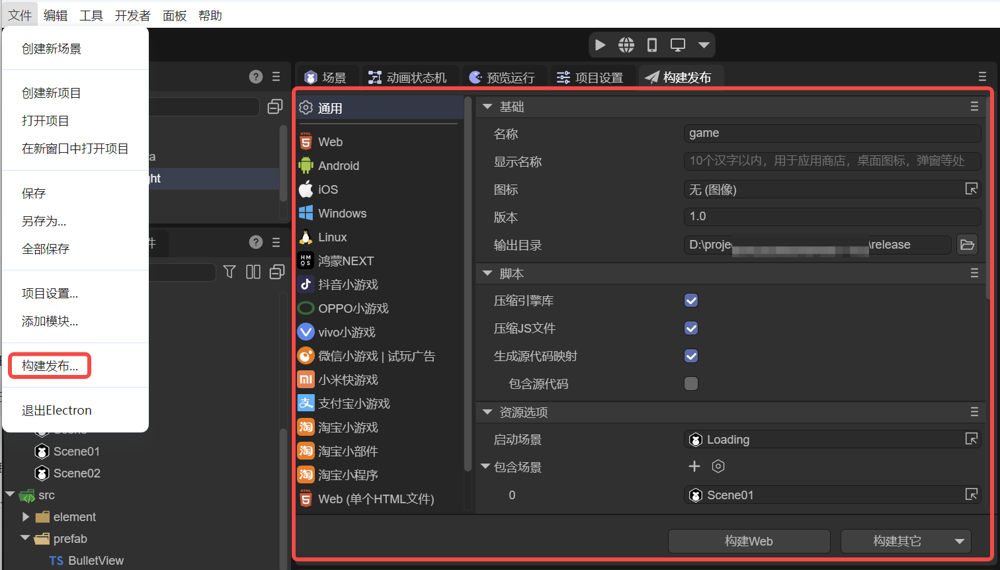

(Figure 1-1)

At the bottom of the general panel, two shortcut buttons are provided by default: **"Build Web"** and **"Build Other"**. Developers can click these buttons directly for quick building, as shown in Figure 1-2. You can also select the target platform from the platform list on the left, enter the corresponding configuration panel, and then proceed with build and release.


(Figure 1-2)

`Web` refers to releasing as an [HTML5 version](../web/readme.md), running in various platform browser HTML5 environments, embedded app or mini-program `webView` environments.

`Android` refers to releasing as an [Android platform](../Android/readme.md), running in Android app environments.

`iOS` refers to releasing as an [iOS platform](../iOS/readme.md), running in iOS app environments.

`Windows` refers to releasing to the [Windows platform](../Windows/readme.md), running directly on the Windows system desktop.

`Linux` refers to releasing to the [Linux platform](../Linux/readme.md), running directly on the Linux system desktop.

`HarmonyOS NEXT` refers to releasing as a project工程 adapted to [HarmonyOS NEXT](../Harmony/readme.md).

`Douyin Mini-game` refers to releasing as a project工程 adapted to [Douyin Mini-game](../miniGame/byteDance/readme.md).

`OPPO Mini-game` refers to releasing as a project adapted to [OPPO Mini-game](../miniGame/OPPO/readme.md).

`VIVO Mini-game` refers to releasing as a project adapted to [VIVO Mini-game](../miniGame/vivo/readme.md).

`WeChat Mini-game | Trial Ad` refers to releasing as a project adapted to [WeChat Mini-game or Trial Ad](../miniGame/wechat/readme.md).

`Xiaomi Quick Game` refers to releasing as a project adapted to [Xiaomi Quick Game](../miniGame/xiaomi/readme.md).

`Alipay Mini-game` refers to releasing as a project adapted to [Alipay Mini-game](../miniGame/alipaygame/readme.md).

`Taobao Mini-game` refers to releasing as a project adapted to [Taobao Mini-game](../miniGame/tbgame/readme.md).

> This section mainly introduces general release settings. For each release platform, click the links above to view the documentation.

### 1.2 Release Tasks and Operations

After clicking the build button, the IDE automatically switches to the **"Build & Release Tasks"** panel. After the release process is completed, developers can perform a series of operations by selecting the corresponding history record, such as: open release directory, view build logs, rebuild, run directly, scan to run, or delete the release directory. As shown in Figure 1-3.

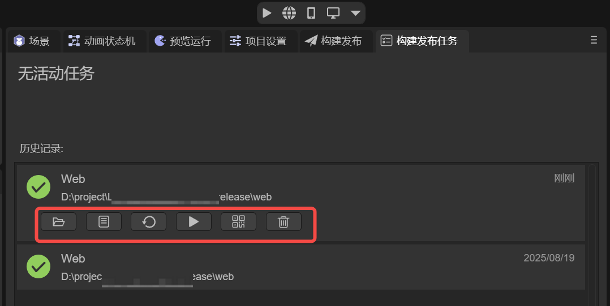

(Figure 1-3)

## 2. Basic Settings

Basic settings cover common information used by all platforms during the release process. Developers need to make necessary configurations here to ensure the project can be correctly identified and displayed on different platforms.

### 2.1 Name `name`

The **internal project name**, filled when creating the project, can be modified here (usually not modified, kept consistent with the project file name).

If no display name is set, it defaults to being used as the display name.

For example, in **Web release**, the name displays in the generated HTML file as the webpage's `<title>`.

As a Native package, the name serves as the package name and the default name on the window. As shown in Figure 2-1.


(Figure 2-1)

### 2.2 Display Name `displayName`

The user-visible product name. Used for web browser titles, desktop application names, installation package names, etc.

After setting, the system prioritizes displaying this name rather than the project name. As shown in Figure 2-2.

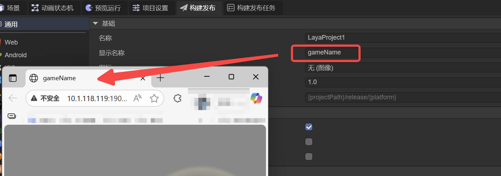

(Figure 2-2)

### 2.3 Icon `icon`

Serves as the default icon for the application on the desktop, installation interface, etc. Usually needs to be a square icon.

### 2.4 Version `version`

The project version number, used to identify different functional versions.
- When making major functional updates, the version number can be upgraded from `1.0` to `2.0`.
- For small bug fixes or optimizations, increment based on the original version number, such as `1.0` → `1.1`.

Recommend using **floating-point format** (such as `0.1`, `1.3`, `5.0`) for easier management and differentiation.

### 2.5 Output Directory `outputPath`

The directory where generated files are stored after release.
- Default path is the `release` folder in the project root directory.
- **Recommend keeping the default path** for unified management.
- For special needs, developers can also customize the path, either as a subfolder under the project directory or as a completely independent directory.

## 3. Scripts

### 3.1 Compress Engine Library `useCompressedEngine`

For formal release, recommend checking this option. After enabling, the compressed version of the engine library will be used to reduce package size.

### 3.2 Compress JS Files `minifyJS`

For formal release, recommend checking this option. After enabling, compressed `JS` files will be output to further reduce size.

### 3.3 Generate Source Map `sourcemap`

After enabling, `.js.map` files will be generated in the output directory for source mapping during debugging.

Source Map is a technique used for debugging and development. It establishes a mapping relationship between original source code and compressed, obfuscated code. By creating a source code mapping file, you can accurately map compressed code back to original source code in browser developer tools, facilitating developers in locating problems, viewing error stacks, and variable values during debugging, improving debugging efficiency.

### 3.4 Include Source Content `sourcesContent`

Include source content is a related attribute of source mapping.

When checked, the source code mapping `.map` file will directly include source code content. During debugging, you can see the complete source code directly in the browser for the best debugging experience, but it increases release package size and source code can be easily restored.

If unchecked, the `.map` file only saves the source code mapping relationship without source code text. You can only see the compressed `JS`. However, when errors occur, it can provide correct error line and column positioning, belonging to a "minimize debug info" solution, often used in online environments.

## 4. Resource Options

### 4.1 Startup Scene `startupScene`

The startup scene is the project entry scene after the engine completes loading and initialization, and must be set.

### 4.2 Included Scenes `includedScenes`

For scenes, only the startup scene and scene files included in the release will be copied to the release directory.

> The release process packages scene-referenced resources to the release directory.

### 4.3 Always Included Resource Directories `alwaysIncluded`

There are many resources in the IDE project's assets. Which resources are copied to the release directory is mainly determined by three rules.

First, resources referenced in release scenes (startup scene + included scenes) will be copied to the release directory.

Second, all resources in directories named `resources` under the assets directory will be automatically merged and copied to the `resources` directory in the release directory. As shown in Figure 4-1.

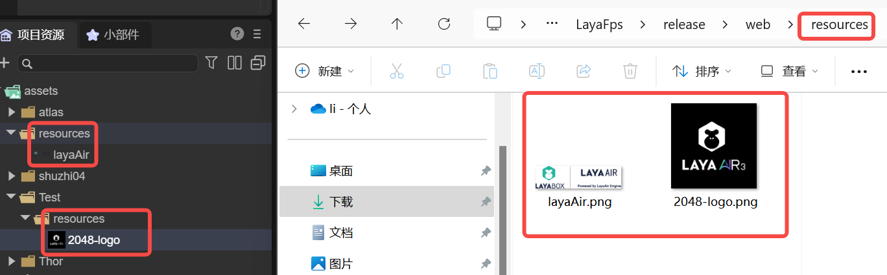

(Figure 4-1)

Third, in addition to the above two rules, directories configured in `alwaysIncluded resource directories` will also be copied to the release directory. As shown in Figure 4-2.


(Figure 4-2)

## 5. Unmanaged Resources

### 5.1 Copy Files Under BIN Directory `copyBinFiles`

When checked, files in the project's **bin directory** will be copied to the release directory.

This feature is mainly applicable to the following scenarios:
- **Custom modified `bin/index.html`** (not recommended to directly modify this file)
- Placed some special resources not suitable for the `assets` directory in the **bin directory**, such as resources that need to be loaded directly via **DOM**.

### 5.2 Exclude Files Rule `excludeFilesRule`

`Exclude files rule` is a companion option for `copy files under bin directory`.

After checking **copy files under bin directory**, you can configure files or directories to exclude in this rule. For example:
- Exclude all files in a specified directory (including subdirectories), e.g., `abc/**/*`
- Exclude specific files, e.g., `bg2.png`

As shown in Figure 5-1.


(Figure 5-1)

## 6. Version Management

### 6.1 Enable Version Management `enableVersion`

After enabling version management, except for engine-included entry files, all other non-ignored file names will have a version tag generated by a specified algorithm and length appended, as shown in Figure 6-1.

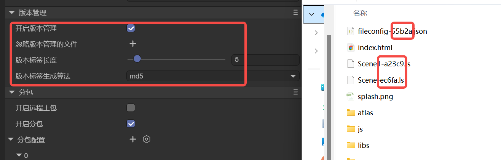

(Figure 6-1)

This method effectively avoids display issues caused by file updates not being timely due to `CDN` or browser caching.

### 6.2 Ignore Files in Version Management `ignoreFilesInVersion`

After enabling version management, except for engine-included entry files, by default all files will carry version tags.

The "ignore files in version management" function allows developers to specify some files not to carry version tags.

### 6.3 Version Tag Generation Algorithm `versionAlgorithm`

The default algorithm for version tags is **MD5**, but you can also choose **SHA1** or **SHA256**.

Developers can choose the appropriate algorithm based on project needs.

### 6.4 Version Tag Length `versionTagLength`

The default length for version tags is **5 characters**.

Developers can freely adjust, but need to pay attention to reasonableness. For example, the MD5 algorithm's maximum length is **32 characters**.

## 7. Subpackage

### 7.1 Enable Remote Main Package `enableRemoteMainPackage`

In actual projects, **game resources** are usually stored separately from script code, engine library, and entry files.

For example: hosting resources on Tencent Cloud COS (Object Storage) or other remote servers, while scripts and engine library remain in the mini-game local package.

After enabling `enable remote main package`, you need to set the resource server address `mainPackageRemoteUrl` as the path prefix for resource loading, as shown in Figure 7-1.


(Figure 7-1)

After configuration is complete, the release process will separately output all resources to a directory named **`targetPlatform-remote`**.

The contents of this directory need to be uploaded to the remote server, while the original release directory no longer contains project resources, only including entry files, engine library (libs), and project scripts (js), as shown in Figure 7-2.

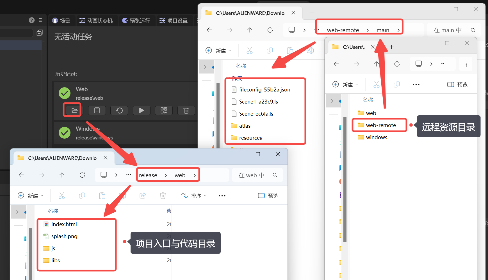

(Figure 7-2)

During development or testing phases, if there's no remote server temporarily, you can directly start a local web service (such as using `anywhere`) in the **remote resource directory** and configure that service's access address as the resource server URL, as shown in Figure 7-3.


(Figure 7-3)

After release is complete, you can verify resource loading through debugging tools. At this point, resource request paths point to the configured remote address rather than the project's startup URL, as shown in Figure 7-4.

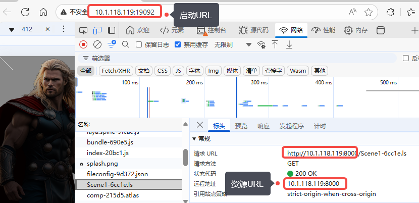

(Figure 7-4)

### 7.2 Enable Subpackage `enableSubpackages`

To avoid the first package being too large, causing long user wait times and user churn. As well as platform limitations (e.g., mini-game package size limits), code and resource modular development needs, etc. The project is divided into an entry main package and several module subpackages to form a complete project.

After enabling subpackages, you can configure one or more subpackages, as well as WASM subpackages, as shown in Figure 7-5.


(Figure 7-5)

### 7.3 Subpackage Configuration `subpackages`

#### 7.3.1 Resource Folder `path`

`Resource folder` specifies the root directory path for each subpackage.

Usually we name the directory `sub1`, `sub2`, etc., and then bind that directory to the `resource folder` configuration item by selecting or dragging, as shown in Figure 7-6.

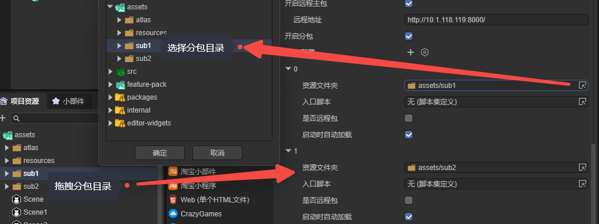

(Figure 7-6)

Note: If resources in the subpackage directory are not in the "included scenes," but rely on code for dynamic loading, the subpackage directory must be additionally added to **always included resource directories** as shown in Figure 7-7, otherwise it may be ignored during release.


(Figure 7-7)

#### 7.3.2 Entry Script `mainScript`

If the subpackage's purpose is only resource subpackaging, the `entry script` can be left unset, defaulting to none.

The main purpose of the entry script is code subpackaging. It can accept a `script set definition` file, as shown in Figure 7-8:

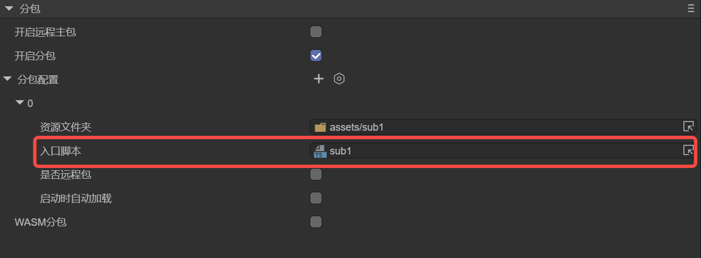

(Figure 7-8)

Through script set definition, code in the subpackage can be compiled and packaged as a complete subpackage script set `game.js`.

> If you're unfamiliar with script set definitions, check the related documentation ["Script Set Definition"](../../IDE/assets/bundledef/readme.md)

#### 7.3.3 Auto Load on Startup `autoLoad`

When checked, the subpackage will **automatically load before the first scene loads**.

If you want to control subpackage loading timing through code logic, uncheck this and manually load in code.

Manual loading method is as follows:

```js
//Non-remote package loading method
Laya.loader.loadPackage("NewFolder");  // "NewFolder" is the subpackage directory name

//Remote package loading method, only considered loading remote package when resource network address is provided
Laya.loader.loadPackage("NewFolder", "http://cdn.cn/"); //"http://cdn.cn/" is the network address
```

> The loadPackage method doesn't immediately load all resources, it only loads a package description file.

After subpackage loading completes, using resources in the subpackage is exactly the same as using ordinary resources.

For example, if the resource path is `"NewFolder/a.png"`, whether the resource comes from a local subpackage or remote subpackage, it can be loaded through the same path.

#### 7.3.4 Is Remote Package `remote`

In section 7.1, we already introduced the concept of "remote main package." In fact, whether for main package or subpackage, **the principle and function of remote packages are consistent**.

When this option is checked, it indicates the current subpackage will be released as a remote package. During build and release, the subpackage's resources and scripts (if configured) will be output to the remote package directory (`release\platformName-remote`).

💡 Subpackage functionality applies to all platforms, but note:

Non-remote packages are used for mini-game platform subpackaging. For web platforms, using non-remote subpackages has little significance. Recommend checking to use remote packages.

#### 7.3.5 Remote Address `remoteUrl`

When both `auto load on startup` and `is remote package` are checked, the remote address `remoteUrl` parameter is displayed, as shown in animated Figure 7-9.

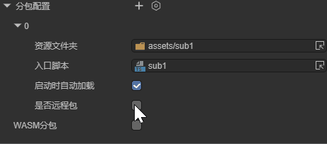

(Animated Figure 7-9)

Only after filling in a valid remote address does the remote package configuration truly take effect.

Its loading method and effect are the same as **section 7.1**'s remote main package introduction, so we won't repeat it here.

#### 7.4 WASM Subpackage `enableWasmSubpackage`

After checking `enable subpackage` and `WASM subpackage`, during release all files ending in "`.wasm`" (and files with property checked `import as plugin`) will be screened. When qualifying `WASM` files exist, the build and release system automatically creates a subpackage configuration object `wasmSubpackage`, sets it to `auto load on startup`. In the resource output directory, it automatically creates a "`wasm_files`" folder and copies all qualifying files ending in "`.wasm`" to this folder, as shown in Figure 7-10.

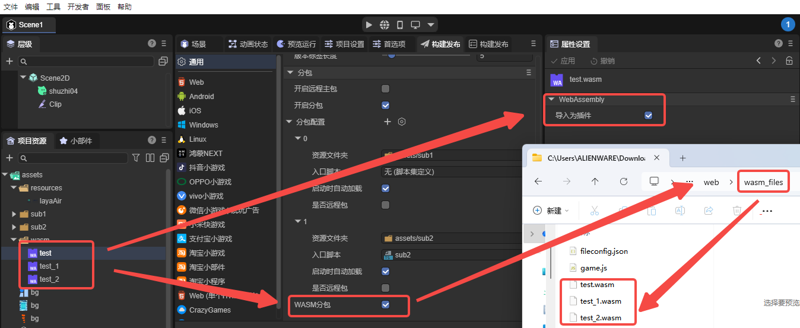

(Figure 7-10)

💡 It's important to emphasize that for `.wasm` files, in the `IDE` you must check `import as plugin` for them to be copied to the subpackage directory (`wasm_files`).
