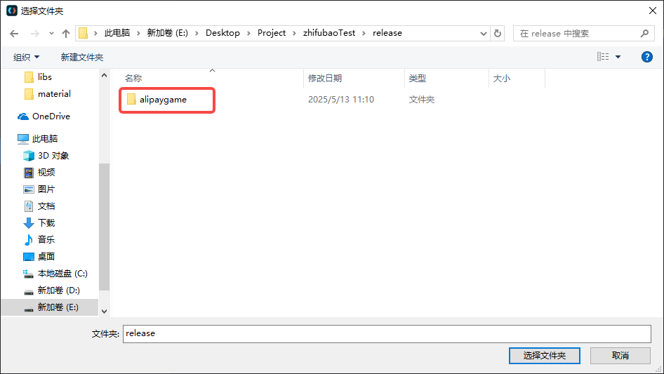
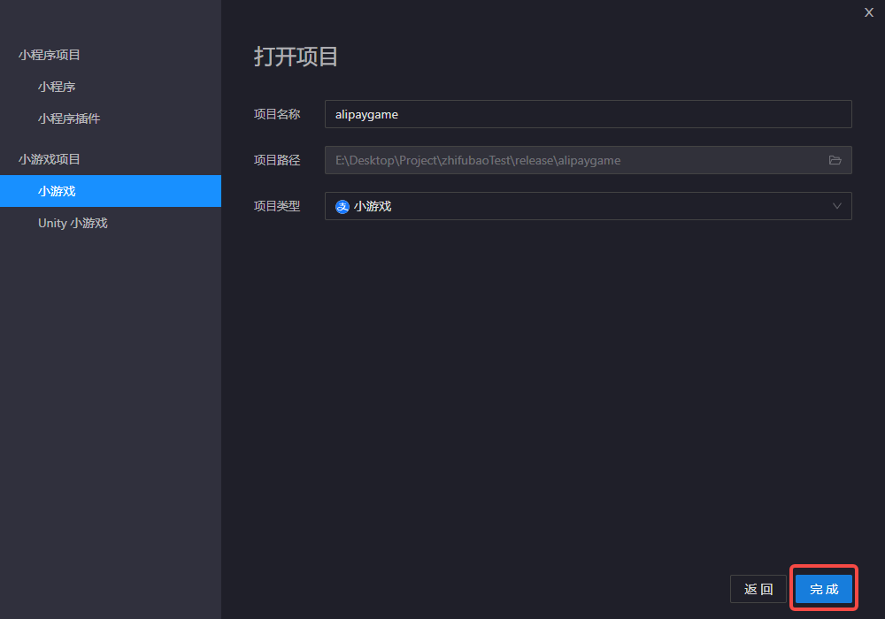
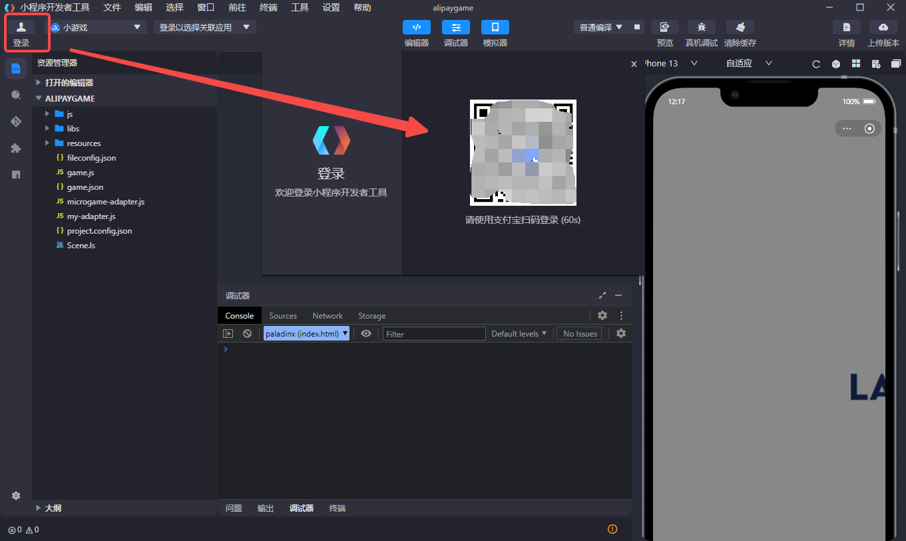
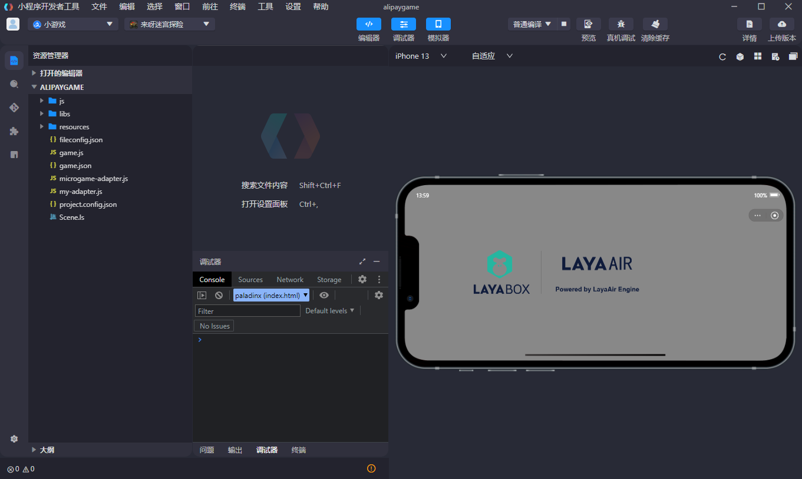
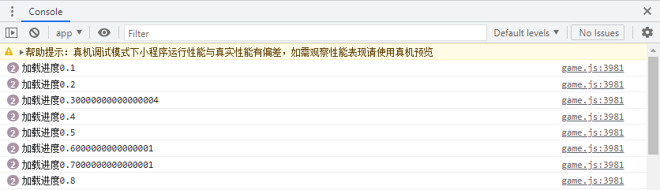

# Alipay Mini Games

## I. Overview

Alipay Mini Games are a new type of game that **doesn't require users to download**; they are **click-to-play**.

Compared to traditional apps, mini games feature **shorter development cycles** and **lower development costs**, making it easier for developers to participate in the development process, enabling **rapid launch and monetization**.

It's recommended to check out the official **Alipay Mini Game documentation** at [doc](https://opendocs.alipay.com/mini-game/08tzon). The "Getting Started" section in their documentation can help developers quickly learn how to publish mini game projects. The LayaAir engine documentation focuses more on engine-related content.

> Before publishing an Alipay Mini Game, you need to perform [generalSetting](../../generalSetting/readme.md).


## II. Building and Publishing for Alipay Mini Games

### 2.1 Selecting the Target Platform

In the build and publish panel, select **Alipay Mini Game** as the target platform in the sidebar, as shown in Figure 2-1.


(Figure 2-1)

Clicking "**Build Alipay Mini Game**" or "Alipay Mini Game" under the "**Build Other**" options will publish your project as an Alipay Mini Game.

`ES6 to ES5`: Used for compatibility with some older devices. Generally, you don't need to check this.

`Compress Textures`: Generally, "Allow using compressed texture formats" should be checked. If not checked, all image settings for compressed formats will be ignored.

`Texture Source Files`: You can uncheck "Always include texture source files." If checked, the source files (png/jpg) will still be packaged even if the images use compressed formats. The purpose is to fall back to source files when encountering systems that do not support compressed formats.

### 2.2 Introduction to the Directory After Publishing

The directory structure after publishing is shown in Figure 2-2:


(Figure 2-2)

**js directory and libs directory**:

Project code and engine libraries.

**resources asset directory and Scene.ls**:

The `resources` asset directory and the `Scene.ls` scene file. Due to initial package limitations in mini games, it's recommended to plan the content of the initial package in advance, ideally placing it in a unified directory for easy separation of the initial package.

**fileconfig.json**:

This file contains some project configuration information.

**game.js**:

The entry file for Alipay Mini Games. The game project's entry JS file and adapter library JS are all introduced here. It's generated by the IDE when creating a project and generally doesn't need to be modified.

**game.json**:

The mini game configuration file, which developer tools and clients need to read to render related interfaces and set properties.

**microgame-adapter.js and my-adapter.js**:

Alipay Mini Game adapter library files, used to adapt to Alipay Mini Games.

**project.config.json**:

The mini game project configuration file, containing some information about the mini game project.


## III. Using Alipay Mini Game Development Tools

To debug an Alipay Mini Game project built and published by LayaAir, you also need to configure the relevant environment. The steps are as follows:

### 3.1 Creating a Mini Game Application

Whether for debugging or official release of an Alipay Mini Game, you first need to **create a mini game application**. Developers can refer to [Create Mini Game - Alipay Document Center](https://opendocs.alipay.com/mini-game/093ryh?pathHash=2f29f6ae) to create one.

### 3.2 Installing the Mini Game Development Tool

Developers can go to [Download Mini Program Developer Tools - Alipay Document Center](https://opendocs.alipay.com/mini/ide/download?pathHash=9ced7631) to download and install the Mini Program Developer Tools.

### 3.3 Opening the Created Project

Open the Mini Program Developer Tools IDE and choose to open a project.


Locate the project built and published in LayaAirIDE, then select the `alipaygame` folder.



Click "Complete" to open the project.



> **Note**: The project structures for mini games and mini programs are different; they are not interchangeable. Developers must select "Mini Game" as the project type.

### 3.4 Logging in to an Alipay Developer Account

After opening the IDE, the first step is to log in to your Alipay developer account. Click "Login" in the upper left corner of the IDE and scan the QR code with your Alipay mobile app to log in. Note that the Alipay account used here should be the one configured in Section 3.1 with project development permissions.



### 3.5 Compiling in Alipay Developer Tools

After creating the mini game project, you can preview and debug the effects within the Alipay Developer Tools.



### 3.6 Previewing or Debugging on a Real Device

Before starting to preview or debug on a real device, developers must first select which mini game corresponds to this project. In the upper left corner of the IDE, choose the required mini game application.


> Even if the developer doesn't select a mini game project, the Alipay Developer Tools will prompt the developer to make a selection.

Since LayaAirIDE can also debug project effects, there's usually no inconsistency between the two, unless it's an adaptation-related issue. Therefore, the most important step here is to click on the preview or real device debugging function and debug on your phone by scanning the Alipay mobile app or directly pushing the build.


### 3.7 Uploading and Publishing

To truly publish a debugged Alipay Mini Game online, you need to perform upload and publish operations.

Developers can find the upload version function in the upper right corner of the IDE.


After uploading, the mini game project also requires operations such as setting up a trial version, submitting for review, grayscale testing, and listing the mini game. For detailed operation procedures, please refer to the document: [Mini Game Publishing - Alipay Document Center](https://opendocs.alipay.com/mini-game/094o15?pathHash=af8f31f0).

## IV. Subpackage Loading

Below, we'll introduce how LayaAir IDE handles subpackage loading for Alipay Mini Games. Developers can first refer to the [generalSetting](../../generalSetting/readme.md)for subpackaging. You can enable subpackage loading by following these steps: as shown in Figure 4-1, check "Enable Subpackage" and then select the folders you want to subpackage. Developers can also choose whether to enable remote packages.


(Figure 4-1)

> Alipay Mini Game Subpackage Restrictions:
>
>   - The total size of all main packages + subpackages for the entire mini game should not exceed **20MB**.
>   - The main package should not exceed **4MB**.
>   - There is no size limit for a single ordinary subpackage.
>
> Please refer to the Alipay Mini Game documentation: [Subpackage Loading - Alipay Document Center](https://opendocs.alipay.com/mini-game/08uo7z?pathHash=55a76c85).

For the IDE to automatically load subpackages, the "Auto-load on startup" option for the subpackage needs to be checked during publishing. If resources are referenced in code, the method is slightly different from web publishing. A code example for loading is as follows:

```typescript
const { regClass, property } = Laya;

@regClass()
export class Script extends Laya.Script {

    @property({ type: Laya.Scene3D })
    scene3d: Laya.Scene3D;

    constructor() {
        super();
    }

    // Executed after the component is activated. At this point, all nodes and components have been created. This method is executed only once.
    onAwake(): void {

        // Alipay Mini Game
        Laya.loader.loadPackage("sub1", this.printProgress).then(() => {
            Laya.loader.load("sub1/Cube.lh").then((res: Laya.PrefabImpl) => {
                let sp3: Laya.Sprite3D = res.create() as Laya.Sprite3D;
                this.scene3d.addChild(sp3);
            });
        })

        Laya.loader.loadPackage("sub2", this.printProgress).then(() => {
            Laya.loader.load("sub2/Sphere.lh").then((res: any) => {
                let sp3 = res.create();
                this.scene3d.addChild(sp3);
            });
        })
        
    }

    printProgress(res: any) {
        console.log("Loading progress" + JSON.stringify(res));
    }

}
```

The `printProgress` function in the code will print loading progress logs, as shown below:



(Figure 4-2)