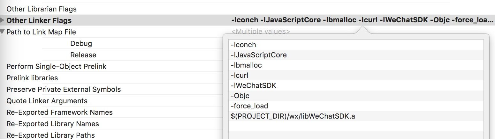

# Other Instructions

## 1. About Third-Party Maps

LayaNative's underlying rendering uses OpenGL ES rendering, using Android's GLSurfaceView control and iOS's GLKView control, so it cannot support third-party maps such as Baidu Maps.

## 2. About File Formats

**Text format files in the project (for example: ini, xml, html, json, js, etc.) must be in UTF8 encoding format, because iOS devices do not support files in non-UTF8 format encoding.**

## 3. Log Levels

LayaNative's underlying LOG is divided into five types:

```c
enum class LogType
{
    Debug,
    Info,
    Warn,
    Error,
    Fatal,
};
```

The log levels corresponding to each log type are as follows:

```c
enum class LogLevel
{
    Debug = 5,  // Most detailed - Debug information
    Info = 4,   // General information
    Warn = 3,   // Warning
    Error = 2,   // Error
    Fatal = 1,   // Fatal error
    Close = 0,   // Close all logs
};
```

**Log Level Description:**
- Values represent "log detail level". Higher values mean more detailed output
- When setting `g_nLogLevel = n`, output all logs with `LogLevel` value <= n
- Default value is 5 (Debug), indicating output of all level logs

In JS scripts, developers can set the log level through the following function. Default value is 5:

```javascript
if (window.conch)
{
    // Log level setting description:
    // Value 0: Close all log output
    // Value 1: Only output Fatal (fatal error) logs
    // Value 2: Output Fatal + Error (error) logs
    // Value 3: Output Fatal + Error + Warn (warning) logs
    // Value 4: Output Fatal + Error + Warn + Info (information) logs
    // Value 5: Output all logs, including Debug (debug) logs (default value)
    //
    // Filtering rule: When value is n, output all logs with LogLevel <= n
    window.conch.config.setLogLevel(2);
}
```

**Tips**
*1. conch can only be called in the LayaNative environment. In the web version, there's no conch definition, so you need to judge whether it exists.*

## 4. About iOS WeChat Integration

When integrating WeChat SDK on the iOS platform, WeChat versions after 1.77 need to add the -Objc parameter. WeChat's official documentation defaults to adding `-Objc -all_load`, but this will cause compilation errors.

When encountering this situation, you can change the parameter to `-Objc -force_load libWeChatSDK.a`. After configuration, as shown in Figure 1:



## 5. About iOS Simulator

LayaNative supports iOS simulators, but since simulator runtime efficiency is relatively low, developers are recommended to use iOS real device debugging.

## 6. Getting Various Information

| Function Name | Function Description | Return Value Description | Note |
| -------------------- | ------------------ | ---------------------------------------- | -------------------------------- |
| getTotalMem() | Get total memory of running device | Unit is KB | |
| getUsedMem() | Get memory occupied by current application | Unit is KB | Return value is not very accurate but can be used as reference |
| getAvalidMem() | Get available memory | Unit is KB | Return value is not very accurate but can be used as reference |
| getNetworkType() | Get network status | Returns int value, NET_NO = 0; NET_WIFI = 1; NET_2G = 2; NET_3G = 3; NET_4G = 4; NET_UNKNOWN=5 | |
| getRuntimeVersion() | Get Runtime version | Return value is a string, similar to ios-conch5-0.9.2, android-conch5-0.9 | |
| getAppVersion() | Get iOS-App version number | Returns string 1.1 | iOS-app version number. Through this version number, you can do APP update prompts. |
| getAppLocalVersion() | Get iOS-App Local version number | Returns string 1.2 | iOS-app version number. Through this version number, you can do APP update prompts. |

These functions all belong to the conch.config class functions. Call example:

```javascript
if (window.conch)
{
    window.conch.config.getRuntimeVersion();
}
```

**Tips**
*1. conch can only be called in the LayaNative environment. In the web version, there's no conch definition, so you need to judge whether it exists.*

## 8. Engine Initialization Error Handling

In LayaNative, when exceptions occur during engine initialization or startup script loading (such as network instability), the engine automatically calls the `window.onLayaInitError(error)` function. This function is defined by default in config.js as follows:

```javascript
window.onLayaInitError = function(e)
{
    console.log("onLayaInitError error=" + e);
    alert("Failed to load game. This may be due to unstable network. Please exit and try again.");
}
```

Developers can modify the error message and error handling method according to their needs.

## 9. conch.getWindowInfo
> Version >= LayaAir 3.4

Similar to WeChat Mini Game interface, retrieves window information including screen size, window size, status bar height, safe area, etc.

### Return Value

Returns an object containing the following properties:

| Property | Type | Description |
| --- | --- | --- |
| pixelRatio | number | Device pixel ratio |
| screenWidth | number | Screen width in px |
| screenHeight | number | Screen height in px |
| windowWidth | number | Available window width in px |
| windowHeight | number | Available window height in px |
| statusBarHeight | number | Status bar height in px (returns 0 in LayaNative as there is no mini game status bar) |
| safeArea | Object | Safe area in portrait orientation. Some devices don't have a safe area concept and won't return the safeArea field — developers need to handle compatibility. |
| safeArea.left | number | Safe area top-left x-coordinate |
| safeArea.right | number | Safe area bottom-right x-coordinate |
| safeArea.top | number | Safe area top-left y-coordinate |
| safeArea.bottom | number | Safe area bottom-right y-coordinate |
| safeArea.width | number | Safe area width in logical pixels |
| safeArea.height | number | Safe area height in logical pixels |
| screenTop | number | Y-value of the window's top edge |

### Example Code

```javascript
if (window.conch)
{
    const windowInfo = window.conch.getWindowInfo();
    
    console.log("Device pixel ratio:", windowInfo.pixelRatio);
    console.log("Screen width:", windowInfo.screenWidth);
    console.log("Screen height:", windowInfo.screenHeight);
    console.log("Window width:", windowInfo.windowWidth);
    console.log("Window height:", windowInfo.windowHeight);
    console.log("Status bar height:", windowInfo.statusBarHeight);
    console.log("Window top edge y-value:", windowInfo.screenTop);
    if (windowInfo.safeArea) {
        console.log("Safe area:", JSON.stringify(windowInfo.safeArea));
    }
}
```

## 10. conch.getDeviceInfo
> Version >= LayaAir 3.4

Similar to WeChat Mini Game interface, retrieves basic device information including device brand, model, operating system, etc.

### Return Value

Returns an object containing the following properties:

| Property | Type | Description |
| --- | --- | --- |
| abi | string | Application binary interface type (Android/HarmonyOS only) |
| deviceAbi | string | Device binary interface type (Android/HarmonyOS only) |
| brand | string | Device brand |
| model | string | Device model. Newly released devices may show "unknown" initially; adaptation will be done as soon as possible. |
| system | string | Operating system and version |
| platform | string | Client platform (see table below for valid values) |
| cpuType | string | Device CPU model (Android only) |
| memorySize | number | Device memory size in MB |

**Valid platform values:**

| Value | Description |
| --- | --- |
| ios | iOS platform (including iPhone, iPad) |
| android | Android platform |
| ohos | HarmonyOS mobile platform |
| ohos_pc | HarmonyOS PC platform |
| windows | Windows platform |

### Example Code

```javascript
if (window.conch)
{
    const deviceInfo = window.conch.getDeviceInfo();
    
    console.log("App binary interface type:", deviceInfo.abi);
    console.log("Device binary interface type:", deviceInfo.deviceAbi);
    console.log("Device brand:", deviceInfo.brand);
    console.log("Device model:", deviceInfo.model);
    console.log("Operating system:", deviceInfo.system);
    console.log("Client platform:", deviceInfo.platform);
    console.log("CPU model:", deviceInfo.cpuType);
    console.log("Device memory:", deviceInfo.memorySize, "MB");
}
```
