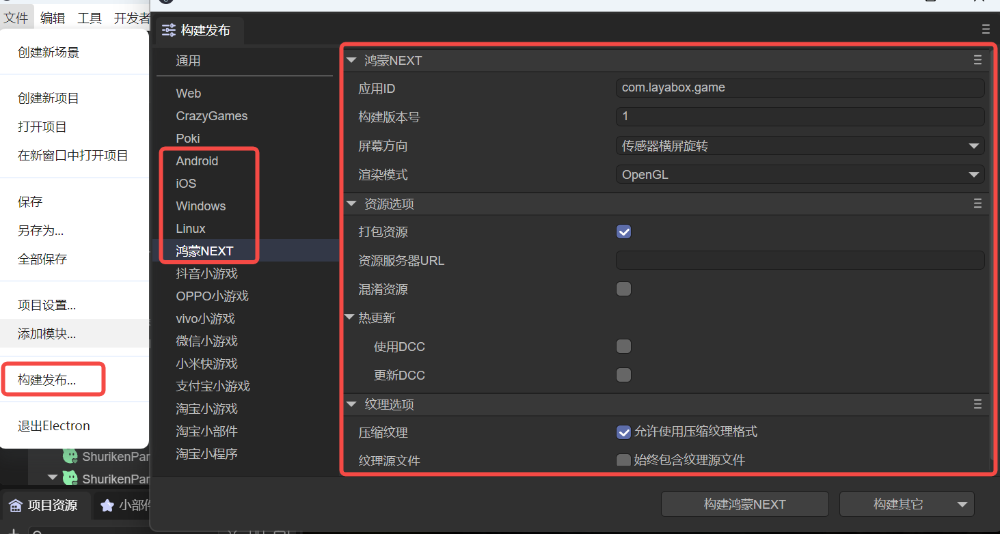
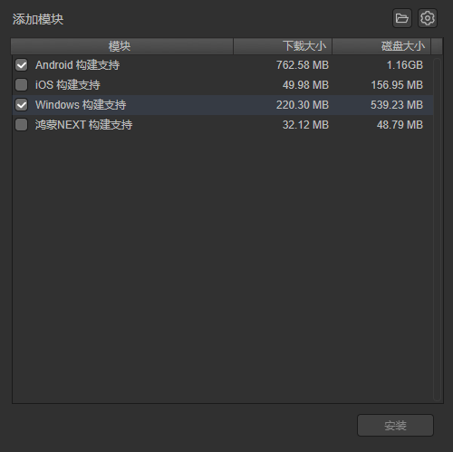
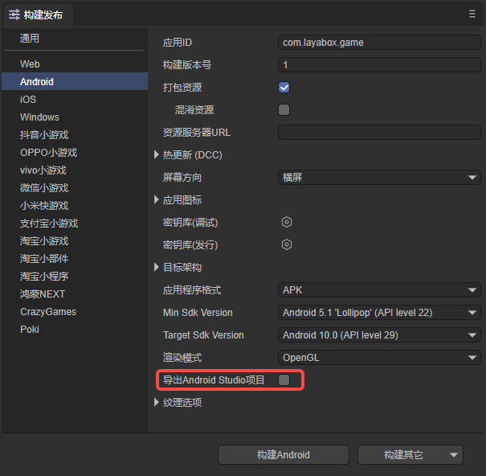

# LayaAir Native Application Build Basics

Starting from LayaAir 3.2, LayaAir Native supports automatic packaging for various system platforms.

For experienced developers who are more accustomed to using traditional development environments to build installation packages, the solution for building as native package projects is also retained.

## 1. Build and Release

For the release and construction of native installation packages, we will introduce the common Native attributes in this article.

First, in the `File` menu, open the "`Build and Release`" option, as shown in Figure 1-1.

(Figure 1-1)

### 1.1 Basic Common Configuration

| Name   | Description                                                         |
| ------ | ------------------------------------------------------------ |
| Application ID | The package name of the application, which is normally invisible. Generally, reverse domain naming rules are used (helpful for identification and avoiding conflicts with existing APPs in the system). For example: com.layabox.runtime.demo. The package name must be in the format xxx.yyy.zzz, with at least two levels, i.e., xxx.yyy. Otherwise, packaging will fail. |
| Build Version | The version of the Native project. |
| Package Resources | Whether to package the resources exported for the current platform (resource directory) into the native project. Packaged resources will be placed in a specific directory for subsequent generation of App for different platforms.  If you want to provide a standalone version, you must select "Package Resources", i.e., check "Package Resources", and leave "Resource Server URL" empty. Packaging resources directly into the App package can avoid network downloads and speed up resource loading.  > The disadvantage of packaging resources is that it will increase the package size. >  > If you want to publish an online game with "Package Resources" checked, you must run dcc on the server side, otherwise you will lose the packaging advantage. |
| Obfuscate Resources | If checked, resources will be randomly obfuscated during packaging, mainly to avoid certain sensitive functions being scanned by the platform when listing. |
| Resource Server URL | Just fill in the server address, note to add index.js after the address.  For example: http://192.168.31.109:8000/index.js |
| Hot Update (DCC) | After enabling DCC, you can package resources or not.  > Refer to [DCC Documentation](../LayaDcc_Tool/readme.md). |
| Screen Orientation | > Refer to [Screen Orientation Settings](../screen_orientation/readme.md). |
| Application Icon | You can set the icon of the APP. |
| KeyStore | Divided into debug version and release version, used to generate digital signatures for applications. The signature proves the author's identity of the application and ensures that the application content has not been tampered with. |
| Target Architecture (CPU) | ARMv7: 32-bit version of ARM processor. Covers most older devices and some mid-to-low end devices.  ARM64: Also known as AArch64 or ARMv8, is the 64-bit version of ARM processor. Covers most modern mid-to-high end devices.  x86: 32-bit processor architecture based on Intel. Mainly used for some older Intel processor Android devices, relatively less used in Android devices.  x86-64: Also known as x64 or AMD64, is the 64-bit version of Intel processor. Used for newer Intel processor Android devices, less used in Android devices. |
| Application Format | You can choose APK or AAB format. |
| Min Sdk Version | Defines the minimum Android version the application can run on. Devices below this version will not be able to install the application. |
| Target Sdk Version | Declares the target Android version the application is designed to run on, affecting the application's behavior on higher Android versions. |
| Render Mode | There are two render modes: OpenGL and WebGL. Generally, you can just choose OpenGL. |
| Export Android Studio Project | After checking, the built and released project will not automatically package into apk or ipa packages, but will be released as a native package project. |
| Texture Options | `Compressed Textures`: Generally need to check "Allow using compressed texture format". If not checked, all image settings for compressed formats will be ignored.  `Texture Source Files`: You can uncheck "Always include texture source files". If checked, even if images use compressed format, the source files (png/jpg) will still be packaged. The purpose is to fallback to source files when encountering systems that do not support compressed formats. |

### 2.2 Download Module

After setting the parameters, if it is the first time building Android/iOS, you will first download the module, as shown in Figure 2-2.

(Figure 2-2)

Select iOS or Android for the target platform. Since the library files required for the build tool are relatively large, they are not directly included in LayaAirIDE. When using this tool for the first time, you will first download the corresponding support modules.

> The file is large, please be patient while downloading.

## 3. Directly Package as APK

> If it is iOS, an ipa package will be generated directly.

As shown in Figure 3-1, if `Export Android Studio Project` is not checked, the exported project will directly generate an apk package.

(Figure 3-1)

The export method in Figure 3-1 is a purely standalone application. The exported directory is shown in Figure 3-2. Just install the apk package to your phone. However, such a purely standalone application cannot achieve dynamic resource updates. When resources change, the APP must be updated.

(Figure 3-2)

If it is an online package, you need to fill in the `Resource Server URL`. After filling, you can uncheck `Package Resources`. After release, you need to place the resource directory on the server, and the address is the url filled during release. The released application will load resources from the server.

If you fill in the `Resource Server URL` and check `Package Resources`, the final release is an online package with resources. The apk itself contains resources, but compared to a purely standalone application, it can update resources through DCC.

## 4. Release as Native Package

Building Android and iOS projects requires a basic development environment. For example: building iOS projects requires preparing a Mac computer and XCode, Android requires preparing Android studio.

Whether building Android or iOS projects, you must have corresponding Android or iOS App development basics. If not, please first learn and understand the relevant basic knowledge.

When building and releasing, if `Export Android Studio Project` is checked, the final built App project can be opened with corresponding development tools for secondary development and packaging operations.

### 4.1 Using the Built Project

- Android projects can be imported and developed using Android Studio software.
- iOS projects can be imported and developed using xcode software. After opening XCode (iOS) projects, you need to select a real iOS device to build.

**Reference Resources:**

- [Android Studio Usage and Configuration](https://github.com/layabox/layaair-doc/tree/master/Chinese/LayaNative/AndroidStudio_ConfigurationAndApplication)

- [IOS Packaging and Release App Detailed Process](https://github.com/layabox/layaair-doc/tree/master/Chinese/LayaNative/packagingReleases_IOS)

### 4.2 Manually Switch Between Standalone and Online Versions

After building is complete, you can switch between standalone and online versions by directly modifying code in the project.

**Android Project**

In the built project, open MainActivity.java and search for `mPlugin.game_plugin_set_option("localize","false");`

For standalone version, it needs to be set to "true", such as `mPlugin.game_plugin_set_option("localize","true");`

If you want to set it to online version, modify to: `mPlugin.game_plugin_set_option("localize","false");`

And set the correct address: `mPlugin.game_plugin_set_option("gameUrl", "http://your address/index.js");`

**iOS Project**

After the iOS project is built, at the end of the resource/scripts/index.js script in the project directory, there is a function that executes loadUrl. This loads the home page address. Modifying the address here can switch between standalone and online versions. The standalone version address is fixed as `http://stand.alone.version/index.js`.

For example, initially it is the online version, the address is:

`loadUrl(conch.presetUrl||"http://10.10.20.19:7788/index.js");`

To change to standalone version, modify here:

`loadUrl(conch.presetUrl||"http://stand.alone.version/runtime.json");`

And vice versa.

> Once the url address is modified, the originally packaged resources are all invalid. At this time, you need to manually delete the contents under the cache directory and regenerate packaged resources using layadcc. See [LayaDCC Tool](../LayaDcc_Tool/readme.md).

### 4.3 Resources

After building the project through the IDE,

- If you choose the standalone version (package resources) version, all resources of the h5 project (including: scripts, images, html, sounds, etc.) will be packaged into this directory:

`Android directory`: release\android\android_project\app\src\main\assets\cache

`iOS directory`: release\ios\ios_project\resource\cache

- If it is an online version without packaging resources, use the resource directory under the release directory (release\resource).

## 5. Other Considerations

After Android Studio build is complete, you need to modify the android sdk version number according to your environment. The file to modify is app/build.gradle.
