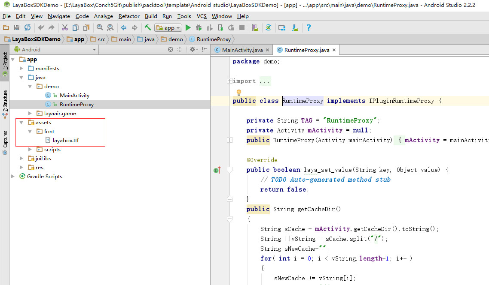
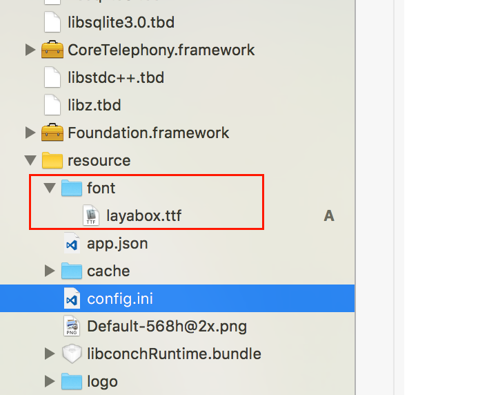

# Embedded Fonts

## 1. Font Introduction

Due to the wide variety of Android devices, inconsistent Android font files, and differences in default Chinese font paths for each system (plus many domestic manufacturers' personalized customization), reading font.ttf is a difficult problem.

LayaNative's strategy is to enumerate font file paths based on the Android system version number. If loading succeeds, the system default font is used. If loading fails, a font is downloaded and stored locally. The second time you enter, the local font is read directly.

When developers package apps, they should default to packaging fonts into the app. If downloading a 4MB TTF font from the network, it will affect user experience.

## 2. Android Embedded Fonts

After building the Android project, find the assets directory, then create a font directory. Rename the font file to be embedded to "layabox.ttf" and place it in this directory. As shown in Figure 1:



## 3. iOS Embedded Fonts

LayaNative supports iOS embedded default fonts. The specific method is the same as for Android. Create a font directory under resource and rename the embedded font to layabox.ttf. As shown in Figure 2 below:



## 4. Font Modifications After LayaAir3.1 Version

After the LayaAir3.1 version, the font system was optimized. System fonts are prioritized by default. If you need to embed custom fonts, you need to register them with the system before using them. The following example shows two embedding methods:

### 4.1 Method 1

Read the local assets directory font file, then register through registerFont in code. Subsequently, use the associated font through the font name "layabox" passed during registration.

```javascript
function registerFont() {
    var assetFontData = conch.readFileFromAsset('font/layabox.ttf', 'raw');
    if (assetFontData) {
        if (conch.registerFont("layabox", assetFontData)) {
            log('Font registered successfully');
        }
        else {
            log('Font registration failed');
        }
    }
}
```

Or directly pass the assets directory font file path for registration
```javascript
function registerFont() {
    if (conch.registerFont("layabox", 'font/layabox.ttf')) {
        log('Font registered successfully');
    }
    else {
        log('Font registration failed');
    }
}
```

### 4.2 Method 2

Download remote font files through ttfloader. The font name passed during registration is the ttf filename.

```javascript
Laya.loader.load("res/maobi.ttf", Loader.TTF).then(() => {
	var label: Label = new Label();
	label.font = "maobi";
	label.text = "Custom Embedded Font";
	label.fontSize = 30;
	label.color = '#FFFFFF';

	this.Main.box2D.addChild(label);
	label.pos(30, 50)
});
```
