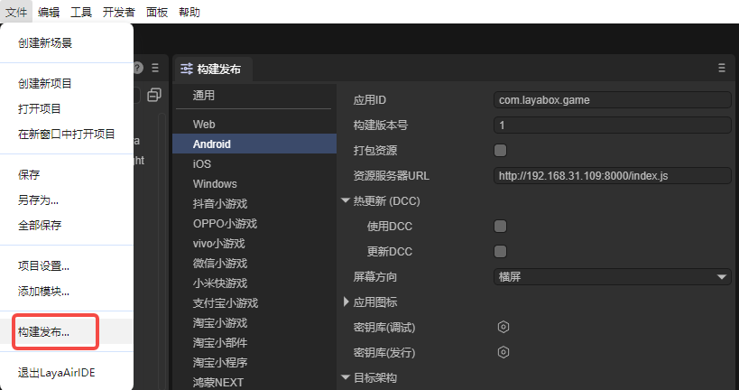
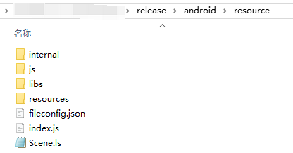

# LayaNative Entry Description

**LayaNative is not a browser!**

**LayaNative is not a browser!**

**LayaNative is not a browser!**

Starting from LayaAir3.2 version, it supports automatic packaging into installation packages for various platforms (such as exe, apk, ipa), and provides options for developers to independently choose the corresponding platform's installation environment, then automatically install the required environment for packaging, so developers don't have to worry about what environment to install to successfully package.

For experienced developers, if you're more accustomed to using traditional development environments to create installation packages, the solution to publish as native package projects is also retained.

A PC simulator is provided on the PC end. Like the mobile runner, you can make instant modifications in the project and directly view the packaged running effect on the PC simulator.

## 1. LayaNative's Startup Entry

Since LayaNative is not a browser, nor does it run html content through encapsulated browsers or webkit-like controls.

Therefore, LayaNative cannot start and run HTML page files.

**LayaNative's default startup entry is:**

Through LayaAir-IDE's menu bar `File` → `Build & Publish`, in the opened window, configure the `Resource Server URL`. The configuration method is shown in Figure 1-1. In Figure 1-1, the entry defaults to index.js.



(Figure 1-1)

## 2. LayaNative Startup File Configuration Description

The entry file mainly determines information about JS files that need to be loaded during project runtime.

If using the project's index.js as LayaNative's startup entry file, after clicking build and publish, find index.js in the resource directory.



(Figure 2-1)

After opening, the code is as follows:

```javascript
//
loadLib("libs/laya.core.js");
//
loadLib("libs/laya.d3.js");
//
loadLib("libs/laya.opengl_2D.js");
//
loadLib("libs/laya.opengl_3D.js");
......
```

> Please do not write any logic code in the index.js file. If you do, unknown errors may occur.
