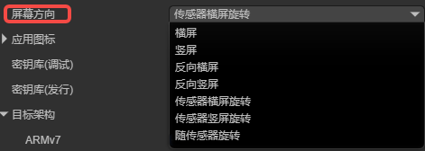
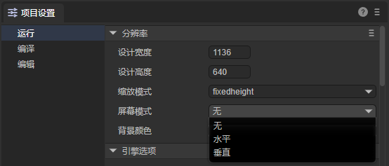
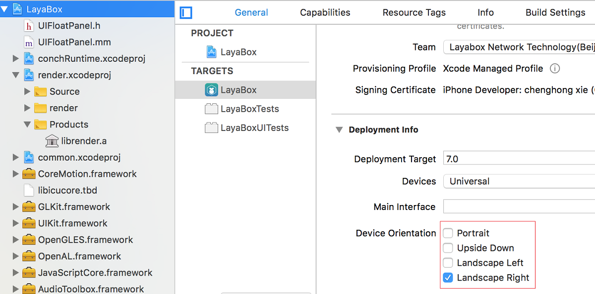
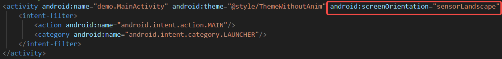

# Screen Orientation Settings

This document provides a comprehensive introduction to LayaNative screen direction settings.

## 1. Setting in IDE Before Publishing

If you want to set screen orientation, through LayaAir-IDE's build and publish panel, in the Android/iOS publish options, as shown in Figure 1-1, configure the screen orientation here.



(Figure 1-1)

It's recommended that developers set the direction consistent with the project settings panel.



(Figure 1-2)

`Landscape`: Device placed horizontally, width greater than height. Screen content displays horizontally.

`Portrait`: Device placed vertically, height greater than width. Screen content displays vertically.

`Reverse Landscape`: Device placed horizontally, but screen content rotated 180 degrees.

`Reverse Portrait`: Device placed vertically, but screen content rotated 180 degrees.

`Sensor Landscape Rotation`: Automatically switches between two landscape directions based on the device's gravity sensor.

`Sensor Portrait Rotation`: Automatically switches between two portrait directions based on the device's gravity sensor.

`Full Sensor Rotation`: Automatically switches between all four directions based on the device's gravity sensor.

## 2. Landscape/Portrait Settings After Project Build

After building and publishing, you can modify the native project's corresponding configuration to set landscape/portrait orientation.

### 2.1 iOS

After the iOS project is successfully built, open the XCode project settings page and check the corresponding Device Orientation options as needed. As shown in Figure 2-1:



(Figure 2-1)

### 2.2 Android

After the Android project is successfully built, open the `AndroidManifest.xml` file. In the activity tag, there's a screenOrientation parameter that developers can modify according to their needs. As shown in Figure 2-3:



(Figure 2-3)

landscape: Landscape

portrait: Portrait

reverseLandscape: Reverse landscape

reversePortrait: Reverse portrait

sensorLandscape: Sensor landscape rotation

sensorPortrait: Sensor portrait rotation

fullSensor: Full sensor rotation

## 3. Dynamically Setting Landscape/Portrait Through Code

You can also dynamically set landscape/portrait through code. The interface is similar to the WeChat mini-game interface:

> Version >= LayaAir 3.4

```typescript
    /**
    * Set LayaNative screen orientation. Can set the following values:
    * landscape: Landscape
    * portrait: Portrait
    * reverseLandscape: Reverse landscape
    * reversePortrait: Reverse portrait
    * sensorLandscape: Sensor landscape rotation
    * sensorPortrait: Sensor portrait rotation
    * fullSensor: Full sensor rotation
    */
    conch.setDeviceOrientation({
        value: value,
        success: function () {
            console.log("success");
        },
        fail: function () {
            console.log("fail");
        },
        complete: function () {
            console.log("complete");
        },
    });
```
