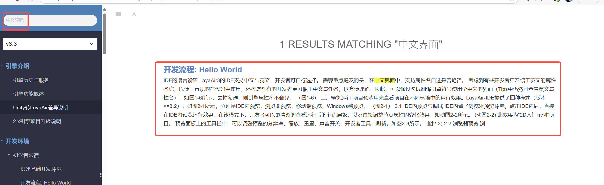
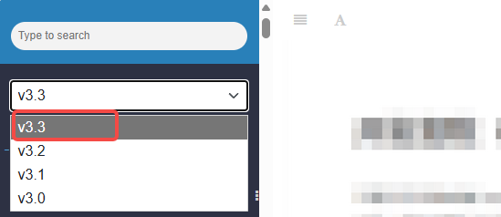
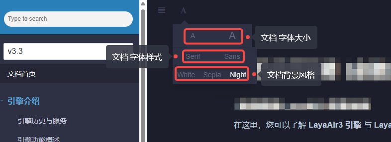

# Documentation Usage Guide (Must Read)

#### Welcome to the **LayaAir3 Engine Documentation**

Here, you can learn about the various features and usage methods of the **LayaAir3 Engine** and **LayaAir3-IDE**.

## 1. Make Good Use of the Search Function

Although we strive to make the documentation structure clear and easy to navigate, if you just want to quickly find an answer when encountering a problem, the **search function** is the most efficient way.

For example, if you want to make the IDE interface display in Chinese, simply type **“中文界面”** (Chinese interface) in the search bar and press **Enter** to see the relevant results, as shown in Figure 1-1:

(Figure 1-1)

Click on the **document title** in the search results to view detailed content.

## 2. Choose the Correct Engine Version Documentation

When viewing documentation, many developers tend to overlook the **engine version**.

Different versions of the LayaAir engine (e.g., **3.1, 3.2, 3.3…**) may add or modify certain features, leading to differences in usage.

Be sure to select the branch that matches your current version through the **version number dropdown menu** in the upper-left corner of the documentation.

For example, if you are using **version 3.3.2**, you should select the **3.3 branch** documentation. See Figure 1-2 below:

(Figure 1-2)

## 3. Customize the Documentation Display Style

Click the **A icon** in the upper-left corner of the documentation to open the **display settings panel**, where you can adjust:

* Font size
* Font style
* Background theme

You can configure the most comfortable reading style according to your preference. See Figure 1-3 below:

(Figure 1-3)

## 4. Documentation Feedback and Revisions

LayaAir documentation is open-source, and developers can:

* **Clone the documentation locally** to view or edit;
* **Submit modifications or new documents**;
* **Provide feedback through customer service**.

📘 Chinese documentation repository: [https://github.com/layabox/LayaAir-Doc-ZH](https://github.com/layabox/LayaAir-Doc-ZH)

📘 English documentation repository: [https://github.com/layabox/LayaAir-Doc-EN](https://github.com/layabox/LayaAir-Doc-EN)

Each branch in the documentation repository corresponds to a specific **engine version number**.

If you’re not familiar with the GitHub submission process, you can directly contact official customer service to provide feedback, and we’ll make the updates as soon as possible.

💬 Customer Service WeChat: **LayaAir_Engine**

(Scan to add official customer service WeChat)
